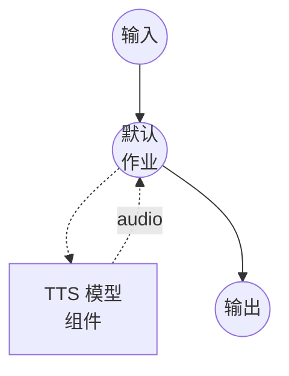

# 文本转语音（HumeAI TADA 语音克隆）模型任务示例

此示例演示如何使用 HumeAI TADA (Text-Acoustic Dual Alignment) 以 24 kHz 执行语音克隆，通过 model-compose 的内置模型任务功能在本地运行。

## 概述

此工作流提供本地语音克隆和语音合成：

1. **本地模型执行**：无需外部 API，在本地运行 HumeAI TADA
2. **文本-声学双重对齐**：TADA 通过对齐文本和声学特征实现高质量克隆
3. **基于参考的合成**：同时使用参考音频及其转录文本进行精确的语音匹配
4. **24 kHz 输出**：以模型原生 24 kHz 采样率输出合成语音

## 准备工作

### 前置条件

- 已安装 model-compose 并在您的 PATH 中可用
- 足够的系统资源（使用 GPU 时推荐：8GB+ VRAM）
- 包含 TADA 依赖的 Python 环境（自动管理）
- 用于语音克隆的参考音频文件及其转录文本

### 环境配置

1. 导航到此示例目录：
   ```bash
   cd examples/model-tasks/text-to-speech-clone-tada
   ```

2. 无需额外的环境配置 - 模型和依赖会自动管理。

## 运行方式

1. **启动服务：**
   ```bash
   model-compose up
   ```

2. **运行工作流：**

   **使用 Web UI（推荐）：**
   - 打开 Web UI：http://localhost:8084
   - 输入要合成的文本
   - 上传参考音频文件
   - 输入参考音频的转录文本
   - 点击"运行工作流"按钮

   **使用 API：**
   ```bash
   curl -X POST http://localhost:8083/api/workflows/runs \
     -H "Content-Type: application/json" \
     -d '{
       "input": {
         "text": "这是使用克隆语音合成的语音。",
         "reference_audio": "<base64编码的音频>",
         "reference_text": "参考音频的转录文本。"
       }
     }'
   ```

   **使用 CLI：**
   ```bash
   model-compose run --input '{
     "text": "这是使用克隆语音合成的语音。",
     "reference_audio": "<base64编码的音频>",
     "reference_text": "参考音频的转录文本。"
   }'
   ```

## 组件详情

### 文本转语音模型组件（默认）
- **类型**：具有 `text-to-speech` 任务的模型组件
- **用途**：从参考音频进行语音克隆和语音合成
- **模型**：`HumeAI/tada-1b`
- **驱动**：`custom`
- **系列**：`tada`
- **设备**：`auto`
- **方法**：`clone` - 从参考音频克隆语音并生成语音
- **并发数**：1（同时处理一个请求）

### 模型信息：HumeAI TADA-1B
- **开发者**：Hume AI
- **参数**：约 10 亿
- **类型**：文本-声学双重对齐语音克隆 TTS 模型
- **采样率**：24 kHz 输出
- **输出格式**：音频（WAV）

## 工作流详情

### "Text to Speech with Voice Cloning (HumeAI TADA)" 工作流（默认）

**描述**：使用 HumeAI TADA (Text-Acoustic Dual Alignment) 进行 24 kHz 语音克隆。

#### 作业流程



#### 输入参数

| 参数 | 类型 | 必需 | 默认值 | 描述 |
|-----------|------|----------|---------|-------------|
| `text` | text | 是 | - | 使用克隆语音合成的文本 |
| `reference_audio` | audio | 是 | - | 用于克隆语音的参考音频样本 |
| `reference_text` | text | 是 | - | 用于对齐的参考音频转录文本 |

#### 输出格式

| 字段 | 类型 | 描述 |
|-------|------|-------------|
| - | audio | 使用克隆语音生成的语音音频（WAV，24 kHz） |

## 示例输出

工作流返回包含以 24 kHz 使用克隆语音合成的语音的 WAV 音频流。

## 自定义

### 切换到多语言 3B 模型

使用更大的多语言 TADA 检查点以获得更广泛的语言支持：

```yaml
component:
  type: model
  task: text-to-speech
  driver: custom
  family: tada
  model: HumeAI/tada-3b-ml
  device: auto
```

### 参考音频提示

- 使用没有背景噪音的清晰音频
- 3-10 秒的自然语音效果最佳
- 确保音频为常见格式（WAV、MP3、FLAC）
- 提供与参考音频相符的准确转录文本

## 相关示例

- **[text-to-speech-clone](../text-to-speech-clone/)**：使用 Qwen3-TTS 的语音克隆
- **[text-to-speech-clone-cosyvoice](../text-to-speech-clone-cosyvoice/)**：使用 CosyVoice2 的 24 kHz 语音克隆
- **[text-to-speech-clone-luxtts](../text-to-speech-clone-luxtts/)**：使用 LuxTTS (ZipVoice) 的 48 kHz 语音克隆
