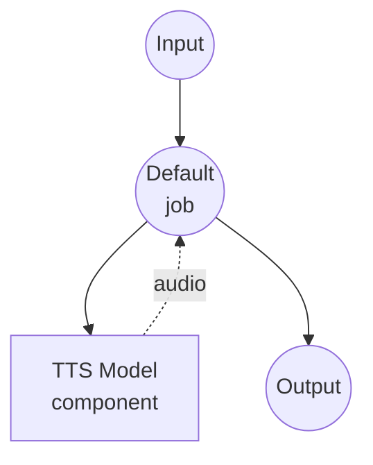

# Text to Speech (Voice Cloning) Model Task Example

This example demonstrates how to clone a voice from reference audio and generate speech using Qwen3-TTS, running locally via model-compose's built-in model task functionality.

## Overview

This workflow provides local voice cloning and speech synthesis that:

1. **Local Model Execution**: Runs Qwen3-TTS-12Hz-1.7B-Base locally using HuggingFace transformers
2. **Voice Cloning**: Reproduces a speaker's voice from a short reference audio sample
3. **Reference-Based Synthesis**: Uses both reference audio and its transcript for accurate voice matching
4. **No External APIs**: Completely offline voice cloning without API dependencies

## Preparation

### Prerequisites

- model-compose installed and available in your PATH
- NVIDIA GPU with CUDA support (configured for `cuda:0`)
- Sufficient system resources (recommended: 8GB+ VRAM)
- Python environment with transformers and torch (automatically managed)
- A reference audio file and its transcript for voice cloning

### Environment Configuration

1. Navigate to this example directory:
   ```bash
   cd examples/model-tasks/text-to-speech-clone
   ```

2. No additional environment configuration required - model and dependencies are managed automatically.

## How to Run

1. **Start the service:**
   ```bash
   model-compose up
   ```

2. **Run the workflow:**

   **Using Web UI (Recommended):**
   - Open the Web UI: http://localhost:8081
   - Enter the text to synthesize
   - Upload a reference audio file
   - Enter the transcript of the reference audio
   - Click the "Run Workflow" button

   **Using API:**
   ```bash
   curl -X POST http://localhost:8080/api/workflows/runs \
     -H "Content-Type: application/json" \
     -d '{
       "input": {
         "text": "This is synthesized speech using a cloned voice.",
         "ref_audio": "<base64-encoded-audio>",
         "ref_text": "Transcript of the reference audio."
       }
     }'
   ```

   **Using CLI:**
   ```bash
   model-compose run --input '{
     "text": "This is synthesized speech using a cloned voice.",
     "ref_audio": "<base64-encoded-audio>",
     "ref_text": "Transcript of the reference audio."
   }'
   ```

## Component Details

### Text-to-Speech Model Component (Default)
- **Type**: Model component with text-to-speech task
- **Purpose**: Voice cloning and speech synthesis from reference audio
- **Model**: Qwen/Qwen3-TTS-12Hz-1.7B-Base
- **Driver**: custom (Qwen family)
- **Device**: cuda:0
- **Method**: `clone` - clones a voice from reference audio and generates speech
- **Concurrency**: 1 (single request at a time)

### Model Information: Qwen3-TTS-12Hz-1.7B-Base
- **Developer**: Alibaba Cloud
- **Parameters**: 1.7 billion
- **Type**: Base text-to-speech model with voice cloning capability
- **Sample Rate**: 12Hz token rate
- **Languages**: Multilingual support
- **Output Format**: Audio (WAV)

## Workflow Details

### "Text to Speech with Voice Cloning" Workflow (Default)

**Description**: Clone a voice from reference audio and generate speech using Qwen3-TTS.

#### Job Flow



#### Input Parameters

| Parameter | Type | Required | Default | Description |
|-----------|------|----------|---------|-------------|
| `text` | text | Yes | - | The text to synthesize with the cloned voice |
| `ref_audio` | audio | Yes | - | Reference audio sample to clone the voice from |
| `ref_text` | text | Yes | - | Transcript of the reference audio for alignment |

#### Output Format

| Field | Type | Description |
|-------|------|-------------|
| - | audio | Generated speech audio in the cloned voice |

## System Requirements

### Minimum Requirements
- **GPU**: NVIDIA GPU with 4GB+ VRAM (CUDA required)
- **RAM**: 8GB (recommended 16GB+)
- **Disk Space**: 10GB+ for model storage
- **Internet**: Required for initial model download only

### Performance Notes
- First run requires model download (several GB)
- GPU is required for this example (`device: cuda:0`)
- Voice cloning quality depends on the clarity and length of reference audio
- Recommended reference audio: 3-10 seconds of clear speech

## Tips for Best Results

### Reference Audio
- Use clean audio without background noise
- 3-10 seconds of natural speech works best
- Ensure the audio is in a common format (WAV, MP3, FLAC)

### Reference Text
- Provide an accurate transcript of the reference audio
- Proper punctuation helps with prosody matching
- Language of reference text should match the reference audio

## Customization

### Using Different Base Models
```yaml
component:
  type: model
  task: text-to-speech
  driver: custom
  family: qwen
  model: Qwen/Qwen3-TTS-12Hz-1.7B-Base
  device: cuda:0
```

## Related Examples

- **[text-to-speech-generate](../text-to-speech-generate/)**: Generate speech using preset voice profiles
- **[text-to-speech-design](../text-to-speech-design/)**: Design a new voice from a text description
