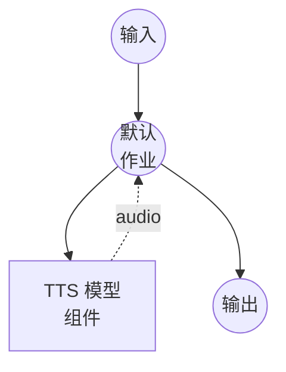

# 文本转语音（语音克隆）模型任务示例

此示例演示如何使用 Qwen3-TTS 从参考音频克隆语音并生成语音，通过 model-compose 的内置模型任务功能在本地运行。

## 概述

此工作流提供本地语音克隆和语音合成：

1. **本地模型执行**：使用 HuggingFace transformers 在本地运行 Qwen3-TTS-12Hz-1.7B-Base
2. **语音克隆**：从简短的参考音频样本中复制说话者的声音
3. **基于参考的合成**：同时使用参考音频及其转录文本进行精确的语音匹配
4. **无需外部 API**：无 API 依赖的完全离线语音克隆

## 准备工作

### 前置条件

- 已安装 model-compose 并在您的 PATH 中可用
- 支持 CUDA 的 NVIDIA GPU（配置为 `cuda:0`）
- 足够的系统资源（推荐：8GB+ VRAM）
- 包含 transformers 和 torch 的 Python 环境（自动管理）
- 用于语音克隆的参考音频文件及其转录文本

### 环境配置

1. 导航到此示例目录：
   ```bash
   cd examples/model-tasks/text-to-speech-clone
   ```

2. 无需额外的环境配置 - 模型和依赖会自动管理。

## 运行方式

1. **启动服务：**
   ```bash
   model-compose up
   ```

2. **运行工作流：**

   **使用 Web UI（推荐）：**
   - 打开 Web UI：http://localhost:8081
   - 输入要合成的文本
   - 上传参考音频文件
   - 输入参考音频的转录文本
   - 点击"运行工作流"按钮

   **使用 API：**
   ```bash
   curl -X POST http://localhost:8080/api/workflows/runs \
     -H "Content-Type: application/json" \
     -d '{
       "input": {
         "text": "这是使用克隆语音合成的语音。",
         "ref_audio": "<base64编码的音频>",
         "ref_text": "参考音频的转录文本。"
       }
     }'
   ```

   **使用 CLI：**
   ```bash
   model-compose run --input '{
     "text": "这是使用克隆语音合成的语音。",
     "ref_audio": "<base64编码的音频>",
     "ref_text": "参考音频的转录文本。"
   }'
   ```

## 组件详情

### 文本转语音模型组件（默认）
- **类型**：具有 text-to-speech 任务的模型组件
- **用途**：从参考音频进行语音克隆和语音合成
- **模型**：Qwen/Qwen3-TTS-12Hz-1.7B-Base
- **驱动**：custom（Qwen 系列）
- **设备**：cuda:0
- **方法**：`clone` - 从参考音频克隆语音并生成语音
- **并发数**：1（同时处理一个请求）

### 模型信息：Qwen3-TTS-12Hz-1.7B-Base
- **开发者**：阿里云
- **参数**：17 亿
- **类型**：具有语音克隆功能的基础文本转语音模型
- **采样率**：12Hz token 率
- **语言**：多语言支持
- **输出格式**：音频（WAV）

## 工作流详情

### "Text to Speech with Voice Cloning"工作流（默认）

**描述**：使用 Qwen3-TTS 从参考音频克隆语音并生成语音。

#### 作业流程



#### 输入参数

| 参数 | 类型 | 必需 | 默认值 | 描述 |
|-----------|------|----------|---------|-------------|
| `text` | text | 是 | - | 使用克隆语音合成的文本 |
| `ref_audio` | audio | 是 | - | 用于克隆语音的参考音频样本 |
| `ref_text` | text | 是 | - | 用于对齐的参考音频转录文本 |

#### 输出格式

| 字段 | 类型 | 描述 |
|-------|------|-------------|
| - | audio | 使用克隆语音生成的语音音频 |

## 系统要求

### 最低要求
- **GPU**：NVIDIA GPU，4GB+ VRAM（需要 CUDA）
- **RAM**：8GB（推荐 16GB+）
- **磁盘空间**：10GB+ 用于模型存储
- **网络**：仅初次模型下载时需要

### 性能说明
- 首次运行需要下载模型（数 GB）
- 此示例需要 GPU（`device: cuda:0`）
- 语音克隆质量取决于参考音频的清晰度和长度
- 推荐参考音频：3-10 秒清晰语音

## 获得最佳效果的提示

### 参考音频
- 使用没有背景噪音的清晰音频
- 3-10 秒的自然语音效果最佳
- 确保音频为常见格式（WAV、MP3、FLAC）

### 参考文本
- 提供参考音频的准确转录文本
- 正确的标点符号有助于韵律匹配
- 参考文本的语言应与参考音频一致

## 相关示例

- **[text-to-speech-generate](../text-to-speech-generate/)**：使用预设语音配置文件生成语音
- **[text-to-speech-design](../text-to-speech-design/)**：通过文本描述设计新语音
