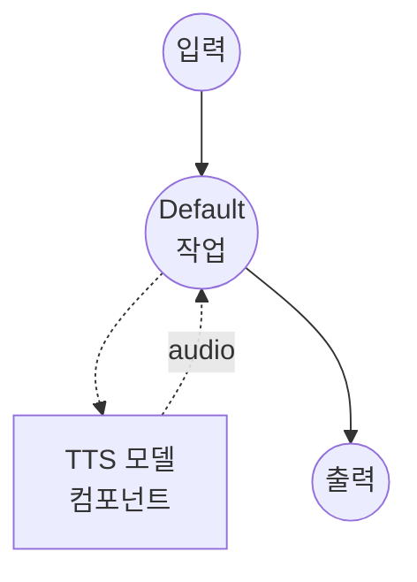

# 텍스트 음성 변환 (FireRedTTS3-Instruct 보이스 디자인) 모델 태스크 예제

이 예제는 FireRedTTS3-Instruct를 사용하여 자연어 설명에서 완전히 새로운 음성을 생성하는 방법을 보여주며, model-compose의 내장 모델 태스크 기능을 통해 로컬에서 실행됩니다.

## 개요

이 워크플로우는 다음과 같은 로컬 보이스 디자인 및 음성 합성을 제공합니다:

1. **로컬 모델 실행**: 외부 API 없이 FireRedTTS3-Instruct를 로컬에서 실행
2. **참조 오디오 불필요**: 텍스트 설명만으로 새로운 음성 생성
3. **명령어 기반 속성 제어**: 자연어를 통해 대상 음성의 성별, 나이, 음색, 감정, 속도, 억양을 유도
4. **24 kHz 출력**: 모델의 기본 24 kHz 샘플 레이트로 합성된 음성 출력

## 준비사항

### 필수 요구사항

- model-compose가 설치되어 PATH에서 사용 가능
- 충분한 시스템 리소스 (GPU 사용 시 권장: 8GB+ VRAM)
- FireRedTTS3가 `sys.path`에서 사용 가능한 Python 환경

### FireRedTTS3 설치

FireRedTTS3는 PyPI 배포판이 없습니다. 저장소를 클론하여 가상환경에 노출시키세요:

```bash
git clone https://github.com/FireRedTeam/FireRedTTS3.git
# 그런 다음 저장소 루트를 sys.path에 추가하세요 (예: venv의 site-packages에 .pth 파일 생성),
# 또는 클론한 저장소 내부에서 model-compose를 실행하세요.
```

사전 학습된 체크포인트는 컴포넌트가 처음 시작될 때 HuggingFace(`FireRedTeam/FireRedTTS3`)에서 자동으로 다운로드됩니다.

### 환경 구성

1. 이 예제 디렉토리로 이동:
   ```bash
   cd examples/model-tasks/text-to-speech-design-fireredtts3
   ```

2. 추가 환경 구성이 필요 없습니다 - 모델 가중치와 의존성은 자동으로 관리됩니다.

## 실행 방법

1. **서비스 시작:**
   ```bash
   model-compose up
   ```

2. **워크플로우 실행:**

   **웹 UI 사용 (권장):**
   - 웹 UI 열기: http://localhost:8084
   - 합성할 텍스트 입력
   - 대상 음성에 대한 자연어 설명 입력
   - "Run Workflow" 버튼 클릭

   **API 사용:**
   ```bash
   curl -X POST http://localhost:8083/api/workflows/runs \
     -H "Content-Type: application/json" \
     -d '{
       "input": {
         "text": "새로운 보이스 디자인 데모에 오신 것을 환영합니다.",
         "instructions": "부드럽고 어린 여성 목소리, 약간 느리며 장난스러운 톤."
       }
     }'
   ```

   **CLI 사용:**
   ```bash
   model-compose run --input '{
     "text": "새로운 보이스 디자인 데모에 오신 것을 환영합니다.",
     "instructions": "부드럽고 어린 여성 목소리, 약간 느리며 장난스러운 톤."
   }'
   ```

## 컴포넌트 세부사항

### 텍스트 음성 변환 모델 컴포넌트 (기본)
- **유형**: `text-to-speech` 태스크를 가진 모델 컴포넌트
- **목적**: 자연어 설명에서 새로운 음성 생성
- **모델**: `FireRedTeam/FireRedTTS3`
- **드라이버**: `custom`
- **패밀리**: `fireredtts3`
- **프리셋**: `instruct` - FireRedTTS3-Instruct 체크포인트를 로드
- **디바이스**: `auto`
- **메서드**: `design` - 명령어에서 음성을 디자인하고 음성 합성
- **동시성**: 1 (한 번에 하나의 요청)

### 모델 정보: FireRedTTS3-Instruct
- **개발자**: FireRedTeam
- **유형**: 통합된 보이스 디자인 및 음성 편집이 가능한 명령어 기반 TTS
- **샘플 레이트**: 24 kHz 출력
- **디자인 속성**: 성별, 나이, 음색, 감정, 속도, 억양
- **출력 형식**: 오디오 (WAV)

## 워크플로우 세부사항

### "Text to Speech with Voice Design (FireRedTTS3-Instruct)" 워크플로우 (기본)

**설명**: 자연어 설명에서 새로운 음성을 디자인하고 FireRedTTS3-Instruct를 사용하여 24 kHz로 음성 생성.

#### 작업 흐름



#### 입력 매개변수

| 매개변수 | 유형 | 필수 | 기본값 | 설명 |
|---------|------|------|--------|------|
| `text` | text | 예 | - | 디자인된 음성으로 합성할 텍스트 |
| `instructions` | text | 예 | - | 대상 음성에 대한 자연어 설명 |

#### 출력 형식

| 필드 | 유형 | 설명 |
|-----|------|------|
| - | audio | 디자인된 음성으로 생성된 음성 오디오 (WAV, 24 kHz) |

## 예제 출력

워크플로우는 설명과 일치하는 완전히 새로운 음성으로 24 kHz에서 합성된 음성을 담은 WAV 오디오 스트림을 반환합니다.

## 효과적인 음성 명령어 작성

FireRedTTS3-Instruct는 먼저 명령어에서 내부 음성 속성 계획을 작성한 다음, 그 계획에서 오디오를 렌더링합니다. 구체적인 속성을 언급하는 명령어가 가장 잘 작동합니다.

예시:

- `"따뜻하고 부드러운 어린 여성 목소리, 약간 장난스러운 톤."`
- `"깊고 느리며 약간 쉰 목소리의 노년 남성."`
- `"명료하고 중립적이며 중간 속도의 중년 전문가 목소리."`
- `"높은 음조로 빠르고 활기찬 명랑한 어린이 목소리."`

중국어와 영어 설명을 혼합하는 것도 지원됩니다.

## 관련 예제

- **[text-to-speech-clone-fireredtts3](../text-to-speech-clone-fireredtts3/)**: FireRedTTS3-Base를 사용한 제로샷 보이스 클로닝
- **[text-to-speech-edit-fireredtts3](../text-to-speech-edit-fireredtts3/)**: 의미론적 및 음향적 음성 편집
- **[text-to-speech-design](../text-to-speech-design/)**: Qwen3-TTS를 사용한 보이스 디자인
