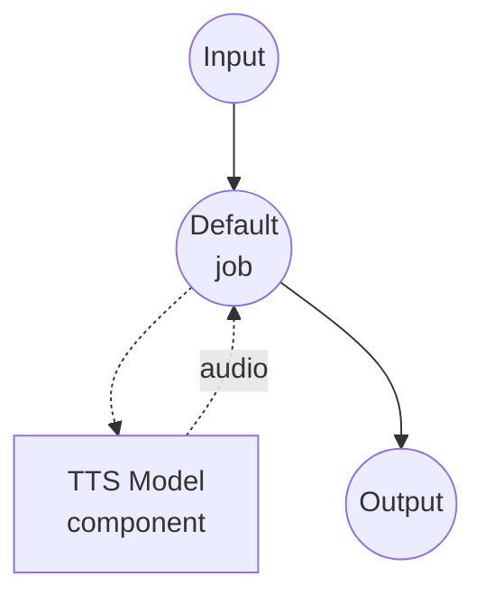

# Text to Speech (Voice Design with FireRedTTS3-Instruct) Model Task Example

This example demonstrates how to generate a brand-new voice from a natural-language description using FireRedTTS3-Instruct, running locally via model-compose's built-in model task functionality.

## Overview

This workflow provides local voice design and speech synthesis that:

1. **Local Model Execution**: Runs FireRedTTS3-Instruct locally without external APIs
2. **No Reference Audio Required**: Generates a novel voice from a text description alone
3. **Instruction-Controlled Attributes**: Guide the target voice's gender, age, timbre, emotion, pace, and accent through natural language
4. **24 kHz Output**: Emits synthesized speech at the model's native 24 kHz sample rate

## Preparation

### Prerequisites

- model-compose installed and available in your PATH
- Sufficient system resources (recommended: 8GB+ VRAM if using a GPU)
- Python environment with FireRedTTS3 available on `sys.path`

### Installing FireRedTTS3

FireRedTTS3 has no PyPI distribution. Clone the repository and expose it to your virtualenv:

```bash
git clone https://github.com/FireRedTeam/FireRedTTS3.git
# Then add the repo root to sys.path (e.g. via a .pth file in your venv's site-packages),
# or run model-compose from inside the cloned repo.
```

The pretrained checkpoint is downloaded automatically from HuggingFace (`FireRedTeam/FireRedTTS3`) the first time the component starts.

### Environment Configuration

1. Navigate to this example directory:
   ```bash
   cd examples/model-tasks/text-to-speech-design-fireredtts3
   ```

2. No additional environment configuration required - model weights and dependencies are managed automatically.

## How to Run

1. **Start the service:**
   ```bash
   model-compose up
   ```

2. **Run the workflow:**

   **Using Web UI (Recommended):**
   - Open the Web UI: http://localhost:8084
   - Enter the text to synthesize
   - Enter a natural-language description of the target voice
   - Click the "Run Workflow" button

   **Using API:**
   ```bash
   curl -X POST http://localhost:8083/api/workflows/runs \
     -H "Content-Type: application/json" \
     -d '{
       "input": {
         "text": "Welcome to the new voice design demo.",
         "instructions": "A gentle young female voice, slightly slow with a playful tone."
       }
     }'
   ```

   **Using CLI:**
   ```bash
   model-compose run --input '{
     "text": "Welcome to the new voice design demo.",
     "instructions": "A gentle young female voice, slightly slow with a playful tone."
   }'
   ```

## Component Details

### Text-to-Speech Model Component (Default)
- **Type**: Model component with `text-to-speech` task
- **Purpose**: Generate a novel voice from a natural-language description
- **Model**: `FireRedTeam/FireRedTTS3`
- **Driver**: `custom`
- **Family**: `fireredtts3`
- **Preset**: `instruct` - loads the FireRedTTS3-Instruct checkpoint
- **Device**: `auto`
- **Method**: `design` - designs a voice from an instruction and synthesizes speech
- **Concurrency**: 1 (single request at a time)

### Model Information: FireRedTTS3-Instruct
- **Developer**: FireRedTeam
- **Type**: Instruction-driven TTS with unified voice design and speech editing
- **Sample Rate**: 24 kHz output
- **Design Attributes**: Gender, age, timbre, emotion, pace, accent
- **Output Format**: Audio (WAV)

## Workflow Details

### "Text to Speech with Voice Design (FireRedTTS3-Instruct)" Workflow (Default)

**Description**: Design a new voice from a natural-language description and generate speech using FireRedTTS3-Instruct at 24 kHz.

#### Job Flow



#### Input Parameters

| Parameter | Type | Required | Default | Description |
|-----------|------|----------|---------|-------------|
| `text` | text | Yes | - | The text to synthesize with the designed voice |
| `instructions` | text | Yes | - | Natural-language description of the target voice |

#### Output Format

| Field | Type | Description |
|-------|------|-------------|
| - | audio | Generated speech audio in the designed voice (WAV, 24 kHz) |

## Example Output

The workflow returns a WAV audio stream containing speech synthesized in a brand-new voice matching the description at 24 kHz.

## Writing Effective Voice Instructions

FireRedTTS3-Instruct first writes an internal voice-attribute plan from your instruction, then renders the audio from that plan. Instructions that mention concrete attributes work best.

Examples:

- `"A young female voice, warm and gentle, with a slightly playful tone."`
- `"An elderly male voice, deep and slow, with a slight rasp."`
- `"A middle-aged professional voice, clear and neutral, moderate pace."`
- `"A cheerful child's voice, high-pitched, fast and energetic."`

Mixing Chinese and English descriptions is supported.

## Related Examples

- **[text-to-speech-clone-fireredtts3](../text-to-speech-clone-fireredtts3/)**: Zero-shot voice cloning with FireRedTTS3-Base
- **[text-to-speech-edit-fireredtts3](../text-to-speech-edit-fireredtts3/)**: Semantic and acoustic speech editing
- **[text-to-speech-design](../text-to-speech-design/)**: Voice design with Qwen3-TTS
