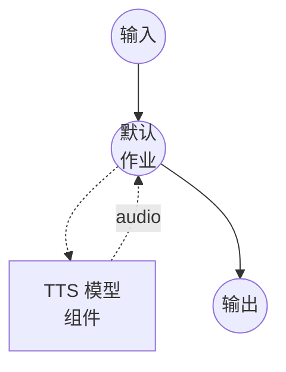

# 文本转语音（FireRedTTS3-Instruct 语音设计）模型任务示例

此示例演示如何使用 FireRedTTS3-Instruct 从自然语言描述中生成全新的语音，通过 model-compose 的内置模型任务功能在本地运行。

## 概述

此工作流提供本地语音设计和语音合成：

1. **本地模型执行**：无需外部 API，在本地运行 FireRedTTS3-Instruct
2. **无需参考音频**：仅从文本描述生成新的语音
3. **指令控制的属性**：通过自然语言引导目标语音的性别、年龄、音色、情感、语速和口音
4. **24 kHz 输出**：以模型原生 24 kHz 采样率输出合成语音

## 准备工作

### 前置条件

- 已安装 model-compose 并在您的 PATH 中可用
- 足够的系统资源（使用 GPU 时推荐：8GB+ VRAM）
- 在 `sys.path` 中包含 FireRedTTS3 的 Python 环境

### 安装 FireRedTTS3

FireRedTTS3 没有 PyPI 发行版。克隆仓库并将其暴露给您的虚拟环境：

```bash
git clone https://github.com/FireRedTeam/FireRedTTS3.git
# 然后将仓库根目录添加到 sys.path（例如通过在 venv 的 site-packages 中创建 .pth 文件），
# 或从克隆的仓库内部运行 model-compose。
```

预训练检查点将在组件首次启动时从 HuggingFace（`FireRedTeam/FireRedTTS3`）自动下载。

### 环境配置

1. 导航到此示例目录：
   ```bash
   cd examples/model-tasks/text-to-speech-design-fireredtts3
   ```

2. 无需额外的环境配置 - 模型权重和依赖会自动管理。

## 运行方式

1. **启动服务：**
   ```bash
   model-compose up
   ```

2. **运行工作流：**

   **使用 Web UI（推荐）：**
   - 打开 Web UI：http://localhost:8084
   - 输入要合成的文本
   - 输入目标语音的自然语言描述
   - 点击"运行工作流"按钮

   **使用 API：**
   ```bash
   curl -X POST http://localhost:8083/api/workflows/runs \
     -H "Content-Type: application/json" \
     -d '{
       "input": {
         "text": "欢迎来到新的语音设计演示。",
         "instructions": "温柔的年轻女性声音，略慢，带有俏皮的语调。"
       }
     }'
   ```

   **使用 CLI：**
   ```bash
   model-compose run --input '{
     "text": "欢迎来到新的语音设计演示。",
     "instructions": "温柔的年轻女性声音，略慢，带有俏皮的语调。"
   }'
   ```

## 组件详情

### 文本转语音模型组件（默认）
- **类型**：具有 `text-to-speech` 任务的模型组件
- **用途**：从自然语言描述生成新的语音
- **模型**：`FireRedTeam/FireRedTTS3`
- **驱动**：`custom`
- **系列**：`fireredtts3`
- **预设**：`instruct` - 加载 FireRedTTS3-Instruct 检查点
- **设备**：`auto`
- **方法**：`design` - 从指令设计语音并合成语音
- **并发数**：1（同时处理一个请求）

### 模型信息：FireRedTTS3-Instruct
- **开发者**：FireRedTeam
- **类型**：具有统一语音设计和语音编辑功能的指令驱动 TTS
- **采样率**：24 kHz 输出
- **设计属性**：性别、年龄、音色、情感、语速、口音
- **输出格式**：音频（WAV）

## 工作流详情

### "Text to Speech with Voice Design (FireRedTTS3-Instruct)" 工作流（默认）

**描述**：从自然语言描述设计新的语音，并使用 FireRedTTS3-Instruct 以 24 kHz 生成语音。

#### 作业流程



#### 输入参数

| 参数 | 类型 | 必需 | 默认值 | 描述 |
|-----------|------|----------|---------|-------------|
| `text` | text | 是 | - | 使用设计语音合成的文本 |
| `instructions` | text | 是 | - | 目标语音的自然语言描述 |

#### 输出格式

| 字段 | 类型 | 描述 |
|-------|------|-------------|
| - | audio | 使用设计语音生成的语音音频（WAV，24 kHz） |

## 示例输出

工作流返回包含以 24 kHz 使用与描述匹配的全新语音合成的 WAV 音频流。

## 编写有效的语音指令

FireRedTTS3-Instruct 首先根据您的指令编写内部语音属性计划，然后从该计划渲染音频。提到具体属性的指令效果最佳。

示例：

- `"年轻的女性声音，温暖而温柔，带有略微俏皮的语调。"`
- `"年长的男性声音，深沉而缓慢，略带沙哑。"`
- `"中年专业人士的声音，清晰而中性，语速适中。"`
- `"欢快的孩童声音，音调高，快速而充满活力。"`

支持中英文混合描述。

## 相关示例

- **[text-to-speech-clone-fireredtts3](../text-to-speech-clone-fireredtts3/)**：使用 FireRedTTS3-Base 的零样本语音克隆
- **[text-to-speech-edit-fireredtts3](../text-to-speech-edit-fireredtts3/)**：语义和声学语音编辑
- **[text-to-speech-design](../text-to-speech-design/)**：使用 Qwen3-TTS 的语音设计
