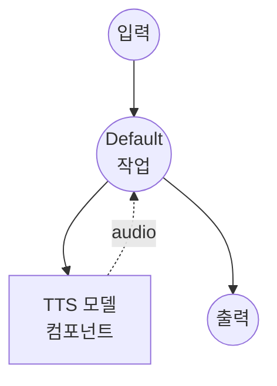

# 텍스트 음성 변환 (보이스 디자인) 모델 태스크 예제

이 예제는 Qwen3-TTS를 사용하여 텍스트 설명으로 새로운 음성을 디자인하고 음성을 생성하는 방법을 보여주며, model-compose의 내장 모델 태스크 기능을 통해 로컬에서 실행됩니다.

## 개요

이 워크플로우는 다음과 같은 로컬 보이스 디자인 및 음성 합성을 제공합니다:

1. **로컬 모델 실행**: HuggingFace transformers를 사용하여 Qwen3-TTS-12Hz-1.7B-VoiceDesign을 로컬에서 실행
2. **보이스 디자인**: 자연어 설명을 기반으로 새로운 음성 생성 (예: "따뜻한 여성 목소리, 약간의 영국식 억양")
3. **서술적 제어**: 참조 오디오 대신 텍스트 지시사항으로 음성 특성 정의
4. **외부 API 불필요**: API 의존 없이 완전한 오프라인 보이스 디자인

## 준비사항

### 필수 요구사항

- model-compose가 설치되어 PATH에서 사용 가능
- CUDA를 지원하는 NVIDIA GPU (`cuda:0`으로 구성)
- 충분한 시스템 리소스 (권장: 8GB+ VRAM)
- transformers와 torch가 포함된 Python 환경 (자동 관리)

### 환경 구성

1. 이 예제 디렉토리로 이동:
   ```bash
   cd examples/model-tasks/text-to-speech-design
   ```

2. 추가 환경 구성이 필요 없습니다 - 모델과 의존성은 자동으로 관리됩니다.

## 실행 방법

1. **서비스 시작:**
   ```bash
   model-compose up
   ```

2. **워크플로우 실행:**

   **API 사용:**
   ```bash
   curl -X POST http://localhost:8080/api/workflows/runs \
     -H "Content-Type: application/json" \
     -d '{
       "input": {
         "text": "안녕하세요, 이 음성은 디자인된 목소리로 생성되었습니다.",
         "instructions": "따뜻하고 친근한 여성 목소리, 차분하고 전문적인 톤."
       }
     }'
   ```

   **웹 UI 사용:**
   - 웹 UI 열기: http://localhost:8081
   - 합성할 텍스트 입력
   - 보이스 디자인 지시사항 입력
   - "Run Workflow" 버튼 클릭

   **CLI 사용:**
   ```bash
   model-compose run --input '{
     "text": "안녕하세요, 이 음성은 디자인된 목소리로 생성되었습니다.",
     "instructions": "따뜻하고 친근한 여성 목소리, 차분하고 전문적인 톤."
   }'
   ```

## 컴포넌트 세부사항

### 텍스트 음성 변환 모델 컴포넌트 (기본)
- **유형**: text-to-speech 태스크를 가진 모델 컴포넌트
- **목적**: 텍스트 설명을 기반으로 한 보이스 디자인 및 음성 합성
- **모델**: Qwen/Qwen3-TTS-12Hz-1.7B-VoiceDesign
- **드라이버**: custom (Qwen 계열)
- **디바이스**: cuda:0
- **메서드**: `design` - 텍스트 설명에서 새로운 음성을 디자인하고 음성 생성
- **동시성**: 1 (한 번에 하나의 요청)

### 모델 정보: Qwen3-TTS-12Hz-1.7B-VoiceDesign
- **개발자**: Alibaba Cloud
- **매개변수**: 17억 개
- **유형**: 보이스 디자인 기능을 가진 텍스트 음성 변환 모델
- **샘플 레이트**: 12Hz 토큰 레이트
- **언어**: 다국어 지원
- **출력 형식**: 오디오 (WAV)

## 워크플로우 세부사항

### "Text to Speech with Voice Design" 워크플로우 (기본)

**설명**: Qwen3-TTS를 사용하여 텍스트 설명으로 새로운 음성을 디자인하고 음성을 생성합니다.

#### 작업 흐름



#### 입력 매개변수

| 매개변수 | 유형 | 필수 | 기본값 | 설명 |
|---------|------|------|--------|------|
| `text` | text | 예 | - | 디자인된 음성으로 합성할 텍스트 |
| `instructions` | text | 예 | - | 원하는 음성 특성에 대한 자연어 설명 |

#### 출력 형식

| 필드 | 유형 | 설명 |
|-----|------|------|
| - | audio | 디자인된 음성으로 생성된 음성 오디오 |

## 보이스 디자인 지시사항

`instructions` 필드는 음성 특성에 대한 자연어 설명을 받습니다. 다음은 몇 가지 예시입니다:

### 지시사항 예시
- `"깊은 남성 목소리, 진지하고 권위 있는 톤."`
- `"젊고 활기찬 여성 목소리, 밝고 경쾌한 톤."`
- `"노년의 남성 목소리, 천천히 부드럽고 지혜로운 톤으로 말함."`
- `"명확하고 전문적인 여성 뉴스 앵커 목소리."`

### 설명 가능한 특성
- **성별**: 남성, 여성
- **연령**: 젊은, 중년, 노년
- **톤**: 따뜻한, 차가운, 전문적인, 캐주얼한, 밝은, 진지한
- **속도**: 빠른, 느린, 보통
- **억양**: 다양한 지역 억양
- **스타일**: 내레이션, 대화, 프레젠테이션

## 시스템 요구사항

### 최소 요구사항
- **GPU**: 4GB+ VRAM의 NVIDIA GPU (CUDA 필수)
- **RAM**: 8GB (권장 16GB+)
- **디스크 공간**: 모델 저장을 위한 10GB+
- **인터넷**: 초기 모델 다운로드 시에만 필요

### 성능 참고사항
- 첫 실행 시 모델 다운로드 필요 (수 GB)
- 이 예제에서는 GPU가 필수입니다 (`device: cuda:0`)
- 동일한 지시사항으로도 실행마다 보이스 디자인 결과가 달라질 수 있음

## 관련 예제

- **[text-to-speech-generate](../text-to-speech-generate/)**: 프리셋 음성 프로필을 사용한 음성 생성
- **[text-to-speech-clone](../text-to-speech-clone/)**: 참조 오디오에서 음성을 복제
