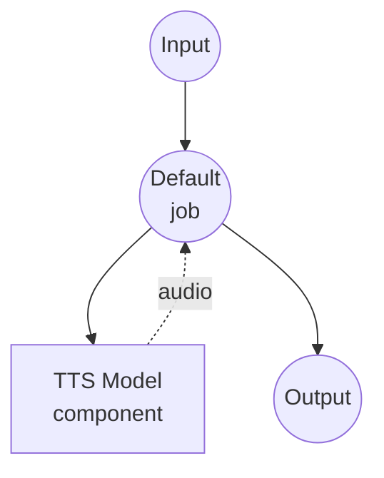

# Text to Speech (Voice Design) Model Task Example

This example demonstrates how to design a new voice from a text description and generate speech using Qwen3-TTS, running locally via model-compose's built-in model task functionality.

## Overview

This workflow provides local voice design and speech synthesis that:

1. **Local Model Execution**: Runs Qwen3-TTS-12Hz-1.7B-VoiceDesign locally using HuggingFace transformers
2. **Voice Design**: Creates a new voice based on a natural language description (e.g., "a warm female voice with a slight British accent")
3. **Descriptive Control**: Define voice characteristics through text instructions instead of reference audio
4. **No External APIs**: Completely offline voice design without API dependencies

## Preparation

### Prerequisites

- model-compose installed and available in your PATH
- NVIDIA GPU with CUDA support (configured for `cuda:0`)
- Sufficient system resources (recommended: 8GB+ VRAM)
- Python environment with transformers and torch (automatically managed)

### Environment Configuration

1. Navigate to this example directory:
   ```bash
   cd examples/model-tasks/text-to-speech-design
   ```

2. No additional environment configuration required - model and dependencies are managed automatically.

## How to Run

1. **Start the service:**
   ```bash
   model-compose up
   ```

2. **Run the workflow:**

   **Using API:**
   ```bash
   curl -X POST http://localhost:8080/api/workflows/runs \
     -H "Content-Type: application/json" \
     -d '{
       "input": {
         "text": "Hello, this speech was generated with a designed voice.",
         "instructions": "A warm, friendly female voice with a calm and professional tone."
       }
     }'
   ```

   **Using Web UI:**
   - Open the Web UI: http://localhost:8081
   - Enter the text to synthesize
   - Enter voice design instructions
   - Click the "Run Workflow" button

   **Using CLI:**
   ```bash
   model-compose run --input '{
     "text": "Hello, this speech was generated with a designed voice.",
     "instructions": "A warm, friendly female voice with a calm and professional tone."
   }'
   ```

## Component Details

### Text-to-Speech Model Component (Default)
- **Type**: Model component with text-to-speech task
- **Purpose**: Voice design and speech synthesis from text descriptions
- **Model**: Qwen/Qwen3-TTS-12Hz-1.7B-VoiceDesign
- **Driver**: custom (Qwen family)
- **Device**: cuda:0
- **Method**: `design` - designs a new voice from a text description and generates speech
- **Concurrency**: 1 (single request at a time)

### Model Information: Qwen3-TTS-12Hz-1.7B-VoiceDesign
- **Developer**: Alibaba Cloud
- **Parameters**: 1.7 billion
- **Type**: Text-to-speech model with voice design capability
- **Sample Rate**: 12Hz token rate
- **Languages**: Multilingual support
- **Output Format**: Audio (WAV)

## Workflow Details

### "Text to Speech with Voice Design" Workflow (Default)

**Description**: Design a new voice from a description and generate speech using Qwen3-TTS.

#### Job Flow



#### Input Parameters

| Parameter | Type | Required | Default | Description |
|-----------|------|----------|---------|-------------|
| `text` | text | Yes | - | The text to synthesize with the designed voice |
| `instructions` | text | Yes | - | Natural language description of the desired voice characteristics |

#### Output Format

| Field | Type | Description |
|-------|------|-------------|
| - | audio | Generated speech audio with the designed voice |

## Voice Design Instructions

The `instructions` field accepts natural language descriptions of voice characteristics. Here are some examples:

### Example Instructions
- `"A deep male voice with a serious, authoritative tone."`
- `"A young, energetic female voice with a cheerful and upbeat tone."`
- `"An elderly male voice, speaking slowly with a gentle and wise tone."`
- `"A clear, professional female newsreader voice."`

### Describable Characteristics
- **Gender**: male, female
- **Age**: young, middle-aged, elderly
- **Tone**: warm, cold, professional, casual, cheerful, serious
- **Pace**: fast, slow, moderate
- **Accent**: various regional accents
- **Style**: narration, conversation, presentation

## System Requirements

### Minimum Requirements
- **GPU**: NVIDIA GPU with 4GB+ VRAM (CUDA required)
- **RAM**: 8GB (recommended 16GB+)
- **Disk Space**: 10GB+ for model storage
- **Internet**: Required for initial model download only

### Performance Notes
- First run requires model download (several GB)
- GPU is required for this example (`device: cuda:0`)
- Voice design results may vary between runs with the same instructions

## Customization

### Combining with Variable Binding
```yaml
action:
  method: design
  text: ${input.text as text}
  instructions: ${input.instructions as text}
```

## Related Examples

- **[text-to-speech-generate](../text-to-speech-generate/)**: Generate speech using preset voice profiles
- **[text-to-speech-clone](../text-to-speech-clone/)**: Clone a voice from reference audio
