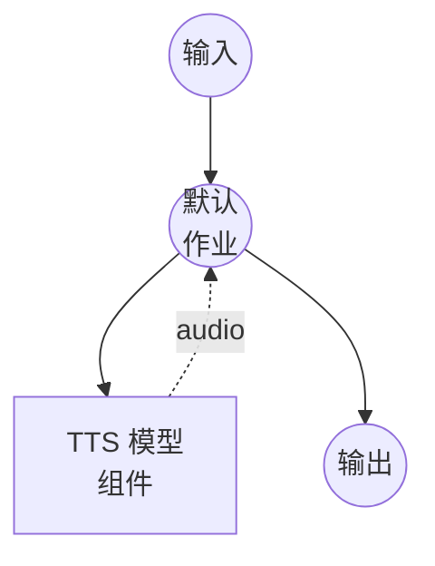

# 文本转语音（语音设计）模型任务示例

此示例演示如何使用 Qwen3-TTS 通过文本描述设计新语音并生成语音，通过 model-compose 的内置模型任务功能在本地运行。

## 概述

此工作流提供本地语音设计和语音合成：

1. **本地模型执行**：使用 HuggingFace transformers 在本地运行 Qwen3-TTS-12Hz-1.7B-VoiceDesign
2. **语音设计**：基于自然语言描述创建新语音（例如"温暖的女性声音，带有轻微的英式口音"）
3. **描述性控制**：通过文本指令而非参考音频定义语音特征
4. **无需外部 API**：无 API 依赖的完全离线语音设计

## 准备工作

### 前置条件

- 已安装 model-compose 并在您的 PATH 中可用
- 支持 CUDA 的 NVIDIA GPU（配置为 `cuda:0`）
- 足够的系统资源（推荐：8GB+ VRAM）
- 包含 transformers 和 torch 的 Python 环境（自动管理）

### 环境配置

1. 导航到此示例目录：
   ```bash
   cd examples/model-tasks/text-to-speech-design
   ```

2. 无需额外的环境配置 - 模型和依赖会自动管理。

## 运行方式

1. **启动服务：**
   ```bash
   model-compose up
   ```

2. **运行工作流：**

   **使用 API：**
   ```bash
   curl -X POST http://localhost:8080/api/workflows/runs \
     -H "Content-Type: application/json" \
     -d '{
       "input": {
         "text": "你好，这段语音是用设计的声音生成的。",
         "instructions": "温暖、友好的女性声音，平静而专业的语调。"
       }
     }'
   ```

   **使用 Web UI：**
   - 打开 Web UI：http://localhost:8081
   - 输入要合成的文本
   - 输入语音设计指令
   - 点击"运行工作流"按钮

   **使用 CLI：**
   ```bash
   model-compose run --input '{
     "text": "你好，这段语音是用设计的声音生成的。",
     "instructions": "温暖、友好的女性声音，平静而专业的语调。"
   }'
   ```

## 组件详情

### 文本转语音模型组件（默认）
- **类型**：具有 text-to-speech 任务的模型组件
- **用途**：基于文本描述的语音设计和语音合成
- **模型**：Qwen/Qwen3-TTS-12Hz-1.7B-VoiceDesign
- **驱动**：custom（Qwen 系列）
- **设备**：cuda:0
- **方法**：`design` - 从文本描述设计新语音并生成语音
- **并发数**：1（同时处理一个请求）

### 模型信息：Qwen3-TTS-12Hz-1.7B-VoiceDesign
- **开发者**：阿里云
- **参数**：17 亿
- **类型**：具有语音设计功能的文本转语音模型
- **采样率**：12Hz token 率
- **语言**：多语言支持
- **输出格式**：音频（WAV）

## 工作流详情

### "Text to Speech with Voice Design"工作流（默认）

**描述**：使用 Qwen3-TTS 通过文本描述设计新语音并生成语音。

#### 作业流程



#### 输入参数

| 参数 | 类型 | 必需 | 默认值 | 描述 |
|-----------|------|----------|---------|-------------|
| `text` | text | 是 | - | 使用设计语音合成的文本 |
| `instructions` | text | 是 | - | 所需语音特征的自然语言描述 |

#### 输出格式

| 字段 | 类型 | 描述 |
|-------|------|-------------|
| - | audio | 使用设计语音生成的语音音频 |

## 语音设计指令

`instructions` 字段接受对语音特征的自然语言描述。以下是一些示例：

### 指令示例
- `"深沉的男性声音，严肃而权威的语调。"`
- `"年轻、充满活力的女性声音，欢快而乐观的语调。"`
- `"老年男性声音，缓慢而温和、充满智慧的语调。"`
- `"清晰、专业的女性新闻播报员声音。"`

### 可描述的特征
- **性别**：男性、女性
- **年龄**：年轻、中年、老年
- **语调**：温暖、冷淡、专业、休闲、欢快、严肃
- **语速**：快速、缓慢、适中
- **口音**：各种地区口音
- **风格**：叙述、对话、演讲

## 系统要求

### 最低要求
- **GPU**：NVIDIA GPU，4GB+ VRAM（需要 CUDA）
- **RAM**：8GB（推荐 16GB+）
- **磁盘空间**：10GB+ 用于模型存储
- **网络**：仅初次模型下载时需要

### 性能说明
- 首次运行需要下载模型（数 GB）
- 此示例需要 GPU（`device: cuda:0`）
- 使用相同指令的语音设计结果可能因运行而异

## 相关示例

- **[text-to-speech-generate](../text-to-speech-generate/)**：使用预设语音配置文件生成语音
- **[text-to-speech-clone](../text-to-speech-clone/)**：从参考音频克隆语音
