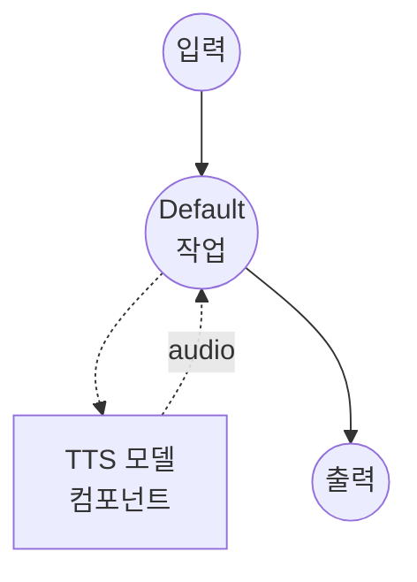

# 음성 편집 (FireRedTTS3-Instruct) 모델 태스크 예제

이 예제는 FireRedTTS3-Instruct를 사용하여 자연어 명령으로 기존 음성 클립을 편집하는 방법을 보여주며, model-compose의 내장 모델 태스크 기능을 통해 로컬에서 실행됩니다.

## 개요

이 워크플로우는 다음과 같은 로컬 음성 편집을 제공합니다:

1. **로컬 모델 실행**: 외부 API 없이 FireRedTTS3-Instruct를 로컬에서 실행
2. **의미론적 편집**: 자유 형식 명령어를 통해 소스 오디오에서 단어를 삽입, 삭제 또는 교체
3. **음향적 편집**: 템플릿 기반 명령어를 통해 속도, 음높이 또는 볼륨 조정
4. **통합 모델**: 두 편집 모드 모두 동일한 기본 Instruct 체크포인트를 공유
5. **24 kHz 출력**: 모델의 기본 24 kHz 샘플 레이트로 편집된 음성 출력

## 준비사항

### 필수 요구사항

- model-compose가 설치되어 PATH에서 사용 가능
- 충분한 시스템 리소스 (GPU 사용 시 권장: 8GB+ VRAM)
- FireRedTTS3가 `sys.path`에서 사용 가능한 Python 환경
- 편집할 입력 오디오 클립

### FireRedTTS3 설치

FireRedTTS3는 PyPI 배포판이 없습니다. 저장소를 클론하여 가상환경에 노출시키세요:

```bash
git clone https://github.com/FireRedTeam/FireRedTTS3.git
# 그런 다음 저장소 루트를 sys.path에 추가하세요 (예: venv의 site-packages에 .pth 파일 생성),
# 또는 클론한 저장소 내부에서 model-compose를 실행하세요.
```

사전 학습된 체크포인트는 컴포넌트가 처음 시작될 때 HuggingFace(`FireRedTeam/FireRedTTS3`)에서 자동으로 다운로드됩니다.

### 환경 구성

1. 이 예제 디렉토리로 이동:
   ```bash
   cd examples/model-tasks/text-to-speech-edit-fireredtts3
   ```

2. 추가 환경 구성이 필요 없습니다 - 모델 가중치와 의존성은 자동으로 관리됩니다.

## 실행 방법

1. **서비스 시작:**
   ```bash
   model-compose up
   ```

2. **워크플로우 실행:**

   **웹 UI 사용 (권장):**
   - 웹 UI 열기: http://localhost:8084
   - 입력 오디오 클립 업로드
   - 편집 명령 입력
   - 편집 모드 선택: `semantic` 또는 `acoustic`
   - "Run Workflow" 버튼 클릭

   **API 사용 (의미론적 편집):**
   ```bash
   curl -X POST http://localhost:8083/api/workflows/runs \
     -H "Content-Type: application/json" \
     -d '{
       "input": {
         "audio_in": "<base64-인코딩된-오디오>",
         "instructions": "Replace \"cats\" with \"dogs\".",
         "mode": "semantic"
       }
     }'
   ```

   **API 사용 (음향적 편집):**
   ```bash
   curl -X POST http://localhost:8083/api/workflows/runs \
     -H "Content-Type: application/json" \
     -d '{
       "input": {
         "audio_in": "<base64-인코딩된-오디오>",
         "instructions": "adjust the speed to 0.5",
         "mode": "acoustic"
       }
     }'
   ```

   **CLI 사용:**
   ```bash
   model-compose run --input '{
     "audio_in": "<base64-인코딩된-오디오>",
     "instructions": "shift the pitch by 2 steps",
     "mode": "acoustic"
   }'
   ```

## 컴포넌트 세부사항

### 텍스트 음성 변환 모델 컴포넌트 (기본)
- **유형**: `text-to-speech` 태스크를 가진 모델 컴포넌트
- **목적**: 의미론적 및 음향적 음성 편집
- **모델**: `FireRedTeam/FireRedTTS3`
- **드라이버**: `custom`
- **패밀리**: `fireredtts3`
- **프리셋**: `instruct` - FireRedTTS3-Instruct 체크포인트를 로드
- **디바이스**: `auto`
- **메서드**: `edit` - 명령에 따라 입력 오디오를 다시 작성
- **동시성**: 1 (한 번에 하나의 요청)

## 워크플로우 세부사항

### "Speech Editing (FireRedTTS3-Instruct)" 워크플로우 (기본)

**설명**: 자연어 명령을 사용하여 기존 음성 클립을 편집합니다. 의미론적 편집(내용 삽입/삭제/교체)과 음향적 편집(속도, 음높이, 볼륨)을 지원합니다.

#### 작업 흐름



#### 입력 매개변수

| 매개변수 | 유형 | 필수 | 기본값 | 설명 |
|---------|------|------|--------|------|
| `audio_in` | audio | 예 | - | 편집할 입력 오디오 클립 |
| `instructions` | text | 예 | - | 편집 명령 (아래 모드 참조) |
| `mode` | text | 아니오 | `semantic` | `semantic` 또는 `acoustic` |
| `text` | text | 아니오 | `""` | edit 메서드에서는 무시됨; TTS 액션 계약을 위해 유지 |

#### 출력 형식

| 필드 | 유형 | 설명 |
|-----|------|------|
| - | audio | 편집된 음성 오디오 (WAV, 24 kHz) |

## 편집 모드

### 의미론적 편집

자유 형식 명령으로 구동되는 콘텐츠 수준 편집. 모델은 화자의 음성을 유지하면서 대본을 다시 작성하고 오디오를 재합성합니다.

예시:

- `"Replace \"cats\" with \"dogs\"."`
- `"Delete the phrase \"in fact\"."`
- `"Insert \"very carefully\" after \"walked\"."`

### 음향적 편집

템플릿화된 명령으로 구동되는 음향 속성 편집. 자유 형식 표현은 지원되지 않으며, 명령은 아래 템플릿 중 하나와 일치해야 합니다:

| 속성 | 템플릿 | 유효 범위 |
|-----|--------|-----------|
| speed | `adjust the speed to X` | `X in [0.5, 2.0]`, 단계 0.1 |
| pitch | `shift the pitch by N step(s)` | `N in {-6..-1, 1..+6}` |
| volume | `adjust the volume to X` | `X in [0.3, 2.0]`, 단계 0.1 |

예시:

- `"adjust the speed to 0.8"`
- `"shift the pitch by -3 steps"`
- `"adjust the volume to 1.5"`

## 예제 출력

워크플로우는 24 kHz에서 편집된 음성을 담은 WAV 오디오 스트림을 반환합니다.

## 관련 예제

- **[text-to-speech-clone-fireredtts3](../text-to-speech-clone-fireredtts3/)**: FireRedTTS3-Base를 사용한 제로샷 보이스 클로닝
- **[text-to-speech-design-fireredtts3](../text-to-speech-design-fireredtts3/)**: 자연어 설명에서의 보이스 디자인
