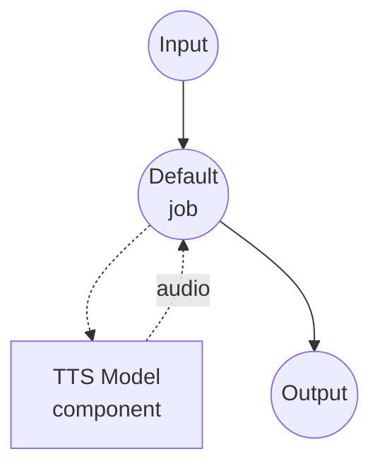

# Speech Editing (FireRedTTS3-Instruct) Model Task Example

This example demonstrates how to edit an existing speech clip using natural-language instructions with FireRedTTS3-Instruct, running locally via model-compose's built-in model task functionality.

## Overview

This workflow provides local speech editing that:

1. **Local Model Execution**: Runs FireRedTTS3-Instruct locally without external APIs
2. **Semantic Editing**: Insert, delete, or replace words in the source audio through free-form instructions
3. **Acoustic Editing**: Adjust speed, pitch, or volume through template-driven instructions
4. **Unified Model**: Both edit modes share the same underlying Instruct checkpoint
5. **24 kHz Output**: Emits the edited speech at the model's native 24 kHz sample rate

## Preparation

### Prerequisites

- model-compose installed and available in your PATH
- Sufficient system resources (recommended: 8GB+ VRAM if using a GPU)
- Python environment with FireRedTTS3 available on `sys.path`
- An input audio clip to edit

### Installing FireRedTTS3

FireRedTTS3 has no PyPI distribution. Clone the repository and expose it to your virtualenv:

```bash
git clone https://github.com/FireRedTeam/FireRedTTS3.git
# Then add the repo root to sys.path (e.g. via a .pth file in your venv's site-packages),
# or run model-compose from inside the cloned repo.
```

The pretrained checkpoint is downloaded automatically from HuggingFace (`FireRedTeam/FireRedTTS3`) the first time the component starts.

### Environment Configuration

1. Navigate to this example directory:
   ```bash
   cd examples/model-tasks/text-to-speech-edit-fireredtts3
   ```

2. No additional environment configuration required - model weights and dependencies are managed automatically.

## How to Run

1. **Start the service:**
   ```bash
   model-compose up
   ```

2. **Run the workflow:**

   **Using Web UI (Recommended):**
   - Open the Web UI: http://localhost:8084
   - Upload the input audio clip
   - Enter the edit instruction
   - Choose the edit mode: `semantic` or `acoustic`
   - Click the "Run Workflow" button

   **Using API (semantic edit):**
   ```bash
   curl -X POST http://localhost:8083/api/workflows/runs \
     -H "Content-Type: application/json" \
     -d '{
       "input": {
         "audio_in": "<base64-encoded-audio>",
         "instructions": "Replace \"cats\" with \"dogs\".",
         "mode": "semantic"
       }
     }'
   ```

   **Using API (acoustic edit):**
   ```bash
   curl -X POST http://localhost:8083/api/workflows/runs \
     -H "Content-Type: application/json" \
     -d '{
       "input": {
         "audio_in": "<base64-encoded-audio>",
         "instructions": "adjust the speed to 0.5",
         "mode": "acoustic"
       }
     }'
   ```

   **Using CLI:**
   ```bash
   model-compose run --input '{
     "audio_in": "<base64-encoded-audio>",
     "instructions": "shift the pitch by 2 steps",
     "mode": "acoustic"
   }'
   ```

## Component Details

### Text-to-Speech Model Component (Default)
- **Type**: Model component with `text-to-speech` task
- **Purpose**: Semantic and acoustic speech editing
- **Model**: `FireRedTeam/FireRedTTS3`
- **Driver**: `custom`
- **Family**: `fireredtts3`
- **Preset**: `instruct` - loads the FireRedTTS3-Instruct checkpoint
- **Device**: `auto`
- **Method**: `edit` - rewrites the input audio according to the instruction
- **Concurrency**: 1 (single request at a time)

## Workflow Details

### "Speech Editing (FireRedTTS3-Instruct)" Workflow (Default)

**Description**: Edit an existing speech clip using natural-language instructions. Supports semantic edits (insert/delete/replace content) and acoustic edits (speed, pitch, volume).

#### Job Flow



#### Input Parameters

| Parameter | Type | Required | Default | Description |
|-----------|------|----------|---------|-------------|
| `audio_in` | audio | Yes | - | Input audio clip to be edited |
| `instructions` | text | Yes | - | Edit instruction (see modes below) |
| `mode` | text | No | `semantic` | Either `semantic` or `acoustic` |
| `text` | text | No | `""` | Ignored by the edit method; kept for TTS action contract |

#### Output Format

| Field | Type | Description |
|-------|------|-------------|
| - | audio | Edited speech audio (WAV, 24 kHz) |

## Edit Modes

### Semantic Edit

Content-level editing driven by free-form instructions. The model rewrites the transcript and re-synthesizes the audio while preserving the speaker's voice.

Examples:

- `"Replace \"cats\" with \"dogs\"."`
- `"Delete the phrase \"in fact\"."`
- `"Insert \"very carefully\" after \"walked\"."`

### Acoustic Edit

Acoustic-attribute editing driven by templated instructions. Free-form phrasing is not supported — the instruction must match one of the templates below:

| Attribute | Template | Valid range |
|-----------|----------|-------------|
| speed | `adjust the speed to X` | `X in [0.5, 2.0]`, step 0.1 |
| pitch | `shift the pitch by N step(s)` | `N in {-6..-1, 1..+6}` |
| volume | `adjust the volume to X` | `X in [0.3, 2.0]`, step 0.1 |

Examples:

- `"adjust the speed to 0.8"`
- `"shift the pitch by -3 steps"`
- `"adjust the volume to 1.5"`

## Example Output

The workflow returns a WAV audio stream containing the edited speech at 24 kHz.

## Related Examples

- **[text-to-speech-clone-fireredtts3](../text-to-speech-clone-fireredtts3/)**: Zero-shot voice cloning with FireRedTTS3-Base
- **[text-to-speech-design-fireredtts3](../text-to-speech-design-fireredtts3/)**: Voice design from a natural-language description
