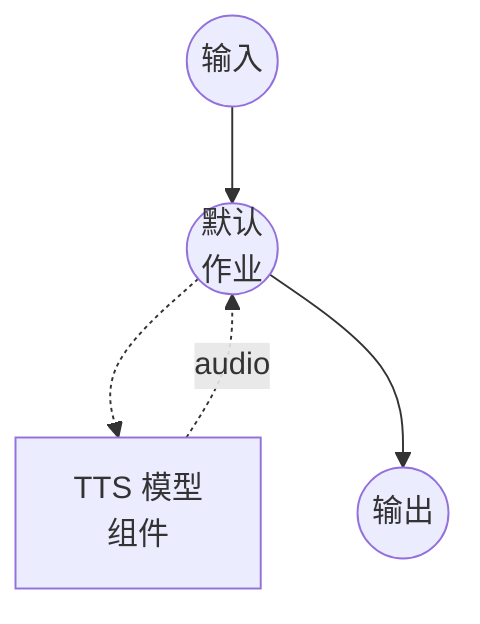

# 语音编辑（FireRedTTS3-Instruct）模型任务示例

此示例演示如何使用 FireRedTTS3-Instruct 通过自然语言指令编辑现有的语音片段，通过 model-compose 的内置模型任务功能在本地运行。

## 概述

此工作流提供本地语音编辑：

1. **本地模型执行**：无需外部 API，在本地运行 FireRedTTS3-Instruct
2. **语义编辑**：通过自由形式的指令在源音频中插入、删除或替换单词
3. **声学编辑**：通过模板驱动的指令调整语速、音高或音量
4. **统一模型**：两种编辑模式共享相同的底层 Instruct 检查点
5. **24 kHz 输出**：以模型原生 24 kHz 采样率输出编辑后的语音

## 准备工作

### 前置条件

- 已安装 model-compose 并在您的 PATH 中可用
- 足够的系统资源（使用 GPU 时推荐：8GB+ VRAM）
- 在 `sys.path` 中包含 FireRedTTS3 的 Python 环境
- 要编辑的输入音频片段

### 安装 FireRedTTS3

FireRedTTS3 没有 PyPI 发行版。克隆仓库并将其暴露给您的虚拟环境：

```bash
git clone https://github.com/FireRedTeam/FireRedTTS3.git
# 然后将仓库根目录添加到 sys.path（例如通过在 venv 的 site-packages 中创建 .pth 文件），
# 或从克隆的仓库内部运行 model-compose。
```

预训练检查点将在组件首次启动时从 HuggingFace（`FireRedTeam/FireRedTTS3`）自动下载。

### 环境配置

1. 导航到此示例目录：
   ```bash
   cd examples/model-tasks/text-to-speech-edit-fireredtts3
   ```

2. 无需额外的环境配置 - 模型权重和依赖会自动管理。

## 运行方式

1. **启动服务：**
   ```bash
   model-compose up
   ```

2. **运行工作流：**

   **使用 Web UI（推荐）：**
   - 打开 Web UI：http://localhost:8084
   - 上传输入音频片段
   - 输入编辑指令
   - 选择编辑模式：`semantic` 或 `acoustic`
   - 点击"运行工作流"按钮

   **使用 API（语义编辑）：**
   ```bash
   curl -X POST http://localhost:8083/api/workflows/runs \
     -H "Content-Type: application/json" \
     -d '{
       "input": {
         "audio_in": "<base64编码的音频>",
         "instructions": "Replace \"cats\" with \"dogs\".",
         "mode": "semantic"
       }
     }'
   ```

   **使用 API（声学编辑）：**
   ```bash
   curl -X POST http://localhost:8083/api/workflows/runs \
     -H "Content-Type: application/json" \
     -d '{
       "input": {
         "audio_in": "<base64编码的音频>",
         "instructions": "adjust the speed to 0.5",
         "mode": "acoustic"
       }
     }'
   ```

   **使用 CLI：**
   ```bash
   model-compose run --input '{
     "audio_in": "<base64编码的音频>",
     "instructions": "shift the pitch by 2 steps",
     "mode": "acoustic"
   }'
   ```

## 组件详情

### 文本转语音模型组件（默认）
- **类型**：具有 `text-to-speech` 任务的模型组件
- **用途**：语义和声学语音编辑
- **模型**：`FireRedTeam/FireRedTTS3`
- **驱动**：`custom`
- **系列**：`fireredtts3`
- **预设**：`instruct` - 加载 FireRedTTS3-Instruct 检查点
- **设备**：`auto`
- **方法**：`edit` - 根据指令重写输入音频
- **并发数**：1（同时处理一个请求）

## 工作流详情

### "Speech Editing (FireRedTTS3-Instruct)" 工作流（默认）

**描述**：使用自然语言指令编辑现有的语音片段。支持语义编辑（插入/删除/替换内容）和声学编辑（语速、音高、音量）。

#### 作业流程



#### 输入参数

| 参数 | 类型 | 必需 | 默认值 | 描述 |
|-----------|------|----------|---------|-------------|
| `audio_in` | audio | 是 | - | 要编辑的输入音频片段 |
| `instructions` | text | 是 | - | 编辑指令（参见下方模式） |
| `mode` | text | 否 | `semantic` | `semantic` 或 `acoustic` |
| `text` | text | 否 | `""` | edit 方法忽略此字段；保留以符合 TTS action 契约 |

#### 输出格式

| 字段 | 类型 | 描述 |
|-------|------|-------------|
| - | audio | 编辑后的语音音频（WAV，24 kHz） |

## 编辑模式

### 语义编辑

由自由形式指令驱动的内容级编辑。模型在保留说话者声音的同时重写文稿并重新合成音频。

示例：

- `"Replace \"cats\" with \"dogs\"."`
- `"Delete the phrase \"in fact\"."`
- `"Insert \"very carefully\" after \"walked\"."`

### 声学编辑

由模板化指令驱动的声学属性编辑。不支持自由形式表达 - 指令必须与以下模板之一匹配：

| 属性 | 模板 | 有效范围 |
|-----|------|---------|
| speed | `adjust the speed to X` | `X in [0.5, 2.0]`，步长 0.1 |
| pitch | `shift the pitch by N step(s)` | `N in {-6..-1, 1..+6}` |
| volume | `adjust the volume to X` | `X in [0.3, 2.0]`，步长 0.1 |

示例：

- `"adjust the speed to 0.8"`
- `"shift the pitch by -3 steps"`
- `"adjust the volume to 1.5"`

## 示例输出

工作流返回包含以 24 kHz 编辑后语音的 WAV 音频流。

## 相关示例

- **[text-to-speech-clone-fireredtts3](../text-to-speech-clone-fireredtts3/)**：使用 FireRedTTS3-Base 的零样本语音克隆
- **[text-to-speech-design-fireredtts3](../text-to-speech-design-fireredtts3/)**：从自然语言描述进行语音设计
