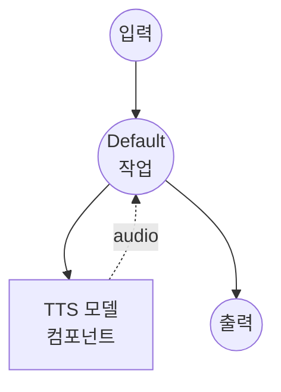

# 텍스트 음성 변환 (프리셋 보이스) 모델 태스크 예제

이 예제는 Qwen3-TTS의 프리셋 보이스를 사용하여 텍스트에서 음성 오디오를 생성하는 방법을 보여주며, model-compose의 내장 모델 태스크 기능을 통해 로컬에서 실행됩니다.

## 개요

이 워크플로우는 다음과 같은 로컬 텍스트 음성 변환을 제공합니다:

1. **로컬 모델 실행**: HuggingFace transformers를 사용하여 Qwen3-TTS-12Hz-1.7B-CustomVoice를 로컬에서 실행
2. **프리셋 보이스**: 일관된 음성 출력을 위한 내장 음성 프로필 (예: `vivian`) 사용
3. **음성 지시사항**: 발화 스타일을 조정하기 위한 선택적 지시사항 지원
4. **외부 API 불필요**: API 의존 없이 완전한 오프라인 음성 합성

## 준비사항

### 필수 요구사항

- model-compose가 설치되어 PATH에서 사용 가능
- CUDA를 지원하는 NVIDIA GPU (`cuda:0`으로 구성)
- 충분한 시스템 리소스 (권장: 8GB+ VRAM)
- transformers와 torch가 포함된 Python 환경 (자동 관리)

### 환경 구성

1. 이 예제 디렉토리로 이동:
   ```bash
   cd examples/model-tasks/text-to-speech-generate
   ```

2. 추가 환경 구성이 필요 없습니다 - 모델과 의존성은 자동으로 관리됩니다.

## 실행 방법

1. **서비스 시작:**
   ```bash
   model-compose up
   ```

2. **워크플로우 실행:**

   **API 사용:**
   ```bash
   curl -X POST http://localhost:8080/api/workflows/runs \
     -H "Content-Type: application/json" \
     -d '{"input": {"text": "안녕하세요, 텍스트 음성 변환 데모입니다."}}'
   ```

   **웹 UI 사용:**
   - 웹 UI 열기: http://localhost:8081
   - 텍스트 입력
   - "Run Workflow" 버튼 클릭

   **CLI 사용:**
   ```bash
   model-compose run --input '{"text": "안녕하세요, 텍스트 음성 변환 데모입니다."}'
   ```

## 컴포넌트 세부사항

### 텍스트 음성 변환 모델 컴포넌트 (기본)
- **유형**: text-to-speech 태스크를 가진 모델 컴포넌트
- **목적**: 프리셋 음성 프로필을 사용한 로컬 음성 합성
- **모델**: Qwen/Qwen3-TTS-12Hz-1.7B-CustomVoice
- **드라이버**: custom (Qwen 계열)
- **디바이스**: cuda:0
- **메서드**: `generate` - 프리셋 보이스를 사용하여 음성 합성
- **동시성**: 1 (한 번에 하나의 요청)

### 모델 정보: Qwen3-TTS-12Hz-1.7B-CustomVoice
- **개발자**: Alibaba Cloud
- **매개변수**: 17억 개
- **유형**: 프리셋 커스텀 보이스 지원 텍스트 음성 변환 모델
- **샘플 레이트**: 12Hz 토큰 레이트
- **언어**: 자동 언어 감지를 통한 다국어 지원
- **출력 형식**: 오디오 (WAV)

## 워크플로우 세부사항

### "Text to Speech with Preset Voice" 워크플로우 (기본)

**설명**: Qwen3-TTS의 프리셋 보이스를 사용하여 텍스트에서 음성 오디오를 생성합니다.

#### 작업 흐름



#### 입력 매개변수

| 매개변수 | 유형 | 필수 | 기본값 | 설명 |
|---------|------|------|--------|------|
| `text` | text | 예 | - | 음성으로 변환할 텍스트 |
| `voice` | string | 아니오 | `vivian` | 프리셋 음성 프로필 이름 |
| `instructions` | text | 아니오 | `""` | 발화 스타일을 조정하기 위한 선택적 지시사항 |

#### 출력 형식

| 필드 | 유형 | 설명 |
|-----|------|------|
| - | audio | 생성된 음성 오디오 |

## 시스템 요구사항

### 최소 요구사항
- **GPU**: 4GB+ VRAM의 NVIDIA GPU (CUDA 필수)
- **RAM**: 8GB (권장 16GB+)
- **디스크 공간**: 모델 저장을 위한 10GB+
- **인터넷**: 초기 모델 다운로드 시에만 필요

### 성능 참고사항
- 첫 실행 시 모델 다운로드 필요 (수 GB)
- 이 예제에서는 GPU가 필수입니다 (`device: cuda:0`)
- GPU 메모리 문제를 방지하기 위한 단일 동시 요청

## 맞춤화

### 음성 변경
```yaml
action:
  method: generate
  text: ${input.text as text}
  voice: ${input.voice | another-voice}
```

### 스타일 지시사항 추가
```yaml
action:
  method: generate
  text: ${input.text as text}
  voice: ${input.voice | vivian}
  instructions: "천천히 그리고 따뜻한 톤으로 명확하게 말해주세요."
```

## 관련 예제

- **[text-to-speech-clone](../text-to-speech-clone/)**: 참조 오디오에서 음성을 복제
- **[text-to-speech-design](../text-to-speech-design/)**: 텍스트 설명으로 새로운 음성을 디자인
