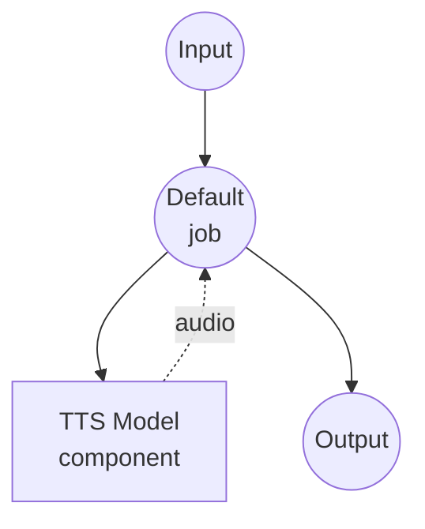

# Text to Speech (Preset Voice) Model Task Example

This example demonstrates how to generate speech audio from text using a preset voice with Qwen3-TTS, running locally via model-compose's built-in model task functionality.

## Overview

This workflow provides local text-to-speech generation that:

1. **Local Model Execution**: Runs Qwen3-TTS-12Hz-1.7B-CustomVoice locally using HuggingFace transformers
2. **Preset Voices**: Uses built-in voice profiles (e.g., `vivian`) for consistent speech output
3. **Voice Instructions**: Supports optional instructions to adjust speaking style
4. **No External APIs**: Completely offline speech synthesis without API dependencies

## Preparation

### Prerequisites

- model-compose installed and available in your PATH
- NVIDIA GPU with CUDA support (configured for `cuda:0`)
- Sufficient system resources (recommended: 8GB+ VRAM)
- Python environment with transformers and torch (automatically managed)

### Environment Configuration

1. Navigate to this example directory:
   ```bash
   cd examples/model-tasks/text-to-speech-generate
   ```

2. No additional environment configuration required - model and dependencies are managed automatically.

## How to Run

1. **Start the service:**
   ```bash
   model-compose up
   ```

2. **Run the workflow:**

   **Using API:**
   ```bash
   curl -X POST http://localhost:8080/api/workflows/runs \
     -H "Content-Type: application/json" \
     -d '{"input": {"text": "Hello, welcome to the text to speech demo."}}'
   ```

   **Using Web UI:**
   - Open the Web UI: http://localhost:8081
   - Enter your text
   - Click the "Run Workflow" button

   **Using CLI:**
   ```bash
   model-compose run --input '{"text": "Hello, welcome to the text to speech demo."}'
   ```

## Component Details

### Text-to-Speech Model Component (Default)
- **Type**: Model component with text-to-speech task
- **Purpose**: Local speech synthesis using preset voice profiles
- **Model**: Qwen/Qwen3-TTS-12Hz-1.7B-CustomVoice
- **Driver**: custom (Qwen family)
- **Device**: cuda:0
- **Method**: `generate` - uses a preset voice to synthesize speech
- **Concurrency**: 1 (single request at a time)

### Model Information: Qwen3-TTS-12Hz-1.7B-CustomVoice
- **Developer**: Alibaba Cloud
- **Parameters**: 1.7 billion
- **Type**: Text-to-speech model with preset custom voice support
- **Sample Rate**: 12Hz token rate
- **Languages**: Multilingual with automatic language detection
- **Output Format**: Audio (WAV)

## Workflow Details

### "Text to Speech with Preset Voice" Workflow (Default)

**Description**: Generate speech audio from text using a preset voice with Qwen3-TTS.

#### Job Flow



#### Input Parameters

| Parameter | Type | Required | Default | Description |
|-----------|------|----------|---------|-------------|
| `text` | text | Yes | - | The text to convert to speech |
| `voice` | string | No | `vivian` | Preset voice profile name |
| `instructions` | text | No | `""` | Optional instructions to adjust speaking style |

#### Output Format

| Field | Type | Description |
|-------|------|-------------|
| - | audio | Generated speech audio |

## System Requirements

### Minimum Requirements
- **GPU**: NVIDIA GPU with 4GB+ VRAM (CUDA required)
- **RAM**: 8GB (recommended 16GB+)
- **Disk Space**: 10GB+ for model storage
- **Internet**: Required for initial model download only

### Performance Notes
- First run requires model download (several GB)
- GPU is required for this example (`device: cuda:0`)
- Single concurrent request to prevent GPU memory issues

## Customization

### Changing Voice
```yaml
action:
  method: generate
  text: ${input.text as text}
  voice: ${input.voice | another-voice}
```

### Adding Style Instructions
```yaml
action:
  method: generate
  text: ${input.text as text}
  voice: ${input.voice | vivian}
  instructions: "Speak slowly and clearly with a warm tone."
```

## Related Examples

- **[text-to-speech-clone](../text-to-speech-clone/)**: Clone a voice from reference audio
- **[text-to-speech-design](../text-to-speech-design/)**: Design a new voice from a text description
