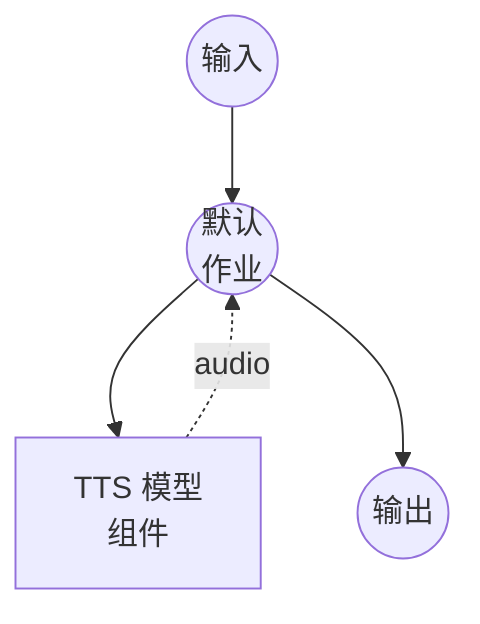

# 文本转语音（预设语音）模型任务示例

此示例演示如何使用 Qwen3-TTS 的预设语音从文本生成语音音频，通过 model-compose 的内置模型任务功能在本地运行。

## 概述

此工作流提供本地文本转语音生成：

1. **本地模型执行**：使用 HuggingFace transformers 在本地运行 Qwen3-TTS-12Hz-1.7B-CustomVoice
2. **预设语音**：使用内置语音配置文件（例如 `vivian`）提供一致的语音输出
3. **语音指令**：支持可选指令以调整说话风格
4. **无需外部 API**：无 API 依赖的完全离线语音合成

## 准备工作

### 前置条件

- 已安装 model-compose 并在您的 PATH 中可用
- 支持 CUDA 的 NVIDIA GPU（配置为 `cuda:0`）
- 足够的系统资源（推荐：8GB+ VRAM）
- 包含 transformers 和 torch 的 Python 环境（自动管理）

### 环境配置

1. 导航到此示例目录：
   ```bash
   cd examples/model-tasks/text-to-speech-generate
   ```

2. 无需额外的环境配置 - 模型和依赖会自动管理。

## 运行方式

1. **启动服务：**
   ```bash
   model-compose up
   ```

2. **运行工作流：**

   **使用 API：**
   ```bash
   curl -X POST http://localhost:8080/api/workflows/runs \
     -H "Content-Type: application/json" \
     -d '{"input": {"text": "你好，欢迎来到文本转语音演示。"}}'
   ```

   **使用 Web UI：**
   - 打开 Web UI：http://localhost:8081
   - 输入您的文本
   - 点击"运行工作流"按钮

   **使用 CLI：**
   ```bash
   model-compose run --input '{"text": "你好，欢迎来到文本转语音演示。"}'
   ```

## 组件详情

### 文本转语音模型组件（默认）
- **类型**：具有 text-to-speech 任务的模型组件
- **用途**：使用预设语音配置文件进行本地语音合成
- **模型**：Qwen/Qwen3-TTS-12Hz-1.7B-CustomVoice
- **驱动**：custom（Qwen 系列）
- **设备**：cuda:0
- **方法**：`generate` - 使用预设语音合成语音
- **并发数**：1（同时处理一个请求）

### 模型信息：Qwen3-TTS-12Hz-1.7B-CustomVoice
- **开发者**：阿里云
- **参数**：17 亿
- **类型**：支持预设自定义语音的文本转语音模型
- **采样率**：12Hz token 率
- **语言**：多语言，具有自动语言检测
- **输出格式**：音频（WAV）

## 工作流详情

### "Text to Speech with Preset Voice"工作流（默认）

**描述**：使用 Qwen3-TTS 的预设语音从文本生成语音音频。

#### 作业流程



#### 输入参数

| 参数 | 类型 | 必需 | 默认值 | 描述 |
|-----------|------|----------|---------|-------------|
| `text` | text | 是 | - | 要转换为语音的文本 |
| `voice` | string | 否 | `vivian` | 预设语音配置文件名称 |
| `instructions` | text | 否 | `""` | 调整说话风格的可选指令 |

#### 输出格式

| 字段 | 类型 | 描述 |
|-------|------|-------------|
| - | audio | 生成的语音音频 |

## 系统要求

### 最低要求
- **GPU**：NVIDIA GPU，4GB+ VRAM（需要 CUDA）
- **RAM**：8GB（推荐 16GB+）
- **磁盘空间**：10GB+ 用于模型存储
- **网络**：仅初次模型下载时需要

### 性能说明
- 首次运行需要下载模型（数 GB）
- 此示例需要 GPU（`device: cuda:0`）
- 单并发请求以防止 GPU 内存问题

## 自定义

### 更改语音
```yaml
action:
  method: generate
  text: ${input.text as text}
  voice: ${input.voice | another-voice}
```

### 添加风格指令
```yaml
action:
  method: generate
  text: ${input.text as text}
  voice: ${input.voice | vivian}
  instructions: "请慢速、清晰地以温暖的语调朗读。"
```

## 相关示例

- **[text-to-speech-clone](../text-to-speech-clone/)**：从参考音频克隆语音
- **[text-to-speech-design](../text-to-speech-design/)**：通过文本描述设计新语音
