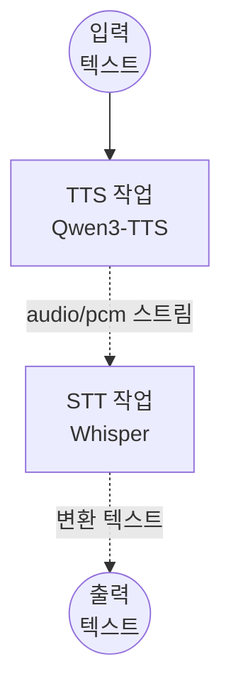

# Text-to-Speech-to-Text 파이프라인 예제

이 예제는 로컬 TTS 모델(Qwen3-TTS)과 로컬 STT 모델(Whisper)을 단일 워크플로우로 연결하는 방법을 보여줍니다 — 텍스트를 음성으로 변환한 후, 그 음성을 다시 텍스트로 변환합니다.

---

## 개요

이 워크플로우는 두 개의 로컬 모델 태스크를 체이닝합니다:

1. **Text-to-Speech (Qwen3-TTS)**: 프리셋 보이스를 사용해 입력 텍스트를 PCM 오디오 스트림으로 변환
2. **Speech-to-Text (Whisper)**: PCM 오디오 스트림을 다시 텍스트로 변환

TTS 모델이 생성한 PCM 오디오 스트림은 디스크에 기록하지 않고 STT 모델로 직접 전달됩니다. 이를 통해 모델 컴포넌트 간 인메모리 오디오 체이닝을 시연합니다.

---

## 준비사항

### 필수 요구사항

- model-compose가 설치되어 PATH에서 사용 가능
- CUDA 지원 NVIDIA GPU (`cuda:0`)
- 16GB+ VRAM 권장 (두 모델이 동시에 로드됨)
- 최초 모델 다운로드를 위한 인터넷 연결

### 환경 구성

```bash
cd examples/model-tasks/text-to-speech-to-text
```

추가 설정은 필요하지 않습니다 — 모델과 의존성은 자동으로 관리됩니다.

---

## 실행 방법

1. **서비스 시작:**
   ```bash
   model-compose up
   ```

2. **워크플로우 실행:**

   **API 사용:**
   ```bash
   curl -X POST http://localhost:8080/api/workflows/runs \
     -H "Content-Type: application/json" \
     -d '{"input": {"text": "안녕하세요, 텍스트 음성 변환 파이프라인 데모입니다."}}'
   ```

   **언어 및 보이스 옵션 포함:**
   ```bash
   curl -X POST http://localhost:8080/api/workflows/runs \
     -H "Content-Type: application/json" \
     -d '{"input": {"text": "안녕하세요, 반갑습니다.", "voice": "vivian", "language": "ko"}}'
   ```

   **Web UI 사용:**
   - http://localhost:8081 열기
   - 텍스트 입력, 선택적으로 보이스와 언어 설정
   - "Run Workflow" 클릭

   **CLI 사용:**
   ```bash
   model-compose run --input '{"text": "안녕하세요, 테스트입니다."}'
   ```

---

## 워크플로우 세부사항

### 작업 흐름



### 입력 파라미터

| 파라미터 | 유형 | 필수 | 기본값 | 설명 |
|----------|------|------|--------|------|
| `text` | text | 예 | — | 음성으로 변환할 입력 텍스트 |
| `voice` | string | 아니오 | `vivian` | TTS 프리셋 보이스 프로파일 |
| `language` | string | 아니오 | 자동 감지 | STT 언어 힌트 (예: `en`, `ko`, `ja`, `zh`) |

### 출력 형식

| 필드 | 유형 | 설명 |
|------|------|------|
| `transcription` | text | 생성된 음성에서 변환된 텍스트 |

---

## 컴포넌트 세부사항

### TTS 모델 (`tts-model`)
- **모델**: `Qwen/Qwen3-TTS-12Hz-1.7B-CustomVoice`
- **개발사**: Alibaba Cloud
- **출력**: PCM 오디오 스트림 (`audio/pcm`)
- **메서드**: 프리셋 보이스를 사용하는 `generate`

### STT 모델 (`stt-model`)
- **모델**: `openai/whisper-large-v3-turbo`
- **개발사**: OpenAI
- **입력**: TTS 작업의 PCM 오디오 스트림
- **출력**: 변환된 텍스트

---

## 시스템 요구사항

| 리소스 | 최소 | 권장 |
|--------|------|------|
| GPU VRAM | 12GB | 16GB+ |
| RAM | 16GB | 32GB+ |
| 디스크 | 15GB | 20GB+ |
| CUDA | 11.8+ | 12.x |

> 두 모델이 동시에 로드됩니다. 충분한 VRAM을 확보하거나 컴포넌트별로 별도 `device` 설정을 구성하세요.

---

## 커스터마이징

### 다른 보이스 사용
```yaml
action:
  method: generate
  text: ${input.text as text}
  voice: ${input.voice | another-voice}
```

### 모델을 여러 GPU에 분산
```yaml
components:
  - id: tts-model
    device: cuda:0
    ...
  - id: stt-model
    device: cuda:1
    ...
```

### 음성을 영어로 번역
```yaml
- id: stt
  component: stt-model
  action:
    audio: ${tts.output as audio}
    task: translate
```

---

## 관련 예제

- **[text-to-speech-generate](../text-to-speech-generate/)**: 프리셋 보이스 TTS 단독
- **[text-to-speech-clone](../text-to-speech-clone/)**: 보이스 클로닝 TTS
- **[speech-to-text](../speech-to-text/)**: 오디오 파일에서 STT 단독

---

## 📖 다른 언어

- **🇺🇸 English**: [English Guide](README.md)
- **🇨🇳 简体中文**: [简体中文指南](README.zh-cn.md)
