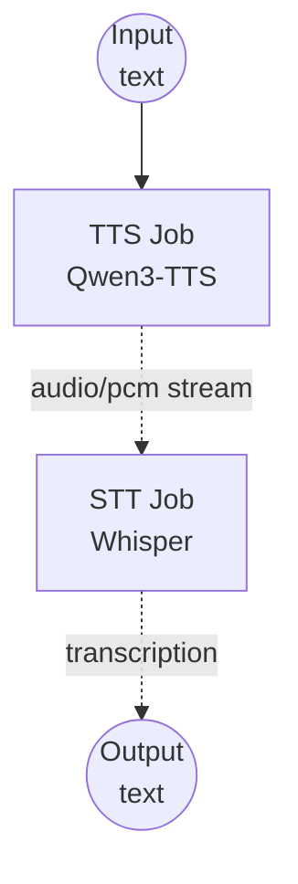

# Text-to-Speech-to-Text Pipeline Example

This example demonstrates how to chain a local TTS model (Qwen3-TTS) and a local STT model (Whisper) in a single workflow — converting text to speech audio, then transcribing it back to text.

---

## Overview

This workflow chains two local model tasks:

1. **Text-to-Speech (Qwen3-TTS)**: Converts input text to a PCM audio stream using a preset voice
2. **Speech-to-Text (Whisper)**: Transcribes the PCM audio stream back to text

The PCM audio stream produced by the TTS model is passed directly to the STT model without writing to disk, demonstrating in-memory audio chaining between model components.

---

## Preparation

### Prerequisites

- model-compose installed and available in your PATH
- NVIDIA GPU with CUDA support (`cuda:0`)
- 16GB+ VRAM recommended (both models loaded simultaneously)
- Internet connection for initial model downloads

### Environment Configuration

```bash
cd examples/model-tasks/text-to-speech-to-text
```

No additional configuration required — models and dependencies are managed automatically.

---

## How to Run

1. **Start the service:**
   ```bash
   model-compose up
   ```

2. **Run the workflow:**

   **Using API:**
   ```bash
   curl -X POST http://localhost:8080/api/workflows/runs \
     -H "Content-Type: application/json" \
     -d '{"input": {"text": "Hello, this is a text to speech to text pipeline demo."}}'
   ```

   **With language and voice options:**
   ```bash
   curl -X POST http://localhost:8080/api/workflows/runs \
     -H "Content-Type: application/json" \
     -d '{"input": {"text": "안녕하세요, 반갑습니다.", "voice": "vivian", "language": "ko"}}'
   ```

   **Using Web UI:**
   - Open: http://localhost:8081
   - Enter text, optionally set voice and language
   - Click "Run Workflow"

   **Using CLI:**
   ```bash
   model-compose run --input '{"text": "Hello, this is a test."}'
   ```

---

## Workflow Details

### Job Flow



### Input Parameters

| Parameter | Type | Required | Default | Description |
|-----------|------|----------|---------|-------------|
| `text` | text | Yes | - | Input text to convert to speech |
| `voice` | string | No | `vivian` | Preset voice profile for TTS |
| `language` | string | No | auto-detect | Language hint for STT (e.g. `en`, `ko`, `ja`, `zh`) |

### Output Format

| Field | Type | Description |
|-------|------|-------------|
| `transcription` | text | Transcribed text from the generated speech |

---

## Component Details

### TTS Model (`tts-model`)
- **Model**: `Qwen/Qwen3-TTS-12Hz-1.7B-CustomVoice`
- **Developer**: Alibaba Cloud
- **Output**: PCM audio stream (`audio/pcm`)
- **Method**: `generate` with preset voice

### STT Model (`stt-model`)
- **Model**: `openai/whisper-large-v3-turbo`
- **Developer**: OpenAI
- **Input**: PCM audio stream from TTS job
- **Output**: Transcribed text

---

## System Requirements

| Resource | Minimum | Recommended |
|----------|---------|-------------|
| GPU VRAM | 12GB | 16GB+ |
| RAM | 16GB | 32GB+ |
| Disk | 15GB | 20GB+ |
| CUDA | 11.8+ | 12.x |

> Both models are loaded simultaneously. Ensure sufficient VRAM or configure separate `device` settings per component.

---

## Customization

### Using a Different Voice
```yaml
action:
  method: generate
  text: ${input.text as text}
  voice: ${input.voice | another-voice}
```

### Splitting Models Across GPUs
```yaml
components:
  - id: tts-model
    device: cuda:0
    ...
  - id: stt-model
    device: cuda:1
    ...
```

### Translating Speech to English
```yaml
- id: stt
  component: stt-model
  action:
    audio: ${tts.output as audio}
    task: translate
```

---

## Related Examples

- **[text-to-speech-generate](../text-to-speech-generate/)**: TTS only with preset voice
- **[text-to-speech-clone](../text-to-speech-clone/)**: TTS with voice cloning
- **[speech-to-text](../speech-to-text/)**: STT only from audio file

---

## 📖 Other Languages

- **🇰🇷 한국어**: [한국어 가이드](README.ko.md)
- **🇨🇳 简体中文**: [简体中文指南](README.zh-cn.md)
