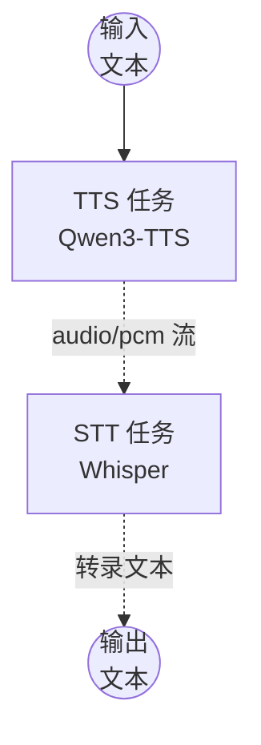

# Text-to-Speech-to-Text 流水线示例

本示例演示如何在单个工作流中串联本地 TTS 模型（Qwen3-TTS）和本地 STT 模型（Whisper）——将文本转换为语音，再将语音转录回文本。

---

## 概述

本工作流串联两个本地模型任务：

1. **文本转语音（Qwen3-TTS）**：使用预设音色将输入文本转换为 PCM 音频流
2. **语音转文本（Whisper）**：将 PCM 音频流转录回文本

TTS 模型生成的 PCM 音频流无需写入磁盘，直接传递给 STT 模型，演示了模型组件之间的内存音频串联。

---

## 准备工作

### 前置条件

- 已安装 model-compose 并可在 PATH 中使用
- 支持 CUDA 的 NVIDIA GPU（`cuda:0`）
- 建议 16GB+ 显存（两个模型同时加载）
- 首次下载模型需要网络连接

### 环境配置

```bash
cd examples/model-tasks/text-to-speech-to-text
```

无需额外配置——模型和依赖项会自动管理。

---

## 运行方法

1. **启动服务：**
   ```bash
   model-compose up
   ```

2. **运行工作流：**

   **使用 API：**
   ```bash
   curl -X POST http://localhost:8080/api/workflows/runs \
     -H "Content-Type: application/json" \
     -d '{"input": {"text": "你好，这是文本转语音转文本流水线演示。"}}'
   ```

   **包含语言和音色选项：**
   ```bash
   curl -X POST http://localhost:8080/api/workflows/runs \
     -H "Content-Type: application/json" \
     -d '{"input": {"text": "你好，很高兴认识你。", "voice": "vivian", "language": "zh"}}'
   ```

   **使用 Web UI：**
   - 打开：http://localhost:8081
   - 输入文本，可选择设置音色和语言
   - 点击"Run Workflow"

   **使用 CLI：**
   ```bash
   model-compose run --input '{"text": "你好，这是测试。"}'
   ```

---

## 工作流详情

### 任务流程



### 输入参数

| 参数 | 类型 | 必填 | 默认值 | 说明 |
|------|------|------|--------|------|
| `text` | text | 是 | — | 要转换为语音的输入文本 |
| `voice` | string | 否 | `vivian` | TTS 预设音色配置 |
| `language` | string | 否 | 自动检测 | STT 语言提示（如 `en`、`ko`、`ja`、`zh`） |

### 输出格式

| 字段 | 类型 | 说明 |
|------|------|------|
| `transcription` | text | 从生成的语音转录的文本 |

---

## 组件详情

### TTS 模型（`tts-model`）
- **模型**：`Qwen/Qwen3-TTS-12Hz-1.7B-CustomVoice`
- **开发商**：阿里云
- **输出**：PCM 音频流（`audio/pcm`）
- **方法**：使用预设音色的 `generate`

### STT 模型（`stt-model`）
- **模型**：`openai/whisper-large-v3-turbo`
- **开发商**：OpenAI
- **输入**：来自 TTS 任务的 PCM 音频流
- **输出**：转录文本

---

## 系统要求

| 资源 | 最低 | 建议 |
|------|------|------|
| GPU 显存 | 12GB | 16GB+ |
| 内存 | 16GB | 32GB+ |
| 磁盘 | 15GB | 20GB+ |
| CUDA | 11.8+ | 12.x |

> 两个模型同时加载。请确保有足够的显存，或为每个组件配置单独的 `device` 设置。

---

## 自定义配置

### 使用不同音色
```yaml
action:
  method: generate
  text: ${input.text as text}
  voice: ${input.voice | another-voice}
```

### 将模型分配到不同 GPU
```yaml
components:
  - id: tts-model
    device: cuda:0
    ...
  - id: stt-model
    device: cuda:1
    ...
```

### 将语音翻译为英文
```yaml
- id: stt
  component: stt-model
  action:
    audio: ${tts.output as audio}
    task: translate
```

---

## 相关示例

- **[text-to-speech-generate](../text-to-speech-generate/)**：仅 TTS，使用预设音色
- **[text-to-speech-clone](../text-to-speech-clone/)**：带音色克隆的 TTS
- **[speech-to-text](../speech-to-text/)**：仅从音频文件进行 STT

---

## 📖 其他语言

- **🇺🇸 English**: [English Guide](README.md)
- **🇰🇷 한국어**: [한국어 가이드](README.ko.md)
