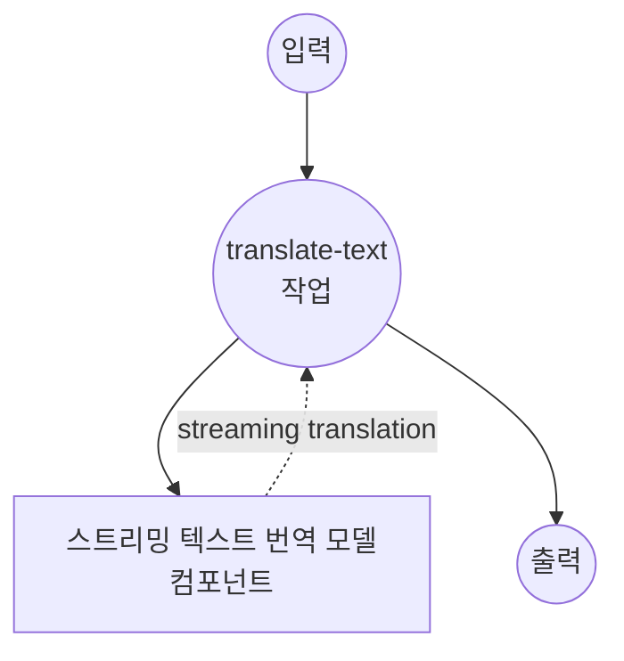

# 텍스트 번역 스트림 모델 작업 예제

이 예제는 model-compose의 내장 text-generation 작업과 SMALL100을 사용하여 스트리밍 텍스트 번역을 위한 로컬 다국어 모델을 사용하는 방법을 보여주며, Server-Sent Events (SSE)를 통한 실시간 번역을 제공합니다.

## 개요

이 워크플로우는 다음과 같은 로컬 스트리밍 텍스트 번역을 제공합니다:

1. **로컬 스트리밍 모델**: 실시간 스트리밍 출력과 함께 SMALL100 모델을 로컬에서 실행
2. **100개 이상의 언어**: 100개 이상의 언어 쌍 간 스트리밍 번역 지원
3. **실시간 생성**: Server-Sent Events를 통한 증분 번역 제공
4. **점진적 업데이트**: 생성되는 번역 토큰을 스트리밍
5. **외부 API 불필요**: 스트리밍 기능을 갖춘 완전히 오프라인 번역

## 준비사항

### 필수 요구사항

- model-compose가 설치되어 PATH에서 사용 가능
- SMALL100 실행을 위한 충분한 시스템 리소스 (권장: 8GB+ RAM)
- transformers 및 torch가 포함된 Python 환경 (자동 관리)

### 로컬 스트리밍 번역을 사용하는 이유

클라우드 기반 번역 API와 달리, 로컬 스트리밍 실행은 다음을 제공합니다:

**로컬 스트리밍의 장점:**
- **프라이버시**: 모든 텍스트 처리가 로컬에서 발생하며, 외부 서비스로 콘텐츠가 전송되지 않음
- **실시간 피드백**: 즉각적인 가시성을 제공하는 점진적 번역 생성
- **비용**: 초기 설정 후 문자당 또는 API 사용 요금 없음
- **오프라인**: 모델 다운로드 후 인터넷 연결 없이 작동
- **지연 시간**: 번역 처리를 위한 네트워크 지연 없음
- **사용자 경험**: 스트리밍 응답으로 인터랙티브한 느낌

**절충점:**
- **하드웨어 요구사항**: 모델 및 스트리밍 처리를 위한 적절한 RAM 필요
- **설정 시간**: 초기 모델 다운로드 및 로딩 시간
- **스트리밍 복잡성**: SSE를 위한 더 복잡한 클라이언트 측 처리
- **리소스 사용**: 스트리밍 중 지속적인 처리

### 환경 구성

1. 이 예제 디렉토리로 이동:
   ```bash
   cd examples/model-tasks/translation-stream
   ```

2. 추가 환경 구성 불필요 - 모델과 의존성은 자동으로 관리됩니다.

## 실행 방법

1. **서비스 시작:**
   ```bash
   model-compose up
   ```

2. **워크플로우 실행:**

   **API 사용:**
   ```bash
   curl -X POST http://localhost:8080/api/workflows/runs \
     -H "Content-Type: application/json" \
     -d '{"input": {"text": "Hello, how are you today? I hope you are having a wonderful day."}}'
   ```

   **웹 UI 사용:**
   - 웹 UI 열기: http://localhost:8081
   - 입력 매개변수 입력
   - "Run Workflow" 버튼 클릭

   **CLI 사용:**
   ```bash
   model-compose run translation --input '{"text": "Hello, how are you today? I hope you are having a wonderful day."}'
   ```

## 컴포넌트 세부사항

### 텍스트 번역 스트리밍 모델 컴포넌트 (기본)
- **유형**: text-generation 작업을 포함한 모델 컴포넌트 (스트리밍 활성화)
- **목적**: 실시간 스트리밍을 통한 로컬 다국어 텍스트 번역
- **모델**: alirezamsh/small100
- **아키텍처**: mBART 기반 시퀀스-투-시퀀스 transformer
- **기능**:
  - 실시간 토큰별 스트리밍
  - Server-Sent Events (SSE) 출력 형식
  - 100개 이상의 언어 지원
  - 결정론적 번역 (샘플링 비활성화)
  - CPU 및 GPU 가속 지원

### 모델 정보: SMALL100

- **개발자**: Alireza Mohammadshahi
- **기반 아키텍처**: mBART (Multilingual BART)
- **매개변수**: ~3억 개
- **유형**: 다국어 시퀀스-투-시퀀스 transformer
- **언어**: 주요 세계 언어를 포함한 100개 이상의 언어
- **스트리밍**: 즉각적인 출력을 제공하는 토큰 수준 생성
- **입력 제한**: 1024 토큰 (자동 잘림)
- **라이선스**: MIT

## 워크플로우 세부사항

### "Translate Text" 워크플로우 (스트리밍)

**설명**: SMALL100 다국어 모델을 사용하여 실시간 스트리밍 출력으로 입력 텍스트를 번역합니다.

#### 작업 흐름



#### 입력 매개변수

| 매개변수 | 유형 | 필수 | 기본값 | 설명 |
|---------|------|------|--------|------|
| `text` | text | 예 | - | 번역할 입력 텍스트 (최대 1024 토큰) |

#### 출력 형식

**스트리밍 출력 (SSE):**
```
data: {"token": "Hola", "is_final": false}

data: {"token": ",", "is_final": false}

data: {"token": " ¿", "is_final": false}

data: {"token": "cómo", "is_final": false}

...

data: {"token": "?", "is_final": true}
```

**최종 출력:**
| 필드 | 유형 | 설명 |
|-----|------|------|
| `output` | text | 완전한 번역 텍스트 (SSE 형식) |

## Server-Sent Events (SSE) 형식

스트리밍 출력은 실시간 번역 업데이트를 위해 SSE 프로토콜을 사용합니다:

### 이벤트 구조
```
data: {"token": "string", "is_final": boolean}

```

### 토큰 속성
- **token**: 생성된 번역 토큰/단어
- **is_final**: 마지막 토큰 여부를 나타내는 불린 값

### 연결 헤더
```
Content-Type: text/plain
Cache-Control: no-cache
Connection: keep-alive
```

## 시스템 요구사항

### 최소 요구사항
- **RAM**: 8GB (권장 16GB+)
- **디스크 공간**: 모델 저장 및 캐시를 위한 3GB+
- **CPU**: 멀티코어 프로세서 (4+ 코어 권장)
- **인터넷**: 초기 모델 다운로드 시에만 필요
- **네트워크**: SSE 스트리밍을 위한 로컬 네트워크 기능

### 성능 참고사항
- 첫 실행 시 모델 다운로드 필요 (~1.2GB)
- 모델 로딩은 하드웨어에 따라 1-2분 소요
- GPU 가속은 스트리밍 속도 향상
- 스트리밍 지연 시간은 생성 속도 및 토큰 복잡도에 따라 다름

## 언어 지원

### 실시간 번역 쌍

**인기 있는 언어 쌍:**
- 영어 ↔ 스페인어, 프랑스어, 독일어, 이탈리아어, 포르투갈어
- 스페인어 ↔ 프랑스어, 독일어, 포르투갈어
- 중국어 ↔ 영어, 일본어, 한국어
- 아랍어 ↔ 영어, 프랑스어
- 러시아어 ↔ 영어, 독일어

**언어별 스트리밍 성능:**
- **라틴 문자**: 가장 빠른 스트리밍 (영어, 스페인어, 프랑스어 등)
- **아시아 언어**: 중간 속도 (중국어, 일본어, 한국어)
- **복잡한 문자**: 느리지만 기능적 (아랍어, 태국어, 힌디어)

## 맞춤화

### 스트리밍 매개변수 조정

스트리밍 동작 및 번역 품질 제어:

```yaml
component:
  type: model
  task: text-generation
  model: alirezamsh/small100
  architecture: seq2seq
  text: ${input.text as text}
  streaming: true
  params:
    max_input_length: 1024
    max_length: 1024
    num_beams: 1                # 탐욕적 검색으로 더 빠른 스트리밍
    do_sample: false            # 결정론적 출력
    streaming_buffer_size: 1    # 모든 토큰을 즉시 스트리밍
```

### 사용자 정의 언어 구성

```yaml
component:
  type: model
  task: text-generation
  model: alirezamsh/small100
  architecture: seq2seq
  text: |
    Translate from ${input.source_lang | "English"} to ${input.target_lang | "Spanish"}:
    ${input.text as text}
  streaming: true
  params:
    max_input_length: 1024
    do_sample: false
```

### 스트리밍 품질 대 속도 절충

```yaml
# 빠른 스트리밍 (낮은 품질)
component:
  streaming: true
  params:
    num_beams: 1              # 탐욕적 디코딩
    streaming_buffer_size: 1  # 즉시 스트리밍

# 품질 스트리밍 (느림)
component:
  streaming: true
  params:
    num_beams: 3              # 품질을 위한 빔 검색
    streaming_buffer_size: 3  # 더 부드러운 출력을 위한 토큰 버퍼링
```
