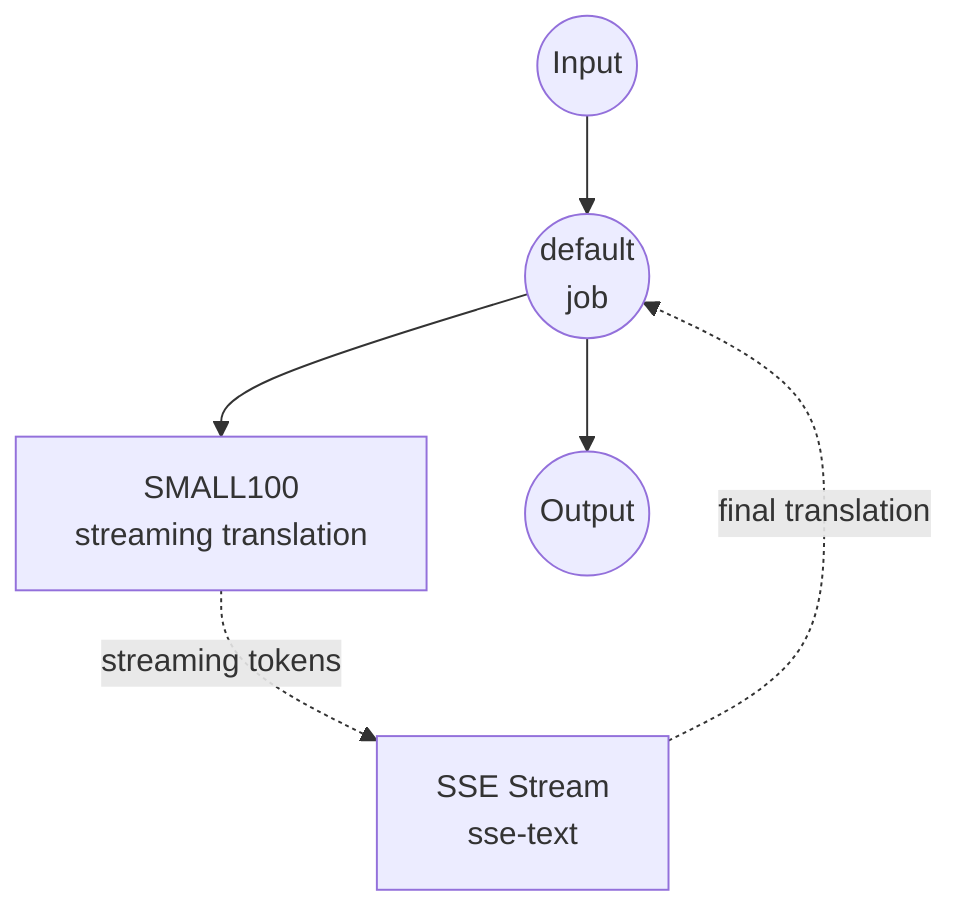

# Text Translation Stream Model Task Example

This example demonstrates how to use local multilingual models for streaming text translation using model-compose's built-in text-generation task with SMALL100, providing real-time translation with Server-Sent Events (SSE).

## Overview

This workflow provides local streaming text translation that:

1. **Local Streaming Model**: Runs SMALL100 model locally with real-time streaming output
2. **100+ Languages**: Supports streaming translation between over 100 language pairs
3. **Real-time Generation**: Provides incremental translation via Server-Sent Events
4. **Progressive Updates**: Streams translated tokens as they are generated
5. **No External APIs**: Completely offline translation with streaming capabilities

## Preparation

### Prerequisites

- model-compose installed and available in your PATH
- Sufficient system resources for running SMALL100 (recommended: 8GB+ RAM)
- Python environment with transformers and torch (automatically managed)

### Why Local Streaming Translation

Unlike cloud-based translation APIs, local streaming execution provides:

**Benefits of Local Streaming:**
- **Privacy**: All text processing happens locally, no content sent to external services
- **Real-time Feedback**: Progressive translation generation with immediate visibility
- **Cost**: No per-character or API usage fees after initial setup
- **Offline**: Works without internet connection after model download
- **Latency**: No network latency for translation processing
- **User Experience**: Interactive feel with streaming responses

**Trade-offs:**
- **Hardware Requirements**: Requires adequate RAM for model and streaming processing
- **Setup Time**: Initial model download and loading time
- **Streaming Complexity**: More complex client-side handling for SSE
- **Resource Usage**: Continuous processing during streaming

### Environment Configuration

1. Navigate to this example directory:
   ```bash
   cd examples/model-tasks/translation-stream
   ```

2. No additional environment configuration required - model and dependencies are managed automatically.

## How to Run

1. **Start the service:**
   ```bash
   model-compose up
   ```

2. **Run the workflow:**

   **Using API:**
   ```bash
   curl -X POST http://localhost:8080/api/workflows/__default__/runs \
     -H "Content-Type: application/json" \
     -d '{"input": {"text": "Hello, how are you today? I hope you are having a wonderful day."}}'
   ```

   **Using Web UI:**
   - Open the Web UI: http://localhost:8081
   - Enter your input parameters
   - Click the "Run Workflow" button

   **Using CLI:**
   ```bash
   model-compose run translation --input '{"text": "Hello, how are you today? I hope you are having a wonderful day."}'
   ```

## Component Details

### Text Translation Streaming Model Component
- **Type**: Model component with text-generation task (streaming enabled)
- **Purpose**: Local multilingual text translation with real-time streaming
- **Model**: alirezamsh/small100
- **Architecture**: mBART-based sequence-to-sequence transformer
- **Features**:
  - Real-time token-by-token streaming
  - Server-Sent Events (SSE) output format
  - 100+ language support
  - Deterministic translation (sampling disabled)
  - CPU and GPU acceleration support

### Model Information: SMALL100

- **Developer**: Alireza Mohammadshahi
- **Base Architecture**: mBART (Multilingual BART)
- **Parameters**: ~300 million
- **Type**: Multilingual sequence-to-sequence transformer
- **Languages**: 100+ languages including major world languages
- **Streaming**: Token-level generation with immediate output
- **Input Limit**: 1024 tokens (automatically truncated)
- **License**: MIT

## Workflow Details

### "Translate Text" Workflow (Streaming)

**Description**: Translate input text with real-time streaming output using Server-Sent Events.

#### Job Flow

This example uses a simplified single-component configuration with streaming enabled.



#### Input Parameters

| Parameter | Type | Required | Default | Description |
|-----------|------|----------|---------|-------------|
| `text` | text | Yes | - | Input text to translate (max 1024 tokens) |

#### Output Format

**Streaming Output (SSE):**
```
data: {"token": "Hola", "is_final": false}

data: {"token": ",", "is_final": false}

data: {"token": " ¿", "is_final": false}

data: {"token": "cómo", "is_final": false}

...

data: {"token": "?", "is_final": true}
```

**Final Output:**
| Field | Type | Description |
|-------|------|-------------|
| `output` | text | Complete translated text (SSE format) |

## Server-Sent Events (SSE) Format

The streaming output uses the SSE protocol for real-time translation updates:

### Event Structure
```
data: {"token": "string", "is_final": boolean}

```

### Token Properties
- **token**: The generated translation token/word
- **is_final**: Boolean indicating if this is the last token

### Connection Headers
```
Content-Type: text/plain
Cache-Control: no-cache
Connection: keep-alive
```

## System Requirements

### Minimum Requirements
- **RAM**: 8GB (recommended 16GB+)
- **Disk Space**: 3GB+ for model storage and cache
- **CPU**: Multi-core processor (4+ cores recommended)
- **Internet**: Required for initial model download only
- **Network**: Local network capability for SSE streaming

### Performance Notes
- First run requires model download (~1.2GB)
- Model loading takes 1-2 minutes depending on hardware
- GPU acceleration improves streaming speed
- Streaming latency depends on generation speed and token complexity

## Language Support

### Real-time Translation Pairs

**Popular Language Pairs:**
- English ↔ Spanish, French, German, Italian, Portuguese
- Spanish ↔ French, German, Portuguese
- Chinese ↔ English, Japanese, Korean
- Arabic ↔ English, French
- Russian ↔ English, German

**Streaming Performance by Language:**
- **Latin Script**: Fastest streaming (English, Spanish, French, etc.)
- **Asian Languages**: Moderate speed (Chinese, Japanese, Korean)
- **Complex Scripts**: Slower but functional (Arabic, Thai, Hindi)

## Customization

### Adjusting Streaming Parameters

Control streaming behavior and translation quality:

```yaml
component:
  type: model
  task: text-generation
  model: alirezamsh/small100
  architecture: seq2seq
  text: ${input.text as text}
  stream: true
  params:
    max_input_length: 1024
    max_length: 1024
    num_beams: 1                # Faster streaming with greedy search
    do_sample: false            # Deterministic output
    streaming_buffer_size: 1    # Stream every token immediately
```

### Custom Language Configuration

```yaml
component:
  type: model
  task: text-generation
  model: alirezamsh/small100
  architecture: seq2seq
  text: |
    Translate from ${input.source_lang | "English"} to ${input.target_lang | "Spanish"}:
    ${input.text as text}
  stream: true
  params:
    max_input_length: 1024
    do_sample: false
```

### Streaming Quality vs Speed Trade-offs

```yaml
# Fast streaming (lower quality)
component:
  stream: true
  params:
    num_beams: 1              # Greedy decoding
    streaming_buffer_size: 1  # Immediate streaming

# Quality streaming (slower)
component:
  stream: true
  params:
    num_beams: 3              # Beam search for quality
    streaming_buffer_size: 3  # Buffer tokens for smoother output
```

## Troubleshooting

### Common Issues

1. **SSE Connection Drops**: Check network stability and implement reconnection
2. **Slow Streaming**: Enable GPU acceleration or reduce beam search
3. **Memory Issues**: Reduce input length or close other applications
4. **Language Detection**: Specify source language explicitly
5. **Incomplete Streams**: Handle connection errors and timeouts gracefully

### Streaming Optimization

- **Network**: Use local connections to minimize latency
- **Buffer Management**: Balance between speed and smoothness
- **Client Implementation**: Use proper SSE libraries with reconnection
- **Error Handling**: Implement graceful degradation to batch mode

## Comparison with Non-Streaming Solutions

| Feature | Streaming Translation | Batch Translation |
|---------|---------------------|------------------|
| User Experience | Real-time feedback | Wait for completion |
| Perceived Latency | Lower (immediate start) | Higher (wait for full result) |
| Network Usage | Continuous stream | Single response |
| Client Complexity | SSE handling required | Simple request/response |
| Error Recovery | Partial results available | All-or-nothing |
| Resource Usage | Continuous during generation | Burst during processing |
| Use Cases | Interactive applications | Document processing |

## Advanced Usage

### Multi-Language Streaming Chat

```javascript
class MultilingualStreamingChat {
  constructor(apiUrl) {
    this.apiUrl = apiUrl;
    this.conversations = new Map();
  }

  async sendMessage(conversationId, message, targetLang) {
    const conversation = this.conversations.get(conversationId) || [];

    // Stream translation of the message
    const translation = await this.streamTranslation(message, targetLang);

    // Update conversation history
    conversation.push({
      original: message,
      translated: translation,
      timestamp: Date.now()
    });

    this.conversations.set(conversationId, conversation);
    return translation;
  }

  async streamTranslation(text, targetLang) {
    // Implementation using the streaming translator
    const translator = new StreamingTranslator(this.apiUrl);
    return translator.translate(text, 'auto', targetLang);
  }
}
```

### Document Translation with Progress

```python
import requests
import json
from typing import Callable, Optional

class StreamingDocumentTranslator:
    def __init__(self, api_url: str = "http://localhost:8080/api"):
        self.api_url = api_url

    def translate_document(
        self,
        file_path: str,
        target_lang: str,
        source_lang: str = 'auto',
        progress_callback: Optional[Callable] = None
    ) -> str:
        with open(file_path, 'r', encoding='utf-8') as f:
            text = f.read()

        # Split into paragraphs for streaming
        paragraphs = text.split('\n\n')
        translated_paragraphs = []
        total_paragraphs = len(paragraphs)

        for i, paragraph in enumerate(paragraphs):
            if paragraph.strip():
                translated = self.stream_translate_chunk(
                    paragraph, source_lang, target_lang
                )
                translated_paragraphs.append(translated)

                if progress_callback:
                    progress_callback(i + 1, total_paragraphs, translated)

        return '\n\n'.join(translated_paragraphs)

    def stream_translate_chunk(
        self, text: str, source_lang: str, target_lang: str
    ) -> str:
        response = requests.post(
            self.api_url,
            json={
                'text': text,
                'source_lang': source_lang,
                'target_lang': target_lang
            },
            headers={'Accept': 'text/event-stream'},
            stream=True
        )

        translation = ''
        for line in response.iter_lines():
            if line.startswith(b'data: '):
                data = json.loads(line[6:])
                translation += data['token']
                if data['is_final']:
                    break

        return translation

# Usage
def progress_handler(current, total, current_translation):
    print(f"Progress: {current}/{total} paragraphs translated")

translator = StreamingDocumentTranslator()
result = translator.translate_document(
    'document.txt', 'es', 'en', progress_handler
)
```

## Use Cases

This streaming translation example is ideal for:

1. **Live Chat Translation**: Real-time multilingual communication
2. **Interactive Language Learning**: Immediate translation feedback
3. **Live Subtitles**: Real-time video/audio translation
4. **Customer Support**: Multi-language customer service interfaces
5. **Content Creation**: Real-time translation during writing
6. **Conference Tools**: Live interpretation assistance
7. **Social Media**: Real-time post translation
8. **Gaming**: Multiplayer communication translation

## Performance Considerations

### Streaming vs. Batch Trade-offs

**Streaming Advantages:**
- Better user experience with immediate feedback
- Lower perceived latency for translation start
- Ability to show progress on long translations
- Early termination possible for time-sensitive scenarios

**Streaming Challenges:**
- More complex client implementation
- Network connection management requirements
- Error handling complexity
- Continuous resource usage during streaming

### Optimization Strategies

1. **Token Buffering**: Balance between latency and smoothness
2. **Connection Pooling**: Reuse connections for multiple translations
3. **Graceful Degradation**: Fallback to batch mode if streaming fails
4. **Progress Indicators**: Show translation progress to users
5. **Caching**: Cache common phrase translations for speed
6. **Language Detection**: Pre-detect source language to improve speed