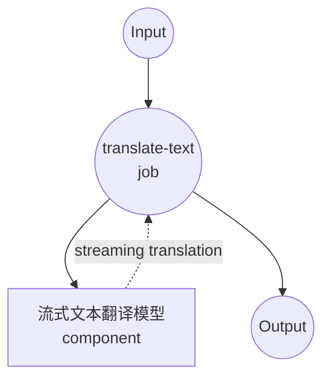

# 文本翻译流式模型任务示例

此示例演示如何使用本地多语言模型进行流式文本翻译，使用 model-compose 内置的 text-generation 任务和 SMALL100，通过服务器发送事件(SSE)提供实时翻译。

## 概述

此工作流提供本地流式文本翻译功能：

1. **本地流式模型**：在本地运行 SMALL100 模型并提供实时流式输出
2. **100+ 种语言**：支持超过 100 种语言对之间的流式翻译
3. **实时生成**：通过服务器发送事件提供增量翻译
4. **渐进式更新**：在生成翻译令牌时进行流式传输
5. **无需外部 API**：完全离线的流式翻译能力

## 准备工作

### 前置条件

- 已安装 model-compose 并在 PATH 中可用
- 运行 SMALL100 所需的充足系统资源（建议：8GB+ 内存）
- 带有 transformers 和 torch 的 Python 环境（自动管理）

### 为什么选择本地流式翻译

与基于云的翻译 API 不同，本地流式执行提供：

**本地流式处理的优势：**
- **隐私性**：所有文本处理在本地进行，不向外部服务发送内容
- **实时反馈**：渐进式翻译生成，立即可见
- **成本**：初始设置后无需按字符或 API 使用计费
- **离线能力**：模型下载后无需互联网连接即可工作
- **延迟**：无网络延迟的翻译处理
- **用户体验**：流式响应带来交互式感受

**权衡考虑：**
- **硬件要求**：模型和流式处理需要足够的内存
- **设置时间**：初始模型下载和加载时间
- **流式复杂性**：客户端需要更复杂的 SSE 处理
- **资源使用**：流式处理期间持续的处理

### 环境配置

1. 导航到此示例目录：
   ```bash
   cd examples/model-tasks/translation-stream
   ```

2. 无需额外的环境配置 - 模型和依赖项会自动管理。

## 如何运行

1. **启动服务：**
   ```bash
   model-compose up
   ```

2. **运行工作流：**

   **使用 API：**
   ```bash
   curl -X POST http://localhost:8080/api/workflows/runs \
     -H "Content-Type: application/json" \
     -d '{"input": {"text": "Hello, how are you today? I hope you are having a wonderful day."}}'
   ```

   **使用 Web UI：**
   - 打开 Web UI：http://localhost:8081
   - 输入您的输入参数
   - 点击"运行工作流"按钮

   **使用 CLI：**
   ```bash
   model-compose run translation --input '{"text": "Hello, how are you today? I hope you are having a wonderful day."}'
   ```

## 组件详情

### 文本翻译流式模型组件（默认）
- **类型**：带有 text-generation 任务的模型组件（启用流式传输）
- **用途**：具有实时流式传输的本地多语言文本翻译
- **模型**：alirezamsh/small100
- **架构**：基于 mBART 的序列到序列转换器
- **特性**：
  - 实时逐令牌流式传输
  - 服务器发送事件 (SSE) 输出格式
  - 支持 100+ 种语言
  - 确定性翻译（禁用采样）
  - CPU 和 GPU 加速支持

### 模型信息：SMALL100

- **开发者**：Alireza Mohammadshahi
- **基础架构**：mBART（多语言 BART）
- **参数**：约 3 亿
- **类型**：多语言序列到序列转换器
- **语言**：100+ 种语言，包括主要世界语言
- **流式传输**：令牌级生成，立即输出
- **输入限制**：1024 个令牌（自动截断）
- **许可证**：MIT

## 工作流详情

### "翻译文本"工作流（流式）

**描述**：使用 SMALL100 多语言模型，通过实时流式输出翻译输入文本。

#### 作业流程



#### 输入参数

| 参数 | 类型 | 必需 | 默认值 | 描述 |
|-----------|------|----------|---------|-------------|
| `text` | text | 是 | - | 要翻译的输入文本（最多 1024 个令牌） |

#### 输出格式

**流式输出 (SSE)：**
```
data: {"token": "Hola", "is_final": false}

data: {"token": ",", "is_final": false}

data: {"token": " ¿", "is_final": false}

data: {"token": "cómo", "is_final": false}

...

data: {"token": "?", "is_final": true}
```

**最终输出：**
| 字段 | 类型 | 描述 |
|-------|------|-------------|
| `output` | text | 完整翻译文本（SSE 格式） |

## 服务器发送事件 (SSE) 格式

流式输出使用 SSE 协议进行实时翻译更新：

### 事件结构
```
data: {"token": "string", "is_final": boolean}

```

### 令牌属性
- **token**：生成的翻译令牌/单词
- **is_final**：布尔值，指示这是否是最后一个令牌

### 连接头
```
Content-Type: text/plain
Cache-Control: no-cache
Connection: keep-alive
```

## 系统要求

### 最低要求
- **内存**：8GB（建议 16GB+）
- **磁盘空间**：3GB+ 用于模型存储和缓存
- **CPU**：多核处理器（建议 4+ 核心）
- **互联网**：仅初始模型下载时需要
- **网络**：SSE 流式传输的本地网络能力

### 性能说明
- 首次运行需要下载模型（约 1.2GB）
- 模型加载需要 1-2 分钟，取决于硬件
- GPU 加速提高流式速度
- 流式延迟取决于生成速度和令牌复杂性

## 语言支持

### 实时翻译对

**流行语言对：**
- 英语 ↔ 西班牙语、法语、德语、意大利语、葡萄牙语
- 西班牙语 ↔ 法语、德语、葡萄牙语
- 中文 ↔ 英语、日语、韩语
- 阿拉伯语 ↔ 英语、法语
- 俄语 ↔ 英语、德语

**按语言的流式性能：**
- **拉丁字母**：最快的流式传输（英语、西班牙语、法语等）
- **亚洲语言**：中等速度（中文、日语、韩语）
- **复杂脚本**：较慢但可用（阿拉伯语、泰语、印地语）

## 自定义

### 调整流式参数

控制流式行为和翻译质量：

```yaml
component:
  type: model
  task: text-generation
  model: alirezamsh/small100
  architecture: seq2seq
  streaming: true
  action:
    text: ${input.text as text}
    params:
      max_input_length: 1024
      max_length: 1024
      num_beams: 1                # 更快的贪婪搜索流式传输
      do_sample: false            # 确定性输出
      streaming_buffer_size: 1    # 立即流式传输每个令牌
```

### 自定义语言配置

```yaml
component:
  type: model
  task: text-generation
  model: alirezamsh/small100
  architecture: seq2seq
  streaming: true
  action:
    text: |
      Translate from ${input.source_lang | "English"} to ${input.target_lang | "Spanish"}:
      ${input.text as text}
    params:
      max_input_length: 1024
      do_sample: false
```

### 流式质量与速度的权衡

```yaml
# 快速流式传输（较低质量）
component:
  streaming: true
  params:
    num_beams: 1              # 贪婪解码
    streaming_buffer_size: 1  # 立即流式传输

# 质量流式传输（较慢）
component:
  streaming: true
  params:
    num_beams: 3              # 束搜索以提高质量
    streaming_buffer_size: 3  # 缓冲令牌以实现更流畅的输出
```
