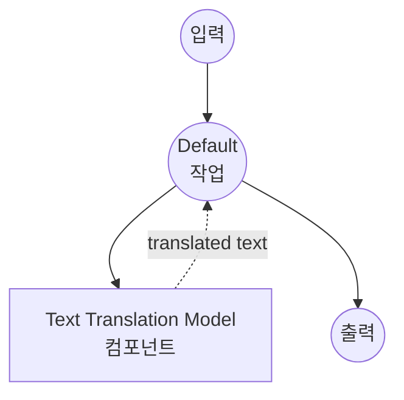

# Text Translation Model Task 예제

이 예제는 model-compose의 내장 text-generation 작업과 SMALL100을 사용하여 로컬 다국어 모델로 텍스트 번역을 수행하는 방법을 보여주며, 100개 이상의 언어에 걸쳐 오프라인 번역 기능을 제공합니다.

## 개요

이 워크플로우는 다음과 같은 로컬 텍스트 번역을 제공합니다:

1. **로컬 다국어 모델**: 텍스트 번역을 위해 SMALL100 모델을 로컬에서 실행
2. **100개 이상의 언어**: 100개 이상의 언어 쌍 간 번역 지원
3. **자동 모델 관리**: 첫 사용 시 모델을 자동으로 다운로드하고 캐시
4. **외부 API 불필요**: 종속성 없이 완전히 오프라인 번역
5. **결정론적 출력**: 샘플링 비활성화로 일관된 번역 결과

## 준비사항

### 필수 요구사항

- model-compose가 설치되어 PATH에서 사용 가능
- SMALL100 실행을 위한 충분한 시스템 리소스 (권장: 8GB+ RAM)
- transformers 및 torch가 있는 Python 환경 (자동 관리)

### 로컬 번역 모델을 사용하는 이유

클라우드 기반 번역 API와 달리 로컬 모델 실행은 다음을 제공합니다:

**로컬 처리의 이점:**
- **프라이버시**: 모든 텍스트 처리가 로컬에서 이루어지며 외부 서비스로 콘텐츠 전송 없음
- **비용**: 초기 설정 후 문자당 또는 API 사용 요금 없음
- **오프라인**: 모델 다운로드 후 인터넷 연결 없이 작동
- **지연시간**: 번역 처리에 네트워크 지연 없음
- **사용자 정의**: 번역 매개변수에 대한 완전한 제어
- **배치 처리**: 속도 제한 없이 무제한 텍스트 처리

**트레이드오프:**
- **하드웨어 요구사항**: 모델 및 텍스트 처리를 위한 적절한 RAM 필요
- **설정 시간**: 초기 모델 다운로드 및 로딩 시간
- **품질 제한**: 더 작은 모델은 대형 클라우드 서비스보다 낮은 품질을 가질 수 있음
- **언어 커버리지**: 모델에서 지원하는 언어 쌍으로 제한

### 환경 구성

1. 이 예제 디렉토리로 이동:
   ```bash
   cd examples/model-tasks/translation
   ```

2. 추가 환경 구성 불필요 - 모델 및 종속성이 자동으로 관리됩니다.

## 실행 방법

1. **서비스 시작:**
   ```bash
   model-compose up
   ```

2. **워크플로우 실행:**

   **API 사용:**
   ```bash
   curl -X POST http://localhost:8080/api/workflows/runs \
     -H "Content-Type: application/json" \
     -d '{"input": {"text": "Hello, how are you today?"}}'
   ```

   **웹 UI 사용:**
   - 웹 UI 열기: http://localhost:8081
   - 입력 매개변수 입력
   - "Run Workflow" 버튼 클릭

   **CLI 사용:**
   ```bash
   model-compose run translation --input '{"text": "Hello, how are you today?"}'
   ```

## 컴포넌트 세부사항

### Text Translation Model 컴포넌트 (기본)
- **유형**: text-generation 작업을 사용하는 Model 컴포넌트
- **목적**: 로컬 다국어 텍스트 번역
- **모델**: alirezamsh/small100
- **아키텍처**: mBART 기반 시퀀스 투 시퀀스 트랜스포머
- **기능**:
  - 100개 이상의 언어 지원
  - 자동 모델 다운로드 및 캐싱
  - 결정론적 번역 (샘플링 비활성화)
  - CPU 및 GPU 가속 지원
  - 메모리 효율적인 처리

### 모델 정보: SMALL100

- **개발자**: Alireza Mohammadshahi
- **기본 아키텍처**: mBART (Multilingual BART)
- **매개변수**: 약 3억
- **유형**: 다국어 시퀀스 투 시퀀스 트랜스포머
- **언어**: 주요 세계 언어를 포함한 100개 이상의 언어
- **학습**: 다국어 병렬 코퍼스
- **입력 제한**: 1024 토큰 (자동 잘림)
- **라이센스**: MIT

## 워크플로우 세부사항

### "Translate Text" 워크플로우 (기본)

**설명**: 사전 학습된 다국어 모델을 사용하여 입력 텍스트를 다른 언어로 번역합니다.

#### 작업 흐름

이 예제는 명시적인 작업 없이 단순화된 단일 컴포넌트 구성을 사용합니다.



#### 입력 매개변수

| 매개변수 | 유형 | 필수 | 기본값 | 설명 |
|---------|------|------|--------|------|
| `text` | text | 예 | - | 번역할 입력 텍스트 (최대 1024 토큰) |

#### 출력 형식

| 필드 | 유형 | 설명 |
|-----|------|------|
| `translated` | text | 대상 언어로 번역된 텍스트 |

## 언어 지원

### 지원되는 주요 언어군

**유럽 언어:**
- 영어 (en), 스페인어 (es), 프랑스어 (fr), 독일어 (de), 이탈리아어 (it)
- 포르투갈어 (pt), 네덜란드어 (nl), 러시아어 (ru), 폴란드어 (pl), 체코어 (cs)
- 그리스어 (el), 스웨덴어 (sv), 노르웨이어 (no), 덴마크어 (da), 핀란드어 (fi)

**아시아 언어:**
- 중국어 (zh), 일본어 (ja), 한국어 (ko), 힌디어 (hi), 아랍어 (ar)
- 태국어 (th), 베트남어 (vi), 인도네시아어 (id), 말레이어 (ms), 타밀어 (ta)
- 벵골어 (bn), 우르두어 (ur), 페르시아어 (fa), 히브리어 (he), 터키어 (tr)

**아프리카 언어:**
- 스와힐리어 (sw), 요루바어 (yo), 하우사어 (ha), 암하라어 (am), 소말리아어 (so)

**그리고 70개 이상의 추가 언어...**

### 언어 코드 형식
ISO 639-1 언어 코드를 사용합니다 (예: 영어는 'en', 스페인어는 'es', 중국어는 'zh').

## 시스템 요구사항

### 최소 요구사항
- **RAM**: 8GB (권장 16GB+)
- **디스크 공간**: 모델 저장 및 캐시를 위한 3GB+
- **CPU**: 멀티코어 프로세서 (4+ 코어 권장)
- **인터넷**: 초기 모델 다운로드에만 필요

### 성능 참고사항
- 첫 실행 시 모델 다운로드 필요 (~1.2GB)
- 모델 로딩은 하드웨어에 따라 1-2분 소요
- GPU 가속으로 번역 속도 향상
- 처리 시간은 입력 텍스트 길이에 따라 다름

## 사용자 정의

### 번역 방향 지정

특정 언어 쌍 구성:

```yaml
component:
  type: model
  task: text-generation
  model: alirezamsh/small100
  architecture: seq2seq
  action:
    text: |
      Translate from ${input.source_lang | "English"} to ${input.target_lang | "Spanish"}:
      ${input.text as text}
    params:
      max_input_length: 1024
      do_sample: false
```

### 언어 토큰 사용

일부 다국어 모델은 특수 언어 토큰을 사용합니다:

```yaml
component:
  type: model
  task: text-generation
  model: alirezamsh/small100
  architecture: seq2seq
  action:
    text: |
      <source_lang>${input.source_lang | "en"}</source_lang>
      <target_lang>${input.target_lang | "es"}</target_lang>
      ${input.text as text}
    params:
      max_input_length: 1024
      do_sample: false
```

### 배치 번역

여러 텍스트 처리:

```yaml
workflow:
  title: Batch Translation
  jobs:
    - id: translate-texts
      component: text-translator
      repeat_count: ${input.text_count}
      input:
        text: ${input.texts[${index}]}
        source_lang: ${input.source_lang}
        target_lang: ${input.target_lang}
```

## 고급 구성

### 번역 품질 제어

```yaml
component:
  type: model
  task: text-generation
  model: alirezamsh/small100
  architecture: seq2seq
  action:
    text: ${input.text as text}
    params:
      max_input_length: 1024
      max_length: ${input.max_length as number | 1024}
      num_beams: ${input.quality as number | 4}    # 빔 수 증가 = 품질 향상
      length_penalty: 1.0                           # 출력 길이 제어
      no_repeat_ngram_size: 3                      # 반복 방지
      do_sample: false                             # 결정론적 출력
```

### 다른 모델 사용

다른 번역 모델로 교체:

```yaml
component:
  type: model
  task: text-generation
  model: facebook/m2m100_418M              # 더 작은 다국어 모델
  # 또는
  model: facebook/mbart-large-50-many-to-many-mmt  # 더 큰 모델, 50개 언어
  # 또는
  model: Helsinki-NLP/opus-mt-en-es        # 전용 영어-스페인어 모델
```

### 커스텀 전처리

텍스트 전처리 추가:

```yaml
component:
  type: model
  task: text-generation
  model: alirezamsh/small100
  architecture: seq2seq
  action:
    text: |
      Original text (${input.source_lang | "English"}):
      "${input.text as text}"

      Translation (${input.target_lang | "Spanish"}):
    params:
      max_input_length: 1024
      do_sample: false
```

## 문제 해결

### 일반적인 문제

1. **번역 품질 저하**: 더 큰 모델 시도 또는 빔 검색 매개변수 조정
2. **지원되지 않는 언어**: 지원되는 언어 쌍에 대한 모델 문서 확인
3. **입력이 너무 김**: 텍스트가 토큰 제한 초과 - 더 작은 청크로 분할
4. **메모리 문제**: 배치 크기 줄이기 또는 다른 애플리케이션 종료
5. **느린 처리**: GPU 가속 활성화 또는 더 작은 모델 사용

### 성능 최적화

- **GPU 사용**: 빠른 추론을 위해 CUDA 호환 PyTorch 설치
- **모델 선택**: 모델 크기와 번역 품질 요구사항 균형
- **텍스트 청킹**: 긴 문서를 관리 가능한 세그먼트로 분할
- **캐싱**: 자주 번역되는 구문 캐시

## API 기반 솔루션과 비교

| 기능 | 로컬 번역 | 클라우드 번역 API |
|-----|---------|----------------|
| 프라이버시 | 완전한 프라이버시 | 프로바이더로 텍스트 전송 |
| 비용 | 하드웨어 비용만 | 문자당 가격 |
| 지연시간 | 하드웨어 의존적 | 네트워크 + API 지연 |
| 가용성 | 오프라인 가능 | 인터넷 필요 |
| 언어 지원 | 모델별 | 일반적으로 더 넓은 커버리지 |
| 품질 | 로컬 모델에 따라 다름 | 일반적으로 더 높은 품질 |
| 사용자 정의 | 완전한 매개변수 제어 | 제한된 API 매개변수 |
| 배치 처리 | 무제한 | 속도 제한 |
| 설정 복잡도 | 모델 다운로드 필요 | API 키만 |

## 고급 사용

### 다국어 문서 처리
```yaml
workflow:
  title: Multi-Language Document Translation
  jobs:
    - id: detect-language
      component: language-detector
      input:
        text: ${input.text}
    - id: translate-content
      component: text-translator
      input:
        text: ${input.text}
        source_lang: ${detect-language.language}
        target_lang: ${input.target_lang}
```

### 번역 품질 평가
```yaml
workflow:
  title: Translation with Quality Check
  jobs:
    - id: translate
      component: text-translator
      input:
        text: ${input.text}
        source_lang: ${input.source_lang}
        target_lang: ${input.target_lang}
    - id: back-translate
      component: text-translator
      input:
        text: ${translate.translated}
        source_lang: ${input.target_lang}
        target_lang: ${input.source_lang}
    - id: quality-score
      component: text-similarity
      input:
        text1: ${input.text}
        text2: ${back-translate.translated}
```

### 대화형 번역
```yaml
component:
  type: model
  task: text-generation
  model: alirezamsh/small100
  architecture: seq2seq
  action:
    text: |
      Context: This is a ${input.context | "casual"} conversation.
      Translate from ${input.source_lang} to ${input.target_lang}:

      "${input.text as text}"

      Translation:
    params:
      max_input_length: 1024
      do_sample: false
```

## 모델 변형

### 다양한 규모의 모델
- **facebook/m2m100_418M**: 4억 1,800만 매개변수, 100개 언어, 빠름
- **facebook/m2m100_1.2B**: 12억 매개변수, 더 높은 품질
- **alirezamsh/small100**: 약 3억 매개변수, 우수한 균형 (기본값)

### 특화된 모델
- **Helsinki-NLP/opus-mt-***: 언어별 모델 (예: opus-mt-en-es)
- **facebook/mbart-large-50**: 50개 언어, 높은 품질
- **google/mt5-base**: 번역을 위한 텍스트 투 텍스트 전송 트랜스포머

### 도메인별 모델
- **facebook/wmt19-en-de**: 영어-독일어 뉴스 번역에 최적화
- **microsoft/DialoGPT-***: 대화형 번역 모델
