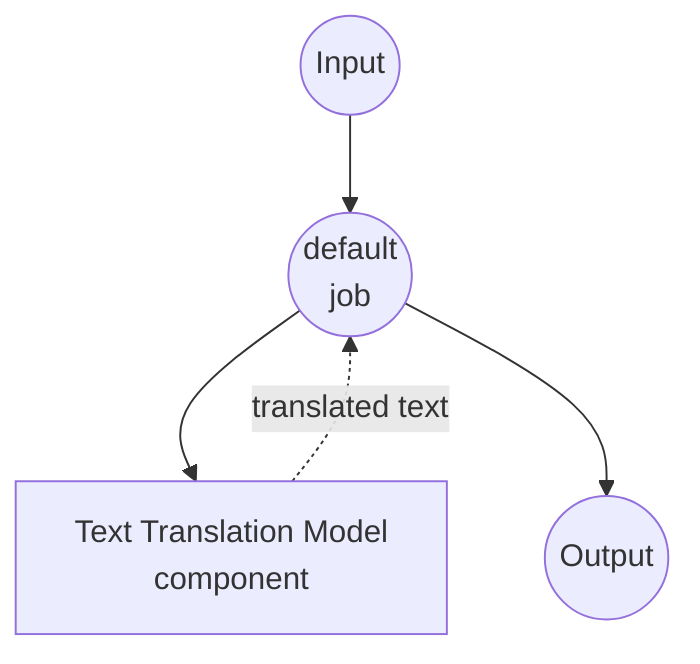

# Text Translation Model Task Example

This example demonstrates how to use local multilingual models for text translation using model-compose's built-in text-generation task with SMALL100, providing offline translation capabilities across 100+ languages.

## Overview

This workflow provides local text translation that:

1. **Local Multilingual Model**: Runs SMALL100 model locally for text translation
2. **100+ Languages**: Supports translation between over 100 language pairs
3. **Automatic Model Management**: Downloads and caches models automatically on first use
4. **No External APIs**: Completely offline translation without dependencies
5. **Deterministic Output**: Consistent translation results with disabled sampling

## Preparation

### Prerequisites

- model-compose installed and available in your PATH
- Sufficient system resources for running SMALL100 (recommended: 8GB+ RAM)
- Python environment with transformers and torch (automatically managed)

### Why Local Translation Models

Unlike cloud-based translation APIs, local model execution provides:

**Benefits of Local Processing:**
- **Privacy**: All text processing happens locally, no content sent to external services
- **Cost**: No per-character or API usage fees after initial setup
- **Offline**: Works without internet connection after model download
- **Latency**: No network latency for translation processing
- **Customization**: Full control over translation parameters
- **Batch Processing**: Unlimited text processing without rate limits

**Trade-offs:**
- **Hardware Requirements**: Requires adequate RAM for model and text processing
- **Setup Time**: Initial model download and loading time
- **Quality Limitations**: Smaller models may have lower quality than large cloud services
- **Language Coverage**: Limited to supported language pairs in the model

### Environment Configuration

1. Navigate to this example directory:
   ```bash
   cd examples/model-tasks/translation
   ```

2. No additional environment configuration required - model and dependencies are managed automatically.

## How to Run

1. **Start the service:**
   ```bash
   model-compose up
   ```

2. **Run the workflow:**

   **Using API:**
   ```bash
   curl -X POST http://localhost:8080/api/workflows/__default__/runs \
     -H "Content-Type: application/json" \
     -d '{"input": {"text": "Hello, how are you today?"}}'
   ```

   **Using Web UI:**
   - Open the Web UI: http://localhost:8081
   - Enter your input parameters
   - Click the "Run Workflow" button

   **Using CLI:**
   ```bash
   model-compose run translation --input '{"text": "Hello, how are you today?"}'
   ```

## Component Details

### Text Translation Model Component
- **Type**: Model component with text-generation task
- **Purpose**: Local multilingual text translation
- **Model**: alirezamsh/small100
- **Architecture**: mBART-based sequence-to-sequence transformer
- **Features**:
  - 100+ language support
  - Automatic model downloading and caching
  - Deterministic translation (sampling disabled)
  - CPU and GPU acceleration support
  - Memory-efficient processing

### Model Information: SMALL100

- **Developer**: Alireza Mohammadshahi
- **Base Architecture**: mBART (Multilingual BART)
- **Parameters**: ~300 million
- **Type**: Multilingual sequence-to-sequence transformer
- **Languages**: 100+ languages including major world languages
- **Training**: Multilingual parallel corpora
- **Input Limit**: 1024 tokens (automatically truncated)
- **License**: MIT

## Workflow Details

### "Translate Text" Workflow (Default)

**Description**: Translate input text into another language using a pretrained multilingual model.

#### Job Flow

This example uses a simplified single-component configuration without explicit jobs.



#### Input Parameters

| Parameter | Type | Required | Default | Description |
|-----------|------|----------|---------|-------------|
| `text` | text | Yes | - | Input text to translate (max 1024 tokens) |

#### Output Format

| Field | Type | Description |
|-------|------|-------------|
| `translated` | text | Translated text in the target language |

## Language Support

### Major Language Families Supported

**European Languages:**
- English (en), Spanish (es), French (fr), German (de), Italian (it)
- Portuguese (pt), Dutch (nl), Russian (ru), Polish (pl), Czech (cs)
- Greek (el), Swedish (sv), Norwegian (no), Danish (da), Finnish (fi)

**Asian Languages:**
- Chinese (zh), Japanese (ja), Korean (ko), Hindi (hi), Arabic (ar)
- Thai (th), Vietnamese (vi), Indonesian (id), Malay (ms), Tamil (ta)
- Bengali (bn), Urdu (ur), Persian (fa), Hebrew (he), Turkish (tr)

**African Languages:**
- Swahili (sw), Yoruba (yo), Hausa (ha), Amharic (am), Somali (so)

**And 70+ additional languages...**

### Language Code Format
Use ISO 639-1 language codes (e.g., 'en' for English, 'es' for Spanish, 'zh' for Chinese).

## System Requirements

### Minimum Requirements
- **RAM**: 8GB (recommended 16GB+)
- **Disk Space**: 3GB+ for model storage and cache
- **CPU**: Multi-core processor (4+ cores recommended)
- **Internet**: Required for initial model download only

### Performance Notes
- First run requires model download (~1.2GB)
- Model loading takes 1-2 minutes depending on hardware
- GPU acceleration improves translation speed
- Processing time varies with input text length

## Customization

### Specifying Translation Direction

Configure specific language pairs:

```yaml
component:
  type: model
  task: text-generation
  model: alirezamsh/small100
  architecture: seq2seq
  text: |
    Translate from ${input.source_lang | "English"} to ${input.target_lang | "Spanish"}:
    ${input.text as text}
  params:
    max_input_length: 1024
    do_sample: false
```

### Using Language Tokens

Some multilingual models use special language tokens:

```yaml
component:
  type: model
  task: text-generation
  model: alirezamsh/small100
  architecture: seq2seq
  text: |
    <source_lang>${input.source_lang | "en"}</source_lang>
    <target_lang>${input.target_lang | "es"}</target_lang>
    ${input.text as text}
  params:
    max_input_length: 1024
    do_sample: false
```

### Batch Translation

Process multiple texts:

```yaml
workflow:
  title: Batch Translation
  jobs:
    - id: translate-texts
      component: text-translator
      repeat_count: ${input.text_count}
      input:
        text: ${input.texts[${index}]}
        source_lang: ${input.source_lang}
        target_lang: ${input.target_lang}
```

## Advanced Configuration

### Translation Quality Control

```yaml
component:
  type: model
  task: text-generation
  model: alirezamsh/small100
  architecture: seq2seq
  text: ${input.text as text}
  params:
    max_input_length: 1024
    max_length: ${input.max_length as number | 1024}
    num_beams: ${input.quality as number | 4}    # Higher beams = better quality
    length_penalty: 1.0                           # Control output length
    no_repeat_ngram_size: 3                      # Prevent repetition
    do_sample: false                             # Deterministic output
```

### Using Different Models

Replace with other translation models:

```yaml
component:
  type: model
  task: text-generation
  model: facebook/m2m100_418M              # Smaller multilingual model
  # or
  model: facebook/mbart-large-50-many-to-many-mmt  # Larger model, 50 languages
  # or
  model: Helsinki-NLP/opus-mt-en-es        # Dedicated English-Spanish model
```

### Custom Preprocessing

Add text preprocessing:

```yaml
component:
  type: model
  task: text-generation
  model: alirezamsh/small100
  architecture: seq2seq
  text: |
    Original text (${input.source_lang | "English"}):
    "${input.text as text}"

    Translation (${input.target_lang | "Spanish"}):
  params:
    max_input_length: 1024
    do_sample: false
```

## Troubleshooting

### Common Issues

1. **Poor Translation Quality**: Try larger models or adjust beam search parameters
2. **Unsupported Languages**: Check model documentation for supported language pairs
3. **Input Too Long**: Text exceeds token limit - split into smaller chunks
4. **Memory Issues**: Reduce batch size or close other applications
5. **Slow Processing**: Enable GPU acceleration or use smaller models

### Performance Optimization

- **GPU Usage**: Install CUDA-compatible PyTorch for faster inference
- **Model Selection**: Balance model size with translation quality needs
- **Text Chunking**: Split long documents into manageable segments
- **Caching**: Cache frequently translated phrases

## Comparison with API-based Solutions

| Feature | Local Translation | Cloud Translation API |
|---------|-----------------|---------------------|
| Privacy | Complete privacy | Text sent to provider |
| Cost | Hardware cost only | Per-character pricing |
| Latency | Hardware dependent | Network + API latency |
| Availability | Offline capable | Internet required |
| Language Support | Model-specific | Usually broader coverage |
| Quality | Depends on local model | Usually higher quality |
| Customization | Full parameter control | Limited API parameters |
| Batch Processing | Unlimited | Rate limited |
| Setup Complexity | Model download required | API key only |

## Advanced Usage

### Multi-Language Document Processing
```yaml
workflow:
  title: Multi-Language Document Translation
  jobs:
    - id: detect-language
      component: language-detector
      input:
        text: ${input.text}
    - id: translate-content
      component: text-translator
      input:
        text: ${input.text}
        source_lang: ${detect-language.language}
        target_lang: ${input.target_lang}
```

### Translation Quality Assessment
```yaml
workflow:
  title: Translation with Quality Check
  jobs:
    - id: translate
      component: text-translator
      input:
        text: ${input.text}
        source_lang: ${input.source_lang}
        target_lang: ${input.target_lang}
    - id: back-translate
      component: text-translator
      input:
        text: ${translate.translated}
        source_lang: ${input.target_lang}
        target_lang: ${input.source_lang}
    - id: quality-score
      component: text-similarity
      input:
        text1: ${input.text}
        text2: ${back-translate.translated}
```

### Conversational Translation
```yaml
component:
  type: model
  task: text-generation
  model: alirezamsh/small100
  architecture: seq2seq
  text: |
    Context: This is a ${input.context | "casual"} conversation.
    Translate from ${input.source_lang} to ${input.target_lang}:

    "${input.text as text}"

    Translation:
  params:
    max_input_length: 1024
    do_sample: false
```

## Model Variants

### Different Scale Models
- **facebook/m2m100_418M**: 418M parameters, 100 languages, faster
- **facebook/m2m100_1.2B**: 1.2B parameters, higher quality
- **alirezamsh/small100**: ~300M parameters, good balance (default)

### Specialized Models
- **Helsinki-NLP/opus-mt-***: Language-specific models (e.g., opus-mt-en-es)
- **facebook/mbart-large-50**: 50 languages, high quality
- **google/mt5-base**: Text-to-text transfer transformer for translation

### Domain-Specific Models
- **facebook/wmt19-en-de**: Optimized for English-German news translation
- **microsoft/DialoGPT-***: Conversational translation models
