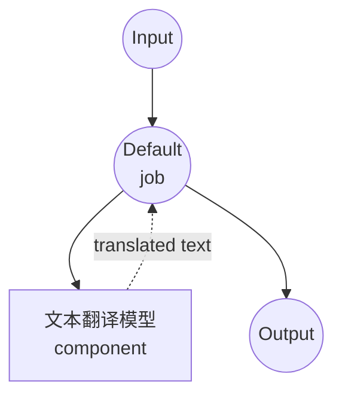

# 文本翻译模型任务示例

此示例演示如何使用本地多语言模型进行文本翻译，使用 model-compose 内置的 text-generation 任务和 SMALL100，在 100+ 种语言之间提供离线翻译能力。

## 概述

此工作流提供本地文本翻译功能：

1. **本地多语言模型**：在本地运行 SMALL100 模型进行文本翻译
2. **100+ 种语言**：支持超过 100 种语言对之间的翻译
3. **自动模型管理**：首次使用时自动下载和缓存模型
4. **无需外部 API**：完全离线的翻译，无需依赖
5. **确定性输出**：禁用采样的一致翻译结果

## 准备工作

### 前置条件

- 已安装 model-compose 并在 PATH 中可用
- 运行 SMALL100 所需的充足系统资源（建议：8GB+ 内存）
- 带有 transformers 和 torch 的 Python 环境（自动管理）

### 为什么选择本地翻译模型

与基于云的翻译 API 不同，本地模型执行提供：

**本地处理的优势：**
- **隐私性**：所有文本处理在本地进行，不向外部服务发送内容
- **成本**：初始设置后无需按字符或 API 使用计费
- **离线能力**：模型下载后无需互联网连接即可工作
- **延迟**：无网络延迟的翻译处理
- **自定义**：完全控制翻译参数
- **批处理**：无限制的文本处理，无速率限制

**权衡考虑：**
- **硬件要求**：模型和文本处理需要足够的内存
- **设置时间**：初始模型下载和加载时间
- **质量限制**：较小的模型可能质量低于大型云服务
- **语言覆盖**：仅限于模型支持的语言对

### 环境配置

1. 导航到此示例目录：
   ```bash
   cd examples/model-tasks/translation
   ```

2. 无需额外的环境配置 - 模型和依赖项会自动管理。

## 如何运行

1. **启动服务：**
   ```bash
   model-compose up
   ```

2. **运行工作流：**

   **使用 API：**
   ```bash
   curl -X POST http://localhost:8080/api/workflows/runs \
     -H "Content-Type: application/json" \
     -d '{"input": {"text": "Hello, how are you today?"}}'
   ```

   **使用 Web UI：**
   - 打开 Web UI：http://localhost:8081
   - 输入您的输入参数
   - 点击"运行工作流"按钮

   **使用 CLI：**
   ```bash
   model-compose run translation --input '{"text": "Hello, how are you today?"}'
   ```

## 组件详情

### 文本翻译模型组件（默认）
- **类型**：带有 text-generation 任务的模型组件
- **用途**：本地多语言文本翻译
- **模型**：alirezamsh/small100
- **架构**：基于 mBART 的序列到序列转换器
- **特性**：
  - 支持 100+ 种语言
  - 自动模型下载和缓存
  - 确定性翻译（禁用采样）
  - CPU 和 GPU 加速支持
  - 内存高效处理

### 模型信息：SMALL100

- **开发者**：Alireza Mohammadshahi
- **基础架构**：mBART（多语言 BART）
- **参数**：约 3 亿
- **类型**：多语言序列到序列转换器
- **语言**：100+ 种语言，包括主要世界语言
- **训练**：多语言平行语料库
- **输入限制**：1024 个令牌（自动截断）
- **许可证**：MIT

## 工作流详情

### "翻译文本"工作流（默认）

**描述**：使用预训练的多语言模型将输入文本翻译成另一种语言。

#### 作业流程

此示例使用简化的单组件配置，无需显式作业。



#### 输入参数

| 参数 | 类型 | 必需 | 默认值 | 描述 |
|-----------|------|----------|---------|-------------|
| `text` | text | 是 | - | 要翻译的输入文本（最多 1024 个令牌） |

#### 输出格式

| 字段 | 类型 | 描述 |
|-------|------|-------------|
| `translated` | text | 目标语言的翻译文本 |

## 语言支持

### 支持的主要语系

**欧洲语言：**
- 英语 (en)、西班牙语 (es)、法语 (fr)、德语 (de)、意大利语 (it)
- 葡萄牙语 (pt)、荷兰语 (nl)、俄语 (ru)、波兰语 (pl)、捷克语 (cs)
- 希腊语 (el)、瑞典语 (sv)、挪威语 (no)、丹麦语 (da)、芬兰语 (fi)

**亚洲语言：**
- 中文 (zh)、日语 (ja)、韩语 (ko)、印地语 (hi)、阿拉伯语 (ar)
- 泰语 (th)、越南语 (vi)、印尼语 (id)、马来语 (ms)、泰米尔语 (ta)
- 孟加拉语 (bn)、乌尔都语 (ur)、波斯语 (fa)、希伯来语 (he)、土耳其语 (tr)

**非洲语言：**
- 斯瓦希里语 (sw)、约鲁巴语 (yo)、豪萨语 (ha)、阿姆哈拉语 (am)、索马里语 (so)

**以及 70+ 种其他语言...**

### 语言代码格式
使用 ISO 639-1 语言代码（例如，'en' 表示英语，'es' 表示西班牙语，'zh' 表示中文）。

## 系统要求

### 最低要求
- **内存**：8GB（建议 16GB+）
- **磁盘空间**：3GB+ 用于模型存储和缓存
- **CPU**：多核处理器（建议 4+ 核心）
- **互联网**：仅初始模型下载时需要

### 性能说明
- 首次运行需要下载模型（约 1.2GB）
- 模型加载需要 1-2 分钟，取决于硬件
- GPU 加速提高翻译速度
- 处理时间随输入文本长度而变化

## 自定义

### 指定翻译方向

配置特定的语言对：

```yaml
component:
  type: model
  task: text-generation
  model: alirezamsh/small100
  architecture: seq2seq
  text: |
    Translate from ${input.source_lang | "English"} to ${input.target_lang | "Spanish"}:
    ${input.text as text}
  params:
    max_input_length: 1024
    do_sample: false
```

### 使用语言令牌

某些多语言模型使用特殊的语言令牌：

```yaml
component:
  type: model
  task: text-generation
  model: alirezamsh/small100
  architecture: seq2seq
  text: |
    <source_lang>${input.source_lang | "en"}</source_lang>
    <target_lang>${input.target_lang | "es"}</target_lang>
    ${input.text as text}
  params:
    max_input_length: 1024
    do_sample: false
```

### 批量翻译

处理多个文本：

```yaml
workflow:
  title: Batch Translation
  jobs:
    - id: translate-texts
      component: text-translator
      repeat_count: ${input.text_count}
      input:
        text: ${input.texts[${index}]}
        source_lang: ${input.source_lang}
        target_lang: ${input.target_lang}
```

## 高级配置

### 翻译质量控制

```yaml
component:
  type: model
  task: text-generation
  model: alirezamsh/small100
  architecture: seq2seq
  text: ${input.text as text}
  params:
    max_input_length: 1024
    max_length: ${input.max_length as number | 1024}
    num_beams: ${input.quality as number | 4}    # 更高的束 = 更好的质量
    length_penalty: 1.0                           # 控制输出长度
    no_repeat_ngram_size: 3                      # 防止重复
    do_sample: false                             # 确定性输出
```

### 使用不同的模型

替换为其他翻译模型：

```yaml
component:
  type: model
  task: text-generation
  model: facebook/m2m100_418M              # 较小的多语言模型
  # 或
  model: facebook/mbart-large-50-many-to-many-mmt  # 较大的模型，50 种语言
  # 或
  model: Helsinki-NLP/opus-mt-en-es        # 专用的英语-西班牙语模型
```

### 自定义预处理

添加文本预处理：

```yaml
component:
  type: model
  task: text-generation
  model: alirezamsh/small100
  architecture: seq2seq
  text: |
    Original text (${input.source_lang | "English"}):
    "${input.text as text}"

    Translation (${input.target_lang | "Spanish"}):
  params:
    max_input_length: 1024
    do_sample: false
```

## 故障排除

### 常见问题

1. **翻译质量差**：尝试更大的模型或调整束搜索参数
2. **不支持的语言**：查看模型文档以了解支持的语言对
3. **输入过长**：文本超过令牌限制 - 拆分成较小的块
4. **内存问题**：减小批量大小或关闭其他应用程序
5. **处理缓慢**：启用 GPU 加速或使用更小的模型

### 性能优化

- **GPU 使用**：安装与 CUDA 兼容的 PyTorch 以加快推理速度
- **模型选择**：平衡模型大小与翻译质量需求
- **文本分块**：将长文档拆分成可管理的片段
- **缓存**：缓存经常翻译的短语

## 与基于 API 的解决方案比较

| 特性 | 本地翻译 | 云翻译 API |
|---------|-----------------|---------------------|
| 隐私性 | 完全隐私 | 文本发送给提供商 |
| 成本 | 仅硬件成本 | 按字符计费 |
| 延迟 | 依赖于硬件 | 网络 + API 延迟 |
| 可用性 | 离线能力 | 需要互联网 |
| 语言支持 | 特定于模型 | 通常覆盖更广 |
| 质量 | 取决于本地模型 | 通常质量更高 |
| 自定义 | 完全参数控制 | 有限的 API 参数 |
| 批处理 | 无限制 | 速率限制 |
| 设置复杂性 | 需要下载模型 | 仅需 API 密钥 |

## 高级用法

### 多语言文档处理
```yaml
workflow:
  title: Multi-Language Document Translation
  jobs:
    - id: detect-language
      component: language-detector
      input:
        text: ${input.text}
    - id: translate-content
      component: text-translator
      input:
        text: ${input.text}
        source_lang: ${detect-language.language}
        target_lang: ${input.target_lang}
```

### 翻译质量评估
```yaml
workflow:
  title: Translation with Quality Check
  jobs:
    - id: translate
      component: text-translator
      input:
        text: ${input.text}
        source_lang: ${input.source_lang}
        target_lang: ${input.target_lang}
    - id: back-translate
      component: text-translator
      input:
        text: ${translate.translated}
        source_lang: ${input.target_lang}
        target_lang: ${input.source_lang}
    - id: quality-score
      component: text-similarity
      input:
        text1: ${input.text}
        text2: ${back-translate.translated}
```

### 会话翻译
```yaml
component:
  type: model
  task: text-generation
  model: alirezamsh/small100
  architecture: seq2seq
  text: |
    Context: This is a ${input.context | "casual"} conversation.
    Translate from ${input.source_lang} to ${input.target_lang}:

    "${input.text as text}"

    Translation:
  params:
    max_input_length: 1024
    do_sample: false
```

## 模型变体

### 不同规模的模型
- **facebook/m2m100_418M**：4.18 亿参数，100 种语言，更快
- **facebook/m2m100_1.2B**：12 亿参数，质量更高
- **alirezamsh/small100**：约 3 亿参数，良好平衡（默认）

### 专用模型
- **Helsinki-NLP/opus-mt-***：特定语言模型（例如 opus-mt-en-es）
- **facebook/mbart-large-50**：50 种语言，高质量
- **google/mt5-base**：用于翻译的文本到文本转换转换器

### 领域特定模型
- **facebook/wmt19-en-de**：为英德新闻翻译优化
- **microsoft/DialoGPT-***：会话翻译模型
