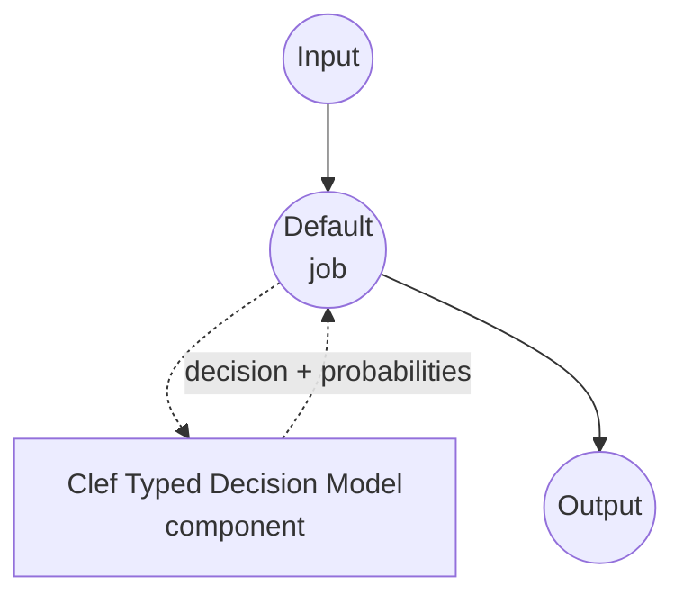

# Typed Decision Clef 모델 태스크 예제

이 예제는 Cloudflare의 Clef 모델을 model-compose의 내장 typed-decision 태스크와 함께 사용하여 원샷 타입드 결정을 수행하는 방법을 보여줍니다. 호출자가 제공한 스키마의 각 질문에 대해 선택된 값과 후보별 확률을 반환하며, 어떠한 자유 형식 텍스트도 생성하지 않습니다.

## 개요

이 워크플로우는 다음과 같은 로컬 구조화된 의사결정 기능을 제공합니다:

1. **타입 안전 출력**: 각 질문은 `noul`(예/아니오), `choice`(N개 명명된 옵션 중 하나), 또는 `score`(순서형 평점 스케일) 중 하나이며, 응답은 반드시 스키마의 값 중 하나임이 보장됩니다
2. **질문별 확률**: 모든 후보에 대한 모델의 보정된 확률을 반환하여 신뢰도 임계값과 기대값 계산에 활용 가능합니다
3. **자유 텍스트 생성 없음**: Clef의 joint schema head가 상태로부터 각 질문으로 근거를 라우팅하고 허용된 모든 옵션을 단일 forward pass에서 스코어링합니다. JSON 생성도, chain-of-thought도, 스키마 외 옵션의 환각도 없습니다
4. **요청 시점 스키마**: 질문 세트, 옵션, 지시문이 컴포넌트에 고정되지 않고 호출마다 공급됩니다
5. **로컬 모델 실행**: CUDA(권장), MPS(Apple Silicon), CPU에서 완전히 오프라인으로 실행
6. **멀티모달 가능**: Clef는 텍스트 상태와 함께 이미지 및 비디오 프레임을 받을 수 있습니다(이 예제는 텍스트만 연결하며, 태스크 표면은 텍스트 중심을 유지)

## 준비사항

### 필수 요구사항

- model-compose가 설치되어 PATH에서 사용 가능
- 지원되는 하드웨어 경로 중 하나:
  - **Linux의 NVIDIA GPU** — 권장. 27B BF16 가중치는 단일 48 GB급 GPU(A6000, L40S, H100)에 적재되거나 `device_map="auto"`로 CPU에 스필 가능
  - **Apple Silicon (Darwin arm64)** — 스모크 테스트는 가능. 27B BF16에서는 처리량이 낮음
  - **CPU** — 지원되지만 매우 느립니다. 스키마 검증 및 오프라인 실험용
- Clef 스냅샷을 저장할 디스크 공간 (BF16 기준 ~55 GB)
- Python 3.10 이상

### Clef를 선택하는 이유

일반 챗 모델에 JSON을 반환하라고 프롬프팅하는 것과 비교해, Clef는 Qwen3.8-27B 위에 구축되어 텍스트, 이미지, 비디오 전반에서 "이 옵션들 중에 골라라" 패턴에 파인튜닝된 27B 멀티모달 결정 모델입니다:

**장점:**
- **타입 안전 출력**: joint schema head가 허용된 옵션 토큰만 스코어링하므로 스키마 밖 옵션이 원리적으로 나올 수 없습니다
- **파싱 불필요**: 응답이 이미 타입드 딕셔너리 — JSON 문법 강제나 복구가 없음
- **단일 forward pass**: 상태가 한 번 인코딩되고 모든 질문이 함께 답변됩니다. 같은 상태에 N개 질문을 답하는 비용이 한 개와 거의 같음
- **보정된 확률**: 옵션 로짓에 대한 질문별 softmax가 다운스트림 임계값에 쓸 수 있는 확률을 제공
- **세 가지 질문 형태**: `noul`(예/아니오), `choice`(명명 옵션), `score`(순서 레벨) — 프롬프트 엔지니어링 없이 대부분의 분류 패턴을 커버
- **멀티모달 표면**: 기반 모델은 이미지와 비디오 프레임도 수용(이 예제는 태스크를 텍스트 중심으로 유지하기 위해 연결하지 않음)

**트레이드오프:**
- **27B 가중치**: BF16 추론은 ~55 GB VRAM 또는 device-map 분할이 필요. 랩톱용 모델이 아님
- **리포에 코드 포함**: Clef의 `joint_schema_model` 모듈은 PyPI가 아닌 스냅샷 안에 들어 있습니다. 드라이버는 import 전에 스냅샷을 `sys.path`에 추가
- **단일 체크포인트**: 현재 Clef 릴리스는 하나뿐이며, 사이즈 변형이 없음

### 환경 설정

1. 예제 디렉토리로 이동:
   ```bash
   cd examples/model-tasks/typed-decision-clef
   ```

2. 별도 환경 설정 불필요 — Clef 체크포인트와 의존성이 자동으로 관리됩니다.

## 실행 방법

1. **서비스 시작:**
   ```bash
   model-compose up
   ```

2. **워크플로우 실행:**

   **API 사용:**
   ```bash
   # 지원 메시지 트리아지: 긴급 여부, 담당 팀, 1-5 심각도 평가
   curl -X POST http://localhost:8080/api/workflows/runs \
     -H "Content-Type: application/json" \
     -d '{
       "input": {
         "text": "The payment service is down for all customers.",
         "schema": {
           "urgent": {
             "type": "noul",
             "instructions": "Is this an urgent operational incident?",
             "criteria": {
               "true": "A production system is currently unavailable to real users.",
               "false": "Non-blocking issue, question, or feature request."
             }
           },
           "category": {
             "type": "choice",
             "instructions": "Which team owns this?",
             "criteria": {
               "payments": "Billing, checkout, or payment processing.",
               "infra": "Servers, deployment, or platform outages.",
               "product": "UX, feature behavior, or product feedback."
             }
           },
           "severity": {
             "type": "score",
             "instructions": "Rate business impact from 1 (trivial) to 5 (critical).",
             "criteria": [
               "trivial: cosmetic or single-user issue",
               "low: minor inconvenience for a few users",
               "medium: measurable revenue or productivity loss",
               "high: broad customer impact, some workaround exists",
               "critical: total outage with no workaround"
             ]
           }
         }
       }
     }'
   ```

   **웹 UI 사용:**
   - 웹 UI 열기: http://localhost:8081
   - `text`에 판단할 상태를 입력
   - `schema`에 질문별 맵(JSON 객체)을 입력
   - "Run Workflow" 버튼 클릭

   **CLI 사용:**
   ```bash
   model-compose run --input '{
     "text": "The payment service is down for all customers.",
     "schema": {
       "urgent": {"type": "noul", "instructions": "Urgent incident?"},
       "category": {"type": "choice", "instructions": "Which team owns this?", "criteria": {"payments": "", "infra": "", "product": ""}},
       "severity": {"type": "score", "instructions": "Impact 1-5.", "criteria": ["trivial", "low", "medium", "high", "critical"]}
     }
   }'
   ```

## 컴포넌트 상세

### Typed Decision 모델 컴포넌트 (기본)
- **타입**: typed-decision 태스크를 가진 모델 컴포넌트
- **목적**: 로컬 원샷 타입드 결정과 보정된 후보 확률
- **모델**: Cloudflare/clef (가중치와 함께 `joint_schema_model` 모듈을 포함)
- **패밀리**: clef
- **기능**:
  - `huggingface_hub`를 통한 자동 스냅샷 다운로드
  - 스냅샷을 `sys.path`에 올려 리포 내 `joint_schema_model` 모듈을 로드
  - `load_release_model`에 전달되는 디바이스 선택 (`auto`, `cuda`, `mps`, `cpu`)
  - `noul`, `choice`, `score` 질문 타입별 옵션 확률

### 모델 정보: Clef
- **개발자**: Cloudflare
- **베이스**: Qwen3.8-27B 위에 타입드 결정용으로 학습된 joint schema head
- **파라미터**: 27B (BF16)
- **파이프라인 태그**: `image-text-to-text`
- **모달리티**: 텍스트(JSON 상태)와 선택적 이미지 및 비디오 프레임
- **능력**: `noul`(예/아니오), `choice`(명명 옵션), `score`(순서 레벨)
- **라이선스**: Apache-2.0

## 워크플로우 상세

### "Typed Decision (Clef)" 워크플로우 (기본)

**설명**: 상태와 질문별 스키마로부터 원샷 타입드 결정을 수행. 질문별로 선택된 값과 후보별 확률을 반환하며, 어떤 자유 형식 텍스트도 생성하지 않습니다.

#### 작업 흐름

이 예제는 명시적 작업 없이 단일 컴포넌트로 구성된 간단한 형태를 사용합니다.



#### 입력 파라미터

| 파라미터 | 타입 | 필수 | 기본값 | 설명 |
|---------|------|------|--------|------|
| `text` | text | 예 | - | 모델이 판단할 상태(비정형 텍스트). Clef의 컨텍스트 윈도우는 상태와 질문별 브랜치가 공유. |
| `schema` | json | 예 | - | 질문 ID → 질문 스펙 맵: `{type: noul, instructions, criteria?: {true?, false?}}`, `{type: choice, instructions, criteria: {name: description, ...}}`, 또는 `{type: score, instructions, criteria: [level1, level2, ...]}`. |

#### 출력 형식

| 필드 | 타입 | 설명 |
|------|------|------|
| `decision` | json | 질문별로 선택된 값. |
| `fields` | json | `return_probabilities`가 켜졌을 때 채워지는 질문별 상세 (`fields[qid].scores`). |

응답 본문 예시:

```json
{
  "decision": {"urgent": true, "category": "infra", "severity": "high"},
  "fields": {
    "urgent": {"scores": {"true": 0.94, "false": 0.06}},
    "category": {"scores": {"payments": 0.31, "infra": 0.58, "product": 0.11}},
    "severity": {"scores": {"trivial": 0.01, "low": 0.03, "medium": 0.09, "high": 0.63, "critical": 0.24}}
  }
}
```

`decision` 값:
- `noul` 질문은 boolean으로 해석 (`p(true) >= 0.5`)
- `choice` 질문은 승리한 옵션 이름으로 해석 (softmax에 대한 argmax)
- `score` 질문은 승리한 레벨 이름으로 해석 (softmax에 대한 argmax)

## 시스템 요구사항

### 최소 요구사항
- **RAM**: CPU 폴백 또는 `device_map="auto"` 오프로드를 위해 64 GB 이상 시스템 메모리
- **VRAM**: 단일 GPU에서 BF16 직접 적재 시 ~55 GB. 작은 GPU에서는 지연 시간을 감수하고 `device_map="auto"`와 호스트 오프로드로 동작
- **디스크 공간**: Clef 스냅샷에 ~55 GB
- **CPU**: 최신 멀티코어 프로세서 (토큰화 및 오프로드된 레이어에 사용)
- **인터넷**: 최초 체크포인트 다운로드에만 필요

### 성능 참고사항
- 상태는 단일 요청 내에서 한 번 인코딩되어 모든 질문에 재사용. 지연 시간은 질문 수에 대해 sub-linear 확장
- 단일 H100 (BF16, 오프로드 없음)에서 수십 개 필드의 질문 세트는 보통 1초 이내 응답
- Apple Silicon 경로도 동작하지만 이 파라미터 규모에서는 의도된 배포 대상이 아님
- 이 드라이버에는 Clef용 융합 CUDA 고속 경로 플래그가 없습니다. 속도는 GPU와 `device` 설정에 따름

## 커스터마이징

### 디바이스 고정

드라이버는 `device`를 `joint_schema_model.load_release_model`로 전달합니다. `auto`는 가용 가속기 중 최적을 선택하며, 특정 디바이스가 필요하면 오버라이드:

```yaml
component:
  device: cuda                           # 단일 GPU. CUDA가 없으면 에러
  # device: mps                          # Apple Silicon
  # device: cpu                          # 스키마 디버깅 / 오프라인 검증
```

### 다중 상태 배치

동일 스키마에 대해 여러 독립적 결정이 필요하면 `text`에 리스트를 넘기세요. 드라이버가 내부적으로 한 번에 한 호출씩 배치합니다 (Clef는 forward pass당 하나의 record를 처리):

```yaml
component:
  action:
    text: ${input.texts}                 # 문자열 리스트
    schema: ${input.schema}
    batch_size: 1
```

`batch_size: 1`로 유지하고 컨트롤러의 동시성도 1로 두세요 — 27B 모델은 단일 GPU에서 동시 요청 간 메모리를 효율적으로 공유하지 않습니다.

### 원시 로짓 반환

보정 실험 등에서 정규화되지 않은 스코어가 확률과 함께 필요할 때 플래그를 켜세요:

```yaml
component:
  action:
    return_probabilities: true
    return_logits: true
```

## 문제 해결

### 일반적인 이슈

1. **체크포인트 다운로드가 느림**: 첫 실행 시 ~55 GB를 가져옵니다. 이후 실행은 `~/.cache/huggingface`의 HuggingFace 캐시를 재사용
2. **로드 시 메모리 부족**: 27B BF16은 ~55 GB VRAM이 필요합니다. 스키마 검증을 위해 `device: cpu`로 폴백하거나, `device: auto`로 로드해 `load_release_model`이 GPU/CPU로 분할하도록 하세요
3. **`ModuleNotFoundError: joint_schema_model`**: 드라이버가 첫 사용 시 스냅샷 경로를 `sys.path`에 주입합니다. 모델이 다운로드를 완료했는지 확인하세요. 이전 다운로드가 중단된 경우 `~/.cache/huggingface/hub/models--Cloudflare--clef/`를 지우고 재시도
4. **상태가 너무 김**: Clef는 상태와 질문별 브랜치가 하나의 컨텍스트 윈도우를 공유합니다. 상태를 과밀하게 채우지 말고 긴 입력은 여러 호출로 분할하세요

### 성능 최적화

- **GPU 배치**: 충분히 큰 단일 GPU에서는 `device: cuda`로 고정해 device-map 오버헤드를 피하세요
- **요청 동시성**: `max_concurrent_count: 1`을 유지하세요 — 27B 모델은 단일 디바이스에서 처리량이 아닌 지연·메모리 바운드
- **질문 설명**: 더 명확하고 구별되는 옵션 설명이 더 자신 있는 확률을 만듭니다
- **질문 독립성**: Clef는 공유 forward pass에서 각 질문을 독립적으로 스코어링. 모델 일치에 의존하지 말고 워크플로우에서 교차 질문 일관성을 강제하세요
