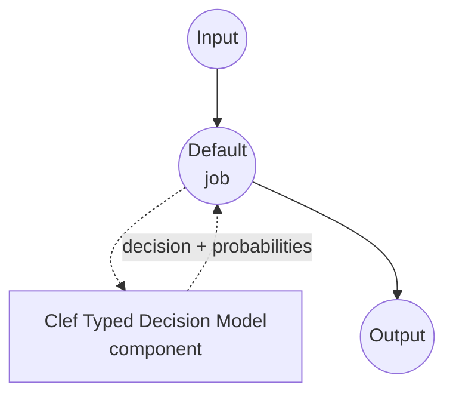

# Typed Decision Clef Model Task Example

This example demonstrates how to use Cloudflare's Clef model for one-shot typed decisions using model-compose's built-in typed-decision task, returning a chosen value plus per-candidate probabilities for each question in a caller-supplied schema — without generating any free-form text.

## Overview

This workflow provides local, structured decision-making that:

1. **Typed Outputs**: Each question is one of `noul` (yes/no), `choice` (one of N named options), or `score` (an ordered rating scale); the response is guaranteed to be a value from the schema
2. **Per-Question Probabilities**: Returns the model's calibrated probability for every candidate, useful for confidence thresholds and expected-value calculations
3. **No Free-Form Text**: Clef's joint schema head routes evidence from the state to each question and scores every allowed option in a single forward pass; there is no JSON generation, no chain-of-thought, no hallucinated options
4. **Request-Time Schema**: The question set, options, and instructions are supplied per call, not baked into the component
5. **Local Model Execution**: Runs entirely offline on CUDA (recommended), MPS (Apple Silicon), or CPU
6. **Multimodal Capable**: Clef accepts images and video frames alongside the text state (this example wires only text; the task surface stays text-first)

## Preparation

### Prerequisites

- model-compose installed and available in your PATH
- One of the supported hardware paths:
  - **NVIDIA GPU on Linux** — recommended; the 27B BF16 weights fit on a single 48 GB-class GPU (A6000, L40S, H100) or spill to CPU with `device_map="auto"`
  - **Apple Silicon (Darwin arm64)** — works for smoke tests; expect slow throughput at 27B BF16
  - **CPU** — supported but very slow; intended for schema validation and offline experiments
- Enough disk for the Clef snapshot (~55 GB in BF16)
- Python 3.10 or newer

### Why Clef for Typed Decisions

Compared to prompting a general chat model to return JSON, Clef is a 27B multimodal decision model built on Qwen3.8-27B and fine-tuned for the "choose one of these" pattern across text, images, and video:

**Benefits:**
- **Type-Safe Outputs**: The joint schema head scores only the allowed option tokens; producing an option outside the schema is impossible by construction
- **No Parsing**: The response is already a dict of typed values — no JSON grammar to enforce or repair
- **One Forward Pass**: The state is encoded once and every question is answered together, so answering N questions on the same state is close to the cost of one
- **Calibrated Probabilities**: Per-question softmax over the option logits gives probabilities suitable for downstream thresholds
- **Three Question Shapes**: `noul` (yes/no), `choice` (named options), and `score` (ordinal levels) cover most classification patterns without prompt engineering
- **Multimodal Surface**: The underlying model also accepts images and video frames (not wired in this example, which keeps the task text-first)

**Trade-offs:**
- **27B Weights**: BF16 inference needs ~55 GB of VRAM or a device-map split; this is not a laptop-class model
- **Ships Code in the Repo**: Clef's `joint_schema_model` module lives inside the snapshot (not on PyPI); the driver puts the snapshot on `sys.path` before importing
- **Single Checkpoint**: There is one Clef release at the moment; there are no size variants to pick between

### Environment Configuration

1. Navigate to this example directory:
   ```bash
   cd examples/model-tasks/typed-decision-clef
   ```

2. No additional environment configuration required — the Clef checkpoint and dependencies are managed automatically.

## How to Run

1. **Start the service:**
   ```bash
   model-compose up
   ```

2. **Run the workflow:**

   **Using API:**
   ```bash
   # Triage a support message: is it urgent, which category, on a 1-5 severity scale
   curl -X POST http://localhost:8080/api/workflows/runs \
     -H "Content-Type: application/json" \
     -d '{
       "input": {
         "text": "The payment service is down for all customers.",
         "schema": {
           "urgent": {
             "type": "noul",
             "instructions": "Is this an urgent operational incident?",
             "criteria": {
               "true": "A production system is currently unavailable to real users.",
               "false": "Non-blocking issue, question, or feature request."
             }
           },
           "category": {
             "type": "choice",
             "instructions": "Which team owns this?",
             "criteria": {
               "payments": "Billing, checkout, or payment processing.",
               "infra": "Servers, deployment, or platform outages.",
               "product": "UX, feature behavior, or product feedback."
             }
           },
           "severity": {
             "type": "score",
             "instructions": "Rate business impact from 1 (trivial) to 5 (critical).",
             "criteria": [
               "trivial: cosmetic or single-user issue",
               "low: minor inconvenience for a few users",
               "medium: measurable revenue or productivity loss",
               "high: broad customer impact, some workaround exists",
               "critical: total outage with no workaround"
             ]
           }
         }
       }
     }'
   ```

   **Using Web UI:**
   - Open the Web UI: http://localhost:8081
   - Fill in `text` with the state to judge
   - Fill in `schema` with the per-question map (JSON object)
   - Click the "Run Workflow" button

   **Using CLI:**
   ```bash
   model-compose run --input '{
     "text": "The payment service is down for all customers.",
     "schema": {
       "urgent": {"type": "noul", "instructions": "Urgent incident?"},
       "category": {"type": "choice", "instructions": "Which team owns this?", "criteria": {"payments": "", "infra": "", "product": ""}},
       "severity": {"type": "score", "instructions": "Impact 1-5.", "criteria": ["trivial", "low", "medium", "high", "critical"]}
     }
   }'
   ```

## Component Details

### Typed Decision Model Component (Default)
- **Type**: Model component with typed-decision task
- **Purpose**: Local one-shot typed decisions with calibrated candidate probabilities
- **Model**: Cloudflare/clef (ships the `joint_schema_model` module alongside the weights)
- **Family**: clef
- **Features**:
  - Automatic snapshot download via `huggingface_hub`
  - The in-repo `joint_schema_model` module is loaded by putting the snapshot on `sys.path`
  - Device selection forwarded to `load_release_model` (`auto`, `cuda`, `mps`, `cpu`)
  - Per-question option probabilities for `noul`, `choice`, and `score` question types

### Model Information: Clef
- **Developer**: Cloudflare
- **Base**: Qwen3.8-27B with a joint schema head trained for typed decisions
- **Parameters**: 27B (BF16)
- **Pipeline Tag**: `image-text-to-text`
- **Modalities**: Text (JSON state) plus optional images and video frames
- **Capabilities**: `noul` (yes/no), `choice` (named options), `score` (ordinal levels)
- **License**: Apache-2.0

## Workflow Details

### "Typed Decision (Clef)" Workflow (Default)

**Description**: One-shot typed decisions from a state and a per-question schema; returns the chosen value plus per-candidate probabilities per question, without generating any free-form text.

#### Job Flow

This example uses a simplified single-component configuration without explicit jobs.



#### Input Parameters

| Parameter | Type | Required | Default | Description |
|-----------|------|----------|---------|-------------|
| `text` | text | Yes | - | The state (unstructured text) the model judges. Fits inside Clef's context window shared with the per-question branches. |
| `schema` | json | Yes | - | Map of question id to a per-question spec: `{type: noul, instructions, criteria?: {true?, false?}}`, `{type: choice, instructions, criteria: {name: description, ...}}`, or `{type: score, instructions, criteria: [level1, level2, ...]}`. |

#### Output Format

| Field | Type | Description |
|-------|------|-------------|
| `decision` | json | Chosen value per question. |
| `fields` | json | Per-question detail, populated when `return_probabilities` is on (`fields[qid].scores`). |

Example response body:

```json
{
  "decision": {"urgent": true, "category": "infra", "severity": "high"},
  "fields": {
    "urgent": {"scores": {"true": 0.94, "false": 0.06}},
    "category": {"scores": {"payments": 0.31, "infra": 0.58, "product": 0.11}},
    "severity": {"scores": {"trivial": 0.01, "low": 0.03, "medium": 0.09, "high": 0.63, "critical": 0.24}}
  }
}
```

Values in `decision`:
- `noul` questions resolve to a boolean (`p(true) >= 0.5`)
- `choice` questions resolve to the winning option name (argmax over the softmax)
- `score` questions resolve to the winning level name (argmax over the softmax)

## System Requirements

### Minimum Requirements
- **RAM**: 64 GB+ system memory for CPU fallback or `device_map="auto"` offload
- **VRAM**: ~55 GB for straight BF16 on a single GPU; smaller GPUs work with `device_map="auto"` and host offload at the cost of latency
- **Disk Space**: ~55 GB for the Clef snapshot
- **CPU**: Modern multi-core processor (used for tokenization and any offloaded layers)
- **Internet**: Required for initial checkpoint download only

### Performance Notes
- The state is encoded once and reused across all questions in a single request; latency scales sub-linearly with question count
- On a single H100 (BF16, no offload), a question set of a dozen fields typically answers in under a second
- Apple Silicon paths work but are not the intended deployment target at this parameter count
- Clef has no fused CUDA fast path flag in this driver; speed depends on your GPU and `device` setting

## Customization

### Pinning a Device

The driver forwards `device` to `joint_schema_model.load_release_model`. `auto` picks the best available accelerator; override when you need a specific device:

```yaml
component:
  device: cuda                           # single GPU; raises if CUDA is unavailable
  # device: mps                          # Apple Silicon
  # device: cpu                          # schema debugging / offline validation
```

### Batching Multiple States

Pass a list to `text` when you have many independent decisions against the same schema; the driver batches them internally one call at a time (Clef processes one record per forward pass):

```yaml
component:
  action:
    text: ${input.texts}                 # list of strings
    schema: ${input.schema}
    batch_size: 1
```

Set `batch_size: 1` and keep concurrency in the controller to one — the 27B model does not share memory well across concurrent requests on a single GPU.

### Returning Raw Logits

Flip the flag when you need unnormalized scores alongside probabilities (e.g., for calibration experiments):

```yaml
component:
  action:
    return_probabilities: true
    return_logits: true
```

## Troubleshooting

### Common Issues

1. **Checkpoint Download Slow**: The first run pulls ~55 GB. Subsequent runs reuse the HuggingFace cache under `~/.cache/huggingface`.
2. **Out of Memory on Load**: BF16 at 27B needs ~55 GB VRAM. Fall back to `device: cpu` for schema validation, or load with `device: auto` so `load_release_model` can split across GPU/CPU.
3. **`ModuleNotFoundError: joint_schema_model`**: The driver injects the snapshot path into `sys.path` on first use; make sure the model finished downloading. Clear `~/.cache/huggingface/hub/models--Cloudflare--clef/` and retry if a prior download was interrupted.
4. **State Too Long**: Clef shares one context window across state and per-question branches; split long inputs across multiple calls rather than crowding the state.

### Performance Optimization

- **GPU Placement**: On a single sufficiently large GPU, pin `device: cuda` to avoid device-map overhead
- **Request Concurrency**: Keep `max_concurrent_count: 1` — the 27B model is latency- and memory-bound, not throughput-bound on a single device
- **Question Descriptions**: Sharper, more distinct option descriptions produce more confident probabilities
- **Question Independence**: Clef scores each question independently in the shared forward pass; enforce cross-question consistency in your workflow, not by trusting model agreement
