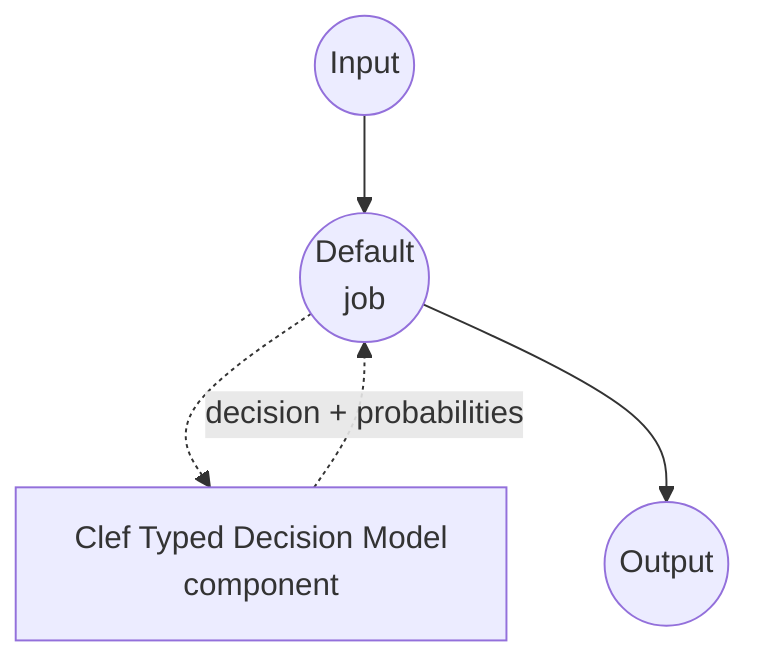

# Typed Decision Clef 模型任务示例

本示例演示如何使用 Cloudflare 的 Clef 模型与 model-compose 内置的 typed-decision 任务，实现一次性类型化决策。针对调用方提供的模式中的每个问题，返回被选中的值以及各候选项的概率，且不生成任何自由格式文本。

## 概述

此工作流提供本地结构化决策功能：

1. **类型安全输出**：每个问题是 `noul`（是/否）、`choice`（N 个命名选项之一）或 `score`（有序评分刻度）之一，响应保证是模式中的值
2. **逐问题概率**：为每个候选项返回模型的校准概率，可用于置信度阈值和期望值计算
3. **无自由文本生成**：Clef 的 joint schema head 将状态中的证据路由到每个问题，并在单次前向传播中对所有允许的选项评分；没有 JSON 生成、没有 chain-of-thought、不会幻觉出模式之外的选项
4. **请求时模式**：问题集、选项和指令在调用时提供，不烘焙在组件中
5. **本地模型执行**：CUDA（推荐）、MPS（Apple Silicon）和 CPU 上完全离线运行
6. **多模态能力**：Clef 可同时接受文本状态与图像、视频帧（本示例仅连接文本，任务表面保持以文本为主）

## 准备工作

### 先决条件

- 已安装 model-compose 并在 PATH 中可用
- 受支持的硬件路径之一：
  - **Linux 上的 NVIDIA GPU** — 推荐。27B BF16 权重可装入单块 48 GB 级 GPU（A6000、L40S、H100），或通过 `device_map="auto"` 分流到 CPU
  - **Apple Silicon (Darwin arm64)** — 可用于烟雾测试；在 27B BF16 规模下吞吐较慢
  - **CPU** — 支持但非常慢；用于模式验证与离线实验
- 足够磁盘空间用于 Clef 快照（BF16 约 55 GB）
- Python 3.10 或更新版本

### 为何选择 Clef

与提示通用聊天模型返回 JSON 相比，Clef 是基于 Qwen3.8-27B 构建的 27B 多模态决策模型，针对文本、图像与视频上的"从这些选项中选择"模式进行了微调：

**优势：**
- **类型安全输出**：joint schema head 仅对允许的选项 token 评分，原理上不可能产生模式之外的选项
- **无需解析**：响应已经是类型化字典 — 没有 JSON 语法强制或修复
- **单次前向传播**：状态编码一次，所有问题一起作答；对同一状态回答 N 个问题的成本接近一个
- **校准概率**：针对选项 logits 的逐问题 softmax 提供可用于下游阈值的概率
- **三种问题形态**：`noul`（是/否）、`choice`（命名选项）和 `score`（有序级别）覆盖大多数分类模式，无需提示工程
- **多模态表面**：底层模型也接受图像与视频帧（本示例不连接，以保持任务以文本为主）

**权衡：**
- **27B 权重**：BF16 推理需要约 55 GB VRAM 或 device-map 分片；这不是笔记本级模型
- **代码随仓库分发**：Clef 的 `joint_schema_model` 模块位于快照内（而非 PyPI）；驱动在导入前将快照加入 `sys.path`
- **单一检查点**：目前 Clef 只有一次发布，无尺寸变体可选

### 环境配置

1. 导航到本示例目录：
   ```bash
   cd examples/model-tasks/typed-decision-clef
   ```

2. 无需额外的环境配置 — Clef 检查点和依赖项自动管理。

## 运行方法

1. **启动服务：**
   ```bash
   model-compose up
   ```

2. **运行工作流：**

   **使用 API：**
   ```bash
   # 支持消息分流：是否紧急、归属团队、1-5 严重度评分
   curl -X POST http://localhost:8080/api/workflows/runs \
     -H "Content-Type: application/json" \
     -d '{
       "input": {
         "text": "The payment service is down for all customers.",
         "schema": {
           "urgent": {
             "type": "noul",
             "instructions": "Is this an urgent operational incident?",
             "criteria": {
               "true": "A production system is currently unavailable to real users.",
               "false": "Non-blocking issue, question, or feature request."
             }
           },
           "category": {
             "type": "choice",
             "instructions": "Which team owns this?",
             "criteria": {
               "payments": "Billing, checkout, or payment processing.",
               "infra": "Servers, deployment, or platform outages.",
               "product": "UX, feature behavior, or product feedback."
             }
           },
           "severity": {
             "type": "score",
             "instructions": "Rate business impact from 1 (trivial) to 5 (critical).",
             "criteria": [
               "trivial: cosmetic or single-user issue",
               "low: minor inconvenience for a few users",
               "medium: measurable revenue or productivity loss",
               "high: broad customer impact, some workaround exists",
               "critical: total outage with no workaround"
             ]
           }
         }
       }
     }'
   ```

   **使用 Web UI：**
   - 打开 Web UI：http://localhost:8081
   - 在 `text` 中填入待判断的状态
   - 在 `schema` 中填入逐问题的映射（JSON 对象）
   - 点击 "Run Workflow" 按钮

   **使用 CLI：**
   ```bash
   model-compose run --input '{
     "text": "The payment service is down for all customers.",
     "schema": {
       "urgent": {"type": "noul", "instructions": "Urgent incident?"},
       "category": {"type": "choice", "instructions": "Which team owns this?", "criteria": {"payments": "", "infra": "", "product": ""}},
       "severity": {"type": "score", "instructions": "Impact 1-5.", "criteria": ["trivial", "low", "medium", "high", "critical"]}
     }
   }'
   ```

## 组件详情

### Typed Decision 模型组件（默认）
- **类型**：带 typed-decision 任务的模型组件
- **目的**：本地一次性类型化决策，附带校准的候选概率
- **模型**：Cloudflare/clef（随权重附带 `joint_schema_model` 模块）
- **族**：clef
- **功能**：
  - 通过 `huggingface_hub` 自动下载快照
  - 将快照加入 `sys.path` 以加载仓库内的 `joint_schema_model` 模块
  - 转发到 `load_release_model` 的设备选择（`auto`、`cuda`、`mps`、`cpu`）
  - 针对 `noul`、`choice` 和 `score` 问题类型的逐选项概率

### 模型信息：Clef
- **开发者**：Cloudflare
- **基座**：Qwen3.8-27B 配以为类型化决策训练的 joint schema head
- **参数量**：27B（BF16）
- **流水线标签**：`image-text-to-text`
- **模态**：文本（JSON 状态）加上可选的图像与视频帧
- **能力**：`noul`（是/否）、`choice`（命名选项）、`score`（有序级别）
- **许可**：Apache-2.0

## 工作流详情

### "Typed Decision (Clef)" 工作流（默认）

**说明**：从状态与逐问题模式进行一次性类型化决策；返回每个问题被选中的值与各候选项的概率，不生成任何自由格式文本。

#### 作业流程

本示例使用没有显式作业的简化单组件配置。



#### 输入参数

| 参数 | 类型 | 必需 | 默认值 | 描述 |
|------|------|------|--------|------|
| `text` | text | 是 | - | 模型要判断的状态（非结构化文本）。放入 Clef 由状态与逐问题分支共享的上下文窗口内。 |
| `schema` | json | 是 | - | 问题 ID 到逐问题规格的映射：`{type: noul, instructions, criteria?: {true?, false?}}`、`{type: choice, instructions, criteria: {name: description, ...}}` 或 `{type: score, instructions, criteria: [level1, level2, ...]}`。 |

#### 输出格式

| 字段 | 类型 | 描述 |
|------|------|------|
| `decision` | json | 每个问题被选中的值。 |
| `fields` | json | 当 `return_probabilities` 开启时填充的逐问题详情（`fields[qid].scores`）。 |

示例响应体：

```json
{
  "decision": {"urgent": true, "category": "infra", "severity": "high"},
  "fields": {
    "urgent": {"scores": {"true": 0.94, "false": 0.06}},
    "category": {"scores": {"payments": 0.31, "infra": 0.58, "product": 0.11}},
    "severity": {"scores": {"trivial": 0.01, "low": 0.03, "medium": 0.09, "high": 0.63, "critical": 0.24}}
  }
}
```

`decision` 中的值：
- `noul` 问题解析为布尔（`p(true) >= 0.5`）
- `choice` 问题解析为获胜选项名（对 softmax 取 argmax）
- `score` 问题解析为获胜级别名（对 softmax 取 argmax）

## 系统要求

### 最低要求
- **RAM**：使用 CPU 回退或 `device_map="auto"` 卸载时需要 64 GB 以上系统内存
- **VRAM**：单 GPU 直接 BF16 需约 55 GB；较小 GPU 可通过 `device_map="auto"` 与主机卸载工作，但延迟增加
- **磁盘空间**：Clef 快照约 55 GB
- **CPU**：现代多核处理器（用于分词与任何被卸载的层）
- **互联网**：仅首次检查点下载时需要

### 性能说明
- 状态在单次请求中编码一次并被所有问题复用；延迟相对问题数呈次线性增长
- 单块 H100（BF16，无卸载）上，十几个字段的问题集通常在一秒内完成
- Apple Silicon 路径可用，但在该参数规模下并非目标部署平台
- 本驱动没有 Clef 的融合 CUDA 快速路径标志；速度取决于 GPU 与 `device` 设置

## 自定义

### 固定设备

驱动将 `device` 转发给 `joint_schema_model.load_release_model`。`auto` 会选择最佳可用加速器；需要特定设备时请覆盖：

```yaml
component:
  device: cuda                           # 单 GPU；CUDA 不可用时报错
  # device: mps                          # Apple Silicon
  # device: cpu                          # 模式调试 / 离线验证
```

### 多状态批处理

当需要对相同模式做多个独立决策时，向 `text` 传入列表；驱动内部按次批处理（Clef 每次前向传播处理一条 record）：

```yaml
component:
  action:
    text: ${input.texts}                 # 字符串列表
    schema: ${input.schema}
    batch_size: 1
```

保持 `batch_size: 1` 并将控制器并发也设为 1 — 27B 模型在单 GPU 上并发请求间无法高效共享显存。

### 返回原始 logits

需要未归一化的分数与概率一起返回（例如用于校准实验）时打开该标志：

```yaml
component:
  action:
    return_probabilities: true
    return_logits: true
```

## 故障排除

### 常见问题

1. **检查点下载缓慢**：首次运行拉取约 55 GB。后续运行复用 `~/.cache/huggingface` 下的 HuggingFace 缓存
2. **加载时内存不足**：27B BF16 需约 55 GB VRAM。可回退到 `device: cpu` 做模式验证，或用 `device: auto` 让 `load_release_model` 在 GPU/CPU 间分片
3. **`ModuleNotFoundError: joint_schema_model`**：驱动在首次使用时将快照路径注入 `sys.path`。请确认模型已下载完成。如果之前的下载被中断，清理 `~/.cache/huggingface/hub/models--Cloudflare--clef/` 后重试
4. **状态过长**：Clef 在状态与逐问题分支之间共享同一个上下文窗口。避免把状态塞得过满，长输入请拆成多次调用

### 性能优化

- **GPU 放置**：在足够大的单 GPU 上，固定 `device: cuda` 以避免 device-map 开销
- **请求并发**：保持 `max_concurrent_count: 1` — 27B 模型在单设备上是延迟与显存受限，而非吞吐受限
- **问题描述**：更清晰、更有区分度的选项描述能带来更自信的概率
- **问题独立性**：Clef 在共享前向传播中对每个问题独立评分。请在工作流中强制跨问题一致性，而不是依赖模型之间的一致
