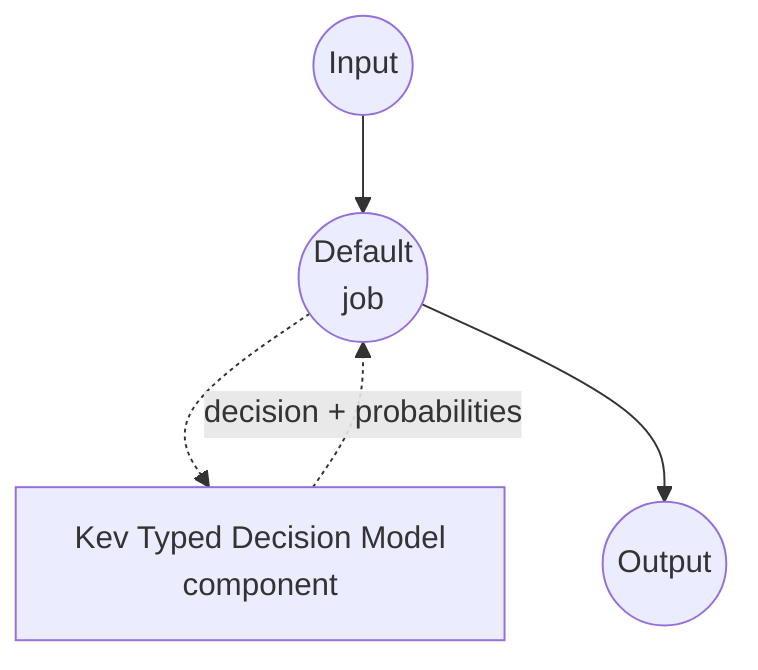

# Typed Decision Kev 모델 태스크 예제

이 예제는 Jared Palmer의 Kev-4B 모델을 model-compose의 내장 typed-decision 태스크와 함께 사용하여 원샷 타입드 결정을 수행하는 방법을 보여줍니다. 호출자가 제공한 스키마의 각 질문에 대해 선택된 값과 후보별 확률을 반환하며, 어떠한 자유 형식 텍스트도 생성하지 않습니다.

## 개요

이 워크플로우는 다음과 같은 로컬 구조화된 의사결정 기능을 제공합니다:

1. **타입 안전 출력**: 각 질문은 `noul`(예/아니오), `choice`(N개 명명된 옵션 중 하나), 또는 `score`(순서형 평점 스케일) 중 하나이며, 응답은 반드시 스키마의 값 중 하나임이 보장됩니다
2. **질문별 확률**: 모든 후보에 대한 모델의 보정된 확률을 반환하여 신뢰도 임계값과 기대값 계산에 활용 가능합니다
3. **자유 텍스트 생성 없음**: 포인터 스코어링 헤드가 답변 토큰의 은닉 상태를 직접 읽습니다. JSON 생성도, chain-of-thought도, 스키마 외 옵션의 환각도 없습니다
4. **요청 시점 스키마**: 질문 세트, 옵션, 지시문이 컴포넌트에 고정되지 않고 호출마다 공급됩니다
5. **로컬 모델 실행**: Apple Silicon에서는 MLX, CUDA에서는 Torch를 통해 완전히 오프라인으로 실행
6. **질문 격리**: 여러 질문이 입력 상태를 공유하지만 마스킹된 어텐션을 통해 서로의 내용을 읽을 수 없습니다

## 준비사항

### 필수 요구사항

- model-compose가 설치되어 PATH에서 사용 가능
- 지원되는 하드웨어 경로 중 하나:
  - **Apple Silicon (Darwin arm64)** with Metal — 하이브리드 Qwen3.5 베이스에 대해 MLX 고속 경로 사용
  - **Linux의 BF16 지원 NVIDIA GPU** — CUDA에서 SDPA 어텐션 사용
  - **CPU** — 지원되나 느림; 스모크 테스트용
- 베이스 모델과 Kev 체크포인트를 저장할 충분한 디스크 (베이스 모델 ID는 체크포인트의 `head.pt`에서 읽어옵니다. Kev-4B는 Qwen3.5-4B를 자동 다운로드)
- 선택한 Kev 사이즈(0.8B / 4B / 9B)에 맞는 RAM/VRAM

### Kev를 선택하는 이유

일반 챗 모델에 JSON을 반환하라고 프롬프팅하는 것과 비교해, Kev는 "이 옵션들 중에 골라라" 패턴에 특화되어 있습니다:

**장점:**
- **타입 안전 출력**: 포인터 헤드가 후보 답변 토큰만 스코어링하므로 스키마 밖 옵션이 원리적으로 나올 수 없습니다
- **파싱 불필요**: 응답이 이미 타입드 딕셔너리 — JSON 문법 강제나 복구가 없음
- **공유 인코딩**: 상태(컨텍스트)가 한 번 인코딩되어 모든 질문에 재사용됩니다. 같은 상태에 N개 질문을 답하는 비용이 한 개와 거의 같음
- **보정된 확률**: 후보 은닉 상태 스코어에 대한 softmax가 다운스트림 임계값에 쓸 수 있는 확률을 제공
- **세 가지 질문 형태**: `noul`(예/아니오), `choice`(명명 옵션), `score`(순서 레벨) — 프롬프트 엔지니어링 없이 대부분의 분류 패턴을 커버

**트레이드오프:**
- **텍스트 전용**: Kev는 텍스트 상태만 받습니다. 베이스 모델의 비전 헤드는 사용되지 않음
- **질문-국소 어텐션**: 질문들이 상태는 공유하지만 서로는 공유하지 않음. 두 질문이 반드시 일치해야 한다면 워크플로우에서 강제하세요
- **프롬프트 예산**: 상태와 질문별 브랜치가 각각 `max_state` / `max_branch` 토큰으로 제한
- **고정 모델 사이즈**: 0.8B / 4B / 9B 중 지연 시간과 VRAM 예산에 맞는 것을 선택

### 환경 설정

1. 예제 디렉토리로 이동:
   ```bash
   cd examples/model-tasks/typed-decision-kev
   ```

2. 별도 환경 설정 불필요 — Kev 체크포인트, 베이스 모델, 의존성이 자동으로 관리됩니다.

## 실행 방법

1. **서비스 시작:**
   ```bash
   model-compose up
   ```

2. **워크플로우 실행:**

   **API 사용:**
   ```bash
   # 지원 메시지 트리아지: 긴급 여부, 담당 팀, 1-5 심각도 평가
   curl -X POST http://localhost:8080/api/workflows/runs \
     -H "Content-Type: application/json" \
     -d '{
       "input": {
         "text": "The payment service is down for all customers.",
         "schema": {
           "urgent": {
             "type": "noul",
             "instructions": "Is this an urgent operational incident?",
             "criteria": {
               "true": "A production system is currently unavailable to real users.",
               "false": "Non-blocking issue, question, or feature request."
             }
           },
           "category": {
             "type": "choice",
             "instructions": "Which team owns this?",
             "criteria": {
               "payments": "Billing, checkout, or payment processing.",
               "infra": "Servers, deployment, or platform outages.",
               "product": "UX, feature behavior, or product feedback."
             }
           },
           "severity": {
             "type": "score",
             "instructions": "Rate business impact from 1 (trivial) to 5 (critical).",
             "criteria": [
               "trivial: cosmetic or single-user issue",
               "low: minor inconvenience for a few users",
               "medium: measurable revenue or productivity loss",
               "high: broad customer impact, some workaround exists",
               "critical: total outage with no workaround"
             ]
           }
         }
       }
     }'
   ```

   **웹 UI 사용:**
   - 웹 UI 열기: http://localhost:8081
   - `text`에 판단할 상태를 입력
   - `schema`에 질문별 맵(JSON 객체)을 입력
   - "Run Workflow" 버튼 클릭

   **CLI 사용:**
   ```bash
   model-compose run --input '{
     "text": "The payment service is down for all customers.",
     "schema": {
       "urgent": {"type": "noul"},
       "category": {"type": "choice", "criteria": {"payments": "", "infra": "", "product": ""}},
       "severity": {"type": "score", "criteria": ["trivial", "low", "medium", "high", "critical"]}
     }
   }'
   ```

## 컴포넌트 상세

### Typed Decision 모델 컴포넌트 (기본)
- **타입**: typed-decision 태스크를 가진 모델 컴포넌트
- **목적**: 로컬 원샷 타입드 결정과 보정된 후보 확률
- **모델**: jaredpalmer/kev-4b (LoRA 어댑터 + 포인터 헤드 번들)
- **베이스**: 체크포인트의 `head.pt` 메타데이터에서 자동 읽음 (`kev-4b`는 Qwen3.5-4B). 수동 `base_model` 재정의 불필요
- **패밀리**: kev
- **기능**:
  - 자동 체크포인트 및 베이스 다운로드
  - MLX(Apple Silicon, 하이브리드 Qwen3.5 베이스)와 Torch(CUDA / CPU) 간 백엔드 자동 선택
  - `noul`, `choice`, `score` 질문 타입별 후보 확률
  - 단일 요청 내 모든 질문에 대한 공유 상태 인코딩

### 모델 정보: Kev-4B
- **개발자**: Jared Palmer
- **패밀리 사이즈**: 0.8B, 4B, 9B (`model` 필드로 선택)
- **타입**: 프리즈된 Qwen3.5 베이스 위의 rank-16 LoRA 어댑터 + 포인터 스코어링 헤드
- **능력**: `noul`(예/아니오), `choice`(명명 옵션), `score`(순서 레벨) — 질문당 최대 255개 옵션
- **체크포인트**: `jaredpalmer/kev-4b`가 어댑터, 포인터 헤드, 베이스 모델과 revision을 명시하는 메타데이터를 번들

## 워크플로우 상세

### "Typed Decision (Kev-4B)" 워크플로우 (기본)

**설명**: 상태와 질문별 스키마로부터 원샷 타입드 결정을 수행. 질문별로 선택된 값과 후보별 확률을 반환하며, 어떤 자유 형식 텍스트도 생성하지 않습니다.

#### 작업 흐름

이 예제는 명시적 작업 없이 단일 컴포넌트로 구성된 간단한 형태를 사용합니다.



#### 입력 파라미터

| 파라미터 | 타입 | 필수 | 기본값 | 설명 |
|---------|------|------|--------|------|
| `text` | text | 예 | - | 모델이 판단할 상태(비정형 텍스트). 스키마와 합쳐 `max_state` + `max_branch` 토큰 이내여야 합니다. |
| `schema` | json | 예 | - | 질문 ID → 질문 스펙 맵: `{type: noul, criteria?: {true?, false?}}`, `{type: choice, criteria: {name: description, ...}}`, 또는 `{type: score, criteria: [level1, level2, ...]}`. 각 질문은 `instructions` 필드도 가질 수 있음. |

#### 출력 형식

| 필드 | 타입 | 설명 |
|------|------|------|
| `decision` | json | 질문별로 선택된 값. |
| `fields` | json | `return_probabilities`가 켜졌을 때 채워지는 질문별 상세 (`fields[qid].scores`). |

응답 본문 예시:

```json
{
  "decision": {"urgent": true, "category": "infra", "severity": 4.6},
  "fields": {
    "urgent": {"scores": {"true": 0.94, "false": 0.06}},
    "category": {"scores": {"payments": 0.31, "infra": 0.58, "product": 0.11}},
    "severity": {"scores": {"0": 0.01, "1": 0.03, "2": 0.09, "3": 0.24, "4": 0.63}}
  }
}
```

`decision` 값:
- `noul` 질문은 boolean으로 해석 (`p(true) >= 0.5`)
- `choice` 질문은 승리한 옵션 이름으로 해석
- `score` 질문은 기대 레벨(평점 스케일에 대한 float)로 해석

## 시스템 요구사항

### 최소 요구사항
- **RAM**: Kev-4B에 16 GB 이상, Kev-9B는 더 많이
- **VRAM**: Torch 백엔드 Kev-4B에 8 GB 이상. Apple Silicon에서는 통합 메모리 상당
- **디스크 공간**: 베이스 모델과 Kev 체크포인트에 충분히 (`kev-4b`는 Qwen3.5-4B를 가져옴. 몇 GB 예상)
- **CPU**: 최신 멀티코어 프로세서
- **인터넷**: 최초 체크포인트 및 베이스 다운로드에만 필요

### 성능 참고사항
- 상태는 단일 요청 내에서 한 번 인코딩되어 모든 질문에 재사용. 지연 시간은 질문 수에 대해 sub-linear 확장
- Apple Silicon에서는 하이브리드 Qwen3.5 베이스에 대해 MLX 커널이 자동 선택됨
- CUDA에서는 기본적으로 BF16으로 SDPA 어텐션 사용
- CPU에서도 모든 게 동작하지만 느림 — 스모크 테스트용

## 커스터마이징

### 모델 사이즈 선택

예제는 지연 시간과 정확도의 균형을 위해 Kev-4B를 사용합니다. Kev-0.8B(가장 빠름) 또는 Kev-9B(가장 정확)로 교체:

```yaml
component:
  model: jaredpalmer/kev-0.8b   # 또는 jaredpalmer/kev-9b
```

베이스 모델은 체크포인트 메타데이터에서 읽으므로 `base_model` 재정의는 필요 없습니다.

### 백엔드 강제

백엔드 선택은 기본적으로 `auto`입니다. 원하는 걸 알 때 강제:

```yaml
component:
  backend: torch   # 또는 'mlx' (Apple Silicon 전용)
```

### 다중 상태 배치

동일 스키마에 대해 여러 독립적 결정이 필요하면 `text`에 리스트를 넘기세요. 드라이버가 내부적으로 배치 처리합니다:

```yaml
component:
  action:
    text: ${input.texts}          # 문자열 리스트
    schema: ${input.schema}
    batch_size: 4
```

## 문제 해결

### 일반적인 이슈

1. **체크포인트 다운로드가 느림**: 첫 실행 시 Kev 체크포인트와 `head.pt`에 명시된 베이스 모델을 가져옵니다. 이후 실행은 HuggingFace 캐시를 재사용
2. **MLX 백엔드 사용 불가**: MLX는 Apple Silicon 전용이며 `mlx-lm`이 필요합니다. 다른 플랫폼에서는 드라이버가 Torch로 자동 폴백
3. **BF16 미지원**: Torch 백엔드는 GPU에서 기본 BF16. 이전 GPU에서는 LoadOptions로 precision을 재정의하거나 CPU를 사용
4. **상태가 너무 김**: 긴 상태는 `max_state` 토큰 이내여야 하며 질문별 브랜치는 `max_branch` 이내여야 합니다. 입력을 줄이거나 여러 호출로 분할하세요
5. **score 질문의 예상치 못한 값**: `score` 질문은 **기대 레벨**(float)을 반환합니다 — 하드 argmax가 아니라 레벨에 대한 softmax의 평균. 하드 argmax가 필요하면 `probabilities` 필드를 사용

### 성능 최적화

- **백엔드**: Apple Silicon에서는 MLX 유지, Linux에서는 BF16 지원 GPU 사용
- **배치**: 동일 스키마에 대해 많은 상태를 스코어링할 때 `batch_size` 증가
- **질문 설명**: 더 명확하고 구별되는 옵션 설명이 더 자신 있는 확률을 만듭니다
- **질문 독립성**: Kev는 마스킹된 어텐션 하에 각 질문을 독립적으로 스코어링. 모델 일치에 의존하지 말고 워크플로우에서 교차 질문 일관성을 강제하세요
