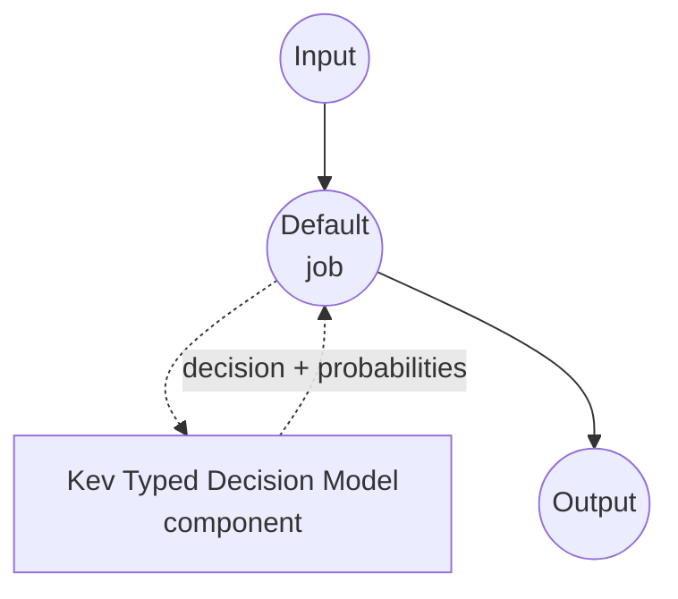

# Typed Decision Kev Model Task Example

This example demonstrates how to use Jared Palmer's Kev-4B model for one-shot typed decisions using model-compose's built-in typed-decision task, returning a chosen value plus per-candidate probabilities for each question in a caller-supplied schema — without generating any free-form text.

## Overview

This workflow provides local, structured decision-making that:

1. **Typed Outputs**: Each question is one of `noul` (yes/no), `choice` (one of N named options), or `score` (an ordered rating scale); the response is guaranteed to be a value from the schema
2. **Per-Question Probabilities**: Returns the model's calibrated probability for every candidate, useful for confidence thresholds and expected-value calculations
3. **No Free-Form Text**: A pointer scoring head reads answer-token hidden states directly; there is no JSON generation, no chain-of-thought, no hallucinated options
4. **Request-Time Schema**: The question set, options, and instructions are supplied per call, not baked into the component
5. **Local Model Execution**: Runs entirely offline via MLX on Apple Silicon or Torch on CUDA
6. **Question Isolation**: Multiple questions share the input state but cannot read each other's content through masked attention

## Preparation

### Prerequisites

- model-compose installed and available in your PATH
- One of the supported hardware paths:
  - **Apple Silicon (Darwin arm64)** with Metal — the MLX fast path scores hybrid Qwen3.5 bases in parallel
  - **BF16-capable NVIDIA GPU on Linux** — the Torch path uses SDPA on CUDA
  - **CPU** — supported but slow; intended for smoke tests
- Enough disk for the base model plus the Kev checkpoint (the base model id is read from the checkpoint's `head.pt`; Kev-4B pulls Qwen3.5-4B automatically)
- Enough RAM/VRAM for the chosen Kev size (0.8B / 4B / 9B)

### Why Kev for Typed Decisions

Compared to prompting a general chat model to return JSON, Kev is purpose-built for the "choose one of these" pattern:

**Benefits:**
- **Type-Safe Outputs**: The pointer head scores only the candidate answer tokens; producing an option outside the schema is impossible by construction
- **No Parsing**: The response is already a dict of typed values — no JSON grammar to enforce or repair
- **Shared Encoding**: The state (context) is encoded once and reused across every question, so answering N questions on the same state is close to the cost of one
- **Calibrated Probabilities**: Softmax over candidate hidden-state scores gives a per-answer probability suitable for downstream thresholds
- **Three Question Shapes**: `noul` (yes/no), `choice` (named options), and `score` (ordinal levels) cover most classification patterns without prompt engineering

**Trade-offs:**
- **Text Only**: Kev accepts text states only; the vision head of the base model is not used
- **Question-Local Attention**: Questions share the state but not each other; if two questions must agree, enforce that in your workflow
- **Prompt Budget**: The state and per-question branches are each capped by `max_state` / `max_branch` tokens
- **Model Sizes**: Fixed at 0.8B / 4B / 9B — pick one that fits your latency and VRAM budget

### Environment Configuration

1. Navigate to this example directory:
   ```bash
   cd examples/model-tasks/typed-decision-kev
   ```

2. No additional environment configuration required — the Kev checkpoint, base model, and dependencies are managed automatically.

## How to Run

1. **Start the service:**
   ```bash
   model-compose up
   ```

2. **Run the workflow:**

   **Using API:**
   ```bash
   # Triage a support message: is it urgent, which category, on a 1-5 severity scale
   curl -X POST http://localhost:8080/api/workflows/runs \
     -H "Content-Type: application/json" \
     -d '{
       "input": {
         "text": "The payment service is down for all customers.",
         "schema": {
           "urgent": {
             "type": "noul",
             "instructions": "Is this an urgent operational incident?",
             "criteria": {
               "true": "A production system is currently unavailable to real users.",
               "false": "Non-blocking issue, question, or feature request."
             }
           },
           "category": {
             "type": "choice",
             "instructions": "Which team owns this?",
             "criteria": {
               "payments": "Billing, checkout, or payment processing.",
               "infra": "Servers, deployment, or platform outages.",
               "product": "UX, feature behavior, or product feedback."
             }
           },
           "severity": {
             "type": "score",
             "instructions": "Rate business impact from 1 (trivial) to 5 (critical).",
             "criteria": [
               "trivial: cosmetic or single-user issue",
               "low: minor inconvenience for a few users",
               "medium: measurable revenue or productivity loss",
               "high: broad customer impact, some workaround exists",
               "critical: total outage with no workaround"
             ]
           }
         }
       }
     }'
   ```

   **Using Web UI:**
   - Open the Web UI: http://localhost:8081
   - Fill in `text` with the state to judge
   - Fill in `schema` with the per-question map (JSON object)
   - Click the "Run Workflow" button

   **Using CLI:**
   ```bash
   model-compose run --input '{
     "text": "The payment service is down for all customers.",
     "schema": {
       "urgent": {"type": "noul"},
       "category": {"type": "choice", "criteria": {"payments": "", "infra": "", "product": ""}},
       "severity": {"type": "score", "criteria": ["trivial", "low", "medium", "high", "critical"]}
     }
   }'
   ```

## Component Details

### Typed Decision Model Component (Default)
- **Type**: Model component with typed-decision task
- **Purpose**: Local one-shot typed decisions with calibrated candidate probabilities
- **Model**: jaredpalmer/kev-4b (LoRA adapter + pointer head bundle)
- **Base**: Read from the checkpoint's `head.pt` metadata (Qwen3.5-4B for `kev-4b`); no manual `base_model` override needed
- **Family**: kev
- **Features**:
  - Automatic checkpoint and base download
  - Backend auto-selection between MLX (Apple Silicon, hybrid Qwen3.5 bases) and Torch (CUDA / CPU)
  - Per-question candidate probabilities for `noul`, `choice`, and `score` question types
  - Shared state encoding across all questions in a single request

### Model Information: Kev-4B
- **Developer**: Jared Palmer
- **Family Sizes**: 0.8B, 4B, 9B (pick via the `model` field)
- **Type**: Rank-16 LoRA adapter + pointer scoring head on a frozen Qwen3.5 base
- **Capabilities**: `noul` (yes/no), `choice` (named options), `score` (ordinal levels) — up to 255 options per question
- **Checkpoint**: `jaredpalmer/kev-4b` bundles the adapter, the pointer head, and metadata that names the base model and revision

## Workflow Details

### "Typed Decision (Kev-4B)" Workflow (Default)

**Description**: One-shot typed decisions from a state and a per-question schema; returns the chosen value plus per-candidate probabilities per question, without generating any free-form text.

#### Job Flow

This example uses a simplified single-component configuration without explicit jobs.



#### Input Parameters

| Parameter | Type | Required | Default | Description |
|-----------|------|----------|---------|-------------|
| `text` | text | Yes | - | The state (unstructured text) the model judges. Combined with the schema, must fit within `max_state` + `max_branch` tokens. |
| `schema` | json | Yes | - | Map of question id to a per-question spec: `{type: noul, criteria?: {true?, false?}}`, `{type: choice, criteria: {name: description, ...}}`, or `{type: score, criteria: [level1, level2, ...]}`. Each question may also carry an `instructions` field. |

#### Output Format

| Field | Type | Description |
|-------|------|-------------|
| `decision` | json | Chosen value per question. |
| `fields` | json | Per-question detail, populated when `return_probabilities` is on (`fields[qid].scores`). |

Example response body:

```json
{
  "decision": {"urgent": true, "category": "infra", "severity": 4.6},
  "fields": {
    "urgent": {"scores": {"true": 0.94, "false": 0.06}},
    "category": {"scores": {"payments": 0.31, "infra": 0.58, "product": 0.11}},
    "severity": {"scores": {"0": 0.01, "1": 0.03, "2": 0.09, "3": 0.24, "4": 0.63}}
  }
}
```

Values in `decision`:
- `noul` questions resolve to a boolean (`p(true) >= 0.5`)
- `choice` questions resolve to the winning option name
- `score` questions resolve to the expected level (a float across the rating scale)

## System Requirements

### Minimum Requirements
- **RAM**: 16 GB+ for Kev-4B; more for Kev-9B
- **VRAM**: 8 GB+ for the Torch backend on Kev-4B; unified memory equivalents on Apple Silicon
- **Disk Space**: enough for the base model plus the Kev checkpoint (`kev-4b` pulls Qwen3.5-4B; expect several GB total)
- **CPU**: Modern multi-core processor
- **Internet**: Required for initial checkpoint and base download only

### Performance Notes
- The state is encoded once and reused across all questions in a single request; latency scales sub-linearly with question count
- On Apple Silicon, MLX kernels are auto-selected for hybrid Qwen3.5 bases
- On CUDA, SDPA attention is used with BF16 by default
- On CPU everything still works but is slow — intended for smoke tests

## Customization

### Choosing a Model Size

The example ships with Kev-4B for a balance of latency and accuracy. Swap for Kev-0.8B (fastest) or Kev-9B (most accurate):

```yaml
component:
  model: jaredpalmer/kev-0.8b   # or jaredpalmer/kev-9b
```

The base model is read from the checkpoint metadata; no `base_model` override is required.

### Forcing a Backend

Backend selection is `auto` by default. Force a specific backend when you know what you want:

```yaml
component:
  backend: torch   # or 'mlx' (Apple Silicon only)
```

### Batching Multiple States

Pass a list to `text` when you have many independent decisions against the same schema; the driver batches them internally:

```yaml
component:
  action:
    text: ${input.texts}          # list of strings
    schema: ${input.schema}
    batch_size: 4
```

## Troubleshooting

### Common Issues

1. **Checkpoint Download Slow**: The first run pulls the Kev checkpoint plus the base model referenced in `head.pt`. Subsequent runs reuse the HuggingFace cache.
2. **MLX Backend Unavailable**: MLX is Apple Silicon only and requires `mlx-lm`. On other platforms the driver falls back to Torch automatically.
3. **BF16 Not Supported**: The Torch backend defaults to BF16 on GPU. On older GPUs, override precision via LoadOptions or use CPU.
4. **State Too Long**: Long states must fit within `max_state` tokens; per-question branches within `max_branch`. Trim the input or split into multiple calls.
5. **Score Question Unexpected Value**: `score` questions return an **expected level** (float) — the model's rating averaged over the softmax across levels, not a hard argmax. If you need the hard argmax use the `probabilities` field.

### Performance Optimization

- **Backend**: On Apple Silicon, keep MLX; on Linux, use a BF16-capable GPU
- **Batching**: Increase `batch_size` when scoring many states against the same schema
- **Question Descriptions**: Sharper, more distinct option descriptions produce more confident probabilities
- **Question Independence**: Kev scores each question independently under masked attention; enforce cross-question consistency in your workflow, not by trusting model agreement
