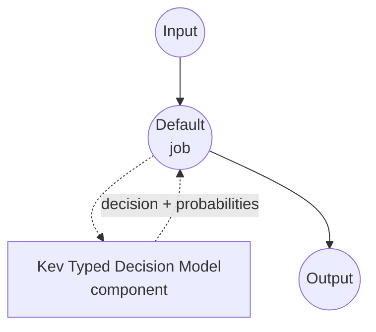

# Typed Decision Kev 模型任务示例

本示例演示如何使用 Jared Palmer 的 Kev-4B 模型与 model-compose 内置的 typed-decision 任务，实现一次性类型化决策。针对调用方提供的模式中的每个问题，返回被选中的值以及各候选项的概率，且不生成任何自由格式文本。

## 概述

此工作流提供本地结构化决策功能：

1. **类型安全输出**：每个问题是 `noul`（是/否）、`choice`（N 个命名选项之一）或 `score`（有序评分刻度）之一，响应保证是模式中的值
2. **逐问题概率**：为每个候选项返回模型的校准概率，可用于置信度阈值和期望值计算
3. **无自由文本生成**：指针评分头直接读取答案 token 的隐藏状态，没有 JSON 生成、没有 chain-of-thought、不会幻觉出模式之外的选项
4. **请求时模式**：问题集、选项和指令在调用时提供，不烘焙在组件中
5. **本地模型执行**：Apple Silicon 上通过 MLX，CUDA 上通过 Torch，完全离线运行
6. **问题隔离**：多个问题共享输入状态，但通过掩码注意力彼此看不到内容

## 准备工作

### 先决条件

- 已安装 model-compose 并在 PATH 中可用
- 受支持的硬件路径之一：
  - **带 Metal 的 Apple Silicon (Darwin arm64)** — 对混合 Qwen3.5 基础模型使用 MLX 快速路径
  - **Linux 上的 BF16 支持 NVIDIA GPU** — 在 CUDA 上使用 SDPA 注意力
  - **CPU** — 支持但慢；仅用于烟雾测试
- 足够的磁盘空间用于基础模型和 Kev 检查点（基础模型 ID 从检查点的 `head.pt` 读取；Kev-4B 自动拉取 Qwen3.5-4B）
- 足够的 RAM/VRAM 容纳所选 Kev 规格（0.8B / 4B / 9B）

### 为何选择 Kev

与提示通用聊天模型返回 JSON 相比，Kev 是专门为"从这些选项中选择"模式设计的：

**优势：**
- **类型安全输出**：指针头仅对候选答案 token 评分，原理上不可能产生模式之外的选项
- **无需解析**：响应已经是类型化字典 — 没有 JSON 语法强制或修复
- **共享编码**：状态（上下文）编码一次并在所有问题中重用；对同一状态回答 N 个问题的成本接近一个
- **校准概率**：候选隐藏状态分数的 softmax 提供可用于下游阈值的概率
- **三种问题形态**：`noul`（是/否）、`choice`（命名选项）和 `score`（有序级别）覆盖大多数分类模式，无需提示工程

**权衡：**
- **仅文本**：Kev 仅接受文本状态；未使用基础模型的视觉头
- **问题局部注意力**：问题共享状态但彼此不共享；如果两个问题必须一致，请在工作流中强制
- **提示预算**：状态和每个问题的分支分别由 `max_state_length` / `max_branch_length` token 上限
- **固定模型规格**：0.8B / 4B / 9B — 选择一个适合你延迟和 VRAM 预算的

### 环境配置

1. 导航到本示例目录：
   ```bash
   cd examples/model-tasks/typed-decision-kev
   ```

2. 无需额外的环境配置 — Kev 检查点、基础模型和依赖项自动管理。

## 运行方法

1. **启动服务：**
   ```bash
   model-compose up
   ```

2. **运行工作流：**

   **使用 API：**
   ```bash
   # 分类支持消息：是否紧急、哪个团队负责、1-5 严重程度评分
   curl -X POST http://localhost:8080/api/workflows/runs \
     -H "Content-Type: application/json" \
     -d '{
       "input": {
         "text": "The payment service is down for all customers.",
         "schema": {
           "urgent": {
             "type": "noul",
             "instructions": "Is this an urgent operational incident?",
             "criteria": {
               "true": "A production system is currently unavailable to real users.",
               "false": "Non-blocking issue, question, or feature request."
             }
           },
           "category": {
             "type": "choice",
             "instructions": "Which team owns this?",
             "criteria": {
               "payments": "Billing, checkout, or payment processing.",
               "infra": "Servers, deployment, or platform outages.",
               "product": "UX, feature behavior, or product feedback."
             }
           },
           "severity": {
             "type": "score",
             "instructions": "Rate business impact from 1 (trivial) to 5 (critical).",
             "criteria": [
               "trivial: cosmetic or single-user issue",
               "low: minor inconvenience for a few users",
               "medium: measurable revenue or productivity loss",
               "high: broad customer impact, some workaround exists",
               "critical: total outage with no workaround"
             ]
           }
         }
       }
     }'
   ```

   **使用 Web UI：**
   - 打开 Web UI：http://localhost:8081
   - 在 `text` 中填写要判断的状态
   - 在 `schema` 中填写逐问题映射（JSON 对象）
   - 点击 "Run Workflow" 按钮

   **使用 CLI：**
   ```bash
   model-compose run --input '{
     "text": "The payment service is down for all customers.",
     "schema": {
       "urgent": {"type": "noul"},
       "category": {"type": "choice", "criteria": {"payments": "", "infra": "", "product": ""}},
       "severity": {"type": "score", "criteria": ["trivial", "low", "medium", "high", "critical"]}
     }
   }'
   ```

## 组件详情

### Typed Decision 模型组件（默认）
- **类型**：带 typed-decision 任务的模型组件
- **目的**：本地一次性类型化决策与校准的候选概率
- **模型**：jaredpalmer/kev-4b（LoRA 适配器 + 指针头捆绑）
- **基础**：从检查点的 `head.pt` 元数据读取（`kev-4b` 为 Qwen3.5-4B）；无需手动 `base_model` 覆盖
- **家族**：kev
- **功能**：
  - 自动检查点和基础模型下载
  - 在 MLX（Apple Silicon，混合 Qwen3.5 基础）和 Torch（CUDA / CPU）之间自动选择后端
  - `noul`、`choice` 和 `score` 问题类型的逐问题候选概率
  - 单个请求内所有问题的共享状态编码

### 模型信息：Kev-4B
- **开发者**：Jared Palmer
- **家族规格**：0.8B、4B、9B（通过 `model` 字段选择）
- **类型**：冻结 Qwen3.5 基础上的 rank-16 LoRA 适配器 + 指针评分头
- **能力**：`noul`（是/否）、`choice`（命名选项）、`score`（有序级别）— 每个问题最多 255 个选项
- **检查点**：`jaredpalmer/kev-4b` 捆绑适配器、指针头以及命名基础模型和 revision 的元数据

## 工作流详情

### "Typed Decision (Kev-4B)" 工作流（默认）

**描述**：从状态和逐问题模式进行一次性类型化决策；返回每个问题的选中值和候选概率，不生成任何自由格式文本。

#### 作业流程

本示例使用无显式作业的简化单组件配置。



#### 输入参数

| 参数 | 类型 | 必需 | 默认值 | 描述 |
|------|------|------|--------|------|
| `text` | text | 是 | - | 模型判断的状态（非结构化文本）。与模式合计必须适合 `max_state_length` + `max_branch_length` token。 |
| `schema` | json | 是 | - | 问题 ID → 逐问题规范映射：`{type: noul, criteria?: {true?, false?}}`、`{type: choice, criteria: {name: description, ...}}` 或 `{type: score, criteria: [level1, level2, ...]}`。每个问题也可携带 `instructions` 字段。 |

#### 输出格式

| 字段 | 类型 | 描述 |
|------|------|------|
| `decision` | json | 每个问题的选中值。 |
| `fields` | json | `return_probabilities` 开启时填充的逐问题详情（`fields[qid].scores`）。 |

响应正文示例：

```json
{
  "decision": {"urgent": true, "category": "infra", "severity": 4.6},
  "fields": {
    "urgent": {"scores": {"true": 0.94, "false": 0.06}},
    "category": {"scores": {"payments": 0.31, "infra": 0.58, "product": 0.11}},
    "severity": {"scores": {"0": 0.01, "1": 0.03, "2": 0.09, "3": 0.24, "4": 0.63}}
  }
}
```

`decision` 的值：
- `noul` 问题解析为布尔值（`p(true) >= 0.5`）
- `choice` 问题解析为获胜选项名称
- `score` 问题解析为期望级别（评分刻度上的浮点数）

## 系统要求

### 最低要求
- **RAM**：Kev-4B 需 16 GB 以上；Kev-9B 更多
- **VRAM**：Torch 后端 Kev-4B 需 8 GB 以上；Apple Silicon 上等价的统一内存
- **磁盘空间**：足够容纳基础模型加 Kev 检查点（`kev-4b` 拉取 Qwen3.5-4B；预计几 GB 总量）
- **CPU**：现代多核处理器
- **互联网**：仅初次检查点和基础下载需要

### 性能说明
- 状态在单个请求内编码一次并在所有问题中重用；延迟随问题数量次线性增长
- 在 Apple Silicon 上，对混合 Qwen3.5 基础自动选择 MLX 内核
- 在 CUDA 上，默认使用 BF16 的 SDPA 注意力
- 在 CPU 上一切仍能工作但很慢 — 仅用于烟雾测试

## 定制化

### 选择模型规格

示例默认使用 Kev-4B 以平衡延迟和准确度。可交换为 Kev-0.8B（最快）或 Kev-9B（最准确）：

```yaml
component:
  model: jaredpalmer/kev-0.8b   # 或 jaredpalmer/kev-9b
```

基础模型从检查点元数据读取；不需要 `base_model` 覆盖。

### 强制后端

后端选择默认为 `auto`。当你知道想要什么时强制：

```yaml
component:
  backend: torch   # 或 'mlx'（仅 Apple Silicon）
```

### 批处理多个状态

当你对同一模式有许多独立决策时，将列表传给 `text`；驱动会内部批处理：

```yaml
component:
  action:
    text: ${input.texts}          # 字符串列表
    schema: ${input.schema}
    batch_size: 4
```

## 故障排除

### 常见问题

1. **检查点下载慢**：首次运行拉取 Kev 检查点加 `head.pt` 中引用的基础模型。后续运行重用 HuggingFace 缓存。
2. **MLX 后端不可用**：MLX 仅限 Apple Silicon 且需要 `mlx-lm`。在其他平台上，驱动自动回退到 Torch。
3. **BF16 不支持**：Torch 后端在 GPU 上默认 BF16。在较旧的 GPU 上，通过 LoadOptions 覆盖 precision 或使用 CPU。
4. **状态过长**：长状态必须在 `max_state_length` token 内；每个问题的分支在 `max_branch_length` 内。修剪输入或拆分为多次调用。
5. **score 问题意外值**：`score` 问题返回**期望级别**（浮点数）— 是模型评分在级别间 softmax 的平均，而不是硬 argmax。如果需要硬 argmax，请使用 `probabilities` 字段。

### 性能优化

- **后端**：在 Apple Silicon 上保持 MLX；在 Linux 上使用 BF16 支持的 GPU
- **批处理**：对同一模式评分多个状态时增加 `batch_size`
- **问题描述**：更清晰、更有区别的选项描述会产生更自信的概率
- **问题独立性**：Kev 在掩码注意力下独立评分每个问题；在工作流中强制跨问题一致性，而不是信任模型一致
