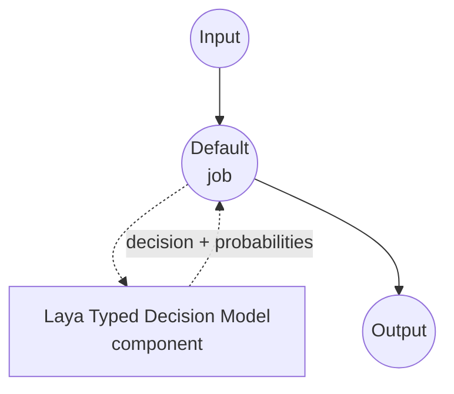

# Typed Decision Laya 모델 태스크 예제

이 예제는 Convai Innovations의 Laya 모델을 model-compose의 내장 typed-decision 태스크와 함께 사용하여 원샷 타입드 결정을 수행하는 방법을 보여줍니다. 호출자가 제공한 스키마의 각 질문에 대해 선택된 값과 후보별 확률을 반환하며, 어떠한 자유 형식 텍스트도 생성하지 않습니다.

## 개요

이 워크플로우는 다음과 같은 로컬 구조화된 의사결정 기능을 제공합니다:

1. **타입 안전 출력**: 각 질문은 `noul`(예/아니오), `choice`(N개 명명된 옵션 중 하나), 또는 `score`(순서형 평점 스케일) 중 하나이며, 응답은 반드시 스키마의 값 중 하나임이 보장됩니다
2. **질문별 확률**: 모든 후보에 대한 모델의 보정된 확률을 반환하여 신뢰도 임계값과 기대값 계산에 활용 가능합니다
3. **자유 텍스트 생성 없음**: 비자기회귀 디시전 헤드가 단일 forward pass에서 후보를 직접 스코어링합니다. JSON 생성도, chain-of-thought도, 스키마 외 옵션의 환각도 없습니다
4. **요청 시점 스키마**: 질문 세트, 옵션, 지시문이 컴포넌트에 고정되지 않고 호출마다 공급됩니다
5. **로컬 모델 실행**: CUDA, MPS(Apple Silicon), CPU에서 완전히 오프라인으로 실행
6. **다국어 지원**: 영어 체크포인트와 100+ 언어를 커버하는 다국어 체크포인트, 그리고 typed-decisions 워크플로우에 파인튜닝된 체크포인트를 함께 제공

## 준비사항

### 필수 요구사항

- model-compose가 설치되어 PATH에서 사용 가능
- 지원되는 하드웨어 경로 중 하나:
  - **Linux의 NVIDIA GPU** — 가장 빠른 경로. `fast: true`로 TileLang 융합 커널 활성화 가능
  - **Apple Silicon (Darwin arm64)** with Metal — MPS autocast가 자동 적용됨
  - **CPU** — 지원되며 이 모델 사이즈(~322–421M 파라미터)에서는 합리적인 속도. 스모크 테스트 및 저처리량 서비스용
- 요청한 Laya 체크포인트를 저장할 디스크 공간 (preset당 ~1 GB. 번들 리포는 필요한 것만 다운로드)
- Python 3.10 이상

### Laya를 선택하는 이유

일반 챗 모델에 JSON을 반환하라고 프롬프팅하는 것과 비교해, Laya는 "이 옵션들 중에 골라라" 패턴에 특화되어 있으며 수십 개 언어를 동시에 처리합니다:

**장점:**
- **타입 안전 출력**: 디시전 헤드가 후보 답변 토큰만 스코어링하므로 스키마 밖 옵션이 원리적으로 나올 수 없습니다
- **파싱 불필요**: 응답이 이미 타입드 딕셔너리 — JSON 문법 강제나 복구가 없음
- **단일 forward pass**: 상태가 한 번 인코딩되고 모든 질문이 함께 하나의 pass에서 답변됩니다. 같은 상태에 N개 질문을 답하는 비용이 한 개와 거의 같음
- **보정된 확률**: 후보 은닉 상태 스코어에 대한 softmax가 다운스트림 임계값에 쓸 수 있는 확률을 제공
- **세 가지 질문 형태**: `noul`(예/아니오), `choice`(명명 옵션), `score`(순서 레벨) — 프롬프트 엔지니어링 없이 대부분의 분류 패턴을 커버
- **다국어**: `multilingual` 체크포인트가 영어 체크포인트와 동일한 결정 표면에서 100+ 언어를 처리

**트레이드오프:**
- **텍스트 전용**: Laya는 텍스트 상태만 받습니다. 비전이나 오디오 헤드는 없음
- **제한된 컨텍스트**: 영어 체크포인트는 최대 512 토큰. `multilingual`은 최대 1024, `max_seq_length`으로 8192까지 확장 가능
- **한 번에 하나의 체크포인트**: 이 드라이버는 단일 체크포인트를 로드합니다. 요청마다 영어와 다국어를 전환하려면 컴포넌트를 두 개 실행하거나 model-compose 밖에서 Laya `Router`를 사용

### 환경 설정

1. 예제 디렉토리로 이동:
   ```bash
   cd examples/model-tasks/typed-decision-laya
   ```

2. 별도 환경 설정 불필요 — Laya 체크포인트와 의존성이 자동으로 관리됩니다.

## 실행 방법

1. **서비스 시작:**
   ```bash
   model-compose up
   ```

2. **워크플로우 실행:**

   **API 사용:**
   ```bash
   # 지원 메시지 트리아지: 긴급 여부, 담당 팀, 1-5 심각도 평가
   curl -X POST http://localhost:8080/api/workflows/runs \
     -H "Content-Type: application/json" \
     -d '{
       "input": {
         "text": "The payment service is down for all customers.",
         "schema": {
           "urgent": {
             "type": "noul",
             "instructions": "Is this an urgent operational incident?",
             "criteria": {
               "true": "A production system is currently unavailable to real users.",
               "false": "Non-blocking issue, question, or feature request."
             }
           },
           "category": {
             "type": "choice",
             "instructions": "Which team owns this?",
             "criteria": {
               "payments": "Billing, checkout, or payment processing.",
               "infra": "Servers, deployment, or platform outages.",
               "product": "UX, feature behavior, or product feedback."
             }
           },
           "severity": {
             "type": "score",
             "instructions": "Rate business impact from 1 (trivial) to 5 (critical).",
             "criteria": [
               "trivial: cosmetic or single-user issue",
               "low: minor inconvenience for a few users",
               "medium: measurable revenue or productivity loss",
               "high: broad customer impact, some workaround exists",
               "critical: total outage with no workaround"
             ]
           }
         }
       }
     }'
   ```

   **웹 UI 사용:**
   - 웹 UI 열기: http://localhost:8081
   - `text`에 판단할 상태를 입력
   - `schema`에 질문별 맵(JSON 객체)을 입력
   - "Run Workflow" 버튼 클릭

   **CLI 사용:**
   ```bash
   model-compose run --input '{
     "text": "The payment service is down for all customers.",
     "schema": {
       "urgent": {"type": "noul", "instructions": "Urgent incident?"},
       "category": {"type": "choice", "instructions": "Which team owns this?", "criteria": {"payments": "", "infra": "", "product": ""}},
       "severity": {"type": "score", "instructions": "Impact 1-5.", "criteria": ["trivial", "low", "medium", "high", "critical"]}
     }
   }'
   ```

## 컴포넌트 상세

### Typed Decision 모델 컴포넌트 (기본)
- **타입**: typed-decision 태스크를 가진 모델 컴포넌트
- **목적**: 로컬 원샷 타입드 결정과 보정된 후보 확률
- **모델**: convaiinnovations/laya (번들 리포. 영어, 다국어, typed-decisions 체크포인트를 `preset`으로 선택)
- **패밀리**: laya
- **기능**:
  - 요청한 preset으로 필터된 자동 체크포인트 다운로드
  - 자동 디바이스 선택(CUDA → MPS → CPU)과 디바이스가 지원할 때의 autocast
  - `noul`, `choice`, `score` 질문 타입별 후보 확률
  - 단일 요청 내 모든 질문에 대한 공유 상태 인코딩

### 모델 정보: Laya
- **개발자**: Convai Innovations
- **체크포인트** (`preset`으로 선택):
  - `preset: english` — ModernBERT-large, 421M 파라미터, 512 토큰 컨텍스트, 영어
  - `preset: multilingual` (기본값) — mmBERT-base, 322M 파라미터, 1024 토큰 컨텍스트(`max_seq_length`으로 최대 8192), 100+ 언어
  - `preset: typed-decisions` — ModernBERT-large, 421M 파라미터, 1024 토큰 컨텍스트, 4개의 typed-decisions 워크플로우에 파인튜닝
- **타입**: RLCD로 학습된 디시전 헤드를 가진 비자기회귀 인코더
- **능력**: `noul`(예/아니오), `choice`(명명 옵션), `score`(순서 레벨)

## 워크플로우 상세

### "Typed Decision (Laya)" 워크플로우 (기본)

**설명**: 상태와 질문별 스키마로부터 원샷 타입드 결정을 수행. 질문별로 선택된 값과 후보별 확률을 반환하며, 어떤 자유 형식 텍스트도 생성하지 않습니다.

#### 작업 흐름

이 예제는 명시적 작업 없이 단일 컴포넌트로 구성된 간단한 형태를 사용합니다.



#### 입력 파라미터

| 파라미터 | 타입 | 필수 | 기본값 | 설명 |
|---------|------|------|--------|------|
| `text` | text | 예 | - | 모델이 판단할 상태(비정형 텍스트). 체크포인트의 토큰 예산 이내여야 함(영어 512, 다국어 1024, `max_seq_length`으로 최대 8192). |
| `schema` | json | 예 | - | 질문 ID → 질문 스펙 맵: `{type: noul, instructions, criteria?: {true?, false?}}`, `{type: choice, instructions, criteria: {name: description, ...}}`, 또는 `{type: score, instructions, criteria: [level1, level2, ...]}`. |

#### 출력 형식

| 필드 | 타입 | 설명 |
|------|------|------|
| `decision` | json | 질문별로 선택된 값. |
| `fields` | json | `return_probabilities`가 켜졌을 때 채워지는 질문별 상세 (`fields[qid].scores`). |

응답 본문 예시:

```json
{
  "decision": {"urgent": true, "category": "infra", "severity": 4.6},
  "fields": {
    "urgent": {"scores": {"true": 0.94, "false": 0.06}},
    "category": {"scores": {"payments": 0.31, "infra": 0.58, "product": 0.11}},
    "severity": {"scores": {"0": 0.01, "1": 0.03, "2": 0.09, "3": 0.24, "4": 0.63}}
  }
}
```

`decision` 값:
- `noul` 질문은 boolean으로 해석 (`p(true) >= 0.5`)
- `choice` 질문은 승리한 옵션 이름으로 해석
- `score` 질문은 기대 레벨(평점 스케일에 대한 float)로 해석

## 시스템 요구사항

### 최소 요구사항
- **RAM**: 다국어 체크포인트에 4 GB 이상, 영어/typed-decisions 체크포인트에 8 GB 이상
- **VRAM**: CUDA를 사용할 경우 2 GB 이상. 체크포인트가 최신 GPU에 여유롭게 적재됨
- **디스크 공간**: preset당 ~1 GB
- **CPU**: 최신 멀티코어 프로세서
- **인터넷**: 최초 체크포인트 다운로드에만 필요

### 성능 참고사항
- 상태는 단일 요청 내에서 한 번 인코딩되어 모든 질문에 재사용. 지연 시간은 질문 수에 대해 sub-linear 확장
- T4 GPU에서 단일 질문 호출은 약 33 ms. 배치 호출은 질문당 평균 약 7 ms
- Apple Silicon에서는 배치가 MPS autocast의 오버헤드를 넘길 만큼 커지면 자동 적용됨
- `fast: true` 플래그는 TileLang 융합 CUDA 커널로 전환해 이산 GPU에서 추가 속도 향상. `laya[fast]`가 필요하며, Linux+x86_64에서 플래그가 켜지면 드라이버가 자동 설치

## 커스터마이징

### 체크포인트 선택

예제는 `preset: multilingual`을 사용합니다. preset을 바꿔 라우팅 표면 전환:

```yaml
component:
  preset: english                      # 영어 전용 512 토큰 체크포인트
  # preset: typed-decisions            # 4개의 typed-decisions 워크플로우에 파인튜닝
```

혹은 `model`을 오버라이드해 스탠드얼론 리포지토리를 직접 지정 — preset은 서브폴더 이름으로 계속 사용되므로 번들 구조와 동일한 layout이라면 `preset: multilingual`도 그대로 동작:

```yaml
component:
  model: convaiinnovations/laya-multilingual
```

### 컨텍스트 예산 확장

`multilingual` preset은 상태당 최대 8192 토큰을 지원합니다. 긴 문서를 보낼 때 `max_seq_length`을 높이세요:

```yaml
component:
  preset: multilingual
  max_seq_length: 8192
```

약 4,000 토큰까지는 정확도가 높고 그 이상은 편차가 있으므로 자체 데이터로 긴 문서 정확도를 확인하세요.

### CUDA 고속 경로 활성화

지원되는 NVIDIA GPU가 있는 Linux+x86_64 호스트에서 TileLang 융합 커널 활성화:

```yaml
component:
  fast: true
```

이 플래그가 Linux+x86_64에서 켜지면 드라이버가 `tilelang`을 자동 설치합니다.

### 다중 상태 배치

동일 스키마에 대해 여러 독립적 결정이 필요하면 `text`에 리스트를 넘기세요. 드라이버가 내부적으로 배치 처리합니다:

```yaml
component:
  action:
    text: ${input.texts}               # 문자열 리스트
    schema: ${input.schema}
    batch_size: 4
```

## 문제 해결

### 일반적인 이슈

1. **체크포인트 다운로드가 느림**: 첫 실행 시 요청한 preset을 가져옵니다. 이후 실행은 HuggingFace 캐시를 재사용
2. **CUDA 고속 경로 사용 불가**: `fast: true`는 Linux+x86_64에서 지원되는 CUDA 툴체인이 있어야 빌드되는 `tilelang`이 필요합니다. 다른 플랫폼에서는 드라이버가 `fast: false`로 유지
3. **긴 입력이 잘림**: `multilingual` 체크포인트는 1024 토큰 기본값을 사용합니다. 긴 문서에는 `max_seq_length: 8192`를 설정하세요
4. **상태가 너무 김**: `max_seq_length`을 올려도 입력이 넘치면, 입력을 여러 호출로 분할하세요
5. **score 질문의 예상치 못한 값**: `score` 질문은 **기대 레벨**(float)을 반환합니다 — 하드 argmax가 아니라 레벨에 대한 softmax의 평균. 하드 argmax가 필요하면 `probabilities` 필드를 사용

### 성능 최적화

- **고속 경로**: 지원되는 NVIDIA GPU가 있는 Linux+x86_64에서는 `fast: true` 설정
- **배치**: 동일 스키마에 대해 많은 상태를 스코어링할 때 `batch_size` 증가
- **질문 설명**: 더 명확하고 구별되는 옵션 설명이 더 자신 있는 확률을 만듭니다
- **질문 독립성**: Laya는 공유 forward pass에서 각 질문을 독립적으로 스코어링. 모델 일치에 의존하지 말고 워크플로우에서 교차 질문 일관성을 강제하세요
