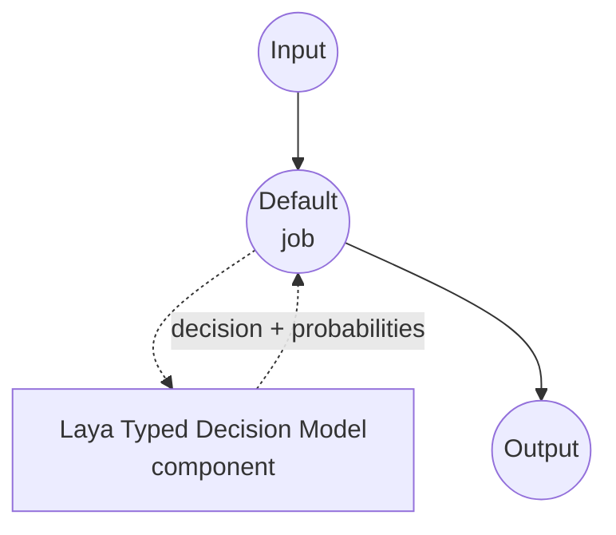

# Typed Decision Laya Model Task Example

This example demonstrates how to use Convai Innovations' Laya model for one-shot typed decisions using model-compose's built-in typed-decision task, returning a chosen value plus per-candidate probabilities for each question in a caller-supplied schema — without generating any free-form text.

## Overview

This workflow provides local, structured decision-making that:

1. **Typed Outputs**: Each question is one of `noul` (yes/no), `choice` (one of N named options), or `score` (an ordered rating scale); the response is guaranteed to be a value from the schema
2. **Per-Question Probabilities**: Returns the model's calibrated probability for every candidate, useful for confidence thresholds and expected-value calculations
3. **No Free-Form Text**: A non-autoregressive decision head scores candidates directly in a single forward pass; there is no JSON generation, no chain-of-thought, no hallucinated options
4. **Request-Time Schema**: The question set, options, and instructions are supplied per call, not baked into the component
5. **Local Model Execution**: Runs entirely offline on CUDA, MPS (Apple Silicon), or CPU
6. **Multilingual**: Ships with an English checkpoint and a multilingual checkpoint covering 100+ languages, and a fine-tuned checkpoint for the typed-decisions workflows

## Preparation

### Prerequisites

- model-compose installed and available in your PATH
- One of the supported hardware paths:
  - **NVIDIA GPU on Linux** — the fastest path; enable `fast: true` for the TileLang fused kernels
  - **Apple Silicon (Darwin arm64)** with Metal — MPS autocast picks up the load automatically
  - **CPU** — supported and reasonable at these model sizes (~322–421M parameters); intended for smoke tests and low-throughput services
- Enough disk for the requested Laya checkpoint (~1 GB per preset; the bundle repo lets you download only what you need)
- Python 3.10 or newer

### Why Laya for Typed Decisions

Compared to prompting a general chat model to return JSON, Laya is purpose-built for the "choose one of these" pattern in dozens of languages at once:

**Benefits:**
- **Type-Safe Outputs**: The decision head scores only the candidate answer tokens; producing an option outside the schema is impossible by construction
- **No Parsing**: The response is already a dict of typed values — no JSON grammar to enforce or repair
- **One Forward Pass**: The state is encoded once and every question is answered together in a single pass, so answering N questions on the same state is close to the cost of one
- **Calibrated Probabilities**: Softmax over candidate hidden-state scores gives a per-answer probability suitable for downstream thresholds
- **Three Question Shapes**: `noul` (yes/no), `choice` (named options), and `score` (ordinal levels) cover most classification patterns without prompt engineering
- **Multilingual**: The `multilingual` checkpoint handles 100+ languages in the same decision surface as the English one

**Trade-offs:**
- **Text Only**: Laya accepts text states only; there is no vision or audio head
- **Bounded Context**: The English checkpoint reads up to 512 tokens; `multilingual` reads up to 1024, extendable to 8192 via `max_seq_length`
- **One Checkpoint at a Time**: This driver loads a single checkpoint; to switch between English and multilingual per request, run two components or upgrade to the Laya `Router` outside of model-compose

### Environment Configuration

1. Navigate to this example directory:
   ```bash
   cd examples/model-tasks/typed-decision-laya
   ```

2. No additional environment configuration required — the Laya checkpoint and dependencies are managed automatically.

## How to Run

1. **Start the service:**
   ```bash
   model-compose up
   ```

2. **Run the workflow:**

   **Using API:**
   ```bash
   # Triage a support message: is it urgent, which category, on a 1-5 severity scale
   curl -X POST http://localhost:8080/api/workflows/runs \
     -H "Content-Type: application/json" \
     -d '{
       "input": {
         "text": "The payment service is down for all customers.",
         "schema": {
           "urgent": {
             "type": "noul",
             "instructions": "Is this an urgent operational incident?",
             "criteria": {
               "true": "A production system is currently unavailable to real users.",
               "false": "Non-blocking issue, question, or feature request."
             }
           },
           "category": {
             "type": "choice",
             "instructions": "Which team owns this?",
             "criteria": {
               "payments": "Billing, checkout, or payment processing.",
               "infra": "Servers, deployment, or platform outages.",
               "product": "UX, feature behavior, or product feedback."
             }
           },
           "severity": {
             "type": "score",
             "instructions": "Rate business impact from 1 (trivial) to 5 (critical).",
             "criteria": [
               "trivial: cosmetic or single-user issue",
               "low: minor inconvenience for a few users",
               "medium: measurable revenue or productivity loss",
               "high: broad customer impact, some workaround exists",
               "critical: total outage with no workaround"
             ]
           }
         }
       }
     }'
   ```

   **Using Web UI:**
   - Open the Web UI: http://localhost:8081
   - Fill in `text` with the state to judge
   - Fill in `schema` with the per-question map (JSON object)
   - Click the "Run Workflow" button

   **Using CLI:**
   ```bash
   model-compose run --input '{
     "text": "The payment service is down for all customers.",
     "schema": {
       "urgent": {"type": "noul", "instructions": "Urgent incident?"},
       "category": {"type": "choice", "instructions": "Which team owns this?", "criteria": {"payments": "", "infra": "", "product": ""}},
       "severity": {"type": "score", "instructions": "Impact 1-5.", "criteria": ["trivial", "low", "medium", "high", "critical"]}
     }
   }'
   ```

## Component Details

### Typed Decision Model Component (Default)
- **Type**: Model component with typed-decision task
- **Purpose**: Local one-shot typed decisions with calibrated candidate probabilities
- **Model**: convaiinnovations/laya (bundle repo; ships English, multilingual, and typed-decisions checkpoints — chosen via `preset`)
- **Family**: laya
- **Features**:
  - Automatic checkpoint download, filtered to just the requested preset
  - Automatic device selection (CUDA → MPS → CPU) with autocast where the device supports it
  - Per-question candidate probabilities for `noul`, `choice`, and `score` question types
  - Shared state encoding across all questions in a single request

### Model Information: Laya
- **Developer**: Convai Innovations
- **Checkpoints** (selected via `preset`):
  - `preset: english` — ModernBERT-large, 421M params, 512-token context, English
  - `preset: multilingual` (default) — mmBERT-base, 322M params, 1024-token context (up to 8192 via `max_seq_length`), 100+ languages
  - `preset: typed-decisions` — ModernBERT-large, 421M params, 1024-token context, fine-tuned on four typed-decisions workflows
- **Type**: Non-autoregressive encoder with a decision head trained via RLCD
- **Capabilities**: `noul` (yes/no), `choice` (named options), `score` (ordinal levels)

## Workflow Details

### "Typed Decision (Laya)" Workflow (Default)

**Description**: One-shot typed decisions from a state and a per-question schema; returns the chosen value plus per-candidate probabilities per question, without generating any free-form text.

#### Job Flow

This example uses a simplified single-component configuration without explicit jobs.



#### Input Parameters

| Parameter | Type | Required | Default | Description |
|-----------|------|----------|---------|-------------|
| `text` | text | Yes | - | The state (unstructured text) the model judges. Must fit within the checkpoint's token budget (512 for English, 1024 for multilingual, up to 8192 with `max_seq_length`). |
| `schema` | json | Yes | - | Map of question id to a per-question spec: `{type: noul, instructions, criteria?: {true?, false?}}`, `{type: choice, instructions, criteria: {name: description, ...}}`, or `{type: score, instructions, criteria: [level1, level2, ...]}`. |

#### Output Format

| Field | Type | Description |
|-------|------|-------------|
| `decision` | json | Chosen value per question. |
| `fields` | json | Per-question detail, populated when `return_probabilities` is on (`fields[qid].scores`). |

Example response body:

```json
{
  "decision": {"urgent": true, "category": "infra", "severity": 4.6},
  "fields": {
    "urgent": {"scores": {"true": 0.94, "false": 0.06}},
    "category": {"scores": {"payments": 0.31, "infra": 0.58, "product": 0.11}},
    "severity": {"scores": {"0": 0.01, "1": 0.03, "2": 0.09, "3": 0.24, "4": 0.63}}
  }
}
```

Values in `decision`:
- `noul` questions resolve to a boolean (`p(true) >= 0.5`)
- `choice` questions resolve to the winning option name
- `score` questions resolve to the expected level (a float across the rating scale)

## System Requirements

### Minimum Requirements
- **RAM**: 4 GB+ for the multilingual checkpoint; 8 GB+ for the English or typed-decisions checkpoint
- **VRAM**: 2 GB+ if targeting CUDA; the checkpoint fits comfortably on any modern discrete GPU
- **Disk Space**: ~1 GB per preset
- **CPU**: Modern multi-core processor
- **Internet**: Required for initial checkpoint download only

### Performance Notes
- The state is encoded once and reused across all questions in a single request; latency scales sub-linearly with question count
- On a T4 GPU, a single-question call runs in about 33 ms; batched calls average about 7 ms per question
- On Apple Silicon, MPS autocast is applied once the batch is large enough to overcome its overhead
- The `fast: true` flag switches to the TileLang fused CUDA kernels for another speedup on discrete GPUs; it needs `laya[fast]`, which the driver installs automatically when the flag is set on Linux+x86_64

## Customization

### Choosing a Checkpoint

The example uses `preset: multilingual`. Switch presets to change the routing surface:

```yaml
component:
  preset: english                      # 512-token English-only checkpoint
  # preset: typed-decisions            # fine-tuned on the four typed-decisions workflows
```

Or override `model` to point at a standalone repository — the preset then names the subfolder for you, so `preset: multilingual` still works with any bundle-style layout:

```yaml
component:
  model: convaiinnovations/laya-multilingual
```

### Extending the Context Budget

The `multilingual` preset supports up to 8192 tokens per state; raise `max_seq_length` when you send long documents:

```yaml
component:
  preset: multilingual
  max_seq_length: 8192
```

Accuracy is strong up to about 4,000 tokens and more variable beyond; check long-document accuracy on your own data.

### Enabling the CUDA Fast Path

On a Linux+x86_64 host with a supported NVIDIA GPU, enable the TileLang fused kernels:

```yaml
component:
  fast: true
```

The driver installs `tilelang` automatically when this flag is set on Linux+x86_64.

### Batching Multiple States

Pass a list to `text` when you have many independent decisions against the same schema; the driver batches them internally:

```yaml
component:
  action:
    text: ${input.texts}               # list of strings
    schema: ${input.schema}
    batch_size: 4
```

## Troubleshooting

### Common Issues

1. **Checkpoint Download Slow**: The first run pulls the requested preset. Subsequent runs reuse the HuggingFace cache.
2. **CUDA Fast Path Unavailable**: `fast: true` requires `tilelang`, which builds only on Linux+x86_64 with a supported CUDA toolchain. On other platforms the driver keeps `fast: false`.
3. **Long Input Cut Off**: The `multilingual` checkpoint ships with a 1024-token default; set `max_seq_length: 8192` for long documents.
4. **State Too Long**: If the input still overflows after raising `max_seq_length`, split the input into multiple calls.
5. **Score Question Unexpected Value**: `score` questions return an **expected level** (float) — the model's rating averaged over the softmax across levels, not a hard argmax. If you need the hard argmax use the `probabilities` field.

### Performance Optimization

- **Fast Path**: On Linux+x86_64 with a supported NVIDIA GPU, set `fast: true`
- **Batching**: Increase `batch_size` when scoring many states against the same schema
- **Question Descriptions**: Sharper, more distinct option descriptions produce more confident probabilities
- **Question Independence**: Laya scores each question independently in the shared forward pass; enforce cross-question consistency in your workflow, not by trusting model agreement
