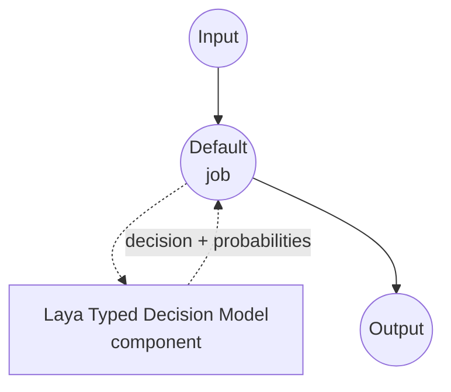

# Typed Decision Laya 模型任务示例

本示例演示如何使用 Convai Innovations 的 Laya 模型与 model-compose 内置的 typed-decision 任务，实现一次性类型化决策。针对调用方提供的模式中的每个问题，返回被选中的值以及各候选项的概率，且不生成任何自由格式文本。

## 概述

此工作流提供本地结构化决策功能：

1. **类型安全输出**：每个问题是 `noul`（是/否）、`choice`（N 个命名选项之一）或 `score`（有序评分刻度）之一，响应保证是模式中的值
2. **逐问题概率**：为每个候选项返回模型的校准概率，可用于置信度阈值和期望值计算
3. **无自由文本生成**：非自回归决策头在单次前向传播中直接对候选项评分，没有 JSON 生成、没有 chain-of-thought、不会幻觉出模式之外的选项
4. **请求时模式**：问题集、选项和指令在调用时提供，不烘焙在组件中
5. **本地模型执行**：CUDA、MPS（Apple Silicon）和 CPU 上完全离线运行
6. **多语言支持**：随附英语检查点、覆盖 100+ 语言的多语言检查点，以及为 typed-decisions 工作流微调的检查点

## 准备工作

### 先决条件

- 已安装 model-compose 并在 PATH 中可用
- 受支持的硬件路径之一：
  - **Linux 上的 NVIDIA GPU** — 最快路径。启用 `fast: true` 以使用 TileLang 融合内核
  - **带 Metal 的 Apple Silicon (Darwin arm64)** — MPS autocast 自动应用
  - **CPU** — 支持且在此模型规格（~322–421M 参数）下速度合理；用于烟雾测试和低吞吐量服务
- 足够的磁盘空间用于所请求的 Laya 检查点（每个 preset 约 1 GB；捆绑仓库仅下载所需部分）
- Python 3.10 或更新版本

### 为何选择 Laya

与提示通用聊天模型返回 JSON 相比，Laya 是专门为"从这些选项中选择"模式设计的，并且同时处理数十种语言：

**优势：**
- **类型安全输出**：决策头仅对候选答案 token 评分，原理上不可能产生模式之外的选项
- **无需解析**：响应已经是类型化字典 — 没有 JSON 语法强制或修复
- **单次前向传播**：状态编码一次，所有问题在一次传播中一起回答；对同一状态回答 N 个问题的成本接近一个
- **校准概率**：候选隐藏状态分数的 softmax 提供可用于下游阈值的概率
- **三种问题形态**：`noul`（是/否）、`choice`（命名选项）和 `score`（有序级别）覆盖大多数分类模式，无需提示工程
- **多语言**：`multilingual` 检查点在与英语检查点相同的决策表面上处理 100+ 语言

**权衡：**
- **仅文本**：Laya 仅接受文本状态；没有视觉或音频头
- **有限上下文**：英语检查点最多读取 512 token；`multilingual` 最多 1024，通过 `max_seq_length` 可扩展至 8192
- **一次一个检查点**：此驱动加载单个检查点。若要在请求之间切换英语与多语言，请运行两个组件或在 model-compose 之外使用 Laya `Router`

### 环境配置

1. 导航到本示例目录：
   ```bash
   cd examples/model-tasks/typed-decision-laya
   ```

2. 无需额外的环境配置 — Laya 检查点和依赖项自动管理。

## 运行方法

1. **启动服务：**
   ```bash
   model-compose up
   ```

2. **运行工作流：**

   **使用 API：**
   ```bash
   # 分类支持消息：是否紧急、哪个团队负责、1-5 严重程度评分
   curl -X POST http://localhost:8080/api/workflows/runs \
     -H "Content-Type: application/json" \
     -d '{
       "input": {
         "text": "The payment service is down for all customers.",
         "schema": {
           "urgent": {
             "type": "noul",
             "instructions": "Is this an urgent operational incident?",
             "criteria": {
               "true": "A production system is currently unavailable to real users.",
               "false": "Non-blocking issue, question, or feature request."
             }
           },
           "category": {
             "type": "choice",
             "instructions": "Which team owns this?",
             "criteria": {
               "payments": "Billing, checkout, or payment processing.",
               "infra": "Servers, deployment, or platform outages.",
               "product": "UX, feature behavior, or product feedback."
             }
           },
           "severity": {
             "type": "score",
             "instructions": "Rate business impact from 1 (trivial) to 5 (critical).",
             "criteria": [
               "trivial: cosmetic or single-user issue",
               "low: minor inconvenience for a few users",
               "medium: measurable revenue or productivity loss",
               "high: broad customer impact, some workaround exists",
               "critical: total outage with no workaround"
             ]
           }
         }
       }
     }'
   ```

   **使用 Web UI：**
   - 打开 Web UI：http://localhost:8081
   - 在 `text` 中填写要判断的状态
   - 在 `schema` 中填写逐问题映射（JSON 对象）
   - 点击 "Run Workflow" 按钮

   **使用 CLI：**
   ```bash
   model-compose run --input '{
     "text": "The payment service is down for all customers.",
     "schema": {
       "urgent": {"type": "noul", "instructions": "Urgent incident?"},
       "category": {"type": "choice", "instructions": "Which team owns this?", "criteria": {"payments": "", "infra": "", "product": ""}},
       "severity": {"type": "score", "instructions": "Impact 1-5.", "criteria": ["trivial", "low", "medium", "high", "critical"]}
     }
   }'
   ```

## 组件详情

### Typed Decision 模型组件（默认）
- **类型**：带 typed-decision 任务的模型组件
- **目的**：本地一次性类型化决策与校准的候选概率
- **模型**：convaiinnovations/laya（捆绑仓库；通过 `preset` 选择英语、多语言或 typed-decisions 检查点）
- **家族**：laya
- **功能**：
  - 按请求的 preset 过滤的自动检查点下载
  - 自动设备选择（CUDA → MPS → CPU），在设备支持处启用 autocast
  - `noul`、`choice` 和 `score` 问题类型的逐问题候选概率
  - 单个请求内所有问题的共享状态编码

### 模型信息：Laya
- **开发者**：Convai Innovations
- **检查点**（通过 `preset` 选择）：
  - `preset: english` — ModernBERT-large，421M 参数，512 token 上下文，英语
  - `preset: multilingual`（默认）— mmBERT-base，322M 参数，1024 token 上下文（通过 `max_seq_length` 最多 8192），100+ 语言
  - `preset: typed-decisions` — ModernBERT-large，421M 参数，1024 token 上下文，为四个 typed-decisions 工作流微调
- **类型**：带 RLCD 训练的决策头的非自回归编码器
- **能力**：`noul`（是/否）、`choice`（命名选项）、`score`（有序级别）

## 工作流详情

### "Typed Decision (Laya)" 工作流（默认）

**描述**：从状态和逐问题模式进行一次性类型化决策；返回每个问题的选中值和候选概率，不生成任何自由格式文本。

#### 作业流程

本示例使用无显式作业的简化单组件配置。



#### 输入参数

| 参数 | 类型 | 必需 | 默认值 | 描述 |
|------|------|------|--------|------|
| `text` | text | 是 | - | 模型判断的状态（非结构化文本）。必须适合检查点的 token 预算（英语 512，多语言 1024，通过 `max_seq_length` 最多 8192）。 |
| `schema` | json | 是 | - | 问题 ID → 逐问题规范映射：`{type: noul, instructions, criteria?: {true?, false?}}`、`{type: choice, instructions, criteria: {name: description, ...}}` 或 `{type: score, instructions, criteria: [level1, level2, ...]}`。 |

#### 输出格式

| 字段 | 类型 | 描述 |
|------|------|------|
| `decision` | json | 每个问题的选中值。 |
| `fields` | json | `return_probabilities` 开启时填充的逐问题详情（`fields[qid].scores`）。 |

响应正文示例：

```json
{
  "decision": {"urgent": true, "category": "infra", "severity": 4.6},
  "fields": {
    "urgent": {"scores": {"true": 0.94, "false": 0.06}},
    "category": {"scores": {"payments": 0.31, "infra": 0.58, "product": 0.11}},
    "severity": {"scores": {"0": 0.01, "1": 0.03, "2": 0.09, "3": 0.24, "4": 0.63}}
  }
}
```

`decision` 的值：
- `noul` 问题解析为布尔值（`p(true) >= 0.5`）
- `choice` 问题解析为获胜选项名称
- `score` 问题解析为期望级别（评分刻度上的浮点数）

## 系统要求

### 最低要求
- **RAM**：多语言检查点需 4 GB 以上；英语或 typed-decisions 检查点需 8 GB 以上
- **VRAM**：使用 CUDA 时需 2 GB 以上；检查点在任何现代独立 GPU 上都能舒适容纳
- **磁盘空间**：每个 preset 约 1 GB
- **CPU**：现代多核处理器
- **互联网**：仅初次检查点下载需要

### 性能说明
- 状态在单个请求内编码一次并在所有问题中重用；延迟随问题数量次线性增长
- 在 T4 GPU 上，单问题调用约 33 ms；批量调用每个问题平均约 7 ms
- 在 Apple Silicon 上，一旦批次足够大以超过其开销，MPS autocast 就会应用
- `fast: true` 标志切换到 TileLang 融合 CUDA 内核，在独立 GPU 上带来额外速度提升；需要 `laya[fast]`，当在 Linux+x86_64 上设置该标志时驱动会自动安装

## 定制化

### 选择检查点

示例使用 `preset: multilingual`。切换 preset 以改变路由表面：

```yaml
component:
  preset: english                      # 仅英语的 512-token 检查点
  # preset: typed-decisions            # 为四个 typed-decisions 工作流微调
```

或者通过覆盖 `model` 指向独立仓库 — preset 仍作为子文件夹名使用，所以只要 layout 与捆绑仓库一致，`preset: multilingual` 仍然有效：

```yaml
component:
  model: convaiinnovations/laya-multilingual
```

### 扩展上下文预算

`multilingual` preset 每个状态最多支持 8192 token；发送长文档时提高 `max_seq_length`：

```yaml
component:
  preset: multilingual
  max_seq_length: 8192
```

准确度在约 4,000 token 之前很强，之后波动更大；在自己的数据上检查长文档准确度。

### 启用 CUDA 快速路径

在带有受支持的 NVIDIA GPU 的 Linux+x86_64 主机上，启用 TileLang 融合内核：

```yaml
component:
  fast: true
```

当在 Linux+x86_64 上设置此标志时，驱动会自动安装 `tilelang`。

### 批处理多个状态

当你对同一模式有许多独立决策时，将列表传给 `text`；驱动会内部批处理：

```yaml
component:
  action:
    text: ${input.texts}               # 字符串列表
    schema: ${input.schema}
    batch_size: 4
```

## 故障排除

### 常见问题

1. **检查点下载慢**：首次运行拉取所请求的 preset。后续运行重用 HuggingFace 缓存。
2. **CUDA 快速路径不可用**：`fast: true` 需要 `tilelang`，它仅在 Linux+x86_64 上带有受支持的 CUDA 工具链时构建。在其他平台上，驱动保持 `fast: false`。
3. **长输入被截断**：`multilingual` 检查点默认为 1024 token；对长文档设置 `max_seq_length: 8192`。
4. **状态过长**：如果提高 `max_seq_length` 后输入仍溢出，将输入拆分为多次调用。
5. **score 问题意外值**：`score` 问题返回**期望级别**（浮点数）— 是模型评分在级别间 softmax 的平均，而不是硬 argmax。如果需要硬 argmax，请使用 `probabilities` 字段。

### 性能优化

- **快速路径**：在带有受支持的 NVIDIA GPU 的 Linux+x86_64 上，设置 `fast: true`
- **批处理**：对同一模式评分多个状态时增加 `batch_size`
- **问题描述**：更清晰、更有区别的选项描述会产生更自信的概率
- **问题独立性**：Laya 在共享的前向传播中独立评分每个问题；在工作流中强制跨问题一致性，而不是信任模型一致
