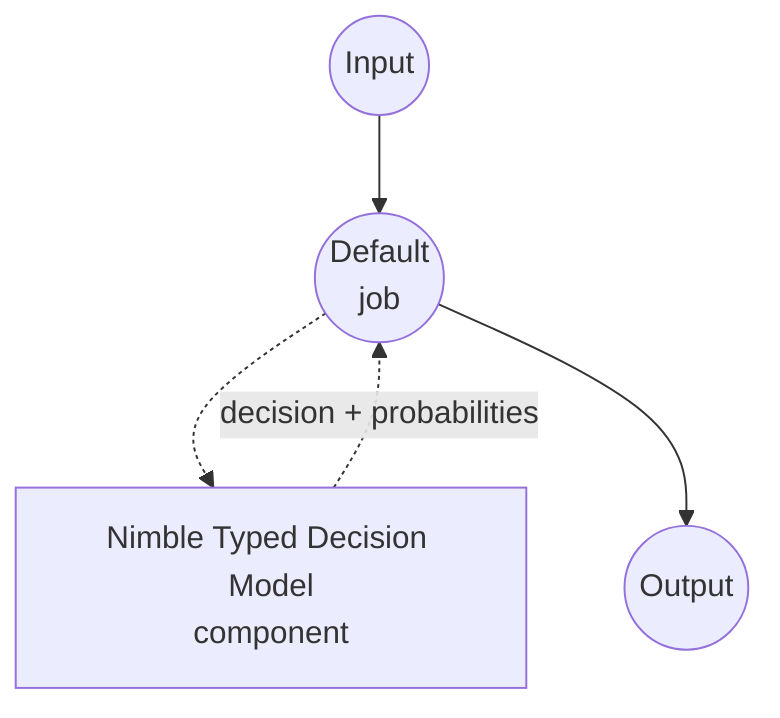

# Typed Decision Nimble 모델 태스크 예제

이 예제는 Bespoke Labs의 Nimble-9B 모델을 model-compose의 내장 typed-decision 태스크와 함께 사용하여 원샷 타입드 결정을 수행하는 방법을 보여줍니다. 호출자가 제공한 스키마의 각 필드에 대해 선택된 값과 후보별 확률을 반환하며, 어떠한 자유 형식 텍스트도 생성하지 않습니다.

## 개요

이 워크플로우는 다음과 같은 로컬 구조화된 의사결정 기능을 제공합니다:

1. **타입 안전 출력**: 각 필드는 `enum`(고정된 선택지 리스트) 또는 `boolean`이며, 응답은 반드시 허용된 값 중 하나임이 보장됩니다
2. **필드별 확률**: 모든 허용 후보에 대해 모델의 보정된 확률을 반환하여 신뢰도 임계값과 기대값 계산에 활용 가능합니다
3. **자유 텍스트 생성 없음**: 스코어러는 답변 토큰 로짓을 직접 읽습니다. JSON 생성도, chain-of-thought도, 스키마 외 옵션의 환각도 없습니다
4. **요청 시점 스키마**: 필드 목록, 선택지, 설명이 컴포넌트에 고정되지 않고 호출마다 공급됩니다
5. **로컬 모델 실행**: Apple Silicon에서는 MLX, CUDA에서는 Torch를 통해 완전히 오프라인으로 실행
6. **자동 모델 관리**: 첫 사용 시 LoRA 어댑터를 다운로드하고 베이스 모델에 병합하며, 병합된 웨이트를 캐시합니다

## 준비사항

### 필수 요구사항

- model-compose가 설치되어 PATH에서 사용 가능
- 지원되는 두 하드웨어 경로 중 하나:
  - **Apple Silicon (Darwin arm64)** with Metal — MLX `ParallelScorer`가 공유 프롬프트를 한 번 읽고 모든 필드를 병렬로 스코어링
  - **BF16 지원 NVIDIA GPU가 있는 Linux (x86_64 또는 aarch64)** — `CudaCandidateScorer`가 필드마다 전체 프롬프트를 재실행
- 베이스 모델(~18 GB), 어댑터(~50 MB), 병합된 스냅샷(초기 실행 시 추가 ~18 GB)을 저장할 충분한 디스크
- 병합된 9B 체크포인트를 다룰 만한 RAM/VRAM. LoRA 병합 단계 자체는 CPU에서 실행되며 추가 여유가 필요합니다

### Nimble을 선택하는 이유

일반 챗 모델에 JSON을 반환하라고 프롬프팅하는 것과 비교해, Nimble은 "이 옵션들 중에 골라라" 패턴에 특화되어 있습니다:

**장점:**
- **타입 안전 출력**: 스코어러가 후보 답변 토큰만 투영하므로 스키마 밖 옵션이 원리적으로 나올 수 없습니다
- **파싱 불필요**: Python 응답이 이미 타입드 딕셔너리 — JSON 문법 강제나 복구가 없음
- **빠른 결정**: MLX에서는 공유 컨텍스트가 한 번 인코딩되어 모든 필드에 재사용됩니다. CUDA 스코어러는 필드마다 독립 처리
- **보정된 확률**: 후보 로짓에 대한 softmax가 다운스트림 임계값에 쓸 수 있는 후보별 확률을 제공합니다
- **프라이버시**: 모든 추론이 로컬에서 일어나며 외부 서비스로 데이터 전송 없음

**트레이드오프:**
- **텍스트 전용**: Nimble은 텍스트 컨텍스트만 받습니다. 베이스 모델의 비전 헤드는 사용되지 않음
- **평면 스키마**: 각 필드는 `enum`(1-26개 선택지) 또는 `boolean`. 중첩 필드, 자유 텍스트 문자열, 필드 간 의존성은 호출자가 처리해야 함
- **프롬프트 예산**: 스키마를 포함한 전체 프롬프트는 `max_seq_length` 토큰(기본 4096)으로 제한
- **병합 비용**: 첫 시작 시 어댑터를 베이스에 다운로드/병합합니다. 이후 실행은 캐시된 병합 폴더를 재사용

### 환경 설정

1. 예제 디렉토리로 이동:
   ```bash
   cd examples/model-tasks/typed-decision-nimble
   ```

2. 별도 환경 설정 불필요 — 모델, 어댑터, 의존성이 자동으로 관리됩니다.

## 실행 방법

1. **서비스 시작:**
   ```bash
   model-compose up
   ```

2. **워크플로우 실행:**

   **API 사용:**
   ```bash
   # 지원 요청 라우팅 및 사람 검토 필요 여부 판단
   curl -X POST http://localhost:8080/api/workflows/runs \
     -H "Content-Type: application/json" \
     -d '{
       "input": {
         "text": "The payment service is down for all customers.",
         "schema": {
           "priority": {
             "type": "enum",
             "choices": ["HIGH", "LOW"],
             "description": "Urgency based on current business impact.",
             "choice_descriptions": {
               "HIGH": "A critical business operation is currently blocked.",
               "LOW": "An optional enhancement with no current business impact."
             }
           },
           "requires_review": {
             "type": "boolean",
             "description": "Whether a human should look at this before the automated response is sent."
           }
         }
       }
     }'
   ```

   **웹 UI 사용:**
   - 웹 UI 열기: http://localhost:8081
   - `text`에 판단할 입력 텍스트를 입력
   - `schema`에 필드 맵(JSON 객체)을 입력
   - "Run Workflow" 버튼 클릭

   **CLI 사용:**
   ```bash
   model-compose run --input '{
     "text": "The payment service is down for all customers.",
     "schema": {
       "priority": {"type": "enum", "choices": ["HIGH", "LOW"]},
       "requires_review": {"type": "boolean"}
     }
   }'
   ```

## 컴포넌트 상세

### Typed Decision 모델 컴포넌트 (기본)
- **타입**: typed-decision 태스크를 가진 모델 컴포넌트
- **목적**: 로컬 원샷 타입드 결정과 보정된 후보 확률
- **모델**: bespokelabs/Bespoke-Nimble-9B (LoRA 어댑터)
- **베이스**: Qwen/Qwen3.5-9B (어댑터 대상. `base_model`로 재정의 가능)
- **패밀리**: nimble
- **기능**:
  - 자동 어댑터 다운로드, LoRA 병합, 병합된 체크포인트 캐싱
  - MLX(Apple Silicon)와 CUDA(Linux+NVIDIA) 간 백엔드 자동 선택
  - 필드별 후보 확률 및 선택적 원시 로짓
  - 호출자가 텍스트 리스트를 넘길 때 배치 처리

### 모델 정보: Bespoke Nimble-9B
- **개발사**: Bespoke Labs
- **파라미터**: 약 9억(어댑터 ~50 MB, 병합된 체크포인트 ~18 GB)
- **타입**: Qwen3.5-9B에 대한 타입드 분류/의사결정용 LoRA 파인튜닝
- **훈련 초점**: 대조적 스키마 분류 쌍(2,676개 큐레이션된 예제)
- **능력**: enum 선택, boolean 결정, 후보 토큰에 대한 보정된 확률
- **체크포인트**: `bespokelabs/Bespoke-Nimble-9B` (어댑터 릴리스. 드라이버가 첫 사용 시 Qwen3.5-9B에 병합)

## 워크플로우 상세

### "Typed Decision (Bespoke Nimble-9B)" 워크플로우 (기본)

**설명**: 입력 텍스트와 평면 필드 스키마로부터 원샷 타입드 결정을 수행. 필드별로 선택된 값과 후보별 확률을 반환하며, 어떤 자유 형식 텍스트도 생성하지 않습니다.

#### 작업 흐름

이 예제는 명시적 작업 없이 단일 컴포넌트로 구성된 간단한 형태를 사용합니다.



#### 입력 파라미터

| 파라미터 | 타입 | 필수 | 기본값 | 설명 |
|---------|------|------|--------|------|
| `text` | text | 예 | - | 스코어러가 판단할 비정형 텍스트. 스키마와 합쳐 `max_seq_length` 토큰(기본 4096) 이내여야 합니다. |
| `schema` | json | 예 | - | 필드 이름 → 필드 스펙의 평면 맵: `{type: enum, choices: [...], description?, choice_descriptions?}` 또는 `{type: boolean, description?}`. |

#### 출력 형식

| 필드 | 타입 | 설명 |
|------|------|------|
| `decision` | json | 필드별로 선택된 값. |
| `fields` | json | `return_probabilities` 또는 `return_logits`가 켜졌을 때 채워지는 필드별 상세 (`fields[name].scores` / `fields[name].logits`). |

응답 본문 예시:

```json
{
  "decision": {"priority": "HIGH", "requires_review": true},
  "fields": {
    "priority": {"scores": {"HIGH": 0.94, "LOW": 0.06}},
    "requires_review": {"scores": {"true": 0.88, "false": 0.12}}
  }
}
```

## 시스템 요구사항

### 최소 요구사항
- **RAM**: 32 GB 이상 (LoRA 병합 단계에서 9B 베이스를 CPU에 로드한 뒤 병합된 스냅샷을 씀)
- **VRAM**: CUDA 백엔드용 20 GB 이상. Apple Silicon에서는 통합 메모리 상당
- **디스크 공간**: 베이스 모델, 어댑터, 병합된 스냅샷, 캐시용 40 GB 이상
- **CPU**: 최신 멀티코어 프로세서
- **인터넷**: 최초 베이스+어댑터 다운로드에만 필요

### 성능 참고사항
- 첫 실행 시 베이스 모델(~18 GB) 다운로드 및 어댑터 병합. 이후 실행은 병합된 폴더를 재사용
- MLX는 입력 텍스트당 공유 프롬프트를 한 번 실행하고 필드를 병렬 스코어링 — Apple Silicon에 최적
- CUDA는 필드마다 전체 프롬프트를 실행 — GPU 연산량에 따라 처리량 확장
- 프롬프트 길이(텍스트 + 스키마)는 `max_seq_length` 토큰(기본 4096)으로 제한. 초과 입력은 거부됨

## 커스터마이징

### 베이스 모델 재정의

기본 베이스는 `Qwen/Qwen3.5-9B`입니다. Nimble을 다른 Qwen3.5 변형에서 훈련된 어댑터에 연결하려면 베이스도 그에 맞게 재정의하세요:

```yaml
component:
  type: model
  task: typed-decision
  driver: custom
  family: nimble
  model: bespokelabs/Bespoke-Nimble-9B
  base_model: Qwen/Qwen3.5-4B   # 어댑터가 훈련된 대상과 일치해야 함
```

### 원시 로짓 반환

다운스트림 단계에서 정규화되지 않은 점수(예: 온도 스케일링된 확률, 커스텀 보정)가 필요할 때 `return_logits`를 켜세요:

```yaml
component:
  action:
    text: ${input.text}
    schema: ${input.schema}
    return_probabilities: true
    return_logits: true
```

### 다중 입력 배치

동일 스키마에 대해 여러 독립적 결정이 필요하면 `text`에 리스트를 넘기세요. 드라이버가 내부적으로 배치 처리합니다:

```yaml
component:
  action:
    text: ${input.texts}          # 문자열 리스트
    schema: ${input.schema}
    batch_size: 4
```

## 문제 해결

### 일반적인 이슈

1. **병합 중 메모리 부족**: 일회성 LoRA 병합은 전체 베이스를 CPU에 로드합니다. 최소 32 GB 시스템 RAM 확보하세요. 병합된 스냅샷은 캐시되므로 이 비용은 한 번만 지불됩니다
2. **미지원 플랫폼 오류**: Nimble 드라이버는 Darwin+arm64 (MLX)와 CUDA가 있는 Linux (x86_64 또는 aarch64)만 지원합니다. 다른 조합(Intel Mac, CUDA 없는 Linux)은 upstream 스코어러가 지원하지 않습니다
3. **BF16 미지원**: Nimble의 CUDA 스코어러는 BF16 지원 GPU(Ampere 이후)를 요구합니다. 이전 카드는 스코어러 구성 단계에서 실패합니다
4. **프롬프트 초과**: 스코어러는 스키마 포함 `max_seq_length` 토큰(기본 4096)을 초과하는 프롬프트를 거부합니다. 텍스트를 줄이거나, 필드 설명을 다듬거나, 결정을 여러 호출로 분할하세요
5. **첫 실행이 느림**: 베이스 모델(~18 GB) 다운로드와 어댑터 병합에 몇 분이 걸릴 수 있습니다. 이후 실행은 캐시된 병합 폴더를 재사용합니다

### 성능 최적화

- **백엔드**: Apple Silicon에서는 MLX 선호(기본). Linux에서는 BF16 지원 GPU 사용
- **배치**: 동일 스키마에 대해 많은 텍스트를 스코어링할 때 `batch_size` 증가
- **스키마 설계**: 잘 설명된 소수의 선택지가 겹치는 다수보다 더 뾰족한 확률을 만듭니다
- **필드 독립성**: Nimble은 각 필드를 독립적으로 스코어링합니다. 두 필드가 반드시 일치해야 한다면(예: `priority: HIGH`일 때만 `requires_review: true`) 워크플로우에서 강제하세요. 모델의 일관성에 의존하지 마세요
