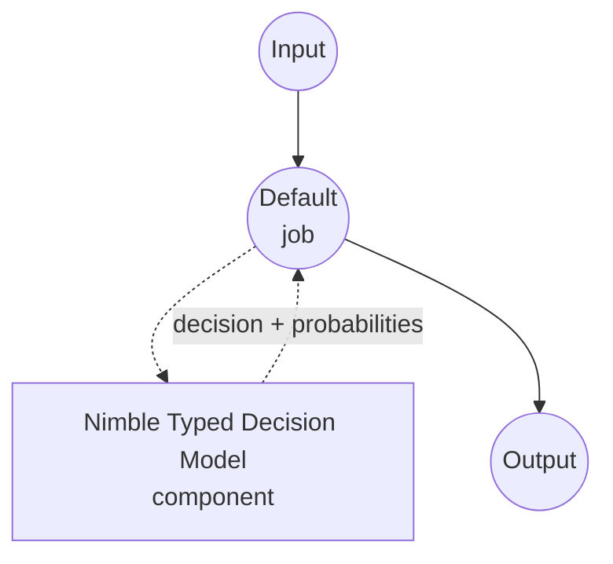

# Typed Decision Nimble Model Task Example

This example demonstrates how to use Bespoke Labs' Nimble-9B model for one-shot typed decisions using model-compose's built-in typed-decision task, returning a chosen value plus per-candidate probabilities for each field in a caller-supplied schema — without generating any free-form text.

## Overview

This workflow provides local, structured decision-making that:

1. **Typed Outputs**: Each field is an `enum` (a fixed choice list) or a `boolean`; the response is guaranteed to be one of the allowed values
2. **Per-Field Probabilities**: Returns the model's calibrated probability for every allowed candidate, useful for confidence thresholds and expected-value calculations
3. **No Free-Form Text**: The scorer reads answer-token logits directly; there is no JSON generation, no chain-of-thought, no hallucinated options
4. **Request-Time Schema**: The list of fields, choices, and their descriptions is supplied per call, not baked into the component
5. **Local Model Execution**: Runs entirely offline via MLX on Apple Silicon or Torch on CUDA
6. **Automatic Model Management**: Downloads the LoRA adapter, merges it onto the base model, and caches the merged weights on first use

## Preparation

### Prerequisites

- model-compose installed and available in your PATH
- One of the two supported hardware paths:
  - **Apple Silicon (Darwin arm64)** with Metal — the MLX `ParallelScorer` reads the shared prompt once and scores all fields in parallel
  - **Linux (x86_64 or aarch64) with a BF16-capable NVIDIA GPU** — the `CudaCandidateScorer` re-runs the full prompt per field
- Enough disk for the base model (~18 GB), the adapter (~50 MB), and the merged snapshot (~18 GB additional the first time)
- Enough RAM/VRAM for the merged 9B checkpoint; the LoRA merge step itself runs on CPU and needs additional headroom

### Why Nimble for Typed Decisions

Compared to prompting a general chat model to return JSON, Nimble is purpose-built for the "choose one of these" pattern:

**Benefits:**
- **Type-Safe Outputs**: The scorer projects only the candidate answer tokens; producing an option outside the schema is impossible by construction
- **No Parsing**: The Python response is already a dict of typed values — no JSON grammar to enforce or repair
- **Fast Decisions**: On MLX the shared context is encoded once and reused across every field; the CUDA scorer processes each field independently
- **Calibrated Probabilities**: The softmax over candidate logits gives a per-answer probability suitable for downstream thresholds
- **Privacy**: All inference happens locally, no data sent to external services

**Trade-offs:**
- **Text Only**: Nimble accepts text contexts only; the vision head of the base model is not used
- **Flat Schemas**: Each field is `enum` (1–26 choices) or `boolean`; nested fields, free-form strings, and cross-field dependencies must be handled by the caller
- **Prompt Budget**: The full prompt including schema is limited to `max_seq_length` tokens (default 4096)
- **Merge Cost**: The first startup downloads and merges the adapter onto the base; subsequent runs reuse the cached merged folder

### Environment Configuration

1. Navigate to this example directory:
   ```bash
   cd examples/model-tasks/typed-decision-nimble
   ```

2. No additional environment configuration required — model, adapter, and dependencies are managed automatically.

## How to Run

1. **Start the service:**
   ```bash
   model-compose up
   ```

2. **Run the workflow:**

   **Using API:**
   ```bash
   # Route a support request and flag whether it needs human review
   curl -X POST http://localhost:8080/api/workflows/runs \
     -H "Content-Type: application/json" \
     -d '{
       "input": {
         "text": "The payment service is down for all customers.",
         "schema": {
           "priority": {
             "type": "enum",
             "choices": ["HIGH", "LOW"],
             "description": "Urgency based on current business impact.",
             "choice_descriptions": {
               "HIGH": "A critical business operation is currently blocked.",
               "LOW": "An optional enhancement with no current business impact."
             }
           },
           "requires_review": {
             "type": "boolean",
             "description": "Whether a human should look at this before the automated response is sent."
           }
         }
       }
     }'
   ```

   **Using Web UI:**
   - Open the Web UI: http://localhost:8081
   - Fill in `text` with the input to judge
   - Fill in `schema` with the field map (JSON object)
   - Click the "Run Workflow" button

   **Using CLI:**
   ```bash
   model-compose run --input '{
     "text": "The payment service is down for all customers.",
     "schema": {
       "priority": {"type": "enum", "choices": ["HIGH", "LOW"]},
       "requires_review": {"type": "boolean"}
     }
   }'
   ```

## Component Details

### Typed Decision Model Component (Default)
- **Type**: Model component with typed-decision task
- **Purpose**: Local one-shot typed decisions with calibrated candidate probabilities
- **Model**: bespokelabs/Bespoke-Nimble-9B (LoRA adapter)
- **Base**: Qwen/Qwen3.5-9B (adapter target; overridable via `base_model`)
- **Family**: nimble
- **Features**:
  - Automatic adapter download, LoRA merge, and merged-checkpoint caching
  - Backend auto-selection between MLX (Apple Silicon) and CUDA (Linux+NVIDIA)
  - Per-field candidate probabilities and optional raw logits
  - Batched processing when the caller passes a list of texts

### Model Information: Bespoke Nimble-9B
- **Developer**: Bespoke Labs
- **Parameters**: ~9 billion (adapter is ~50 MB; merged checkpoint is ~18 GB)
- **Type**: LoRA fine-tune on Qwen3.5-9B for typed classification and decision tasks
- **Training Focus**: Contrastive schema-classification pairs (2,676 curated examples)
- **Capabilities**: Enum selection, boolean decisions, calibrated probabilities over candidate tokens
- **Checkpoint**: `bespokelabs/Bespoke-Nimble-9B` (adapter release; the driver merges it onto Qwen3.5-9B on first use)

## Workflow Details

### "Typed Decision (Bespoke Nimble-9B)" Workflow (Default)

**Description**: One-shot typed decisions from an input text and a flat field schema; returns the chosen value plus per-candidate probabilities per field, without generating any free-form text.

#### Job Flow

This example uses a simplified single-component configuration without explicit jobs.



#### Input Parameters

| Parameter | Type | Required | Default | Description |
|-----------|------|----------|---------|-------------|
| `text` | text | Yes | - | The unstructured text the scorer will judge. Combined with the schema, must fit within `max_seq_length` tokens (default 4096). |
| `schema` | json | Yes | - | Flat map of field name to a field spec: `{type: enum, choices: [...], description?, choice_descriptions?}` or `{type: boolean, description?}`. |

#### Output Format

| Field | Type | Description |
|-------|------|-------------|
| `decision` | json | Chosen value per field. |
| `fields` | json | Per-field detail, populated when `return_probabilities` or `return_logits` is on (`fields[name].scores` / `fields[name].logits`). |

Example response body:

```json
{
  "decision": {"priority": "HIGH", "requires_review": true},
  "fields": {
    "priority": {"scores": {"HIGH": 0.94, "LOW": 0.06}},
    "requires_review": {"scores": {"true": 0.88, "false": 0.12}}
  }
}
```

## System Requirements

### Minimum Requirements
- **RAM**: 32 GB+ (the LoRA merge step loads the 9B base on CPU before writing the merged snapshot)
- **VRAM**: 20 GB+ for the CUDA backend; unified memory equivalents on Apple Silicon
- **Disk Space**: 40 GB+ for base model, adapter, merged snapshot, and cache
- **CPU**: Modern multi-core processor
- **Internet**: Required for initial base + adapter download only

### Performance Notes
- First run downloads the base model (~18 GB) and merges the adapter; the merged folder is reused on subsequent runs
- MLX runs the shared prompt once per input text and scores fields in parallel — best on Apple Silicon
- CUDA runs each field with the full prompt — throughput scales with GPU compute
- Prompt length (text + schema) is capped at `max_seq_length` tokens (default 4096); longer inputs are rejected

## Customization

### Overriding the Base Model

The default base is `Qwen/Qwen3.5-9B`. If you point Nimble at an adapter trained on a different Qwen3.5 variant, override the base to match:

```yaml
component:
  type: model
  task: typed-decision
  driver: custom
  family: nimble
  model: bespokelabs/Bespoke-Nimble-9B
  base_model: Qwen/Qwen3.5-4B   # must match what the adapter was trained on
```

### Returning Raw Logits

Enable `return_logits` when a downstream step needs unnormalized scores (e.g. temperature-scaled probabilities or custom calibration):

```yaml
component:
  action:
    text: ${input.text}
    schema: ${input.schema}
    return_probabilities: true
    return_logits: true
```

### Batching Multiple Inputs

Pass a list to `text` when you have many independent decisions against the same schema; the driver batches them internally:

```yaml
component:
  action:
    text: ${input.texts}          # list of strings
    schema: ${input.schema}
    batch_size: 4
```

## Troubleshooting

### Common Issues

1. **Out of Memory During Merge**: The one-time LoRA merge loads the full base on CPU. Ensure at least 32 GB system RAM; the merged snapshot is cached so this cost is paid once
2. **Unsupported Platform Error**: The Nimble driver supports Darwin+arm64 (MLX) and Linux (x86_64 or aarch64) with CUDA. Other combinations (Intel Mac, Linux without CUDA) are not supported by the upstream scorer
3. **BF16 Not Supported**: Nimble's CUDA scorer requires BF16-capable GPUs (Ampere or newer). Older cards will fail during scorer construction
4. **Prompt Too Long**: The scorer rejects prompts over `max_seq_length` tokens (default 4096) including the schema. Shorten the text, trim field descriptions, or split the decision into multiple calls
5. **Slow First Run**: Downloading the base model (~18 GB) and merging the adapter can take several minutes; subsequent runs reuse the cached merged folder

### Performance Optimization

- **Backend**: On Apple Silicon, prefer MLX (the default); on Linux, use a BF16-capable GPU
- **Batching**: Increase `batch_size` when scoring many texts against the same schema
- **Schema Design**: Fewer, better-described choices produce sharper probabilities than many overlapping ones
- **Field Independence**: Nimble scores each field separately; if two fields must agree (e.g. only allow `requires_review: true` when `priority: HIGH`), enforce that in your workflow rather than trusting the model to be consistent
