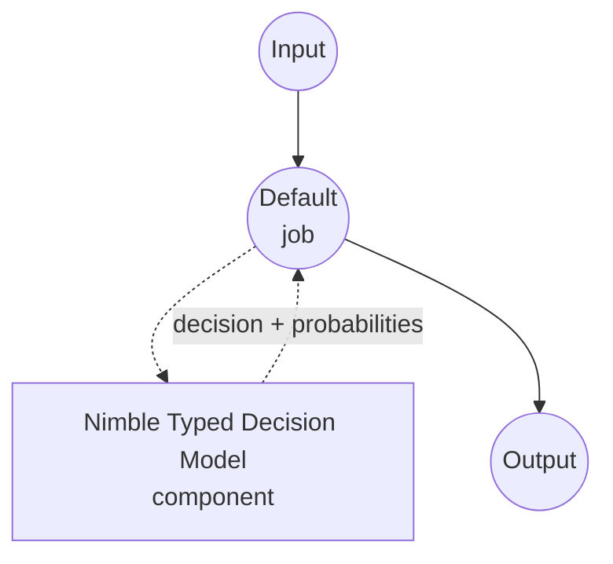

# Typed Decision Nimble 模型任务示例

本示例演示如何使用 Bespoke Labs 的 Nimble-9B 模型与 model-compose 内置的 typed-decision 任务，实现一次性类型化决策。针对调用方提供的模式中的每个字段，返回被选中的值以及各候选项的概率，且不生成任何自由格式文本。

## 概述

此工作流提供本地结构化决策功能：

1. **类型安全输出**：每个字段是 `enum`（固定选项列表）或 `boolean`，响应保证是允许值之一
2. **逐字段概率**：为每个允许候选项返回模型的校准概率，可用于置信度阈值和期望值计算
3. **无自由文本生成**：评分器直接读取答案 token 的 logits，没有 JSON 生成、没有 chain-of-thought、不会幻觉出模式之外的选项
4. **请求时模式**：字段列表、选项、描述在调用时提供，不烘焙在组件中
5. **本地模型执行**：Apple Silicon 上通过 MLX，CUDA 上通过 Torch，完全离线运行
6. **自动模型管理**：首次使用时下载 LoRA 适配器、与基础模型合并，并缓存合并后的权重

## 准备工作

### 先决条件

- 已安装 model-compose 并在 PATH 中可用
- 两种受支持的硬件路径之一：
  - **带 Metal 的 Apple Silicon (Darwin arm64)** — MLX `ParallelScorer` 一次性读取共享提示并并行评分所有字段
  - **带 BF16 支持 NVIDIA GPU 的 Linux（x86_64 或 aarch64）** — `CudaCandidateScorer` 为每个字段重新运行完整提示
- 足够的磁盘空间用于基础模型 (~18 GB)、适配器 (~50 MB) 和合并后的快照（首次运行时额外 ~18 GB）
- 足够的 RAM/VRAM 容纳合并后的 9B 检查点。LoRA 合并步骤本身在 CPU 上运行，需要额外余量

### 为何选择 Nimble

与提示通用聊天模型返回 JSON 相比，Nimble 是专门为"从这些选项中选择"模式设计的：

**优点：**
- **类型安全输出**：评分器仅投影候选答案 token，因此在结构上不可能产生模式外的选项
- **无需解析**：Python 响应已经是类型化字典 —— 无需强制 JSON 语法或修复
- **快速决策**：在 MLX 上，共享上下文一次编码后被每个字段重用；CUDA 评分器独立处理每个字段
- **校准概率**：候选 logits 上的 softmax 提供适合下游阈值的逐候选概率
- **隐私保护**：所有推理在本地进行，不向外部服务发送数据

**权衡：**
- **仅文本**：Nimble 只接受文本上下文；基础模型的视觉头未使用
- **平坦模式**：每个字段是 `enum`（1-26 个选项）或 `boolean`。嵌套字段、自由文本字符串、跨字段依赖需由调用方处理
- **提示预算**：包含模式在内的完整提示限制为 `max_seq_length` 个 token（默认 4096）
- **合并成本**：首次启动时下载适配器并将其合并到基础模型；后续运行重用缓存的合并文件夹

### 环境配置

1. 进入示例目录：
   ```bash
   cd examples/model-tasks/typed-decision-nimble
   ```

2. 无需额外环境配置 —— 模型、适配器和依赖项均自动管理。

## 运行方式

1. **启动服务：**
   ```bash
   model-compose up
   ```

2. **运行工作流：**

   **使用 API：**
   ```bash
   # 路由支持请求并标记是否需要人工审核
   curl -X POST http://localhost:8080/api/workflows/runs \
     -H "Content-Type: application/json" \
     -d '{
       "input": {
         "text": "The payment service is down for all customers.",
         "schema": {
           "priority": {
             "type": "enum",
             "choices": ["HIGH", "LOW"],
             "description": "Urgency based on current business impact.",
             "choice_descriptions": {
               "HIGH": "A critical business operation is currently blocked.",
               "LOW": "An optional enhancement with no current business impact."
             }
           },
           "requires_review": {
             "type": "boolean",
             "description": "Whether a human should look at this before the automated response is sent."
           }
         }
       }
     }'
   ```

   **使用 Web UI：**
   - 打开 Web UI：http://localhost:8081
   - 在 `text` 中填入要判断的输入文本
   - 在 `schema` 中填入字段映射（JSON 对象）
   - 点击 "Run Workflow" 按钮

   **使用 CLI：**
   ```bash
   model-compose run --input '{
     "text": "The payment service is down for all customers.",
     "schema": {
       "priority": {"type": "enum", "choices": ["HIGH", "LOW"]},
       "requires_review": {"type": "boolean"}
     }
   }'
   ```

## 组件详情

### Typed Decision 模型组件（默认）
- **类型**：带 typed-decision 任务的模型组件
- **目的**：本地一次性类型化决策，带校准候选概率
- **模型**：bespokelabs/Bespoke-Nimble-9B（LoRA 适配器）
- **基础**：Qwen/Qwen3.5-9B（适配器目标；可通过 `base_model` 覆盖）
- **家族**：nimble
- **功能**：
  - 自动适配器下载、LoRA 合并、合并检查点缓存
  - 在 MLX（Apple Silicon）和 CUDA（Linux+NVIDIA）之间自动选择后端
  - 逐字段候选概率和可选的原始 logits
  - 当调用方传入文本列表时批处理

### 模型信息：Bespoke Nimble-9B
- **开发者**：Bespoke Labs
- **参数**：约 90 亿（适配器约 50 MB；合并后的检查点约 18 GB）
- **类型**：在 Qwen3.5-9B 上进行的 LoRA 微调，用于类型化分类和决策任务
- **训练焦点**：对比性模式分类对（2,676 个精选样本）
- **能力**：enum 选择、boolean 决策、候选 token 上的校准概率
- **检查点**：`bespokelabs/Bespoke-Nimble-9B`（适配器发布；驱动程序在首次使用时将其合并到 Qwen3.5-9B）

## 工作流详情

### "Typed Decision (Bespoke Nimble-9B)" 工作流（默认）

**描述**：从输入文本和平坦字段模式出发进行一次性类型化决策；按字段返回被选中的值及各候选项的概率，且不生成任何自由格式文本。

#### 作业流程

本示例使用无显式作业的简化单组件配置。



#### 输入参数

| 参数 | 类型 | 必需 | 默认值 | 描述 |
|------|------|------|--------|------|
| `text` | text | 是 | - | 评分器要判断的非结构化文本。与模式合计须在 `max_seq_length` 个 token（默认 4096）以内。 |
| `schema` | json | 是 | - | 字段名到字段规范的平坦映射：`{type: enum, choices: [...], description?, choice_descriptions?}` 或 `{type: boolean, description?}`。 |

#### 输出格式

| 字段 | 类型 | 描述 |
|------|------|------|
| `decision` | json | 每个字段的选中值。 |
| `fields` | json | 当 `return_probabilities` 或 `return_logits` 开启时填充的逐字段详情（`fields[name].scores` / `fields[name].logits`）。 |

响应主体示例：

```json
{
  "decision": {"priority": "HIGH", "requires_review": true},
  "fields": {
    "priority": {"scores": {"HIGH": 0.94, "LOW": 0.06}},
    "requires_review": {"scores": {"true": 0.88, "false": 0.12}}
  }
}
```

## 系统要求

### 最低要求
- **RAM**：32 GB 以上（LoRA 合并步骤在 CPU 上加载 9B 基础模型后再写出合并快照）
- **VRAM**：CUDA 后端 20 GB 以上；Apple Silicon 上等量的统一内存
- **磁盘空间**：40 GB 以上用于基础模型、适配器、合并快照和缓存
- **CPU**：现代多核处理器
- **网络**：仅在首次基础模型 + 适配器下载时需要

### 性能注意事项
- 首次运行下载基础模型（约 18 GB）并合并适配器；合并文件夹在后续运行中被重用
- MLX 每个输入文本执行一次共享提示并并行评分字段 —— 在 Apple Silicon 上最佳
- CUDA 为每个字段运行完整提示 —— 吞吐量随 GPU 算力扩展
- 提示长度（文本 + 模式）上限为 `max_seq_length` 个 token（默认 4096）；超长输入将被拒绝

## 自定义

### 覆盖基础模型

默认基础是 `Qwen/Qwen3.5-9B`。如果将 Nimble 指向在不同 Qwen3.5 变体上训练的适配器，请相应覆盖基础：

```yaml
component:
  type: model
  task: typed-decision
  driver: custom
  family: nimble
  model: bespokelabs/Bespoke-Nimble-9B
  base_model: Qwen/Qwen3.5-4B   # 必须与适配器的训练目标匹配
```

### 返回原始 logits

当下游步骤需要未归一化的分数（例如温度缩放的概率或自定义校准）时，启用 `return_logits`：

```yaml
component:
  action:
    text: ${input.text}
    schema: ${input.schema}
    return_probabilities: true
    return_logits: true
```

### 多输入批处理

当对同一模式有多个独立决策时，将列表传入 `text`；驱动程序在内部进行批处理：

```yaml
component:
  action:
    text: ${input.texts}          # 字符串列表
    schema: ${input.schema}
    batch_size: 4
```

## 故障排除

### 常见问题

1. **合并期间内存不足**：一次性 LoRA 合并将完整基础模型加载到 CPU。确保至少 32 GB 系统 RAM；合并后的快照会被缓存，此成本只支付一次
2. **不支持的平台错误**：Nimble 驱动程序仅支持 Darwin+arm64（MLX）和带 CUDA 的 Linux（x86_64 或 aarch64）。其他组合（Intel Mac、无 CUDA 的 Linux）不受上游评分器支持
3. **不支持 BF16**：Nimble 的 CUDA 评分器需要支持 BF16 的 GPU（Ampere 或更新）。旧显卡将在评分器构造阶段失败
4. **提示过长**：评分器拒绝超过 `max_seq_length` 个 token（默认 4096）的提示（包含模式）。缩短文本、精简字段描述，或将决策拆分为多次调用
5. **首次运行缓慢**：下载基础模型（约 18 GB）和合并适配器可能需要几分钟；后续运行重用缓存的合并文件夹

### 性能优化

- **后端**：在 Apple Silicon 上优先使用 MLX（默认）；在 Linux 上使用 BF16 支持的 GPU
- **批处理**：对同一模式评分多个文本时增加 `batch_size`
- **模式设计**：少而描述清晰的选项比重叠的许多选项能产生更尖锐的概率
- **字段独立性**：Nimble 独立评分每个字段；如果两个字段必须一致（例如仅在 `priority: HIGH` 时才允许 `requires_review: true`），请在工作流中强制该约束，不要依赖模型的一致性
