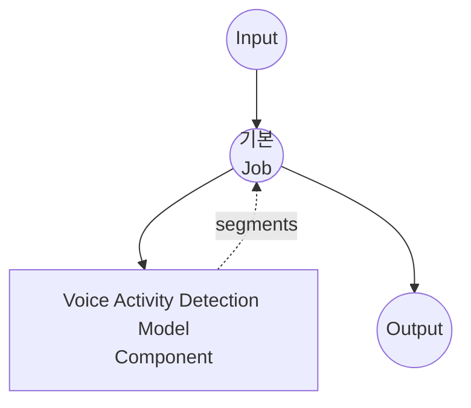

# Voice Activity Detection Model Task 예제

이 예제는 model-compose의 내장 voice-activity-detection 작업과 Silero VAD 모델을 사용하여 오디오 파일에서 음성 구간을 감지하는 방법을 보여줍니다. 외부 API 없이 오프라인으로 음성 세그멘테이션을 수행합니다.

## 개요

이 워크플로우는 입력 오디오에서 감지된 음성 구간의 평평한 리스트를 반환합니다:

1. **로컬 VAD 모델**: `silero-vad` pip 패키지에 번들된 Silero VAD 모델을 로컬에서 실행 (HuggingFace 다운로드 불필요)
2. **세그먼트 감지**: 각 음성 구간의 `start`, `end`, `confidence` 방출
3. **민감도 조정 가능**: 임계값, 최소 지속 시간, 패딩을 요청별로 설정 가능
4. **외부 API 불필요**: 완전히 오프라인으로 동작

## 준비사항

### 필수 요구사항

- model-compose가 설치되어 PATH에서 사용 가능
- `silero-vad`, `torch`, `torchaudio`, `numpy` (컴포넌트 setup requirement로 선언되어 첫 실행 시 자동 설치)

### VAD가 필요한 이유

VAD는 speech-to-text 파이프라인의 전처리 단계로 흔히 사용됩니다:

- **ASR 환각 감소**: Whisper 계열 모델은 침묵/잡음에서 텍스트를 지어내는 경향이 있으며, 비음성 구간을 스킵하면 근본 차단됩니다
- **연산 절약**: 조용한 구간을 ASR로 처리하지 않음
- **문장 경계 힌트**: 긴 침묵은 발화 종료 신호로, 자막 분할이나 화자 분리에 유용

## 실행 방법

1. **서비스 시작:**
   ```bash
   model-compose up
   ```

2. **워크플로우 실행:**

   **API 사용:**
   ```bash
   # 기본 감지
   curl -X POST http://localhost:8080/api/workflows/runs \
     -F "audio=@/path/to/your/audio.mp3" \
     -F "input={\"audio\": \"@audio\"}"

   # 엄격한 임계값과 긴 최소 음성 지속 시간
   curl -X POST http://localhost:8080/api/workflows/runs \
     -F "audio=@/path/to/your/audio.mp3" \
     -F "input={\"audio\": \"@audio\", \"threshold\": 0.6, \"min_speech_duration\": \"500ms\"}"
   ```

   **Web UI 사용:**
   - Web UI 열기: http://localhost:8081
   - 오디오 파일 업로드 (MP3, WAV, FLAC 등)
   - `threshold`, `min_speech_duration`, `min_silence_duration`, `speech_padding_time` 선택적 오버라이드
   - "Run Workflow" 버튼 클릭

   **CLI 사용:**
   ```bash
   # 기본 감지
   model-compose run voice-activity-detection --input '{"audio": "/path/to/your/audio.mp3"}'

   # 사용자 정의 파라미터
   model-compose run voice-activity-detection --input '{
     "audio": "/path/to/your/audio.mp3",
     "threshold": 0.6,
     "min_speech_duration": "500ms",
     "min_silence_duration": "1s"
   }'
   ```

## 컴포넌트 세부사항

### Voice Activity Detection Model Component (기본값)

- **유형**: `voice-activity-detection` 작업을 가진 모델 컴포넌트
- **드라이버**: `custom`
- **패밀리**: `silero`
- **목적**: 오디오에서 음성 구간 감지
- **기능**:
  - 번들 모델 (수동 다운로드 불필요)
  - 16 kHz 및 8 kHz 모노 오디오 지원
  - 입력 오디오를 대상 `sample_rate`로 자동 리샘플링
  - 임계값, 최소 음성/침묵 지속 시간, 패딩 구성 가능

### 모델 정보: Silero VAD

- **개발자**: Silero Team
- **유형**: 프레임 단위 음성 확률을 위한 경량 CNN (~1MB)
- **프레임 크기**: 16 kHz에서 512 샘플 (32 ms), 8 kHz에서 256 샘플
- **라이선스**: MIT

## 워크플로우 세부사항

### "Voice Activity Detection" 워크플로우 (기본값)

**설명**: 오디오 파일에서 음성 구간을 감지하고 평평한 리스트로 반환합니다.

#### Job 흐름



#### 입력 파라미터

| 파라미터 | 유형 | 필수 | 기본값 | 설명 |
|---------|------|------|--------|------|
| `audio` | audio | 예 | - | 입력 오디오 파일 (MP3, WAV, FLAC 등) |
| `sample_rate` | integer | 아니오 | `16000` | 대상 샘플레이트 (16000 또는 8000); 필요 시 자동 리샘플링 |
| `threshold` | number | 아니오 | `0.5` | 음성 확률 임계값 (0.0–1.0); 높을수록 엄격 |
| `min_speech_duration` | duration | 아니오 | `250ms` | 이보다 짧은 음성 구간은 제거 |
| `min_silence_duration` | duration | 아니오 | `500ms` | 인접 구간을 분리하는 데 필요한 침묵 |
| `speech_padding_time` | duration | 아니오 | `100ms` | 감지된 각 구간 양쪽에 추가되는 패딩 |

Duration 필드는 `"250ms"`, `"0.5s"`, 또는 순수 숫자(초) 형식을 허용합니다.

#### 출력 형식

워크플로우 출력은 감지된 음성 구간의 평평한 JSON 배열입니다 (침묵 구간은 생략).

| 필드 | 유형 | 설명 |
|-----|------|------|
| `start` | float | 구간 시작 시간 (초) |
| `end` | float | 구간 종료 시간 (초) |
| `confidence` | float | 구간 내 Silero 음성 확률 평균 (0.0–1.0) |

#### 출력 예시

```json
{
  "segments": [
    { "start": 0.124, "end": 44.58,  "confidence": 0.916 },
    { "start": 47.07, "end": 150.02, "confidence": 0.937 },
    { "start": 151.10, "end": 175.24, "confidence": 0.949 }
  ]
}
```

## 맞춤화

### 엄격한 감지 (오탐 감소)

임계값을 높이고 더 긴 음성 지속을 요구:

```yaml
component:
  type: model
  task: voice-activity-detection
  driver: custom
  family: silero
  action:
    audio: ${input.audio as audio}
    params:
      threshold: 0.7
      min_speech_duration: 500ms
      min_silence_duration: 1s
```

### 관대한 감지 (속삭임/짧은 반응 포착)

임계값을 낮추고 최소 지속 시간을 줄임:

```yaml
component:
  type: model
  task: voice-activity-detection
  driver: custom
  family: silero
  action:
    audio: ${input.audio as audio}
    params:
      threshold: 0.3
      min_speech_duration: 100ms
      min_silence_duration: 250ms
      speech_padding_time: 200ms
```

### 8 kHz 오디오 (전화망)

```yaml
component:
  type: model
  task: voice-activity-detection
  driver: custom
  family: silero
  action:
    audio: ${input.audio as audio}
    sample_rate: 8000
```

## Speech-to-Text와 연결

감지된 구간을 전처리 단계로 사용하여 ASR 환각을 줄이고 침묵을 스킵:

```yaml
workflow:
  jobs:
    - id: vad
      component: silero-vad
      input:
        audio: ${input.audio as audio}

    - id: transcribe
      component: whisper
      depends_on: [vad]
      input:
        audio: ${input.audio as audio}
        segments: ${jobs.vad.output}   # [{start, end, confidence}, ...]

components:
  - id: silero-vad
    type: model
    task: voice-activity-detection
    driver: custom
    family: silero

  - id: whisper
    type: model
    task: speech-to-text
    driver: huggingface
    architecture: whisper
    model: openai/whisper-large-v3-turbo
```

## 문제 해결

### 일반적인 문제

1. **세그먼트가 감지되지 않음**: `threshold`를 낮추거나 (예: `0.3`) `min_speech_duration`을 줄이세요
2. **잡음/음악에서 오탐이 많음**: `threshold`를 높이고 (예: `0.7`) `min_speech_duration`을 늘리세요
3. **구간 경계에서 단어가 잘림**: `speech_padding_time`을 늘리세요 (예: `200ms`)
4. **조용한 속삭임 감지 불량**: `threshold`를 낮추고 `min_silence_duration`을 줄이세요
