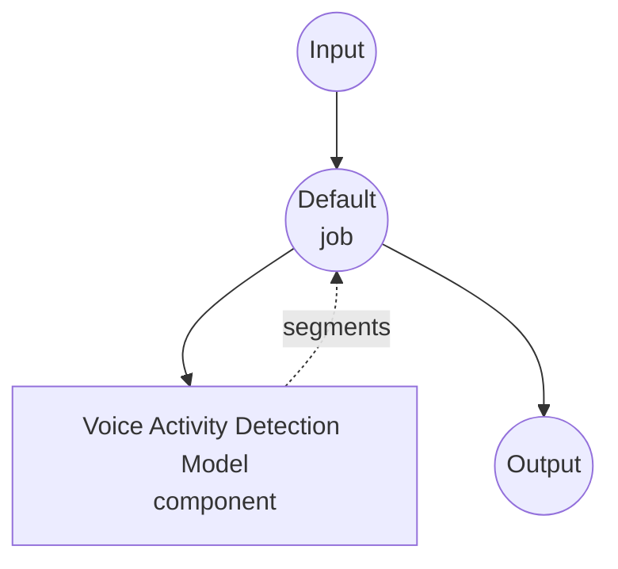

# Voice Activity Detection Model Task Example

This example demonstrates how to detect speech segments in an audio file using model-compose's built-in voice-activity-detection task with the Silero VAD model, providing offline speech segmentation without external APIs.

## Overview

This workflow returns a flat list of speech segments detected in the input audio:

1. **Local VAD Model**: Runs the Silero VAD model locally (bundled inside the `silero-vad` pip package, no HuggingFace download required)
2. **Segment Detection**: Emits `start`, `end`, and `confidence` for each detected speech segment
3. **Tunable Sensitivity**: Threshold, minimum durations, and padding are all configurable per request
4. **No External APIs**: Fully offline detection

## Preparation

### Prerequisites

- model-compose installed and available in your PATH
- Python environment with `silero-vad`, `torch`, `torchaudio`, `numpy` (declared as component setup requirements and auto-installed on first run)

### Why VAD

Voice Activity Detection is commonly used as a pre-processing stage for speech-to-text pipelines:

- **Reduces ASR hallucinations**: Whisper-family models tend to fabricate text on silence/noise; skipping non-speech regions eliminates this at the source
- **Saves compute**: Skip silent regions instead of running ASR on them
- **Gives sentence-boundary hints**: Long silences signal end of utterances, useful for splitting subtitles or diarizing speakers

## How to Run

1. **Start the service:**
   ```bash
   model-compose up
   ```

2. **Run the workflow:**

   **Using API:**
   ```bash
   # Basic detection
   curl -X POST http://localhost:8080/api/workflows/runs \
     -F "audio=@/path/to/your/audio.mp3" \
     -F "input={\"audio\": \"@audio\"}"

   # With a stricter threshold and longer minimum speech duration
   curl -X POST http://localhost:8080/api/workflows/runs \
     -F "audio=@/path/to/your/audio.mp3" \
     -F "input={\"audio\": \"@audio\", \"threshold\": 0.6, \"min_speech_duration\": \"500ms\"}"
   ```

   **Using Web UI:**
   - Open the Web UI: http://localhost:8081
   - Upload an audio file (MP3, WAV, FLAC, etc.)
   - Optionally override `threshold`, `min_speech_duration`, `min_silence_duration`, `speech_padding_time`
   - Click the "Run Workflow" button

   **Using CLI:**
   ```bash
   # Basic detection
   model-compose run voice-activity-detection --input '{"audio": "/path/to/your/audio.mp3"}'

   # With custom parameters
   model-compose run voice-activity-detection --input '{
     "audio": "/path/to/your/audio.mp3",
     "threshold": 0.6,
     "min_speech_duration": "500ms",
     "min_silence_duration": "1s"
   }'
   ```

## Component Details

### Voice Activity Detection Model Component (Default)

- **Type**: Model component with `voice-activity-detection` task
- **Driver**: `custom`
- **Family**: `silero`
- **Purpose**: Detect speech regions in audio
- **Features**:
  - Bundled model (no manual download needed)
  - Supports 16 kHz and 8 kHz mono audio
  - Automatic resampling of input audio to the target `sample_rate`
  - Configurable threshold, min speech/silence duration, and pad

### Model Information: Silero VAD

- **Developer**: Silero Team
- **Type**: Lightweight CNN (~1MB) for frame-level speech probability
- **Frame Size**: 512 samples at 16 kHz (32 ms), 256 samples at 8 kHz
- **License**: MIT

## Workflow Details

### "Voice Activity Detection" Workflow (Default)

**Description**: Detect speech segments in an audio file and return them as a flat list.

#### Job Flow



#### Input Parameters

| Parameter | Type | Required | Default | Description |
|-----------|------|----------|---------|-------------|
| `audio` | audio | Yes | - | Input audio file (MP3, WAV, FLAC, etc.) |
| `sample_rate` | integer | No | `16000` | Target sample rate (16000 or 8000); input is resampled if needed |
| `threshold` | number | No | `0.5` | Speech probability threshold (0.0–1.0); higher = stricter |
| `min_speech_duration` | duration | No | `250ms` | Discard speech chunks shorter than this |
| `min_silence_duration` | duration | No | `500ms` | Silence required to split adjacent chunks |
| `speech_padding_time` | duration | No | `100ms` | Padding added to both sides of each detected chunk |

Duration fields accept values like `"250ms"`, `"0.5s"`, or bare numeric seconds.

#### Output Format

The workflow output is a flat JSON array of detected speech segments (silent regions are omitted).

| Field | Type | Description |
|-------|------|-------------|
| `start` | float | Segment start time in seconds |
| `end` | float | Segment end time in seconds |
| `confidence` | float | Mean Silero speech probability over the segment (0.0–1.0) |

#### Example Output

```json
{
  "segments": [
    { "start": 0.124, "end": 44.58,  "confidence": 0.916 },
    { "start": 47.07, "end": 150.02, "confidence": 0.937 },
    { "start": 151.10, "end": 175.24, "confidence": 0.949 }
  ]
}
```

## Customization

### Stricter Detection (fewer false positives)

Raise the threshold and require longer speech spans:

```yaml
component:
  type: model
  task: voice-activity-detection
  driver: custom
  family: silero
  action:
    audio: ${input.audio as audio}
    params:
      threshold: 0.7
      min_speech_duration: 500ms
      min_silence_duration: 1s
```

### Looser Detection (catches whispers / short interjections)

Lower the threshold and reduce minimum durations:

```yaml
component:
  type: model
  task: voice-activity-detection
  driver: custom
  family: silero
  action:
    audio: ${input.audio as audio}
    params:
      threshold: 0.3
      min_speech_duration: 100ms
      min_silence_duration: 250ms
      speech_padding_time: 200ms
```

### 8 kHz Audio (Telephony)

```yaml
component:
  type: model
  task: voice-activity-detection
  driver: custom
  family: silero
  action:
    audio: ${input.audio as audio}
    sample_rate: 8000
```

## Chaining with Speech-to-Text

Use the detected segments as a pre-processing step to reduce ASR hallucinations and skip silence:

```yaml
workflow:
  jobs:
    - id: vad
      component: silero-vad
      input:
        audio: ${input.audio as audio}

    - id: transcribe
      component: whisper
      depends_on: [vad]
      input:
        audio: ${input.audio as audio}
        segments: ${jobs.vad.output}   # [{start, end, confidence}, ...]

components:
  - id: silero-vad
    type: model
    task: voice-activity-detection
    driver: custom
    family: silero

  - id: whisper
    type: model
    task: speech-to-text
    driver: huggingface
    architecture: whisper
    model: openai/whisper-large-v3-turbo
```

## Troubleshooting

### Common Issues

1. **No segments detected**: Lower `threshold` (e.g. `0.3`) or reduce `min_speech_duration`
2. **Too many false positives on noise/music**: Raise `threshold` (e.g. `0.7`) and increase `min_speech_duration`
3. **Words clipped at segment boundaries**: Increase `speech_padding_time` (e.g. `200ms`)
4. **Poor detection on quiet whispers**: Lower `threshold` and reduce `min_silence_duration`
