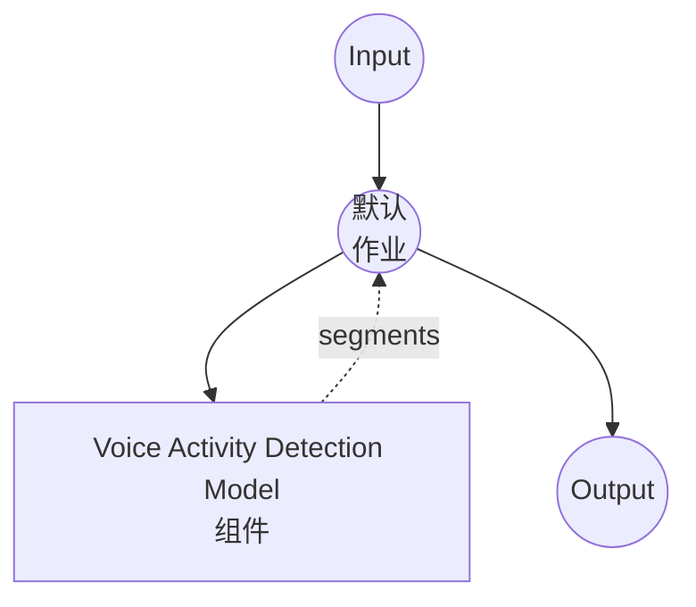

# Voice Activity Detection Model Task 示例

本示例演示如何使用 model-compose 内置的 voice-activity-detection 任务和 Silero VAD 模型在音频文件中检测语音片段，无需外部 API 即可离线进行语音分段。

## 概述

此工作流返回输入音频中检测到的语音片段的扁平列表：

1. **本地 VAD 模型**：在本地运行 Silero VAD 模型（捆绑在 `silero-vad` pip 包中，无需 HuggingFace 下载）
2. **片段检测**：为每个检测到的语音片段输出 `start`、`end` 和 `confidence`
3. **可调灵敏度**：阈值、最小持续时间和填充可按请求配置
4. **无需外部 API**：完全离线运行

## 准备工作

### 前提条件

- 已安装 model-compose 并在 PATH 中可用
- 具有 `silero-vad`、`torch`、`torchaudio`、`numpy` 的 Python 环境（声明为组件 setup requirement，首次运行时自动安装）

### 为什么需要 VAD

VAD 通常用作 speech-to-text 流水线的预处理阶段：

- **减少 ASR 幻觉**：Whisper 系列模型倾向于在静音/噪音处编造文本；跳过非语音区域可从源头消除此问题
- **节省计算**：不对静音区域运行 ASR
- **提供句子边界提示**：长时间静音表示语句结束，有助于分割字幕或说话人分离

## 运行方式

1. **启动服务：**
   ```bash
   model-compose up
   ```

2. **运行工作流：**

   **使用 API：**
   ```bash
   # 基本检测
   curl -X POST http://localhost:8080/api/workflows/runs \
     -F "audio=@/path/to/your/audio.mp3" \
     -F "input={\"audio\": \"@audio\"}"

   # 更严格的阈值和更长的最小语音持续时间
   curl -X POST http://localhost:8080/api/workflows/runs \
     -F "audio=@/path/to/your/audio.mp3" \
     -F "input={\"audio\": \"@audio\", \"threshold\": 0.6, \"min_speech_duration\": \"500ms\"}"
   ```

   **使用 Web UI：**
   - 打开 Web UI: http://localhost:8081
   - 上传音频文件（MP3、WAV、FLAC 等）
   - 可选覆盖 `threshold`、`min_speech_duration`、`min_silence_duration`、`speech_padding_time`
   - 点击 "Run Workflow" 按钮

   **使用 CLI：**
   ```bash
   # 基本检测
   model-compose run voice-activity-detection --input '{"audio": "/path/to/your/audio.mp3"}'

   # 使用自定义参数
   model-compose run voice-activity-detection --input '{
     "audio": "/path/to/your/audio.mp3",
     "threshold": 0.6,
     "min_speech_duration": "500ms",
     "min_silence_duration": "1s"
   }'
   ```

## 组件详情

### Voice Activity Detection Model Component（默认）

- **类型**：带有 `voice-activity-detection` 任务的模型组件
- **驱动**：`custom`
- **系列**：`silero`
- **用途**：检测音频中的语音区域
- **特性**：
  - 捆绑模型（无需手动下载）
  - 支持 16 kHz 和 8 kHz 单声道音频
  - 自动将输入音频重采样到目标 `sample_rate`
  - 可配置阈值、最小语音/静音持续时间和填充

### 模型信息：Silero VAD

- **开发者**：Silero Team
- **类型**：用于帧级语音概率的轻量级 CNN（~1MB）
- **帧大小**：16 kHz 下 512 采样点（32 ms），8 kHz 下 256 采样点
- **许可证**：MIT

## 工作流详情

### "Voice Activity Detection" 工作流（默认）

**描述**：检测音频文件中的语音片段并作为扁平列表返回。

#### 作业流程



#### 输入参数

| 参数 | 类型 | 必需 | 默认值 | 描述 |
|------|------|------|--------|------|
| `audio` | audio | 是 | - | 输入音频文件（MP3、WAV、FLAC 等） |
| `sample_rate` | integer | 否 | `16000` | 目标采样率（16000 或 8000）；根据需要重采样 |
| `threshold` | number | 否 | `0.5` | 语音概率阈值（0.0–1.0）；越高越严格 |
| `min_speech_duration` | duration | 否 | `250ms` | 丢弃短于此值的语音块 |
| `min_silence_duration` | duration | 否 | `500ms` | 分割相邻块所需的静音时长 |
| `speech_padding_time` | duration | 否 | `100ms` | 为每个检测到的块两侧添加的填充 |

Duration 字段接受 `"250ms"`、`"0.5s"` 或纯数字（秒）格式。

#### 输出格式

工作流输出是检测到的语音片段的扁平 JSON 数组（静音区域被省略）。

| 字段 | 类型 | 描述 |
|------|------|------|
| `start` | float | 片段开始时间（秒） |
| `end` | float | 片段结束时间（秒） |
| `confidence` | float | 片段内 Silero 语音概率均值（0.0–1.0） |

#### 输出示例

```json
{
  "segments": [
    { "start": 0.124, "end": 44.58,  "confidence": 0.916 },
    { "start": 47.07, "end": 150.02, "confidence": 0.937 },
    { "start": 151.10, "end": 175.24, "confidence": 0.949 }
  ]
}
```

## 自定义

### 更严格的检测（减少误报）

提高阈值并要求更长的语音持续时间：

```yaml
component:
  type: model
  task: voice-activity-detection
  driver: custom
  family: silero
  action:
    audio: ${input.audio as audio}
    params:
      threshold: 0.7
      min_speech_duration: 500ms
      min_silence_duration: 1s
```

### 更宽松的检测（捕捉低语/短反应）

降低阈值并减少最小持续时间：

```yaml
component:
  type: model
  task: voice-activity-detection
  driver: custom
  family: silero
  action:
    audio: ${input.audio as audio}
    params:
      threshold: 0.3
      min_speech_duration: 100ms
      min_silence_duration: 250ms
      speech_padding_time: 200ms
```

### 8 kHz 音频（电话）

```yaml
component:
  type: model
  task: voice-activity-detection
  driver: custom
  family: silero
  action:
    audio: ${input.audio as audio}
    sample_rate: 8000
```

## 与 Speech-to-Text 链接

使用检测到的片段作为预处理步骤，减少 ASR 幻觉并跳过静音：

```yaml
workflow:
  jobs:
    - id: vad
      component: silero-vad
      input:
        audio: ${input.audio as audio}

    - id: transcribe
      component: whisper
      depends_on: [vad]
      input:
        audio: ${input.audio as audio}
        segments: ${jobs.vad.output}   # [{start, end, confidence}, ...]

components:
  - id: silero-vad
    type: model
    task: voice-activity-detection
    driver: custom
    family: silero

  - id: whisper
    type: model
    task: speech-to-text
    driver: huggingface
    architecture: whisper
    model: openai/whisper-large-v3-turbo
```

## 故障排除

### 常见问题

1. **未检测到片段**：降低 `threshold`（例如 `0.3`）或减少 `min_speech_duration`
2. **噪音/音乐上误报太多**：提高 `threshold`（例如 `0.7`）并增加 `min_speech_duration`
3. **片段边界处单词被截断**：增加 `speech_padding_time`（例如 `200ms`）
4. **对轻声细语检测不佳**：降低 `threshold` 并减少 `min_silence_duration`
