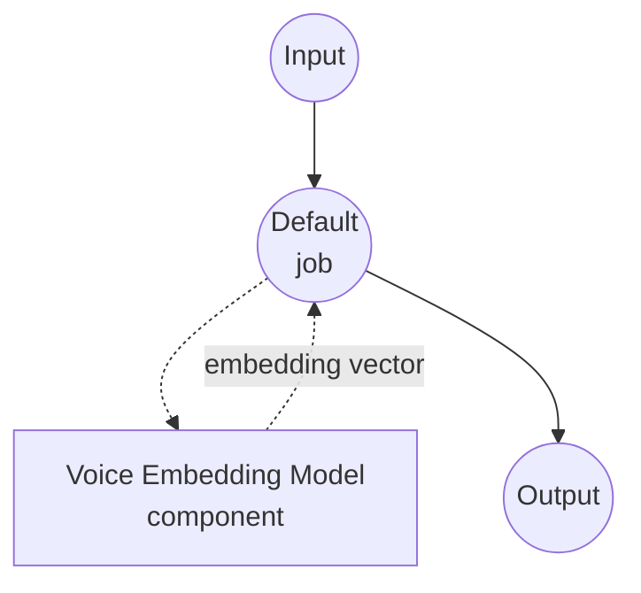

# Voice Embedding Model Task 예제

이 예제는 model-compose에 내장된 voice-embedding 작업과 pyannote.audio 임베딩 모델을 사용하여, 오디오 파일에서 화자 임베딩 벡터를 추출하는 방법을 보여줍니다. 최초 모델 다운로드 이후에는 완전히 로컬에서 실행됩니다.

## 개요

이 워크플로우는 입력 오디오에 담긴 화자의 목소리 특성을 하나의 고정 차원 벡터로 반환합니다:

1. **로컬 임베딩 모델**: 최초 1회 HuggingFace에서 다운로드한 뒤 pyannote.audio의 `pyannote/embedding` 모델을 로컬에서 실행
2. **전체 발화 단위 임베딩**: 오디오 전체를 하나의 벡터로 집계하여 화자 유사도 비교에 바로 사용 가능
3. **전처리 옵션 제공**: 임베딩 전에 적용할 `sample_rate` 리샘플링과 결과 벡터의 `normalize` 여부 지정 가능
4. **외부 API 불필요**: 모델 캐시가 완료되면 완전 오프라인 동작

## 사전 준비

### 필수 조건

- model-compose가 설치되어 PATH에 등록되어 있어야 합니다
- `pyannote.audio`, `torch`, `torchaudio`, `numpy`, `soxr`가 있는 Python 환경 (컴포넌트의 setup 요구사항으로 선언되어 있어 최초 실행 시 자동 설치됩니다)
- 게이트가 걸린 `pyannote/embedding` 모델의 이용 약관을 수락한 HuggingFace 액세스 토큰. model-compose를 실행하기 전에 `HF_TOKEN` 환경 변수로 설정하세요.

### 보이스 임베딩을 왜 사용하나

보이스 임베딩은 화자의 음성 정체성을 고정 크기의 벡터로 압축해, 원본 오디오를 비교하는 대신 간단한 거리 계산으로 화자를 비교할 수 있게 해줍니다:

- **화자 검증(Speaker Verification)**: 두 오디오가 같은 사람 목소리인지 코사인 유사도로 판정
- **화자 식별(Speaker Identification)**: 등록된 화자 데이터베이스와 매칭
- **화자 클러스터링**: 라벨 없는 오디오들(예: 팟캐스트 아카이브)을 화자 기준으로 그룹화
- **음성 검색**: 대규모 오디오 코퍼스에서 특정 화자의 클립을 검색

참고: 이 작업은 각 입력 클립에 한 명의 화자만 있다고 가정합니다. 여러 화자가 섞여 있다면 먼저 `speaker-diarization` 작업으로 구간을 나눈 뒤 각 구간을 개별적으로 임베딩하세요.

## 실행 방법

1. **서비스 시작:**
   ```bash
   export HF_TOKEN=hf_xxx     # pyannote/embedding 접근 권한이 있는 토큰
   model-compose up
   ```

2. **워크플로우 실행:**

   **API 사용:**
   ```bash
   # 기본 임베딩 (L2 정규화, 16 kHz 리샘플)
   curl -X POST http://localhost:8080/api/workflows/runs \
     -F "audio=@/path/to/your/audio.wav" \
     -F "input={\"audio\": \"@audio\"}"

   # 정규화 없이 모델 네이티브 샘플레이트로 원본 임베딩
   curl -X POST http://localhost:8080/api/workflows/runs \
     -F "audio=@/path/to/your/audio.wav" \
     -F "input={\"audio\": \"@audio\", \"normalize\": false, \"sample_rate\": null}"
   ```

   **웹 UI 사용:**
   - 웹 UI 열기: http://localhost:8081
   - 오디오 파일 업로드 (MP3, WAV, FLAC 등)
   - 필요하면 `normalize` 토글 또는 `sample_rate` 설정
   - "Run Workflow" 버튼 클릭

   **CLI 사용:**
   ```bash
   # 기본 임베딩
   model-compose run voice-embedding --input '{"audio": "/path/to/your/audio.wav"}'

   # 전처리 옵션 명시
   model-compose run voice-embedding --input '{
     "audio": "/path/to/your/audio.wav",
     "normalize": true,
     "sample_rate": 16000
   }'
   ```

## 컴포넌트 상세

### Voice Embedding 모델 컴포넌트 (기본)

- **타입**: `voice-embedding` 태스크의 model 컴포넌트
- **드라이버**: `custom`
- **패밀리**: `pyannote`
- **역할**: 오디오 클립에서 화자 정체성 벡터를 생성
- **특징**:
  - 최초 1회 모델 다운로드 후 pyannote.audio로 로컬 추론
  - 클립 길이와 무관하게 전체 발화 단위 임베딩 반환
  - 코사인 유사도 비교를 위한 L2 정규화 옵션 제공

### 모델 정보: pyannote/embedding

- **개발**: pyannote 팀 (Hervé Bredin 외)
- **방식**: VoxCeleb으로 학습된 X-vector 계열 화자 임베딩
- **출력 차원**: 512
- **라이선스**: MIT (모델 가중치는 HuggingFace에서 게이팅되어 있어 이용 약관 수락 필요)

## 워크플로우 상세

### "Voice Embedding" 워크플로우 (기본)

**설명**: 오디오 클립에서 화자 임베딩 벡터를 추출하여 JSON 배열로 반환합니다.

#### 작업 흐름



#### 입력 파라미터

| 파라미터 | 타입 | 필수 | 기본값 | 설명 |
|----------|------|------|--------|------|
| `audio` | audio | 예 | - | 입력 오디오 클립 (MP3, WAV, FLAC 등). 단일 화자 전제 |
| `normalize` | boolean | 아니오 | `true` | 출력 벡터를 L2 정규화 (코사인 유사도가 내적과 동일해짐) |
| `sample_rate` | integer | 아니오 | `16000` | 임베딩 이전에 적용할 목표 샘플레이트. `null`이면 원본 유지 |

#### 출력 포맷

| 필드 | 타입 | 설명 |
|------|------|------|
| `embedding` | json | 화자 임베딩을 나타내는 부동소수점 배열 |

#### 출력 예시

```json
{
  "embedding": [0.0421, -0.0173, 0.0895, -0.0067, 0.1023, ...]
}
```

## 화자 다이어리제이션과 체이닝

먼저 다이어리제이션으로 구간을 나눈 뒤 각 화자 구간을 임베딩하면, 녹음 파일에서 화자별 지문을 만들 수 있습니다:

```yaml
workflow:
  jobs:
    - id: diarize
      component: pyannote-diarizer
      input:
        audio: ${input.audio as audio}

    - id: embed
      component: pyannote-embedder
      depends_on: [diarize]
      input:
        audio: ${input.audio as audio}
        segments: ${jobs.diarize.output.segments}

components:
  - id: pyannote-diarizer
    type: model
    task: speaker-diarization
    driver: custom
    family: pyannote
    model:
      provider: huggingface
      repository: pyannote/speaker-diarization-3.1
      token: ${env.HF_TOKEN}

  - id: pyannote-embedder
    type: model
    task: voice-embedding
    driver: custom
    family: pyannote
    model:
      provider: huggingface
      repository: pyannote/embedding
      token: ${env.HF_TOKEN}
```

## 문제 해결

### 자주 발생하는 문제

1. **"gated repo" 오류로 로딩 실패**: https://huggingface.co/pyannote/embedding 에서 모델 이용 약관을 수락한 뒤, 유효한 `HF_TOKEN`을 export하고 서비스를 시작하세요.
2. **같은 화자의 임베딩이 서로 달라 보임**: `normalize: true`로 두고 코사인 유사도(또는 L2 정규화된 벡터의 내적)로 비교하세요. 정규화 없이 유클리드 거리로 비교하면 결과가 왜곡됩니다.
3. **매우 짧은 클립에서 벡터가 불안정함**: 화자 임베딩은 최소 1~2초 이상의 깨끗한 음성이 필요합니다. 클립을 늘리거나 패딩하세요.
4. **잡음이나 음악이 임베딩을 지배함**: `voice-activity-detection` 태스크로 전처리한 뒤 음성 구간만 임베딩하세요.
