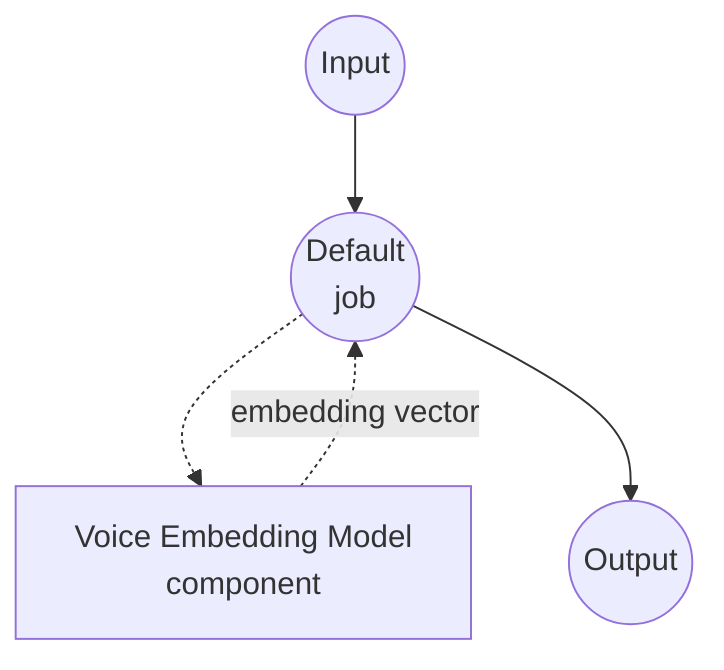

# Voice Embedding Model Task Example

This example demonstrates how to extract a speaker embedding vector from an audio file using model-compose's built-in voice-embedding task with the pyannote.audio embedding model, running fully locally after the initial model download.

## Overview

This workflow returns a single fixed-dimensional embedding that characterizes the speaker's voice in the input audio:

1. **Local Embedding Model**: Runs pyannote.audio's `pyannote/embedding` model locally after a one-time HuggingFace download
2. **Whole-Utterance Embedding**: Aggregates the entire audio into one L2-normalizable vector suitable for speaker similarity
3. **Configurable Preprocessing**: Optional `sample_rate` resampling and `normalize` flag applied before/after embedding
4. **No External APIs**: Fully offline once the model is cached

## Preparation

### Prerequisites

- model-compose installed and available in your PATH
- Python environment with `pyannote.audio`, `torch`, `torchaudio`, `numpy`, `soxr` (declared as component setup requirements and auto-installed on first run)
- A HuggingFace access token accepted for the gated `pyannote/embedding` model. Set it via the `HF_TOKEN` environment variable before starting model-compose.

### Why Voice Embeddings

Voice embeddings compress a speaker's vocal identity into a fixed-size vector, so downstream code can compare speakers with a simple distance metric instead of raw audio:

- **Speaker verification**: Decide whether two clips come from the same speaker via cosine similarity
- **Speaker identification**: Match a clip against an enrolled speaker database
- **Speaker clustering**: Group unlabeled clips by inferred speaker, e.g. across a podcast archive
- **Voice search**: Retrieve clips of a target speaker from a large audio corpus

Note: this task assumes each input clip contains a single speaker. Multi-speaker audio should first be segmented (e.g. with the `speaker-diarization` task) so each segment is embedded on its own.

## How to Run

1. **Start the service:**
   ```bash
   export HF_TOKEN=hf_xxx     # token with access to pyannote/embedding
   model-compose up
   ```

2. **Run the workflow:**

   **Using API:**
   ```bash
   # Basic embedding (L2-normalized, resampled to 16 kHz)
   curl -X POST http://localhost:8080/api/workflows/runs \
     -F "audio=@/path/to/your/audio.wav" \
     -F "input={\"audio\": \"@audio\"}"

   # Raw (non-normalized) embedding at the model's native rate
   curl -X POST http://localhost:8080/api/workflows/runs \
     -F "audio=@/path/to/your/audio.wav" \
     -F "input={\"audio\": \"@audio\", \"normalize\": false, \"sample_rate\": null}"
   ```

   **Using Web UI:**
   - Open the Web UI: http://localhost:8081
   - Upload an audio file (MP3, WAV, FLAC, etc.)
   - Optionally toggle `normalize` or set `sample_rate`
   - Click the "Run Workflow" button

   **Using CLI:**
   ```bash
   # Basic embedding
   model-compose run voice-embedding --input '{"audio": "/path/to/your/audio.wav"}'

   # With explicit preprocessing
   model-compose run voice-embedding --input '{
     "audio": "/path/to/your/audio.wav",
     "normalize": true,
     "sample_rate": 16000
   }'
   ```

## Component Details

### Voice Embedding Model Component (Default)

- **Type**: Model component with `voice-embedding` task
- **Driver**: `custom`
- **Family**: `pyannote`
- **Purpose**: Produce a speaker-identity vector for an audio clip
- **Features**:
  - Local inference via pyannote.audio after one-time model download
  - Whole-utterance embedding, independent of clip duration
  - Optional L2 normalization for cosine-similarity comparisons

### Model Information: pyannote/embedding

- **Developer**: pyannote team (Hervé Bredin et al.)
- **Architecture**: X-vector–style speaker embedding trained on VoxCeleb
- **Output Dimensions**: 512
- **License**: MIT (model weights gated on HuggingFace; requires accepting the terms)

## Workflow Details

### "Voice Embedding" Workflow (Default)

**Description**: Extract a speaker embedding vector from an audio clip and return it as a JSON array.

#### Job Flow



#### Input Parameters

| Parameter | Type | Required | Default | Description |
|-----------|------|----------|---------|-------------|
| `audio` | audio | Yes | - | Input audio clip (MP3, WAV, FLAC, etc.), assumed single-speaker |
| `normalize` | boolean | No | `true` | L2-normalize the output vector so cosine similarity reduces to a dot product |
| `sample_rate` | integer | No | `16000` | Target sample rate applied before embedding; set to `null` to keep the source rate |

#### Output Format

| Field | Type | Description |
|-------|------|-------------|
| `embedding` | json | Array of floating-point numbers representing the speaker embedding |

#### Example Output

```json
{
  "embedding": [0.0421, -0.0173, 0.0895, -0.0067, 0.1023, ...]
}
```

## Chaining with Speaker Diarization

Diarize first, then embed each speaker's segments to build a per-speaker fingerprint of a recording:

```yaml
workflow:
  jobs:
    - id: diarize
      component: pyannote-diarizer
      input:
        audio: ${input.audio as audio}

    - id: embed
      component: pyannote-embedder
      depends_on: [diarize]
      input:
        audio: ${input.audio as audio}
        segments: ${jobs.diarize.output.segments}

components:
  - id: pyannote-diarizer
    type: model
    task: speaker-diarization
    driver: custom
    family: pyannote
    model:
      provider: huggingface
      repository: pyannote/speaker-diarization-3.1
      token: ${env.HF_TOKEN}

  - id: pyannote-embedder
    type: model
    task: voice-embedding
    driver: custom
    family: pyannote
    model:
      provider: huggingface
      repository: pyannote/embedding
      token: ${env.HF_TOKEN}
```

## Troubleshooting

### Common Issues

1. **Fails to load with "gated repo" error**: Accept the model terms at https://huggingface.co/pyannote/embedding and export a valid `HF_TOKEN` before starting the service.
2. **Embeddings from the same speaker look dissimilar**: Ensure `normalize: true` and compare with cosine similarity (or equivalently, the dot product of L2-normalized vectors), not raw Euclidean distance on unnormalized vectors.
3. **Very short clips give unstable vectors**: Speaker embeddings expect at least ~1–2 seconds of clean speech; pad or use longer clips.
4. **Noise or music dominates the embedding**: Preprocess with the `voice-activity-detection` task and embed only the speech regions.
