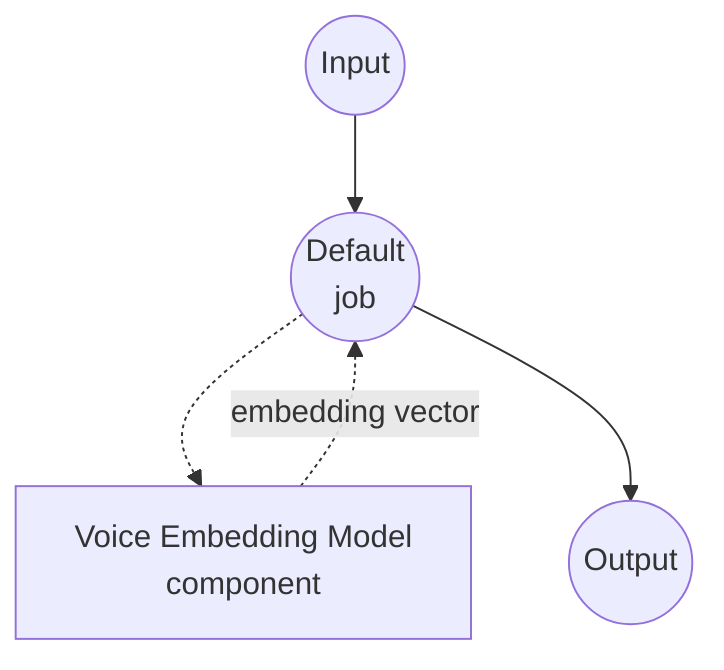

# Voice Embedding Model Task 示例

本示例演示如何使用 model-compose 内置的 voice-embedding 任务与 pyannote.audio 嵌入模型,从音频文件中提取说话人嵌入向量。首次模型下载完成后,可完全在本地运行。

## 概述

该工作流会将输入音频中说话人的声音特征汇总为一个固定维度的嵌入向量:

1. **本地嵌入模型**: 首次从 HuggingFace 下载后,在本地运行 pyannote.audio 的 `pyannote/embedding` 模型
2. **整段发言级嵌入**: 将整段音频聚合为一个向量,可直接用于说话人相似度比较
3. **可配置预处理**: 可选的 `sample_rate` 重采样,以及输出向量是否 `normalize`
4. **无需外部 API**: 模型缓存完成后完全离线运行

## 准备工作

### 必要条件

- 已安装 model-compose 并加入 PATH
- Python 环境包含 `pyannote.audio`、`torch`、`torchaudio`、`numpy`、`soxr`(已声明为组件的 setup 依赖,首次运行时自动安装)
- 已接受受门控的 `pyannote/embedding` 模型条款的 HuggingFace 访问令牌。启动 model-compose 前,请通过 `HF_TOKEN` 环境变量设置。

### 为什么需要声纹嵌入

声纹嵌入将说话人的音色身份压缩为固定大小的向量,让下游代码可以用简单的距离度量而不是原始音频来比较说话人:

- **说话人验证(Speaker Verification)**: 通过余弦相似度判断两段音频是否来自同一说话人
- **说话人识别(Speaker Identification)**: 与已注册的说话人数据库进行匹配
- **说话人聚类**: 将无标签的音频(例如整套播客档案)按推断出的说话人分组
- **声音检索**: 从大规模音频语料中检索目标说话人的片段

注意: 本任务假定每个输入片段只有一位说话人。若音频含多位说话人,请先用 `speaker-diarization` 任务分段,再对每个片段单独嵌入。

## 运行方法

1. **启动服务:**
   ```bash
   export HF_TOKEN=hf_xxx     # 拥有 pyannote/embedding 访问权限的令牌
   model-compose up
   ```

2. **运行工作流:**

   **使用 API:**
   ```bash
   # 基础嵌入(L2 归一化,重采样到 16 kHz)
   curl -X POST http://localhost:8080/api/workflows/runs \
     -F "audio=@/path/to/your/audio.wav" \
     -F "input={\"audio\": \"@audio\"}"

   # 不进行归一化,使用模型原生采样率
   curl -X POST http://localhost:8080/api/workflows/runs \
     -F "audio=@/path/to/your/audio.wav" \
     -F "input={\"audio\": \"@audio\", \"normalize\": false, \"sample_rate\": null}"
   ```

   **使用 Web UI:**
   - 打开 Web UI: http://localhost:8081
   - 上传音频文件(MP3、WAV、FLAC 等)
   - 可选地切换 `normalize` 或设置 `sample_rate`
   - 点击 "Run Workflow" 按钮

   **使用 CLI:**
   ```bash
   # 基础嵌入
   model-compose run voice-embedding --input '{"audio": "/path/to/your/audio.wav"}'

   # 显式指定预处理
   model-compose run voice-embedding --input '{
     "audio": "/path/to/your/audio.wav",
     "normalize": true,
     "sample_rate": 16000
   }'
   ```

## 组件详情

### Voice Embedding 模型组件(默认)

- **类型**: `voice-embedding` 任务的 model 组件
- **驱动**: `custom`
- **家族**: `pyannote`
- **用途**: 为音频片段生成说话人身份向量
- **特性**:
  - 首次下载后通过 pyannote.audio 在本地推理
  - 与片段长度无关,输出整段发言级嵌入
  - 提供 L2 归一化选项,便于余弦相似度比较

### 模型信息: pyannote/embedding

- **开发方**: pyannote 团队(Hervé Bredin 等)
- **架构**: 基于 VoxCeleb 训练的 X-vector 风格说话人嵌入
- **输出维度**: 512
- **许可证**: MIT(模型权重在 HuggingFace 上受门控,需先接受条款)

## 工作流详情

### "Voice Embedding" 工作流(默认)

**说明**: 从音频片段中提取说话人嵌入向量,并以 JSON 数组返回。

#### 作业流程



#### 输入参数

| 参数 | 类型 | 必填 | 默认值 | 说明 |
|------|------|------|--------|------|
| `audio` | audio | 是 | - | 输入音频片段(MP3、WAV、FLAC 等),假定为单一说话人 |
| `normalize` | boolean | 否 | `true` | 对输出向量做 L2 归一化(余弦相似度等价于内积) |
| `sample_rate` | integer | 否 | `16000` | 嵌入前应用的目标采样率;设为 `null` 表示保留原采样率 |

#### 输出格式

| 字段 | 类型 | 说明 |
|------|------|------|
| `embedding` | json | 表示说话人嵌入的浮点数数组 |

#### 输出示例

```json
{
  "embedding": [0.0421, -0.0173, 0.0895, -0.0067, 0.1023, ...]
}
```

## 与说话人分离串联

先做说话人分离,再对每位说话人的片段分别嵌入,即可为一段录音构建按说话人区分的声纹指纹:

```yaml
workflow:
  jobs:
    - id: diarize
      component: pyannote-diarizer
      input:
        audio: ${input.audio as audio}

    - id: embed
      component: pyannote-embedder
      depends_on: [diarize]
      input:
        audio: ${input.audio as audio}
        segments: ${jobs.diarize.output.segments}

components:
  - id: pyannote-diarizer
    type: model
    task: speaker-diarization
    driver: custom
    family: pyannote
    model:
      provider: huggingface
      repository: pyannote/speaker-diarization-3.1
      token: ${env.HF_TOKEN}

  - id: pyannote-embedder
    type: model
    task: voice-embedding
    driver: custom
    family: pyannote
    model:
      provider: huggingface
      repository: pyannote/embedding
      token: ${env.HF_TOKEN}
```

## 故障排查

### 常见问题

1. **加载时出现 "gated repo" 错误**: 请在 https://huggingface.co/pyannote/embedding 接受模型条款,并在启动服务前 export 一个有效的 `HF_TOKEN`。
2. **同一位说话人的嵌入看起来差异很大**: 保持 `normalize: true` 并使用余弦相似度(或 L2 归一化向量的内积)进行比较;直接用未归一化向量的欧氏距离会产生误导。
3. **过短片段的向量不稳定**: 说话人嵌入至少需要 1~2 秒以上的干净语音;请延长片段或做填充。
4. **噪声或音乐主导了嵌入**: 先用 `voice-activity-detection` 任务预处理,只对语音区间进行嵌入。
