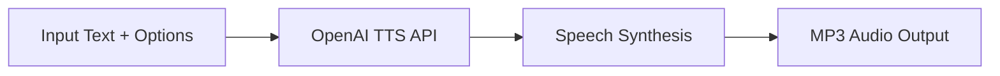

# OpenAI Text-to-Speech Example

This example demonstrates how to use model-compose with OpenAI's Text-to-Speech (TTS) API to convert text into natural-sounding speech. OpenAI's TTS service offers multiple high-quality voices and models optimized for different use cases.

## Overview

OpenAI's TTS API provides advanced speech synthesis capabilities with multiple voice options and quality levels. This configuration showcases:

- Multiple TTS model options (tts-1, tts-1-hd, gpt-4o-mini-tts)
- Extensive voice selection with 11 unique voices
- High-quality MP3 audio output
- Production-ready API integration
- Web UI for interactive testing

## Prerequisites

### OpenAI API Setup

1. **Create Account**: Sign up at [OpenAI](https://platform.openai.com/)
2. **Get API Key**: Navigate to API Keys section
3. **Add Billing**: Set up billing information for API usage

### Environment Setup

```bash
# Set your OpenAI API key
export OPENAI_API_KEY="sk-your_api_key_here"

# Install model-compose
pip install -e .
```

### Optional Dependencies
```bash
# For audio processing and playback testing
pip install pydub pygame
```

## Architecture

### Component Configuration

#### OpenAI TTS (`openai-text-to-speech`)
- **Type**: HTTP client
- **Endpoint**: `https://api.openai.com/v1/audio/speech`
- **Method**: POST
- **Response Type**: Binary (audio buffer)
- **Output Format**: MP3
- **Default Model**: `tts-1`
- **Default Voice**: `nova`

### API Configuration

| Parameter | Value | Description |
|-----------|-------|-------------|
| `endpoint` | `/v1/audio/speech` | OpenAI TTS endpoint |
| `method` | POST | HTTP method |
| `response_format` | mp3 | Audio output format |
| `response_type` | buffer | Binary response handling |

## Workflow

### Generate Speech with OpenAI TTS

Converts input text into natural-sounding speech using OpenAI's advanced TTS models.



**Input Parameters:**
| Parameter | Type | Required | Options | Default | Description |
|-----------|------|----------|---------|---------|-------------|
| `text` | string | Yes | - | - | Text to convert to speech |
| `model` | string | No | tts-1, tts-1-hd, gpt-4o-mini-tts | tts-1 | TTS model selection |
| `voice` | string | No | See voice options below | nova | Voice selection |

**Output:**
- High-quality MP3 audio file
- Binary audio data stream
- Optimized for web and mobile playback

## Model Options

### Available TTS Models

| Model | Quality | Speed | Use Case | Pricing |
|-------|---------|-------|----------|---------|
| **tts-1** | Standard | Fast | Real-time applications | Lower cost |
| **tts-1-hd** | High | Slower | High-quality content | Higher cost |
| **gpt-4o-mini-tts** | Standard | Fast | Cost-effective synthesis | Lowest cost |

## Voice Options

### Available Voices

OpenAI provides 11 distinct voices, each with unique characteristics:

| Voice | Gender | Characteristics | Best For |
|-------|--------|----------------|----------|
| **alloy** | Neutral | Balanced, professional | Business, documentation |
| **ash** | Neutral | Warm, conversational | Podcasts, storytelling |
| **ballad** | Neutral | Smooth, melodic | Audiobooks, narration |
| **coral** | Female | Bright, energetic | Marketing, announcements |
| **echo** | Male | Deep, authoritative | News, formal content |
| **fable** | Neutral | Expressive, dramatic | Creative content, stories |
| **onyx** | Male | Rich, confident | Presentations, training |
| **nova** | Female | Clear, friendly | General purpose (default) |
| **sage** | Neutral | Calm, wise | Educational content |
| **shimmer** | Female | Light, pleasant | Customer service, tutorials |
| **verse** | Neutral | Dynamic, versatile | Entertainment, media |

## How to Run Instructions

### 1. Start the Service

```bash
# Navigate to the example directory
cd examples/openai-audio-speech

# Start the controller
model-compose up
```

This starts:
- HTTP API server on port 8080 (base path: `/api/v1`)
- Gradio web interface on port 8081

### 2. Access the Web UI

Open http://localhost:8081 in your browser to interact with the text-to-speech service through a web interface.

### 3. API Usage

#### Basic Text-to-Speech (Default Settings)
```bash
curl -X POST http://localhost:8080/api/v1 \
  -H "Content-Type: application/json" \
  -d '{"text": "Hello, this is a demonstration of OpenAI text-to-speech synthesis."}' \
  --output speech.mp3
```

#### High-Quality Audio with Custom Voice
```bash
curl -X POST http://localhost:8080/api/v1 \
  -H "Content-Type: application/json" \
  -d '{
    "text": "This is high-quality speech synthesis using OpenAI advanced model.",
    "model": "tts-1-hd",
    "voice": "echo"
  }' \
  --output hq_speech.mp3
```

#### Cost-Optimized Generation
```bash
curl -X POST http://localhost:8080/api/v1 \
  -H "Content-Type: application/json" \
  -d '{
    "text": "This uses the most cost-effective model for budget-conscious applications.",
    "model": "gpt-4o-mini-tts",
    "voice": "alloy"
  }' \
  --output budget_speech.mp3
```

#### Long-Form Content
```bash
curl -X POST http://localhost:8080/api/v1 \
  -H "Content-Type: application/json" \
  -d '{
    "text": "OpenAI text-to-speech API enables developers to convert written text into lifelike spoken audio. This technology is powered by advanced AI models that can generate natural-sounding speech with proper intonation, emphasis, and flow. The service supports multiple voices and models to suit different applications and quality requirements.",
    "model": "tts-1-hd",
    "voice": "ballad"
  }' \
  --output long_content.mp3
```

## Customization Options

### Model Selection Configuration

#### Standard Quality (Default)
```yaml
body:
  model: tts-1
  input: ${input.text}
  voice: ${input.voice as select/alloy,ash,ballad,coral,echo,fable,onyx,nova,sage,shimmer,verse | nova}
  response_format: mp3
```

#### High Definition Quality
```yaml
body:
  model: tts-1-hd
  input: ${input.text}
  voice: ${input.voice as select/alloy,ash,ballad,coral,echo,fable,onyx,nova,sage,shimmer,verse | nova}
  response_format: mp3
```

#### Cost-Optimized
```yaml
body:
  model: gpt-4o-mini-tts
  input: ${input.text}
  voice: ${input.voice as select/alloy,ash,ballad,coral,echo,fable,onyx,nova,sage,shimmer,verse | nova}
  response_format: mp3
```

### Multiple Voice Workflows

```yaml
workflows:
  - id: male-voice-synthesis
    title: Male Voice Text-to-Speech
    jobs:
      - id: speak
        component: openai-text-to-speech
        input:
          text: ${input.text}
          model: ${input.model | tts-1}
          voice: echo  # Fixed male voice
        output: ${output as audio}

  - id: female-voice-synthesis
    title: Female Voice Text-to-Speech
    jobs:
      - id: speak
        component: openai-text-to-speech
        input:
          text: ${input.text}
          model: ${input.model | tts-1}
          voice: nova  # Fixed female voice
        output: ${output as audio}
```

### Advanced Configuration

#### Custom Headers and Error Handling
```yaml
components:
  - id: openai-text-to-speech-advanced
    type: http-client
    endpoint: https://api.openai.com/v1/audio/speech
    method: POST
    headers:
      Authorization: Bearer ${env.OPENAI_API_KEY}
      Content-Type: application/json
      OpenAI-Organization: ${env.OPENAI_ORG_ID}  # Optional
    timeout: 30000  # 30 seconds
    retry_attempts: 3
    body:
      model: ${input.model as select/tts-1,tts-1-hd,gpt-4o-mini-tts | tts-1}
      input: ${input.text}
      voice: ${input.voice as select/alloy,ash,ballad,coral,echo,fable,onyx,nova,sage,shimmer,verse | nova}
      response_format: mp3
      speed: ${input.speed as float/0.25,4.0 | 1.0}  # Speech speed
```

## Pricing and API Limits

### Pricing Structure (as of 2024)

| Model | Price per 1K Characters | Quality | Use Case |
|-------|-------------------------|---------|----------|
| **tts-1** | $0.015 | Standard | Real-time, interactive |
| **tts-1-hd** | $0.030 | High | Content creation, media |
| **gpt-4o-mini-tts** | $0.010 | Standard | Budget-conscious apps |

### Rate Limits

- **Requests per minute (RPM)**: 50 (can be increased)
- **Tokens per minute (TPM)**: 50,000
- **Requests per day (RPD)**: 10,000

### How to Run Optimization

1. **Choose Appropriate Model**: Use tts-1 for real-time, tts-1-hd for quality
2. **Batch Processing**: Combine related text segments
3. **Caching**: Store frequently used audio
4. **Monitor Usage**: Track token consumption

## Advanced Features

### Speech Speed Control

```bash
curl -X POST http://localhost:8080/api/v1 \
  -H "Content-Type: application/json" \
  -d '{
    "text": "This speech will be played at a different speed.",
    "model": "tts-1",
    "voice": "nova",
    "speed": 1.25
  }' \
  --output speed_adjusted.mp3
```

### Different Audio Formats

```yaml
# Configuration for different formats
body:
  model: ${input.model | tts-1}
  input: ${input.text}
  voice: ${input.voice | nova}
  response_format: ${input.format as select/mp3,opus,aac,flac | mp3}
```

### Batch Processing Workflow

```yaml
workflows:
  - id: batch-tts-processing
    title: Batch Text-to-Speech
    jobs:
      - id: process-segments
        component: openai-text-to-speech
        input:
          text: ${input.segments[*].text}
          model: ${input.model | tts-1}
          voice: ${input.voice | nova}
        output: ${output as audio[]}
```

## Use Cases

### Content Creation
- **Podcast Production**: Generate professional narration
- **Video Content**: Add voiceovers to educational videos
- **Audiobook Creation**: Convert written books to audio
- **Social Media**: Create engaging audio content

### Business Applications
- **Customer Service**: Automated phone responses
- **E-learning Platforms**: Interactive educational content
- **Marketing**: Audio advertisements and announcements
- **Accessibility**: Screen reader enhancements

### Developer Tools
- **Chatbots**: Voice responses for conversational AI
- **Mobile Apps**: Text-to-speech functionality
- **Gaming**: Dynamic character voices
- **IoT Devices**: Voice feedback systems

### Accessibility Solutions
- **Visual Impairment Support**: Text-to-speech for websites
- **Reading Assistance**: Help for dyslexia or learning difficulties
- **Language Learning**: Pronunciation examples
- **Elderly Care**: Voice assistance applications

## Troubleshooting

### Authentication Issues
```bash
# Verify API key
curl -X GET "https://api.openai.com/v1/models" \
  -H "Authorization: Bearer $OPENAI_API_KEY"
```

### Common Error Responses

| Status Code | Error | Solution |
|-------------|--------|----------|
| 401 | Invalid API key | Check OPENAI_API_KEY environment variable |
| 400 | Invalid request | Verify text length and parameters |
| 429 | Rate limit exceeded | Implement retry with exponential backoff |
| 500 | Server error | Check OpenAI status page |

### Audio Quality Issues

```bash
# Test different models and voices
curl -X POST http://localhost:8080/api/v1 \
  -H "Content-Type: application/json" \
  -d '{
    "text": "Test audio quality with this sample text.",
    "model": "tts-1-hd",
    "voice": "echo"
  }' \
  --output quality_test.mp3
```

### Rate Limit Handling

```yaml
# Production configuration with retry logic
components:
  - id: openai-tts-resilient
    type: http-client
    endpoint: https://api.openai.com/v1/audio/speech
    method: POST
    headers:
      Authorization: Bearer ${env.OPENAI_API_KEY}
      Content-Type: application/json
    timeout: 60000
    retry_attempts: 5
    retry_delay: 1000
    exponential_backoff: true
```

## Security Considerations

### API Key Protection
```bash
# Use environment variables
export OPENAI_API_KEY="sk-..."

# For production, use secrets management
# AWS Parameter Store, Azure Key Vault, etc.
```

### Content Safety
- Implement content moderation for user-generated text
- Review OpenAI usage policies
- Monitor for potential misuse

### Rate Limiting
```yaml
# Application-level rate limiting
components:
  - id: rate-limiter
    type: shell
    command: echo "Rate limit check for user: ${input.user_id}"
```

## Monitoring and Analytics

### How to Run Tracking
```yaml
workflows:
  - id: tracked-tts
    jobs:
      - id: log-usage
        component: usage-logger
        input:
          user_id: ${input.user_id}
          text_length: ${input.text | length}
          model: ${input.model}

      - id: generate-speech
        component: openai-text-to-speech
        input: ${input}
        depends_on: [log-usage]
```

### Performance Metrics
- Track API response times
- Monitor error rates by model/voice
- Analyze character usage patterns
- Set up billing alerts

### Quality Assurance
```yaml
# Audio validation workflow
workflows:
  - id: tts-with-validation
    jobs:
      - id: generate
        component: openai-text-to-speech
        input: ${input}

      - id: validate
        component: audio-validator
        input: ${jobs.generate.output}
        depends_on: [generate]
```

## Integration Examples

### Discord Bot Integration
```yaml
workflows:
  - id: discord-tts
    jobs:
      - id: speak
        component: openai-text-to-speech
        input:
          text: ${input.message}
          voice: ${input.user_preference | nova}
        output: ${output as audio}
```

### Web Application Integration
```javascript
// Frontend integration example
async function generateSpeech(text, voice = 'nova') {
  const response = await fetch('/api/v1', {
    method: 'POST',
    headers: { 'Content-Type': 'application/json' },
    body: JSON.stringify({ text, voice })
  });

  if (response.ok) {
    const audioBlob = await response.blob();
    const audio = new Audio(URL.createObjectURL(audioBlob));
    audio.play();
  }
}
```

### Mobile App Integration
```yaml
# Mobile-optimized configuration
components:
  - id: mobile-tts
    type: http-client
    endpoint: https://api.openai.com/v1/audio/speech
    method: POST
    headers:
      Authorization: Bearer ${env.OPENAI_API_KEY}
      Content-Type: application/json
    body:
      model: tts-1  # Faster for mobile
      input: ${input.text}
      voice: ${input.voice | nova}
      response_format: opus  # Better compression for mobile
    response_type: buffer
```