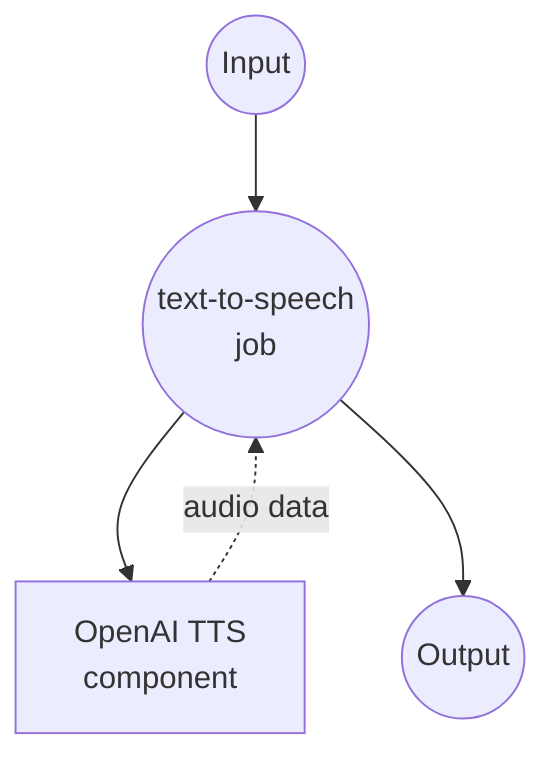

# OpenAI Text-to-Speech Example

This example demonstrates how to use model-compose with OpenAI's Text-to-Speech (TTS) API to convert text into natural-sounding speech using multiple high-quality voices and models.

## Overview

This workflow provides advanced speech synthesis capabilities that:

1. **Text to Speech Conversion**: Converts input text to high-quality MP3 audio using OpenAI's TTS models
2. **Multiple Voice Options**: Supports 11 different voices with various characteristics
3. **Quality Control**: Offers different model options for speed vs quality optimization
4. **Production Ready**: Includes proper error handling and API integration

## Preparation

### Prerequisites

- model-compose installed and available in your PATH
- OpenAI API key with TTS access

### OpenAI API Configuration

1. **Create Account**: Sign up at [OpenAI](https://platform.openai.com/)
2. **Get API Key**: Navigate to API Keys section
3. **Add Billing**: Set up billing information for API usage

### Environment Configuration

1. Navigate to this example directory:
   ```bash
   cd examples/openai-audio-speech
   ```

2. Copy the sample environment file:
   ```bash
   cp .env.sample .env
   ```

3. Edit `.env` and add your OpenAI API key:
   ```env
   OPENAI_API_KEY=your-actual-openai-api-key
   ```

## How to Run

1. **Start the service:**
   ```bash
   model-compose up
   ```

2. **Run the workflow:**

   **Using API:**
   ```bash
   curl -X POST http://localhost:8080/api/workflows/runs \
     -H "Content-Type: application/json" \
     -d '{
       "input": {
         "text": "Hello, this is a test of text to speech conversion",
         "model": "tts-1",
         "voice": "nova"
       }
     }'
   ```

   **Using Web UI:**
   - Open the Web UI: http://localhost:8081
   - Enter your text and voice settings
   - Click the "Run Workflow" button

   **Using CLI:**
   ```bash
   model-compose run --input '{"text": "Hello, this is a test of text to speech conversion", "model": "tts-1", "voice": "nova"}'
   ```

## Component Details

### OpenAI TTS Component (Default)
- **Type**: HTTP client component
- **Purpose**: Convert text to natural-sounding speech using OpenAI's TTS API
- **API**: OpenAI Text-to-Speech v1
- **Models**: tts-1, tts-1-hd, gpt-4o-mini-tts
- **Features**:
  - High-quality MP3 audio output
  - 11 different voice options
  - Multiple quality/speed models
  - Production-ready API integration

## Workflow Details

### "Text to Speech" Workflow (Default)

**Description**: Convert input text into high-quality, natural-sounding speech using OpenAI's advanced TTS models.

#### Job Flow



#### Input Parameters

| Parameter | Type | Required | Default | Description |
|-----------|------|----------|---------|-------------|
| `text` | string | Yes | - | Text to convert to speech |
| `model` | string | No | `tts-1` | TTS model selection (tts-1, tts-1-hd, gpt-4o-mini-tts) |
| `voice` | string | No | `nova` | Voice selection (11 available voices) |

#### Output Format

| Field | Type | Description |
|-------|------|-------------|
| `audio` | audio/mp3 (binary) | High-quality MP3 audio file |

## Model Options

### Available TTS Models

| Model | Quality | Speed | Use Case | Pricing |
|-------|---------|-------|----------|---------|
| **tts-1** | Standard | Fast | Real-time applications | Lower cost |
| **tts-1-hd** | High | Slower | High-quality content | Higher cost |
| **gpt-4o-mini-tts** | Standard | Fast | Cost-effective synthesis | Lowest cost |

## Voice Options

### Available Voices

OpenAI provides 11 distinct voices, each with unique characteristics:

| Voice | Gender | Characteristics | Best For |
|-------|--------|----------------|----------|
| **alloy** | Neutral | Balanced, professional | Business, documentation |
| **ash** | Neutral | Warm, conversational | Podcasts, storytelling |
| **ballad** | Neutral | Smooth, melodic | Audiobooks, narration |
| **coral** | Female | Bright, energetic | Marketing, announcements |
| **echo** | Male | Deep, authoritative | News, formal content |
| **fable** | Neutral | Expressive, dramatic | Creative content, stories |
| **onyx** | Male | Rich, confident | Presentations, training |
| **nova** | Female | Clear, friendly | General purpose (default) |
| **sage** | Neutral | Calm, wise | Educational content |
| **shimmer** | Female | Light, pleasant | Customer service, tutorials |
| **verse** | Neutral | Dynamic, versatile | Entertainment, media |

## Customization

### Model Selection

#### Standard Quality (Default)
```yaml
body:
  model: tts-1
  input: ${input.text}
  voice: ${input.voice | nova}
  response_format: mp3
```

#### High Definition Quality
```yaml
body:
  model: tts-1-hd
  input: ${input.text}
  voice: ${input.voice | nova}
  response_format: mp3
```

#### Cost-Optimized
```yaml
body:
  model: gpt-4o-mini-tts
  input: ${input.text}
  voice: ${input.voice | nova}
  response_format: mp3
```

### Voice Settings

Use different voices for specific content:

```yaml
body:
  model: ${input.model | tts-1}
  input: ${input.text}
  voice: ${input.voice as select/alloy,ash,ballad,coral,echo,fable,onyx,nova,sage,shimmer,verse | nova}
  response_format: mp3
```

### Advanced Configuration

```yaml
body:
  model: ${input.model | tts-1}
  input: ${input.text}
  voice: ${input.voice | nova}
  response_format: ${input.format | mp3}
  speed: ${input.speed | 1.0}  # Speech speed (0.25-4.0)
```
