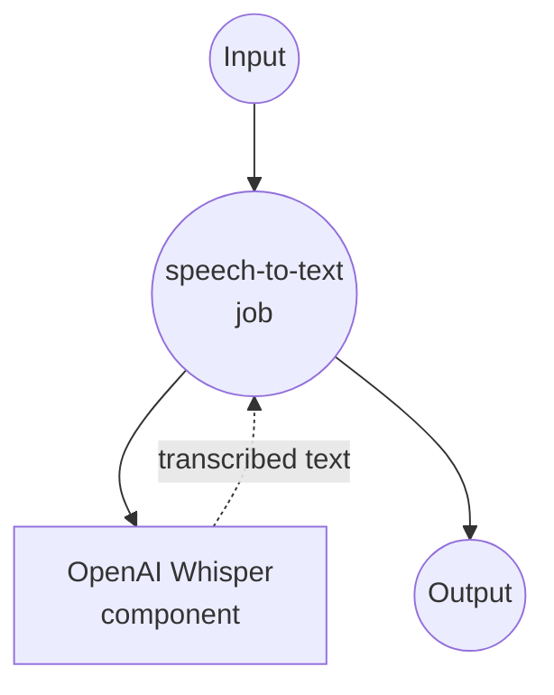

# OpenAI Audio Transcriptions Example

This example demonstrates how to use model-compose with OpenAI's Speech-to-Text (STT) API to transcribe audio files into text using the advanced Whisper model family.

## Overview

This workflow provides advanced speech-to-text capabilities that:

1. **Audio to Text Conversion**: Transcribes audio files to accurate text using OpenAI's Whisper models
2. **Multiple Format Support**: Supports various audio formats (MP3, WAV, M4A, etc.)
3. **Quality Options**: Offers different model options for accuracy vs cost optimization
4. **Usage Tracking**: Provides duration information for billing and monitoring

## Preparation

### Prerequisites

- model-compose installed and available in your PATH
- OpenAI API key with audio transcription access

### OpenAI API Configuration

1. **Create Account**: Sign up at [OpenAI](https://platform.openai.com/)
2. **Get API Key**: Navigate to API Keys section
3. **Add Billing**: Set up billing information for API usage

### Environment Configuration

1. Navigate to this example directory:
   ```bash
   cd examples/openai-audio-transciptions
   ```

2. Copy the sample environment file:
   ```bash
   cp .env.sample .env
   ```

3. Edit `.env` and add your OpenAI API key:
   ```env
   OPENAI_API_KEY=your-actual-openai-api-key
   ```

## How to Run

1. **Start the service:**
   ```bash
   model-compose up
   ```

2. **Run the workflow:**

   **Using API:**
   ```bash
   curl -X POST http://localhost:8080/api/workflows/__default__/runs \
     -H "Content-Type: multipart/form-data" \
     -F "input={\"file\": \"@audio\"}" \
     -F "audio=@sample_audio.mp3"
   ```

   **Using Web UI:**
   - Open the Web UI: http://localhost:8081
   - Upload an audio file
   - Select model options
   - Click the "Run Workflow" button

   **Using CLI:**
   ```bash
   # Basic transcription
   model-compose run --input '{"file": "/path/to/audio.mp3"}'

   # With specific model
   model-compose run --input '{
     "file": "/path/to/audio.wav",
     "model": "whisper-1"
   }'
   ```

## Component Details

### speech-to-text
- **Type**: HTTP client component
- **Purpose**: Convert audio files to text using OpenAI's Whisper models
- **API**: OpenAI Audio Transcriptions v1
- **Models**: whisper-1, gpt-4o-transcribe, gpt-4o-mini-transcribe
- **Features**:
  - High-accuracy speech recognition
  - Multiple audio format support
  - Usage tracking with duration metrics
  - Multi-language support

## Workflow Details

### "Audio to Text" Workflow (Default)

**Description**: Convert audio files into accurate text transcriptions using OpenAI's advanced Whisper models.

#### Job Flow



#### Input Parameters

| Parameter | Type | Required | Default | Description |
|-----------|------|----------|---------|-------------|
| `file` | audio | Yes | - | Audio file to transcribe |
| `model` | string | No | `whisper-1` | STT model selection (whisper-1, gpt-4o-transcribe, gpt-4o-mini-transcribe) |

#### Output Format

| Field | Type | Description |
|-------|------|-------------|
| `text` | string | Transcribed text from audio |
| `seconds` | float | Duration of audio processed (for billing) |

## Model Options

### Available STT Models

| Model | Quality | Speed | Use Case | Pricing |
|-------|---------|-------|----------|---------|
| **whisper-1** | High | Standard | General transcription | Standard cost |
| **gpt-4o-transcribe** | Highest | Slower | High-accuracy needs | Higher cost |
| **gpt-4o-mini-transcribe** | Good | Fast | Cost-effective transcription | Lower cost |

## Supported Audio Formats

### Compatible File Types

| Format | Extension | Quality | Notes |
|--------|-----------|---------|-------|
| **MP3** | .mp3 | Good | Most common format |
| **MP4** | .mp4 | High | Video files (audio extracted) |
| **MPEG** | .mpeg | High | Video files (audio extracted) |
| **MPGA** | .mpga | Good | MPEG audio format |
| **M4A** | .m4a | High | Apple audio format |
| **WAV** | .wav | Excellent | Uncompressed, best quality |
| **WEBM** | .webm | Good | Web-optimized format |

### File Size Limits

- **Maximum file size**: 25 MB
- **Maximum duration**: No specific limit
- **Recommended**: Use compressed formats for large files

## Customization

### Model Selection

#### Standard Quality (Default)
```yaml
body:
  model: whisper-1
  file: ${input.file as audio}
```

#### High Accuracy
```yaml
body:
  model: gpt-4o-transcribe
  file: ${input.file as audio}
```

#### Cost-Optimized
```yaml
body:
  model: gpt-4o-mini-transcribe
  file: ${input.file as audio}
```

### Advanced Configuration

```yaml
body:
  model: ${input.model | whisper-1}
  file: ${input.file as audio}
  language: ${input.language | auto}  # Optional language hint
  prompt: ${input.prompt}  # Optional context prompt
  response_format: json
  temperature: 0  # Deterministic output
```

### Multi-Language Support

```yaml
body:
  model: ${input.model | whisper-1}
  file: ${input.file as audio}
  language: ${input.language as select/en,es,fr,de,it,pt,ru,ja,ko,zh | auto}
```
