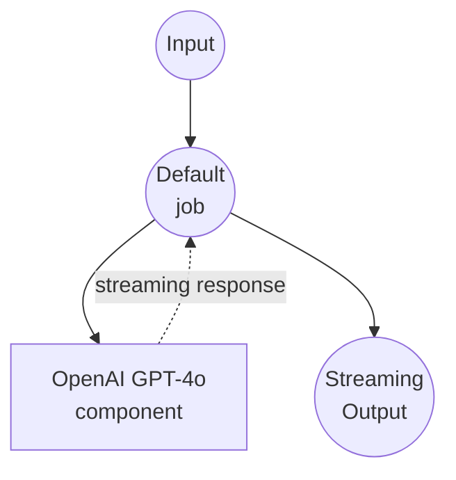

# OpenAI Chat Completions Stream Example

This example demonstrates how to create a streaming chat interface using OpenAI's GPT-4o model through the Chat Completions API with real-time streaming responses.

## Overview

This workflow provides a streaming chat interface that:

1. **Streaming Chat Completion**: Accepts user prompts and generates real-time streaming responses using OpenAI's GPT-4o model
2. **Server-Sent Events**: Delivers responses as SSE (Server-Sent Events) for real-time user experience
3. **Temperature Control**: Allows customization of response creativity through temperature parameter

## Preparation

### Prerequisites

- model-compose installed and available in your PATH
- OpenAI API key

### Environment Configuration

1. Navigate to this example directory:
   ```bash
   cd examples/openai-chat-completions-stream
   ```

2. Copy the sample environment file:
   ```bash
   cp .env.sample .env
   ```

3. Edit `.env` and add your OpenAI API key:
   ```env
   OPENAI_API_KEY=your-actual-openai-api-key
   ```

## How to Run

1. **Start the service:**
  ```bash
  model-compose up
  ```

2. **Run the workflow:**

  **Using API:**
  ```bash
  curl -X POST http://localhost:8080/api/workflows/runs \
    -H "Content-Type: application/json" \
    -d '{
      "input": {
        "prompt": "Explain machine learning in simple terms",
        "temperature": 0.7
      }
    }'
  ```

  **Using Web UI:**
  - Open the Web UI: http://localhost:8081
  - Enter your prompt and settings
  - Click the "Run Workflow" button

  **Using CLI:**
  ```bash
  model-compose run --input '{
    "prompt": "Explain machine learning in simple terms",
    "temperature": 0.7
  }'
  ```

## Component Details

### OpenAI HTTP Client Component (Default)
- **Type**: HTTP client component
- **Purpose**: AI-powered text generation with streaming chat completion
- **API**: OpenAI GPT-4o Chat Completions
- **Endpoint**: `https://api.openai.com/v1/chat/completions`
- **Features**:
  - Real-time streaming responses using `stream: true`
  - Configurable temperature for response creativity
  - Server-Sent Events output format for web applications
  - JSON stream parsing for delta content extraction

## Workflow Details

### "Chat with OpenAI GPT-4o" Workflow (Default)

**Description**: Generate streaming text responses using OpenAI's GPT-4o

#### Job Flow

This example uses a simplified single-component configuration without explicit jobs.



#### Input Parameters

| Parameter | Type | Required | Default | Description |
|-----------|------|----------|---------|-------------|
| `prompt` | text | Yes | - | The user message to send to the AI |
| `temperature` | number | No | 0.7 | Controls randomness in responses (0.0-1.0)<br/>• Lower values (e.g., 0.2): more focused and deterministic<br/>• Higher values (e.g., 0.8): more creative and varied |

#### Output Format

| Field | Type | Description |
|-------|------|-------------|
| - | text (sse-text) | The AI-generated response text delivered as Server-Sent Events stream |

## Streaming Features

This example differs from the standard chat completions by providing:

- **Real-time Streaming**: Responses are delivered incrementally as they're generated
- **SSE Format**: Output is formatted as Server-Sent Events for web browser compatibility
- **Delta Processing**: Extracts content from streaming JSON chunks using `${response[].choices[0].delta.content}`
- **Enhanced UX**: Users see responses appear character-by-character in real-time

## Customization

- **Model**: Change `gpt-4o` to other available models like `gpt-3.5-turbo`, `gpt-4`, etc.
- **Stream Format**: Modify `stream_format` and output extraction logic for different response processing
- **System Prompt**: Add a system message to define the AI's behavior and personality
- **Additional Parameters**: Include other OpenAI parameters like `max_tokens`, `presence_penalty`, etc.
- **Output Format**: Change from `sse-text` to `sse-json` for structured streaming data

## Advanced Configuration

To add a system prompt and conversation history with streaming:

```yaml
body:
  model: gpt-4o
  messages:
    - role: system
      content: "You are a helpful assistant specialized in technical explanations."
    - role: user
      content: ${input.prompt as text}
  temperature: ${input.temperature as number | 0.7}
  max_tokens: ${input.max_tokens as number | 1000}
  stream: true
stream_format: json
output: ${response[].choices[0].delta.content}
```

## Comparison with Standard Chat Completions

| Feature | Standard | Stream |
|---------|----------|--------|
| Response Delivery | Complete response at once | Real-time incremental |
| User Experience | Wait for full response | See response as it generates |
| Output Format | Single message object | Server-Sent Events stream |
| Web Integration | Simple JSON handling | Requires SSE client support |
| Latency | Higher perceived latency | Lower perceived latency |