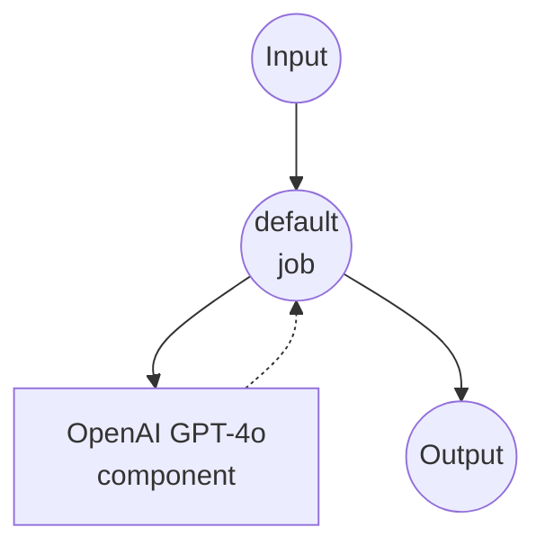

# OpenAI Chat Completions Example

This example demonstrates how to create a simple chat interface using OpenAI's GPT-4o model through the Chat Completions API.

## Overview

This workflow provides a straightforward chat interface that:

1. **Chat Completion**: Accepts user prompts and generates responses using OpenAI's GPT-4o model
2. **Temperature Control**: Allows customization of response creativity through temperature parameter

## Setup

### Prerequisites

- model-compose installed and available in your PATH
- OpenAI API key

### Environment Configuration

1. Navigate to this example directory:
   ```bash
   cd examples/openai-chat-completions
   ```

2. Copy the sample environment file:
   ```bash
   cp .env.sample .env
   ```

3. Edit `.env` and add your OpenAI API key:
   ```env
   OPENAI_API_KEY=your-actual-openai-api-key
   ```

## How to Run

### Run in HTTP Server Mode

```bash
model-compose up
```

Once the server starts:
- API endpoint: http://localhost:8080/api
- Web UI: http://localhost:8081

### Single Execution

```bash
model-compose run --input '{"prompt": "Hello, how are you?", "temperature": 0.7}'
```

## Available Components

### Default Component
- **Type**: HTTP client component
- **Purpose**: AI-powered text generation and chat completion
- **API**: OpenAI GPT-4o Chat Completions
- **Endpoint**: `https://api.openai.com/v1/chat/completions`
- **Features**:
  - Configurable temperature for response creativity
  - Supports various prompt types and conversation styles

## Workflow Details

### "Chat with OpenAI GPT-4o" Workflow (Default)

**Description**: Generate text responses using OpenAI's GPT-4o

#### Job Flow

This example uses a simplified single-component configuration without explicit jobs.



#### Input Parameters

| Parameter | Type | Required | Default | Description |
|-----------|------|----------|---------|-------------|
| `prompt` | text | Yes | - | The user message to send to the AI |
| `temperature` | number | No | 0.7 | Controls randomness in responses (0.0-1.0)<br/>• Lower values (e.g., 0.2): more focused and deterministic<br/>• Higher values (e.g., 0.8): more creative and varied |

#### Output Format

| Field | Type | Description |
|-------|------|-------------|
| `message` | text | The AI-generated response text |

## Example Usage

### Basic Chat
```json
{
  "prompt": "Explain quantum computing in simple terms"
}
```

### Creative Writing
```json
{
  "prompt": "Write a short story about a robot learning to paint",
  "temperature": 0.9
}
```

### Factual Responses
```json
{
  "prompt": "What are the main causes of climate change?",
  "temperature": 0.3
}
```

## Example Output

The workflow returns a JSON response containing the AI-generated message:

```json
{
  "message": "Quantum computing is a revolutionary technology that uses the principles of quantum mechanics..."
}
```

## Customization

- **Model**: Change `gpt-4o` to other available models like `gpt-3.5-turbo`, `gpt-4`, etc.
- **System Prompt**: Add a system message to define the AI's behavior and personality
- **Additional Parameters**: Include other OpenAI parameters like `max_tokens`, `presence_penalty`, etc.
- **Multiple Messages**: Extend to support conversation history by accepting an array of messages

## Advanced Configuration

To add a system prompt and conversation history:

```yaml
body:
  model: gpt-4o
  messages:
    - role: system
      content: "You are a helpful assistant specialized in technical explanations."
    - role: user
      content: ${input.prompt as text}
  temperature: ${input.temperature as number | 0.7}
  max_tokens: ${input.max_tokens as number | 1000}
```