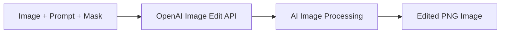

# OpenAI Image Edits Example

This example demonstrates how to use model-compose with OpenAI's Image Editing API to modify images using text prompts. OpenAI's image editing service leverages advanced AI models to perform intelligent image manipulations based on natural language descriptions.

## Overview

OpenAI's Image Edits API provides powerful image modification capabilities using the GPT-Image-1 model. This configuration showcases:

- AI-powered image editing with text prompts
- Support for PNG image format with transparency
- Optional mask-based editing for precise control
- Flexible size options for different use cases
- Base64 encoded image output for easy integration

## Prerequisites

### OpenAI API Setup

1. **Create Account**: Sign up at [OpenAI](https://platform.openai.com/)
2. **Get API Key**: Navigate to API Keys section
3. **Add Billing**: Set up billing information for API usage

### Environment Setup

```bash
# Set your OpenAI API key
export OPENAI_API_KEY="sk-your_api_key_here"

# Install model-compose
pip install -e .
```

### Optional Dependencies
```bash
# For image processing and conversion
pip install Pillow opencv-python
```

## Architecture

### Component Configuration

#### OpenAI Image Edit Component
- **Type**: HTTP client
- **Endpoint**: `https://api.openai.com/v1/images/edits`
- **Method**: POST
- **Content Type**: multipart/form-data
- **Model**: `gpt-image-1`
- **Output Format**: Base64 encoded PNG

### API Configuration

| Parameter | Value | Description |
|-----------|-------|-------------|
| `endpoint` | `/v1/images/edits` | OpenAI image editing endpoint |
| `method` | POST | HTTP method |
| `content_type` | multipart/form-data | Image file upload format |
| `model` | gpt-image-1 | AI image editing model |

## Workflow

### Edit Images with OpenAI GPT

Modifies images using text prompts and optional masks with OpenAI's advanced image editing model.



**Input Parameters:**
| Parameter | Type | Required | Options | Default | Description |
|-----------|------|----------|---------|---------|-------------|
| `prompt` | string | Yes | - | - | Text description of desired changes |
| `image` | image/png | Yes | PNG format | - | Original image to edit |
| `mask` | image/png | No | PNG with transparency | - | Optional mask for targeted editing |
| `size` | string | No | auto, 1024x1024, 1536x1024, 1024x1536 | auto | Output image dimensions |

**Output:**
| Field | Type | Description |
|-------|------|-------------|
| `image_data` | string | Base64 encoded PNG image data |

## Supported Features

### Image Requirements

| Aspect | Specification | Notes |
|--------|---------------|-------|
| **Format** | PNG | Required for transparency support |
| **Max Size** | 4MB | File size limit |
| **Dimensions** | Up to 1024x1024 | Recommended for best results |
| **Transparency** | Supported | Alpha channel preserved |

### Size Options

| Size Option | Dimensions | Aspect Ratio | Use Case |
|-------------|------------|--------------|----------|
| **auto** | Original size | Preserved | Maintain input dimensions |
| **1024x1024** | Square | 1:1 | Social media, avatars |
| **1536x1024** | Landscape | 3:2 | Banners, headers |
| **1024x1536** | Portrait | 2:3 | Mobile screens, posters |

## How to Run Instructions

### 1. Start the Service

```bash
# Navigate to the example directory
cd examples/openai-image-edits

# Start the controller
model-compose up
```

This starts:
- HTTP API server on port 8080 (base path: `/api`)
- Gradio web interface on port 8081

### 2. Access the Web UI

Open http://localhost:8081 in your browser to interact with the image editing service through a web interface.

### 3. API Usage

#### Basic Image Editing
```bash
curl -X POST http://localhost:8080/api \
  -H "Content-Type: multipart/form-data" \
  -F "image=@original.png" \
  -F "prompt=Add a sunset background to this image"
```

#### Editing with Size Control
```bash
curl -X POST http://localhost:8080/api \
  -H "Content-Type: multipart/form-data" \
  -F "image=@portrait.png" \
  -F "prompt=Change the background to a beach scene" \
  -F "size=1024x1536"
```

#### Targeted Editing with Mask
```bash
curl -X POST http://localhost:8080/api \
  -H "Content-Type: multipart/form-data" \
  -F "image=@photo.png" \
  -F "mask=@mask.png" \
  -F "prompt=Replace the masked area with a garden"
```

#### Complex Scene Modifications
```bash
curl -X POST http://localhost:8080/api \
  -H "Content-Type: multipart/form-data" \
  -F "image=@room.png" \
  -F "prompt=Transform this room into a modern office with plants and large windows" \
  -F "size=1536x1024"
```

### Sample Response

```json
{
  "image_data": "iVBORw0KGgoAAAANSUhEUgAAAAEAAAABCAYAAAAfFcSJAAAADUlEQVR42mNk+M9QDwADhgGAWjR9awAAAABJRU5ErkJggg=="
}
```

## Example Use Cases

### Portrait Enhancement
```bash
# Enhance a portrait photo
curl -X POST http://localhost:8080/api \
  -H "Content-Type: multipart/form-data" \
  -F "image=@selfie.png" \
  -F "prompt=Professional headshot with clean background"
```

### Background Replacement
```bash
# Replace background entirely
curl -X POST http://localhost:8080/api \
  -H "Content-Type: multipart/form-data" \
  -F "image=@person.png" \
  -F "prompt=Place this person in a futuristic city setting"
```

### Object Addition
```bash
# Add objects to scene
curl -X POST http://localhost:8080/api \
  -H "Content-Type: multipart/form-data" \
  -F "image=@empty_table.png" \
  -F "prompt=Add a laptop, coffee cup, and notebook to this table"
```

### Style Transfer
```bash
# Change artistic style
curl -X POST http://localhost:8080/api \
  -H "Content-Type: multipart/form-data" \
  -F "image=@photo.png" \
  -F "prompt=Convert this photo to an oil painting style"
```

### Architectural Visualization
```bash
# Modify building or interior
curl -X POST http://localhost:8080/api \
  -H "Content-Type: multipart/form-data" \
  -F "image=@room.png" \
  -F "prompt=Add floor-to-ceiling windows and modern furniture"
```

## Advanced Configuration

### Custom Image Processing Pipeline

```yaml
workflows:
  - id: enhanced-image-editing
    title: Enhanced Image Editing with Preprocessing
    jobs:
      - id: prepare-image
        component: image-preprocessor
        input:
          image: ${input.image}
          operations:
            - resize_if_needed
            - convert_to_png
            - validate_format

      - id: edit-image
        component: openai-image-editor
        input:
          image: ${jobs.prepare-image.output}
          prompt: ${input.prompt}
          size: ${input.size | auto}
        depends_on: [prepare-image]

      - id: post-process
        component: image-postprocessor
        input:
          image_data: ${jobs.edit-image.output.image_data}
          operations:
            - optimize_compression
            - add_metadata
        depends_on: [edit-image]
```

### Batch Image Editing

```yaml
workflows:
  - id: batch-image-editing
    title: Batch Image Processing
    jobs:
      - id: process-images
        component: openai-image-editor
        input:
          image: ${input.images[*]}
          prompt: ${input.batch_prompt}
          size: ${input.output_size | 1024x1024}
        output:
          edited_images: ${output[*].image_data}
```

### Iterative Editing

```yaml
workflows:
  - id: iterative-editing
    title: Multi-Step Image Refinement
    jobs:
      - id: first-edit
        component: openai-image-editor
        input:
          image: ${input.original_image}
          prompt: ${input.step1_prompt}

      - id: second-edit
        component: openai-image-editor
        input:
          image: ${jobs.first-edit.output.image_data | base64_to_image}
          prompt: ${input.step2_prompt}
        depends_on: [first-edit]

      - id: final-edit
        component: openai-image-editor
        input:
          image: ${jobs.second-edit.output.image_data | base64_to_image}
          prompt: ${input.final_prompt}
        depends_on: [second-edit]
```

## Pricing and API Limits

### Pricing Structure (as of 2024)

| Image Size | Price per Edit | Quality | Use Case |
|------------|----------------|---------|----------|
| **1024x1024** | $0.020 | Standard | General editing |
| **1536x1024** | $0.020 | Standard | Landscape images |
| **1024x1536** | $0.020 | Standard | Portrait images |

### Rate Limits

- **Requests per minute (RPM)**: 50
- **Images per day**: 500 (varies by plan)
- **Concurrent edits**: 5

### How to Run Optimization

1. **Optimize Input Images**: Use appropriate resolution
2. **Clear Prompts**: Specific descriptions yield better results
3. **Batch Similar Edits**: Group related modifications
4. **Cache Results**: Store frequently used edits

## Best Practices

### Image Preparation

#### Format Conversion
```bash
# Convert JPG to PNG for editing
convert input.jpg -background white -flatten output.png

# Ensure transparency preservation
convert input.png -background transparent output.png
```

#### Size Optimization
```bash
# Resize image for optimal processing
convert large_image.png -resize 1024x1024> optimized.png

# Compress without quality loss
pngcrush original.png compressed.png
```

### Prompt Engineering

#### Effective Prompts
- **Be Specific**: "Add a red brick fireplace with white mantel" vs "add fireplace"
- **Include Style**: "in photorealistic style" or "as a watercolor painting"
- **Specify Position**: "in the background", "on the left side", "center of image"
- **Mention Lighting**: "with soft natural lighting", "dramatic shadows"

#### Example Prompts

```bash
# Architectural
"Convert this bedroom into a minimalist Japanese-style room with tatami mats and sliding doors"

# Fashion
"Change this casual outfit to business professional attire"

# Landscape
"Transform this daytime scene into a magical nighttime view with stars and moonlight"

# Interior Design
"Redesign this kitchen with modern appliances and marble countertops"
```

### Mask Creation

#### Creating Effective Masks
- Use black (transparent) areas for regions to edit
- White areas remain unchanged
- Soft edges for natural blending
- High contrast for precise control

#### Mask Tools
```python
# Python example for mask creation
from PIL import Image, ImageDraw

# Create mask programmatically
img = Image.open('original.png')
mask = Image.new('RGBA', img.size, (255, 255, 255, 255))
draw = ImageDraw.Draw(mask)
draw.ellipse((100, 100, 300, 300), fill=(0, 0, 0, 0))  # Transparent area
mask.save('mask.png')
```

## Integration Examples

### E-commerce Product Editing

```yaml
workflows:
  - id: product-enhancement
    title: E-commerce Product Enhancement
    jobs:
      - id: remove-background
        component: background-remover
        input:
          image: ${input.product_image}

      - id: add-studio-background
        component: openai-image-editor
        input:
          image: ${jobs.remove-background.output}
          prompt: "Place on a clean white studio background with professional lighting"
        depends_on: [remove-background]

      - id: generate-variants
        component: openai-image-editor
        input:
          image: ${jobs.add-studio-background.output.image_data | base64_to_image}
          prompt: "Show this product in different colors: red, blue, and black versions"
        depends_on: [add-studio-background]
```

### Real Estate Visualization

```yaml
workflows:
  - id: property-staging
    title: Virtual Property Staging
    jobs:
      - id: analyze-room
        component: room-analyzer
        input:
          image: ${input.empty_room}

      - id: stage-room
        component: openai-image-editor
        input:
          image: ${input.empty_room}
          prompt: "Stage this ${jobs.analyze-room.output.room_type} with modern furniture and decor"
        depends_on: [analyze-room]

      - id: lighting-enhancement
        component: openai-image-editor
        input:
          image: ${jobs.stage-room.output.image_data | base64_to_image}
          prompt: "Enhance lighting to make the room bright and welcoming"
        depends_on: [stage-room]
```

### Creative Content Pipeline

```yaml
workflows:
  - id: creative-content-generation
    title: Creative Content for Social Media
    jobs:
      - id: style-transfer
        component: openai-image-editor
        input:
          image: ${input.base_image}
          prompt: "Transform into ${input.artistic_style} art style"

      - id: add-branding
        component: openai-image-editor
        input:
          image: ${jobs.style-transfer.output.image_data | base64_to_image}
          prompt: "Add subtle branding elements and logo placement"
        depends_on: [style-transfer]

      - id: optimize-for-platform
        component: image-resizer
        input:
          image: ${jobs.add-branding.output.image_data | base64_to_image}
          platform: ${input.social_platform}
        depends_on: [add-branding]
```

## Error Handling and Troubleshooting

### Common Issues

#### Authentication Errors
```bash
# Verify API key
curl -X GET "https://api.openai.com/v1/models" \
  -H "Authorization: Bearer $OPENAI_API_KEY"
```

#### Image Format Issues
```bash
# Convert to PNG format
convert input.jpg output.png

# Check image properties
identify input.png
```

#### File Size Issues
```bash
# Check file size (should be < 4MB)
ls -lh image.png

# Compress large images
pngquant --quality=65-80 input.png --output compressed.png
```

### Common Error Responses

| Status Code | Error | Solution |
|-------------|--------|----------|
| 400 | Invalid image format | Convert to PNG |
| 400 | Image too large | Compress or resize image |
| 400 | Invalid prompt | Provide descriptive prompt |
| 401 | Invalid API key | Check OPENAI_API_KEY |
| 429 | Rate limit exceeded | Implement retry with backoff |
| 500 | Server error | Check OpenAI status page |

### Quality Issues

#### Improving Edit Quality
- Use high-resolution source images
- Provide detailed, specific prompts
- Include lighting and style preferences
- Use masks for precise control

#### Troubleshooting Poor Results
```yaml
# Enhanced workflow with validation
workflows:
  - id: quality-controlled-editing
    jobs:
      - id: validate-input
        component: image-validator
        input:
          image: ${input.image}
          min_resolution: 512
          max_file_size: 4000000

      - id: edit-with-retry
        component: openai-image-editor
        input:
          image: ${input.image}
          prompt: ${input.prompt}
        retry_attempts: 3
        depends_on: [validate-input]

      - id: quality-check
        component: edit-quality-scorer
        input:
          original: ${input.image}
          edited: ${jobs.edit-with-retry.output.image_data}
        depends_on: [edit-with-retry]
```

## Security Considerations

### API Key Protection
```bash
# Use environment variables
export OPENAI_API_KEY="sk-..."

# For production, use secrets management
# AWS Secrets Manager, Azure Key Vault, etc.
```

### Image Privacy
- Images are processed by OpenAI and may be retained temporarily
- For sensitive content, review OpenAI's data usage policies
- Consider local image editing solutions for confidential images

### Content Filtering
```yaml
# Add content validation
workflows:
  - id: secure-image-editing
    jobs:
      - id: content-moderation
        component: image-moderator
        input:
          image: ${input.image}
          prompt: ${input.prompt}

      - id: edit-image
        component: openai-image-editor
        input: ${input}
        condition: ${jobs.content-moderation.output.safe}
        depends_on: [content-moderation]
```

## Performance Optimization

### Image Preprocessing
```bash
# Optimize images before editing
convert input.png \
  -resize 1024x1024> \
  -strip \
  -quality 95 \
  optimized.png
```

### Caching Strategy
```yaml
# Cache edited images
workflows:
  - id: cached-editing
    jobs:
      - id: check-cache
        component: edit-cache
        input:
          image_hash: ${input.image | hash}
          prompt_hash: ${input.prompt | hash}

      - id: edit-if-needed
        component: openai-image-editor
        input: ${input}
        condition: ${jobs.check-cache.output.cache_miss}
        depends_on: [check-cache]

      - id: store-result
        component: cache-store
        input:
          key: "${input.image | hash}_${input.prompt | hash}"
          result: ${jobs.edit-if-needed.output}
        depends_on: [edit-if-needed]
```

## Use Cases

### Creative Industries
- **Advertising**: Concept visualization and mood boards
- **Film/TV**: Pre-visualization and concept art
- **Fashion**: Design mockups and virtual styling
- **Architecture**: Interior design and space planning

### E-commerce
- **Product Photography**: Background replacement and enhancement
- **Virtual Try-On**: Clothing and accessory visualization
- **Catalog Creation**: Consistent product presentation
- **Marketing Materials**: Banner and promotional image creation

### Real Estate
- **Virtual Staging**: Furnish empty properties
- **Renovation Visualization**: Before/after concepts
- **Lighting Enhancement**: Improve property photos
- **Landscape Design**: Outdoor space planning

### Personal Use
- **Photo Enhancement**: Improve family photos
- **Creative Projects**: Artistic transformations
- **Home Design**: Interior decoration planning
- **Social Media**: Content creation and enhancement