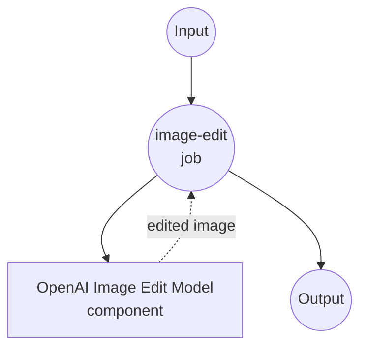

# OpenAI Image Edits Example

This example demonstrates how to use model-compose with OpenAI's Image Editing API to modify images using text prompts and AI-powered image manipulation.

## Overview

This workflow provides advanced image editing capabilities that:

1. **AI-Powered Image Editing**: Modifies images using natural language descriptions
2. **Mask-Based Editing**: Supports optional masks for precise control over editing areas
3. **Flexible Output Sizes**: Offers multiple size options for different use cases
4. **PNG Format Support**: Maintains transparency and high-quality output

## Preparation

### Prerequisites

- model-compose installed and available in your PATH
- OpenAI API key with image editing access

### OpenAI API Configuration

1. **Create Account**: Sign up at [OpenAI](https://platform.openai.com/)
2. **Get API Key**: Navigate to API Keys section
3. **Add Billing**: Set up billing information for API usage

### Environment Configuration

1. Navigate to this example directory:
   ```bash
   cd examples/openai-image-edits
   ```

2. Copy the sample environment file:
   ```bash
   cp .env.sample .env
   ```

3. Edit `.env` and add your OpenAI API key:
   ```env
   OPENAI_API_KEY=your-actual-openai-api-key
   ```

## How to Run

1. **Start the service:**
   ```bash
   model-compose up
   ```

2. **Run the workflow:**

   **Using API:**
   ```bash
   curl -X POST http://localhost:8080/api/workflows/__default__/runs \
     -H "Content-Type: multipart/form-data" \
     -F "input={\"prompt\": \"Add a sunset background\", \"image\": \"@image\"}" \
     -F "image=@original.png"
   ```

   **Using Web UI:**
   - Open the Web UI: http://localhost:8081
   - Upload an image file (PNG format)
   - Enter your editing prompt
   - Optionally upload a mask file
   - Click the "Run Workflow" button

   **Using CLI:**
   ```bash
   # Basic image editing
   model-compose run --input '{
     "prompt": "Add a sunset background to this image",
     "image": "/path/to/image.png"
   }'

   # With size specification
   model-compose run --input '{
     "prompt": "Change the background to a beach scene",
     "image": "/path/to/image.png",
     "size": "1024x1024"
   }'
   ```

## Component Details

### image-editor
- **Type**: HTTP client component
- **Purpose**: Modify images using AI-powered editing with text prompts
- **API**: OpenAI Image Edits v1
- **Model**: gpt-image-1
- **Features**:
  - Natural language image editing
  - PNG format support with transparency
  - Optional mask-based precision editing
  - Multiple output size options

## Workflow Details

### "Image Editing" Workflow (Default)

**Description**: Modify images using AI-powered editing based on text prompts with optional mask support.

#### Job Flow



#### Input Parameters

| Parameter | Type | Required | Default | Description |
|-----------|------|----------|---------|-------------|
| `prompt` | string | Yes | - | Text description of desired changes |
| `image` | image/png | Yes | - | Original image to edit (PNG format) |
| `mask` | image/png | No | - | Optional mask for targeted editing |
| `size` | string | No | `auto` | Output image dimensions (auto, 1024x1024, 1536x1024, 1024x1536) |

#### Output Format

| Field | Type | Description |
|-------|------|-------------|
| `image_data` | string | Base64 encoded PNG image data |

## Image Requirements

### Format Specifications

| Aspect | Specification | Notes |
|--------|---------------|-------|
| **Format** | PNG | Required for transparency support |
| **Max Size** | 4MB | File size limit |
| **Dimensions** | Up to 1024x1024 | Recommended for best results |
| **Transparency** | Supported | Alpha channel preserved |

### Size Options

| Size Option | Dimensions | Aspect Ratio | Use Case |
|-------------|------------|--------------|----------|
| **auto** | Original size | Preserved | Maintain input dimensions |
| **1024x1024** | Square | 1:1 | Social media, avatars |
| **1536x1024** | Landscape | 3:2 | Banners, headers |
| **1024x1536** | Portrait | 2:3 | Mobile screens, posters |

## Customization

### Basic Configuration

```yaml
body:
  model: gpt-image-1
  image: ${input.image as image}
  prompt: ${input.prompt}
  size: ${input.size | auto}
```

### With Mask Support

```yaml
body:
  model: gpt-image-1
  image: ${input.image as image}
  mask: ${input.mask as image}
  prompt: ${input.prompt}
  size: ${input.size | auto}
```

### Advanced Configuration

```yaml
body:
  model: gpt-image-1
  image: ${input.image as image}
  mask: ${input.mask as image}
  prompt: ${input.prompt}
  size: ${input.size as select/auto,1024x1024,1536x1024,1024x1536 | auto}
  response_format: b64_json
```

## Example Use Cases

### Portrait Enhancement
```bash
# Professional headshot transformation
model-compose run --input '{
  "prompt": "Professional headshot with clean background",
  "image": "/path/to/selfie.png"
}'
```

### Background Replacement
```bash
# Change scene background
model-compose run --input '{
  "prompt": "Place this person in a futuristic city setting",
  "image": "/path/to/person.png"
}'
```

### Object Addition
```bash
# Add objects to scene
model-compose run --input '{
  "prompt": "Add a laptop, coffee cup, and notebook to this table",
  "image": "/path/to/empty_table.png"
}'
```

### Style Transfer
```bash
# Artistic style conversion
model-compose run --input '{
  "prompt": "Convert this photo to an oil painting style",
  "image": "/path/to/photo.png"
}'
```

## Best Practices

### Image Preparation

#### Format Conversion
```bash
# Convert JPG to PNG for editing
convert input.jpg -background white -flatten output.png

# Ensure transparency preservation
convert input.png -background transparent output.png
```

#### Size Optimization
```bash
# Resize image for optimal processing
convert large_image.png -resize 1024x1024> optimized.png

# Compress without quality loss
pngcrush original.png compressed.png
```

### Prompt Engineering

#### Effective Prompts
- **Be Specific**: "Add a red brick fireplace with white mantel" vs "add fireplace"
- **Include Style**: "in photorealistic style" or "as a watercolor painting"
- **Specify Position**: "in the background", "on the left side", "center of image"
- **Mention Lighting**: "with soft natural lighting", "dramatic shadows"

### Mask Creation

#### Creating Effective Masks
- Use black (transparent) areas for regions to edit
- White areas remain unchanged
- Soft edges for natural blending
- High contrast for precise control

## Pricing and API Limits

### Pricing Structure (as of 2024)

| Image Size | Price per Edit | Quality | Use Case |
|------------|----------------|---------|----------|
| **1024x1024** | $0.020 | Standard | General editing |
| **1536x1024** | $0.020 | Standard | Landscape images |
| **1024x1536** | $0.020 | Standard | Portrait images |

### Rate Limits

- **Requests per minute (RPM)**: 50
- **Images per day**: 500 (varies by plan)
- **Concurrent edits**: 5

### Cost Optimization Tips

1. **Optimize Input Images**: Use appropriate resolution
2. **Clear Prompts**: Specific descriptions yield better results
3. **Batch Similar Edits**: Group related modifications
4. **Cache Results**: Store frequently used edits

## Use Cases

### Creative Industries
- **Advertising**: Concept visualization and mood boards
- **Film/TV**: Pre-visualization and concept art
- **Fashion**: Design mockups and virtual styling

### E-commerce
- **Product Photography**: Background replacement and enhancement
- **Virtual Try-On**: Clothing and accessory visualization
- **Catalog Creation**: Consistent product presentation

### Real Estate
- **Virtual Staging**: Furnish empty properties
- **Renovation Visualization**: Before/after concepts
- **Lighting Enhancement**: Improve property photos

### Personal Use
- **Photo Enhancement**: Improve family photos
- **Creative Projects**: Artistic transformations
- **Home Design**: Interior decoration planning