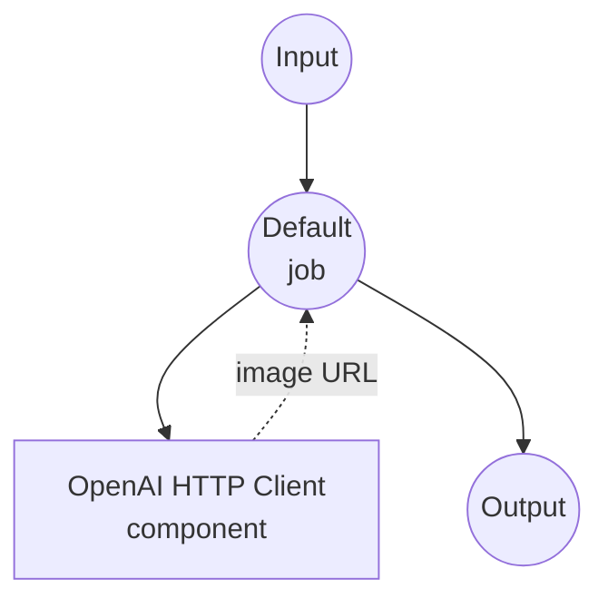
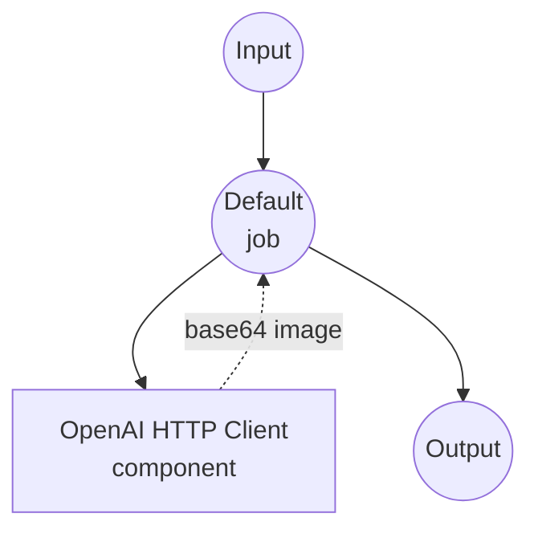

# OpenAI Image Generation Example

This example demonstrates how to generate images from text prompts using OpenAI's image generation models, including both DALL-E and GPT image models.

## Overview

This multi-workflow example provides two different approaches to AI image generation:

1. **DALL-E Workflow**: Generate images using OpenAI's specialized DALL-E models with URL-based output
2. **GPT Image Workflow**: Generate images using OpenAI's GPT image models with base64-encoded output

Both workflows use the same underlying OpenAI Images API but with different models and output formats, allowing you to choose the best approach for your specific use case.

## Preparation

### Prerequisites

- model-compose installed and available in your PATH
- OpenAI API key with access to image generation models

### API Access Requirements

**Required OpenAI API Access:**
- Image Generation API access
- DALL-E 2 and/or DALL-E 3 model access
- GPT image model access (gpt-image-1)

### Environment Configuration

1. Navigate to this example directory:
   ```bash
   cd examples/openai-image-generations
   ```

2. Set your OpenAI API key as an environment variable:
   ```bash
   export OPENAI_API_KEY=your-actual-openai-api-key
   ```

   Or create a `.env` file:
   ```env
   OPENAI_API_KEY=your-actual-openai-api-key
   ```

## How to Run

1. **Start the service:**
   ```bash
   model-compose up
   ```

2. **Run the workflow:**

   **Using API:**
   ```bash
   # Generate image with DALL-E (URL format) - Default workflow
   curl -X POST http://localhost:8080/api/workflows/runs \
     -H "Content-Type: application/json" \
     -d '{"workflow_id": "dall-e", "input": {"prompt": "A serene mountain landscape at sunset", "model": "dall-e-3"}}'
   
   # Generate image with GPT Image (Base64 format)
   curl -X POST http://localhost:8080/api/workflows/runs \
     -H "Content-Type: application/json" \
     -d '{"workflow_id": "gpt-image-1", "input": {"prompt": "A futuristic city skyline"}}'
   ```

   **Using Web UI:**
   - Open the Web UI: http://localhost:8081
   - Select the workflow from the tab
   - Enter your prompt and settings
   - Click the "Run Workflow" button

   **Using CLI:**
   ```bash
   # Generate image with DALL-E (URL format)
   model-compose run dall-e --input '{"prompt": "A serene mountain landscape at sunset", "model": "dall-e-3"}'
   
   # Generate image with GPT Image (Base64 format)
   model-compose run gpt-image-1 --input '{"prompt": "A futuristic city skyline"}'
   ```

## Component Details

### OpenAI HTTP Client Component (Default)
- **Type**: HTTP client component
- **Purpose**: Interface with OpenAI's Images API
- **Base URL**: https://api.openai.com/v1
- **Authentication**: Bearer token using OpenAI API key
- **Actions**: Supports both DALL-E and GPT image generation endpoints

#### Actions Available:

**1. DALL-E Action (dall-e)**
- **Endpoint**: `/images/generations`
- **Models**: DALL-E 2, DALL-E 3
- **Output Format**: URL to generated image
- **Image Size**: 1024x1024 (fixed)

**2. GPT Image Action (gpt-image-1)**
- **Endpoint**: `/images/generations`
- **Model**: gpt-image-1
- **Output Format**: Base64-encoded image data
- **Image Size**: 1024x1024 (fixed)

## Workflow Details

### 1. "Generate Images with OpenAI DALL·E" Workflow (Default)

**Description**: Generate high-quality images from text prompts using OpenAI's DALL-E models with URL-based output for easy sharing and embedding.

#### Job Flow

This workflow uses a simplified single-component configuration.



#### Input Parameters

| Parameter | Type | Required | Options | Default | Description |
|-----------|------|----------|---------|---------|-------------|
| `prompt` | string | Yes | - | - | Text description of the image to generate |
| `model` | string | No | `dall-e-2`, `dall-e-3` | `dall-e-2` | DALL-E model version to use |

#### Output Format

| Field | Type | Description |
|-------|------|-------------|
| `image_url` | string (URL) | Direct URL to the generated image hosted by OpenAI |

### 2. "Generate Images with OpenAI GPT" Workflow

**Description**: Generate images using OpenAI's GPT image model with base64-encoded output for direct embedding in applications.

#### Job Flow



#### Input Parameters

| Parameter | Type | Required | Options | Default | Description |
|-----------|------|----------|---------|---------|-------------|
| `prompt` | string | Yes | - | - | Text description of the image to generate |

#### Output Format

| Field | Type | Description |
|-------|------|-------------|
| `image_data` | string (base64) | Base64-encoded PNG image data |

## Model Comparison

### DALL-E 2 vs DALL-E 3

| Feature | DALL-E 2 | DALL-E 3 |
|---------|----------|----------|
| Image Quality | High | Very High |
| Prompt Adherence | Good | Excellent |
| Fine Details | Good | Superior |
| Creative Interpretation | Standard | Enhanced |
| Cost per Image | Lower | Higher |
| Generation Speed | Faster | Slower |

### DALL-E vs GPT Image

| Feature | DALL-E | GPT Image |
|---------|--------|-----------|
| Output Format | URL | Base64 |
| Model Options | 2 versions | Single model |
| Typical Use Case | Web display | App embedding |
| Storage | OpenAI hosted | Self-managed |
| URL Expiration | Yes (temporary) | N/A |

## Customization

### Using Different Models

Modify the model selection in the workflow:

```yaml
body:
  model: ${input.model as select/dall-e-2,dall-e-3 | dall-e-3}  # Default to DALL-E 3
```

### Adding Size Options

Extend the configuration to support different image sizes:

```yaml
body:
  model: ${input.model as select/dall-e-2,dall-e-3 | dall-e-2}
  prompt: ${input.prompt}
  size: ${input.size as select/1024x1024,1792x1024,1024x1792 | 1024x1024}
  n: ${input.count as integer | 1}
```

### Custom Output Processing

Add post-processing for generated images:

```yaml
workflows:
  - id: dall-e-with-metadata
    title: Generate Image with Metadata
    jobs:
      - id: generate-image
        component: dall-e
        input: ${input}
        output:
          image_url: ${output.image_url}

      - id: analyze-image
        component: gpt-4-vision
        input:
          image_url: ${jobs.generate-image.output.image_url}
          prompt: "Analyze this generated image and provide a detailed description"
```

### Multiple Image Generation

Generate multiple variations:

```yaml
body:
  model: ${input.model as select/dall-e-2,dall-e-3 | dall-e-2}
  prompt: ${input.prompt}
  n: ${input.count as integer | 3}
  size: 1024x1024
```
